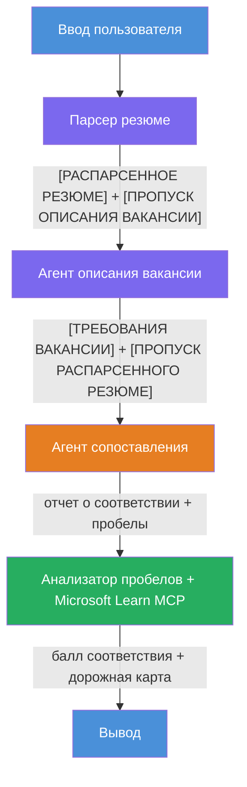

# Лабораторная 02 - Мультиагентный рабочий процесс: Оценка соответствия резюме вакансии

## Обзор

В этой практической лабораторной работе вы создадите **мультиагентное приложение, ориентированное на рабочие процессы**, используя Foundry Toolkit в VS Code и развернете его в Microsoft Foundry Agent Service.

**Что вы создадите:** оценщик соответствия резюме вакансии, который парсит резюме и описание вакансии, оценивает совпадение и создает персонализированную дорожную карту обучения с использованием ресурсов Microsoft Learn.

---

## Архитектура

```mermaid
flowchart TD
    A["Ввод пользователя"] --> B["Парсер резюме"]
    B -->|"[РАСПАРСЕННОЕ РЕЗЮМЕ] + [ПРОПУСК ОПИСАНИЯ ВАКАНСИИ]"| C["Агент описания вакансии"]
    C -->|"[ТРЕБОВАНИЯ ВАКАНСИИ] + [ПРОПУСК РАСПАРСЕННОГО РЕЗЮМЕ]"| D["Агент сопоставления"]
    D -->|отчет о соответствии + пробелы| E["Анализатор пробелов + Microsoft Learn MCP"]
    E -->|балл соответствия + дорожная карта| F["Вывод"]

    style A fill:#4A90D9,color:#fff
    style B fill:#7B68EE,color:#fff
    style C fill:#7B68EE,color:#fff
    style D fill:#E67E22,color:#fff
    style E fill:#27AE60,color:#fff
    style F fill:#4A90D9,color:#fff
```

**Как это работает:**
1. Пользователь вставляет резюме и описание вакансии.
2. **ResumeParser** парсит резюме и копирует описание вакансии дословно в раздел `[ПРОХОД ЗА ОПИСАНИЕМ ВАКАНСИИ]`.
3. **JD Agent** извлекает структурированные требования из проходного раздела, затем передает `[РАСПАРСЕННОЕ РЕЗЮМЕ]` дальше как `[ПРОХОД РАСПАРСЕННОГО РЕЗЮМЕ]`.
4. **MatchingAgent** сравнивает `[ПРОХОД РАСПАРСЕННОГО РЕЗЮМЕ]` с `[ТРЕБОВАНИЯМИ ВАКАНСИИ]` и выдает оценку соответствия.
5. **GapAnalyzer** превращает пробелы в практическую дорожную карту и получает реальные ссылки Microsoft Learn через MCP.

---

## Предпосылки

Сначала выполните Лабораторную 01:

- [Лабораторная 01 - Один агент](../lab01-single-agent/README.md)

---

## Часть 1: Изучите модули по порядку

Полный путь обучения смотрите в:

- [Документация Лабораторной 2 - Предпосылки](docs/00-prerequisites.md)
- [Документация Лабораторной 2 - Полный путь обучения](docs/README.md)
- [Руководство по запуску PersonalCareerCopilot](PersonalCareerCopilot/README.md)

---

## Часть 2: Построение и тестирование рабочего процесса

1. Используйте мастер Foundry Toolkit для создания проекта, основанного на рабочем процессе.
2. Скопируйте блоки подсказок и граф рабочего процесса из `PersonalCareerCopilot/main.py` в ваше рабочее пространство.
3. Запустите локально с помощью Agent Inspector и проверьте всех четырех агентов и инструмент MCP.
4. Разверните размещенного агента на Foundry после успешного локального тестирования.

---

## Шаблоны оркестровки

Лабораторная 02 включает стандартный поток **fan-out → fan-in → последовательный**, а в документации также описаны альтернативные шаблоны оркестровки для экспериментов.

- **Fan-out/Fan-in с взвешенным консенсусом**
- **Проход обозревателя/критика перед финальной дорожной картой**
- **Условный маршрутизатор** на основе оценки соответствия и отсутствующих навыков

Смотрите [docs/04-orchestration-patterns.md](docs/04-orchestration-patterns.md).

---

**Предыдущая:** [Лабораторная 01 - Один агент](../lab01-single-agent/README.md) · **Вернуться к:** [Главная страница мастер-класса](../../README.md)

---

<!-- CO-OP TRANSLATOR DISCLAIMER START -->
**Отказ от ответственности**:
Этот документ был переведен с использованием сервиса машинного перевода [Co-op Translator](https://github.com/Azure/co-op-translator). Несмотря на наши усилия по обеспечению точности, имейте в виду, что автоматический перевод может содержать ошибки или неточности. Оригинальный документ на его исходном языке следует считать авторитетным источником. Для получения критически важной информации рекомендуется обратиться к профессиональному человеческому переводу. Мы не несем ответственности за любые недоразумения или неправильные толкования, возникшие в результате использования этого перевода.
<!-- CO-OP TRANSLATOR DISCLAIMER END -->