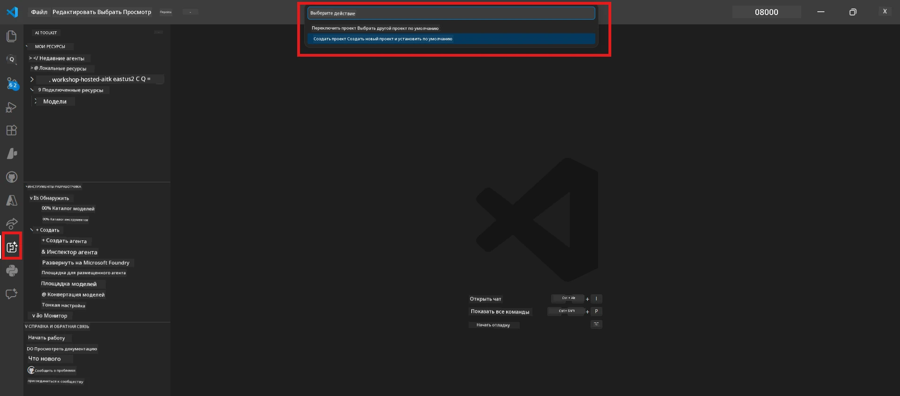

# Модуль 0 - Предварительные требования

Перед началом Лабораторной работы 02 убедитесь, что вы выполнили следующее. Эта лабораторная работа основывается непосредственно на Лабораторной работе 01 — не пропускайте её.

---

## 1. Завершите Лабораторную работу 01

Лабораторная работа 02 предполагает, что вы уже:

- [x] Завершили все 8 модулей [Лабораторной работы 01 - Один агент](../../lab01-single-agent/README.md)
- [x] Успешно развернули одного агента в Foundry Agent Service
- [x] Проверили работу агента как в локальном Agent Inspector, так и в Foundry Playground

Если вы не завершили Лабораторную работу 01, вернитесь и завершите её сейчас: [Документация Лабораторной работы 01](../../lab01-single-agent/docs/00-prerequisites.md)

---

## 2. Проверьте существующую настройку

Все инструменты из Лабораторной работы 01 должны быть по-прежнему установлены и работать. Выполните эти быстрые проверки:

### 2.1 Azure CLI

```powershell
az account show --query "{name:name, id:id}" --output table
```

Ожидается: Выводит название и ID вашей подписки. Если это не работает, выполните [`az login`](https://learn.microsoft.com/cli/azure/authenticate-azure-cli-interactively).

### 2.2 Расширения VS Code

1. Нажмите `Ctrl+Shift+P` → введите **"Microsoft Foundry"** → убедитесь, что видите команды (например, `Microsoft Foundry: Create a New Hosted Agent`).
2. Нажмите `Ctrl+Shift+P` → введите **"Foundry Toolkit"** → убедитесь, что видите команды (например, `Foundry Toolkit: Open Agent Inspector`).

### 2.3 Проект и модель Foundry

1. Нажмите на иконку **Microsoft Foundry** в панели активности VS Code.
2. Подтвердите, что ваш проект отображается (например, `workshop-agents`).
3. Разверните проект → убедитесь, что развернута модель (например, `gpt-4.1-mini`) со статусом **Succeeded**.

> **Если срок действия развертывания вашей модели истек:** Некоторые бесплатные развертывания автоматически истекают. Разверните снова из [Каталога моделей](https://learn.microsoft.com/azure/foundry/foundry-models/concepts/models-sold-directly-by-azure) (`Ctrl+Shift+P` → **Microsoft Foundry: Open Model Catalog**).



### 2.4 Роли RBAC

Убедитесь, что у вас есть роль **Azure AI User** в вашем проекте Foundry:

1. [Azure Portal](https://portal.azure.com) → ресурс вашего проекта Foundry → **Управление доступом (IAM)** → вкладка **[Назначения ролей](https://learn.microsoft.com/azure/foundry/concepts/rbac-foundry)**.
2. Найдите своё имя → подтвердите, что указана роль **[Azure AI User](https://aka.ms/foundry-ext-project-role)**.

---

## 3. Понимание концепций многих агентов (новое для Лабораторной работы 02)

Лабораторная работа 02 вводит концепции, не рассмотренные в Лабораторной работе 01. Ознакомьтесь с ними перед продолжением:

### 3.1 Что такое многоагентный рабочий процесс?

Вместо одного агента, который выполняет всю работу, **многоагентный рабочий процесс** распределяет работу между несколькими специализированными агентами. Каждый агент имеет:

- Свои **инструкции** (системный запрос)
- Свой **роль** (за что он отвечает)
- По желанию **инструменты** (функции, которые он может вызывать)

Агенты взаимодействуют через **граф оркестровки**, который определяет, как данные передаются между ними.

### 3.2 WorkflowBuilder

Класс [`WorkflowBuilder`](https://learn.microsoft.com/agent-framework/workflows/agents-in-workflows) из `agent_framework` — это компонент SDK, который связывает агентов вместе:

```python
from agent_framework import WorkflowBuilder

workflow = (
    WorkflowBuilder(
        name="MyWorkflow",
        start_executor=agent_a,
        output_executors=[agent_d],
    )
    .add_edge(agent_a, agent_b)
    .add_edge(agent_a, agent_c)
    .add_edge(agent_b, agent_d)
    .add_edge(agent_c, agent_d)
    .build()
)
```

- **`start_executor`** — первый агент, который получает ввод от пользователя
- **`output_executors`** — агент(ы), чей вывод становится финальным ответом
- **`add_edge(source, target)`** — определяет, что `target` получает вывод от `source`

### 3.3 Инструменты MCP (Model Context Protocol)

Лабораторная работа 02 использует **инструмент MCP**, который вызывает API Microsoft Learn для получения обучающих ресурсов. [MCP (Model Context Protocol)](https://modelcontextprotocol.io/introduction) — это стандартизованный протокол для подключения моделей ИИ к внешним источникам данных и инструментам.

| Термин | Определение |
|------|-----------|
| **MCP сервер** | Сервис, который предоставляет инструменты/ресурсы через [протокол MCP](https://learn.microsoft.com/azure/foundry/agents/how-to/tools/model-context-protocol) |
| **MCP клиент** | Код вашего агента, который подключается к MCP-серверу и вызывает его инструменты |
| **[Streamable HTTP](https://learn.microsoft.com/agent-framework/agents/tools/hosted-mcp-tools)** | Метод передачи, используемый для общения с MCP-сервером |

### 3.4 Чем Лабораторная работа 02 отличается от Лабораторной работы 01

| Аспект | Лабораторная работа 01 (Один агент) | Лабораторная работа 02 (Многоагентный) |
|--------|----------------------|---------------------|
| Агенты | 1 | 4 (специализированные роли) |
| Оркестровка | Отсутствует | WorkflowBuilder (параллельно и последовательно) |
| Инструменты | Опциональная функция `@tool` | MCP инструмент (внешний вызов API) |
| Сложность | Простой запрос → ответ | Резюме + описание вакансии → оценка соответствия → дорожная карта |
| Поток контекста | Прямой | Передача от агента к агенту |

---

## 4. Структура репозитория мастерской для Лабораторной работы 02

Убедитесь, что вы знаете, где находятся файлы Лабораторной работы 02:

```
workshop/
└── lab02-multi-agent/
    ├── README.md                       ← Lab overview
    ├── docs/                           ← You are here
    │   ├── README.md                   ← Learning path index
    │   ├── 00-prerequisites.md         ← This file
    │   ├── 01-understand-multi-agent.md
    │   ├── ...
    │   └── 08-troubleshooting.md
    └── PersonalCareerCopilot/          ← The agent project
        ├── agent.yaml                  ← Agent definition
        ├── main.py                     ← 4-agent workflow code
        ├── Dockerfile                  ← Container configuration
        └── requirements.txt            ← Python dependencies
```

---

### Контрольный список

- [ ] Лабораторная работа 01 полностью завершена (все 8 модулей, агент развернут и проверен)
- [ ] `az account show` выводит вашу подписку
- [ ] Расширения Microsoft Foundry и Foundry Toolkit установлены и работают
- [ ] В проекте Foundry развернута модель (например, `gpt-4.1-mini`)
- [ ] У вас есть роль **Azure AI User** в проекте
- [ ] Вы прочитали раздел с концепциями многих агентов и понимаете WorkflowBuilder, MCP и оркестровку агентов

---

**Далее:** [01 - Понимание многоагентной архитектуры →](01-understand-multi-agent.md)

---

<!-- CO-OP TRANSLATOR DISCLAIMER START -->
**Отказ от ответственности**:  
Этот документ был переведен с помощью AI-сервиса перевода [Co-op Translator](https://github.com/Azure/co-op-translator). Несмотря на наши усилия обеспечить точность, пожалуйста, имейте в виду, что автоматические переводы могут содержать ошибки или неточности. Оригинальный документ на его родном языке следует считать авторитетным источником. Для критически важной информации рекомендуется обращаться к профессиональному человеческому переводу. Мы не несем ответственности за любые недоразумения или неправильные толкования, возникающие в результате использования этого перевода.
<!-- CO-OP TRANSLATOR DISCLAIMER END -->