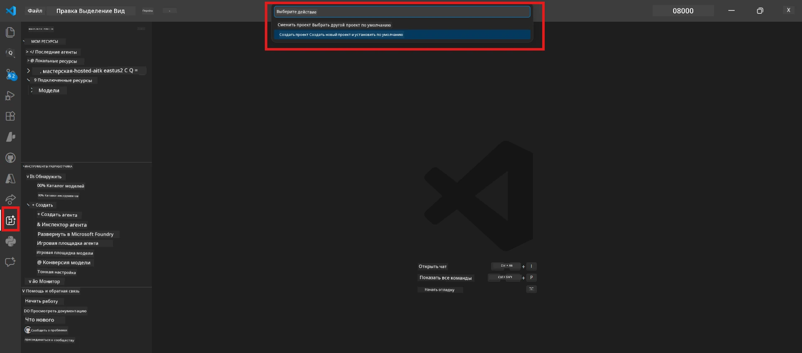

# Модуль 0 - Введение

⏱️ ~10 мин

> [!WARNING]
> **Предварительный просмотр и ограничения:** [Хостинг-агенты](https://learn.microsoft.com/azure/foundry/agents/concepts/hosted-agents) находятся в состоянии **публичного предварительного просмотра** — не рекомендуется для рабочих нагрузок в производстве. Некоторые функции, показанные в этом тренинге, могут измениться по мере приближения сервиса к выпуску GA.

## Что вы создадите

В этой лабораторной работе вы расширяете навыки одного агента из Лаба 01 для создания **многоагентного рабочего процесса** — оценщика соответствия резюме и вакансии.

Вы вставляете **резюме** и **описание вакансии**. Четыре специализированных агента обрабатывают ввод последовательно, после чего возвращают:
- Оценку соответствия (0–100 с разбором по критериям)
- Список пробелов в навыках и сертификатах
- Персонализированную дорожную карту обучения с реальными ссылками на Microsoft Learn для каждого пробела

**Рабочий процесс использует:**
- **Microsoft Agent Framework** — `WorkflowBuilder` для последовательной оркестрации конвейера
- **Foundry Toolkit для VS Code** — структура, локальное тестирование, развертывание
- **AI-модель** (например, `gpt-4.1-mini`) — используется всеми четырьмя агентами
- **Сервер Microsoft Learn MCP** — предоставляет реальные ссылки на обучающие ресурсы для каждого пробела в навыках

---

## Выберите свой путь

> ⚠️ **Продолжайте тем же путём, что использовали в Лабе 01.**

<details open>
<summary><strong>🅰️ Путь A — облако Azure (требуется подписка Azure)</strong></summary>

| | Подробности |
|---|---|
| **Кому это подходит?** | Вы завершили Лаб 01 с использованием подписки Azure |
| **Модель** | Azure OpenAI через Foundry (например, `gpt-4.1-mini`) |
| **Охваченные модули** | Все модули (00–09) |
| **Развертывание в облаке?** | ✅ Да — полное end-to-end развертывание |

</details>

<details open>
<summary><strong>🅱️ Путь B — Foundry Local (подписка Azure не нужна)</strong></summary>

| | Подробности |
|---|---|
| **Кому это подходит?** | Вы завершили Лаб 01, используя Foundry Local |
| **Модель** | Foundry Local (бесплатно, работает на вашем компьютере) |
| **Охваченные модули** | Модули 00–05 (пропускаем 06–07 — развертывание и проверка облака) |
| **Развертывание в облаке?** | ❌ Нет — только локальное тестирование через Agent Inspector |

</details>

---

## Проверка Лаба 01

Лаб 02 строится напрямую на базе Лаба 01. Сначала завершите Лаб 01, перед тем как переходить сюда.

Ещё не сделали Лаб 01? Начните здесь: [Lab 01 - Introduction](../../lab01-single-agent/docs/00-prerequisites.md)

<details open>
<summary><strong>🅰️ Путь A — облако Azure</strong></summary>

```powershell
az account show --query "{name:name, id:id}" --output table
```

Если это не сработает, выполните `az login`. Затем проверьте в VS Code:

1. Нажмите `Ctrl+Shift+P` → введите **Foundry Toolkit** → убедитесь, что команды отображаются.
2. Нажмите на значок **Foundry Toolkit** → ваш проект и развернутая модель показывают статус **Succeeded**.



> **RBAC:** Вы присвоили роль **Foundry User** в Лаб 01. Если нужно переназначить, смотрите [Лаб 01, модуль 1](../../lab01-single-agent/docs/01-setup.md#deploy-a-model--assign-rbac). Роль ранее называлась **Azure AI User** — права те же.

</details>

<details open>
<summary><strong>🅱️ Путь B — Foundry Local</strong></summary>

```powershell
Invoke-WebRequest -Uri "http://localhost:5273/v1/health" -UseBasicParsing | Select-Object StatusCode
```

Ожидается: `StatusCode: 200`. Если нет, перезапустите Foundry Local через боковую панель Foundry Toolkit.

> Вся инференция выполняется на вашем устройстве. Единственный внешний вызов — инструмент MCP к `https://learn.microsoft.com/api/mcp`.

</details>

---

## Что нового в Лабе 02

| | Лаб 01 | Лаб 02 |
|--|--------|--------|
| Агенты | 1 | 4 (цепочка с WorkflowBuilder) |
| Шаблон скелета | Базовый — Agent Framework | Рабочие процессы — Agent Framework |
| Новый пакет | - | `mcp` |
| Оркестрация | Один разговорный агент | Последовательный конвейер (WorkflowBuilder) |
| Новый инструмент | - | `search_microsoft_learn_for_plan` (MCP) |

---

**Далее:** [01 - Понимание архитектуры →](01-understand-multi-agent.md)

---

<!-- CO-OP TRANSLATOR DISCLAIMER START -->
**Отказ от ответственности**:
Этот документ был переведен с использованием сервиса машинного перевода [Co-op Translator](https://github.com/Azure/co-op-translator). Несмотря на наши усилия по обеспечению точности, имейте в виду, что автоматический перевод может содержать ошибки или неточности. Оригинальный документ на его исходном языке следует считать авторитетным источником. Для получения критически важной информации рекомендуется обратиться к профессиональному человеческому переводу. Мы не несем ответственности за любые недоразумения или неправильные толкования, возникшие в результате использования этого перевода.
<!-- CO-OP TRANSLATOR DISCLAIMER END -->