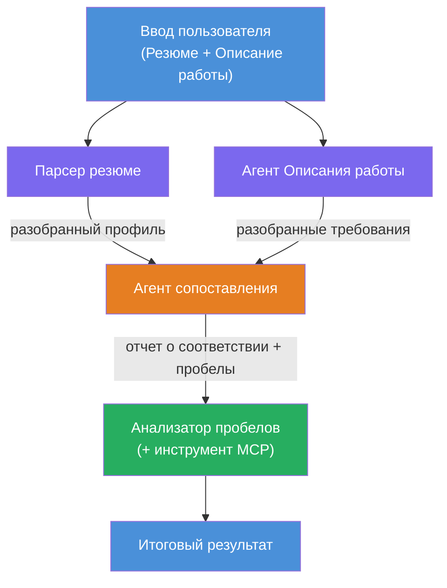
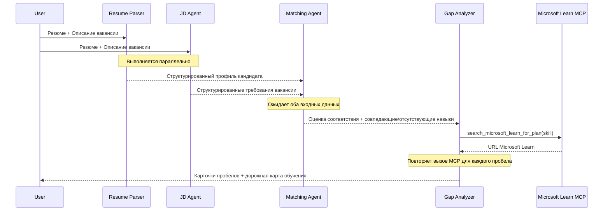
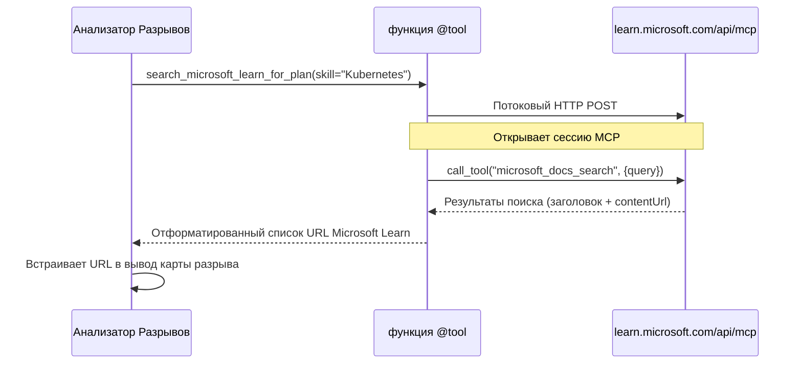

# Модуль 1 - Понимание архитектуры мультиагентной системы

В этом модуле вы изучите архитектуру оценщика соответствия резюме вакансии перед написанием любого кода. Понимание графа оркестрации, ролей агентов и потока данных критично для отладки и расширения [мультиагентных рабочих процессов](https://learn.microsoft.com/azure/architecture/ai-ml/idea/multiple-agent-workflow-automation).

---

## Решаемая проблема

Сопоставление резюме с описанием вакансии включает несколько различных навыков:

1. **Парсинг** — извлечение структурированных данных из неструктурированного текста (резюме)
2. **Анализ** — извлечение требований из описания вакансии
3. **Сравнение** — оценка соответствия между ними
4. **Планирование** — построение учебной дорожной карты для устранения пробелов

Один агент, выполняющий все четыре задачи в одном промте, часто выдает:
- Неполное извлечение (спешит пройти парсинг, чтобы получить оценку)
- Поверхностную оценку (без основанного на доказательствах разбора)
- Общие дорожные карты (не адаптированные к конкретным пробелам)

Разделение на **четыре специализированных агента** позволяет каждому сосредоточиться на своей задаче с выделенными инструкциями, обеспечивая более качественный результат на каждом этапе.

---

## Четыре агента

Каждый агент — это полноценный агент [Microsoft Foundry](https://learn.microsoft.com/azure/foundry/agents/concepts/hosted-agents), созданный через `AzureAIAgentClient.as_agent()`. Они используют одно развертывание модели, но имеют разные инструкции и (опционально) разные инструменты.

| # | Имя агента | Роль | Входные данные | Выходные данные |
|---|------------|------|----------------|-----------------|
| 1 | **ResumeParser** | Извлечение структурированного профиля из текста резюме | Исходный текст резюме (от пользователя) | Профиль кандидата, технические навыки, мягкие навыки, сертификаты, опыт в доменной области, достижения |
| 2 | **JobDescriptionAgent** | Извлечение структурированных требований из описания вакансии | Исходный текст описания вакансии (от пользователя, передается через ResumeParser) | Обзор роли, обязательные навыки, предпочтительные навыки, опыт, сертификаты, образование, обязанности |
| 3 | **MatchingAgent** | Вычисление оценки соответствия на основе доказательств | Результаты ResumeParser + JobDescriptionAgent | Оценка соответствия (0–100 с разбивкой), совпавшие навыки, отсутствующие навыки, пробелы |
| 4 | **GapAnalyzer** | Создание персонализированной учебной дорожной карты | Выход MatchingAgent | Карточки пробелов (по навыкам), порядок обучения, график, ресурсы Microsoft Learn |

---

## Граф оркестрации

Рабочий процесс использует **параллельное разветвление** с последующей **последовательной агрегацией**:


> **Условные обозначения:** Фиолетовый = параллельные агенты, Оранжевый = точка агрегации, Зеленый = финальный агент с инструментами

### Как течет поток данных


1. **Пользователь отправляет** сообщение с резюме и описанием вакансии.
2. **ResumeParser** получает полный ввод пользователя и извлекает структурированный профиль кандидата.
3. **JobDescriptionAgent** получает пользовательский ввод параллельно и извлекает структурированные требования.
4. **MatchingAgent** получает данные от **обоих** ResumeParser и JobDescriptionAgent (фреймворк ждет завершения обоих до запуска MatchingAgent).
5. **GapAnalyzer** получает выход MatchingAgent и вызывает **инструмент Microsoft Learn MCP** для получения реальных учебных ресурсов для каждого пробела.
6. **Финальный вывод** — ответ GapAnalyzer, включающий оценку соответствия, карточки пробелов и полную учебную дорожную карту.

### Почему важен параллельный fan-out

ResumeParser и JobDescriptionAgent работают **параллельно**, так как ни один из них не зависит от другого. Это:
- Снижает общую задержку (они работают одновременно, а не последовательно)
- Естественное разделение (парсинг резюме и описание вакансии — независимые задачи)
- Демонстрирует распространенный мультиагентный паттерн: **fan-out → агрегирование → действие**

---

## WorkflowBuilder в коде

Вот как граф выше отображается в вызовах API [`WorkflowBuilder`](https://learn.microsoft.com/agent-framework/workflows/agents-in-workflows) в `main.py`:

```python
from agent_framework import WorkflowBuilder

workflow = (
    WorkflowBuilder(
        name="ResumeJobFitEvaluator",
        start_executor=resume_parser,       # Первый агент, получивший пользовательский ввод
        output_executors=[gap_analyzer],     # Финальный агент, чей вывод возвращается
    )
    .add_edge(resume_parser, jd_agent)      # ResumeParser → JobDescriptionAgent
    .add_edge(resume_parser, matching_agent) # ResumeParser → MatchingAgent
    .add_edge(jd_agent, matching_agent)      # JobDescriptionAgent → MatchingAgent
    .add_edge(matching_agent, gap_analyzer)  # MatchingAgent → GapAnalyzer
    .build()
)
```

**Пояснения к ребрам:**

| Ребро | Что означает |
|-------|--------------|
| `resume_parser → jd_agent` | Агент описания вакансии получает вывод ResumeParser |
| `resume_parser → matching_agent` | MatchingAgent получает вывод ResumeParser |
| `jd_agent → matching_agent` | MatchingAgent также получает вывод агента описания вакансии (ждет оба) |
| `matching_agent → gap_analyzer` | GapAnalyzer получает вывод MatchingAgent |

Поскольку у `matching_agent` **два входящих ребра** (`resume_parser` и `jd_agent`), фреймворк автоматически ожидает завершения обоих перед запуском MatchingAgent.

---

## Инструмент MCP

У агента GapAnalyzer есть один инструмент: `search_microsoft_learn_for_plan`. Это **[MCP инструмент](https://learn.microsoft.com/agent-framework/agents/tools/hosted-mcp-tools)**, который вызывает API Microsoft Learn для получения курируемых обучающих ресурсов.

### Как это работает

```python
@tool
async def search_microsoft_learn_for_plan(
    skill: str, role: str = "", max_results: int = 5
) -> str:
    """Search Microsoft Learn MCP and return curated official links."""
    # Подключается к https://learn.microsoft.com/api/mcp через потоковый HTTP
    # Вызывает инструмент 'microsoft_docs_search' на сервере MCP
    # Возвращает отформатированный список URL-адресов Microsoft Learn
```

### Поток вызова MCP


1. GapAnalyzer решает, что нужны учебные ресурсы для навыка (например, "Kubernetes")
2. Фреймворк вызывает `search_microsoft_learn_for_plan(skill="Kubernetes")`
3. Функция открывает [Streamable HTTP](https://learn.microsoft.com/agent-framework/agents/tools/hosted-mcp-tools) соединение с `https://learn.microsoft.com/api/mcp`
4. Вызывает `microsoft_docs_search` инструмент на [MCP сервере](https://learn.microsoft.com/azure/foundry/agents/how-to/tools/model-context-protocol)
5. MCP сервер возвращает результаты поиска (заголовок + URL)
6. Функция форматирует результаты и возвращает их как строку
7. GapAnalyzer использует возвращенные URL в выводе карточек пробелов

### Ожидаемые логи MCP

При запуске инструмента вы увидите записи в логах:

```
GET https://learn.microsoft.com/api/mcp → 405 (Method Not Allowed)
POST https://learn.microsoft.com/api/mcp → 200
DELETE https://learn.microsoft.com/api/mcp → 405 (Method Not Allowed)
```

**Это нормально.** MCP клиент отправляет запросы GET и DELETE во время инициализации — получение 405 ожидаемо. Основной вызов инструмента использует POST и возвращает 200. Беспокоиться стоит только если POST-запросы падают.

---

## Паттерн создания агента

Каждый агент создается с помощью **асинхронного контекстного менеджера [`AzureAIAgentClient.as_agent()`](https://learn.microsoft.com/python/api/overview/azure/ai-agents-readme)**. Это паттерн Foundry SDK для создания агентов с автоматическим освобождением ресурсов:

```python
async with (
    get_credential() as credential,
    AzureAIAgentClient(
        project_endpoint=PROJECT_ENDPOINT,
        model_deployment_name=MODEL_DEPLOYMENT_NAME,
        credential=credential,
    ).as_agent(
        name="ResumeParser",
        instructions=RESUME_PARSER_INSTRUCTIONS,
    ) as resume_parser,
    # ... повторить для каждого агента ...
):
    # Здесь существуют все 4 агента
    workflow = create_workflow(resume_parser, jd_agent, matching_agent, gap_analyzer)
```

**Ключевые моменты:**
- Каждый агент получает свой экземпляр `AzureAIAgentClient` (SDK требует, чтобы имя агента было ограничено клиентом)
- Все агенты используют одни и те же `credential`, `PROJECT_ENDPOINT` и `MODEL_DEPLOYMENT_NAME`
- Блок `async with` гарантирует очистку всех агентов при завершении работы сервера
- GapAnalyzer дополнительно получает `tools=[search_microsoft_learn_for_plan]`

---

## Запуск сервера

После создания агентов и построения рабочего процесса сервер запускается:

```python
from azure.ai.agentserver.agentframework import from_agent_framework

agent = create_workflow(resume_parser, jd_agent, matching_agent, gap_analyzer)
await from_agent_framework(agent).run_async()
```

`from_agent_framework()` оборачивает рабочий процесс в HTTP-сервер, открывающий эндпоинт `/responses` на порту 8088. Это тот же паттерн, что и в Лабораторной работе 01, но теперь "агент" — это весь [граф рабочего процесса](https://learn.microsoft.com/agent-framework/workflows/as-agents).

---

### Контрольный перечень

- [ ] Вы понимаете архитектуру из 4 агентов и роль каждого агента
- [ ] Вы можете проследить поток данных: Пользователь → ResumeParser → (параллельно) Агент описания вакансии + MatchingAgent → GapAnalyzer → Вывод
- [ ] Вы понимаете, почему MatchingAgent ждет оба вывода от ResumeParser и агента описания вакансии (два входящих ребра)
- [ ] Вы понимаете инструмент MCP: что он делает, как вызывается и что логи GET 405 нормальны
- [ ] Вы понимаете паттерн `AzureAIAgentClient.as_agent()` и почему у каждого агента свой клиент
- [ ] Вы можете читать код `WorkflowBuilder` и сопоставлять его с визуальным графом

---

**Предыдущая:** [00 - Требования](00-prerequisites.md) · **Следующая:** [02 - Создание скелета мультиагентного проекта →](02-scaffold-multi-agent.md)

---

<!-- CO-OP TRANSLATOR DISCLAIMER START -->
**Отказ от ответственности**:  
Данный документ был переведён с помощью сервиса автоматического перевода [Co-op Translator](https://github.com/Azure/co-op-translator). Несмотря на наши усилия по обеспечению точности, имейте в виду, что автоматические переводы могут содержать ошибки или неточности. Оригинальный документ на его исходном языке считается авторитетным источником. Для получения критически важной информации рекомендуется профессиональный человеческий перевод. Мы не несем ответственности за любые недоразумения или неправильные толкования, возникшие в результате использования данного перевода.
<!-- CO-OP TRANSLATOR DISCLAIMER END -->