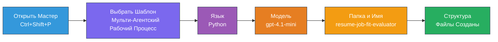
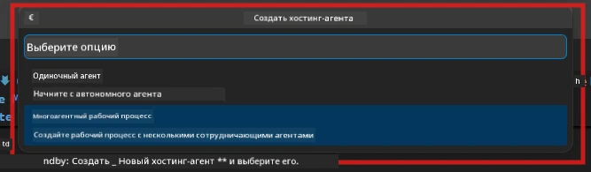

# Module 2 - Создание скелета проекта для мультиагентной системы

В этом модуле вы используете [расширение Microsoft Foundry](https://marketplace.visualstudio.com/items?itemName=TeamsDevApp.vscode-ai-foundry), чтобы **создать скелет проекта мультиагентного рабочего процесса**. Расширение генерирует всю структуру проекта — `agent.yaml`, `main.py`, `Dockerfile`, `requirements.txt`, `.env` и конфигурацию отладки. Затем вы настраиваете эти файлы в Модулях 3 и 4.

> **Примечание:** Папка `PersonalCareerCopilot/` в этой лабораторной работе — это полный, работающий пример настроенного мультиагентного проекта. Вы можете либо создать новый проект с нуля (рекомендуется для обучения), либо изучить существующий код напрямую.

---

## Шаг 1: Откройте мастер создания Hosted Agent


1. Нажмите `Ctrl+Shift+P`, чтобы открыть **Палитру команд**.
2. Введите: **Microsoft Foundry: Create a New Hosted Agent** и выберите эту команду.
3. Откроется мастер создания hosted agent.

> **Альтернатива:** Нажмите на иконку **Microsoft Foundry** на панели активности → нажмите на иконку **+** рядом с **Agents** → выберите **Create New Hosted Agent**.

---

## Шаг 2: Выберите шаблон Multi-Agent Workflow

Мастер предложит выбрать шаблон:

| Шаблон | Описание | Когда использовать |
|----------|-------------|-------------|
| Single Agent | Один агент с инструкциями и опциональными инструментами | Лабораторная 01 |
| **Multi-Agent Workflow** | Несколько агентов, взаимодействующих через WorkflowBuilder | **Эта лабораторная (Лабораторная 02)** |

1. Выберите **Multi-Agent Workflow**.
2. Нажмите **Далее**.



---

## Шаг 3: Выберите язык программирования

1. Выберите **Python**.
2. Нажмите **Далее**.

---

## Шаг 4: Выберите модель

1. Мастер показывает модели, развернутые в вашем проекте Foundry.
2. Выберите ту же модель, что использовали в Лабораторной 01 (например, **gpt-4.1-mini**).
3. Нажмите **Далее**.

> **Совет:** [`gpt-4.1-mini`](https://learn.microsoft.com/azure/foundry/foundry-models/concepts/models-sold-directly-by-azure#gpt-41-series) рекомендуется для разработки — он быстрый, недорогой и хорошо подходит для мультиагентных рабочих процессов. Для финального производственного развертывания переключитесь на `gpt-4.1`, если нужен более качественный вывод.

---

## Шаг 5: Выберите папку расположения и имя агента

1. Откроется диалог выбора файла. Выберите целевую папку:
   - Если следуете репозиторию с мастер-классом: перейдите в `workshop/lab02-multi-agent/` и создайте новую подпапку
   - Если начинаете с нуля: выберите любую папку
2. Введите **имя** для hosted agent (например, `resume-job-fit-evaluator`).
3. Нажмите **Создать**.

---

## Шаг 6: Дождитесь завершения создания скелета

1. VS Code откроет новое окно (или обновит текущее) со сгенерированным проектом.
2. Вы должны увидеть такую структуру файлов:

```
resume-job-fit-evaluator/
├── .env                ← Environment variables (placeholders)
├── .vscode/
│   └── launch.json     ← Debug configuration
├── agent.yaml          ← Agent definition (kind: hosted)
├── Dockerfile          ← Container configuration
├── main.py             ← Multi-agent workflow code (scaffold)
└── requirements.txt    ← Python dependencies
```

> **Примечание мастер-класса:** В репозитории мастер-класса папка `.vscode/` находится в **корне рабочей области** с общей конфигурацией `launch.json` и `tasks.json`. Конфигурации отладки для Лабораторной 01 и Лабораторной 02 включены. При нажатии F5 выберите из списка **"Lab02 - Multi-Agent"**.

---

## Шаг 7: Понимание сгенерированных файлов (особенности мультиагентной системы)

Скелет мультиагентного проекта отличается от одногентного по нескольким ключевым аспектам:

### 7.1 `agent.yaml` — определение агента

```yaml
kind: hosted
name: resume-job-fit-evaluator
description: >
  A multi-agent workflow that evaluates resume-to-job fit.
metadata:
  authors:
    - Microsoft
  tags:
    - Multi-Agent Workflow
    - Resume Evaluator
protocols:
  - protocol: responses
    version: v1
environment_variables:
  - name: PROJECT_ENDPOINT
    value: ${PROJECT_ENDPOINT}
  - name: MODEL_DEPLOYMENT_NAME
    value: ${MODEL_DEPLOYMENT_NAME}
```

**Ключевое отличие от Лабораторной 01:** Раздел `environment_variables` может включать дополнительные переменные для MCP endpoints или другую конфигурацию инструментов. Поля `name` и `description` отражают мультиагентное применение.

### 7.2 `main.py` — код мультиагентного рабочего процесса

Скелет включает:
- **Несколько строк с инструкциями для агентов** (по одной константе на агента)
- **Несколько контекстных менеджеров [`AzureAIAgentClient.as_agent()`](https://learn.microsoft.com/python/api/overview/azure/ai-agents-readme)** (по одному на агента)
- **[`WorkflowBuilder`](https://learn.microsoft.com/agent-framework/workflows/agents-in-workflows)** для связывания агентов
- **`from_agent_framework()`** для публикации рабочего процесса как HTTP endpoint

```python
from agent_framework import WorkflowBuilder, tool
from agent_framework.azure import AzureAIAgentClient
from azure.ai.agentserver.agentframework import from_agent_framework
```

Дополнительный импорт [`WorkflowBuilder`](https://learn.microsoft.com/agent-framework/workflows/agents-in-workflows) — новый по сравнению с Лабораторной 01.

### 7.3 `requirements.txt` — дополнительные зависимости

В мультиагентном проекте используются те же базовые пакеты, что и в Лабораторной 01, плюс пакеты, связанные с MCP:

```
agent-framework-azure-ai==1.0.0rc3
agent-framework-core==1.0.0rc3
azure-ai-agentserver-agentframework==1.0.0b16
azure-ai-agentserver-core==1.0.0b16
debugpy
agent-dev-cli --pre
```

> **Важное замечание по версиям:** Пакет `agent-dev-cli` требует флага `--pre` в `requirements.txt`, чтобы установить последнюю превью-версию. Это нужно для совместимости Agent Inspector с `agent-framework-core==1.0.0rc3`. Подробнее см. [Модуль 8 - Устранение неполадок](08-troubleshooting.md).

| Пакет | Версия | Назначение |
|---------|---------|---------|
| [`agent-framework-azure-ai`](https://learn.microsoft.com/agent-framework/overview/) | `1.0.0rc3` | Интеграция Azure AI для [Microsoft Agent Framework](https://github.com/microsoft/agent-framework) |
| [`agent-framework-core`](https://learn.microsoft.com/agent-framework/overview/) | `1.0.0rc3` | Основное время выполнения (включая WorkflowBuilder) |
| `azure-ai-agentserver-agentframework` | `1.0.0b16` | Время выполнения сервера hosted agent |
| `azure-ai-agentserver-core` | `1.0.0b16` | Основные абстракции сервера агента |
| `debugpy` | Последняя | Отладка Python (F5 в VS Code) |
| `agent-dev-cli` | `--pre` | Локальный CLI для разработки + бэкенд Agent Inspector |

### 7.4 `Dockerfile` — как в Лабораторной 01

Dockerfile идентичен файлу из Лабораторной 01 — копирует файлы, устанавливает зависимости из `requirements.txt`, открывает порт 8088 и запускает `python main.py`.

```dockerfile
FROM python:3.14-slim
WORKDIR /app
COPY ./ .
RUN pip install --upgrade pip && \
    if [ -f requirements.txt ]; then \
        pip install -r requirements.txt; \
    else \
      echo "No requirements.txt found" >&2; exit 1; \
    fi
EXPOSE 8088
CMD ["python", "main.py"]
```

---

### Контрольные точки

- [ ] Мастер создания скелета завершён → видна структура нового проекта
- [ ] Видны все файлы: `agent.yaml`, `main.py`, `Dockerfile`, `requirements.txt`, `.env`
- [ ] В `main.py` присутствует импорт `WorkflowBuilder` (подтверждает выбор шаблона мультиагентного проекта)
- [ ] В `requirements.txt` есть `agent-framework-core` и `agent-framework-azure-ai`
- [ ] Вы понимаете, как скелет мультиагентного проекта отличается от одногентного (несколько агентов, WorkflowBuilder, инструменты MCP)

---

**Предыдущий:** [01 - Понимание архитектуры мультиагентной системы](01-understand-multi-agent.md) · **Следующий:** [03 - Настройка агентов и окружения →](03-configure-agents.md)

---

<!-- CO-OP TRANSLATOR DISCLAIMER START -->
**Отказ от ответственности**:  
Этот документ был переведен с помощью сервиса автоматического перевода [Co-op Translator](https://github.com/Azure/co-op-translator). Хотя мы стремимся к точности, пожалуйста, имейте в виду, что автоматический перевод может содержать ошибки или неточности. Оригинальный документ на его исходном языке следует считать авторитетным источником. Для получения критически важной информации рекомендуется профессиональный перевод человеком. Мы не несем ответственности за любые недоразумения или неправильные толкования, возникшие в результате использования данного перевода.
<!-- CO-OP TRANSLATOR DISCLAIMER END -->