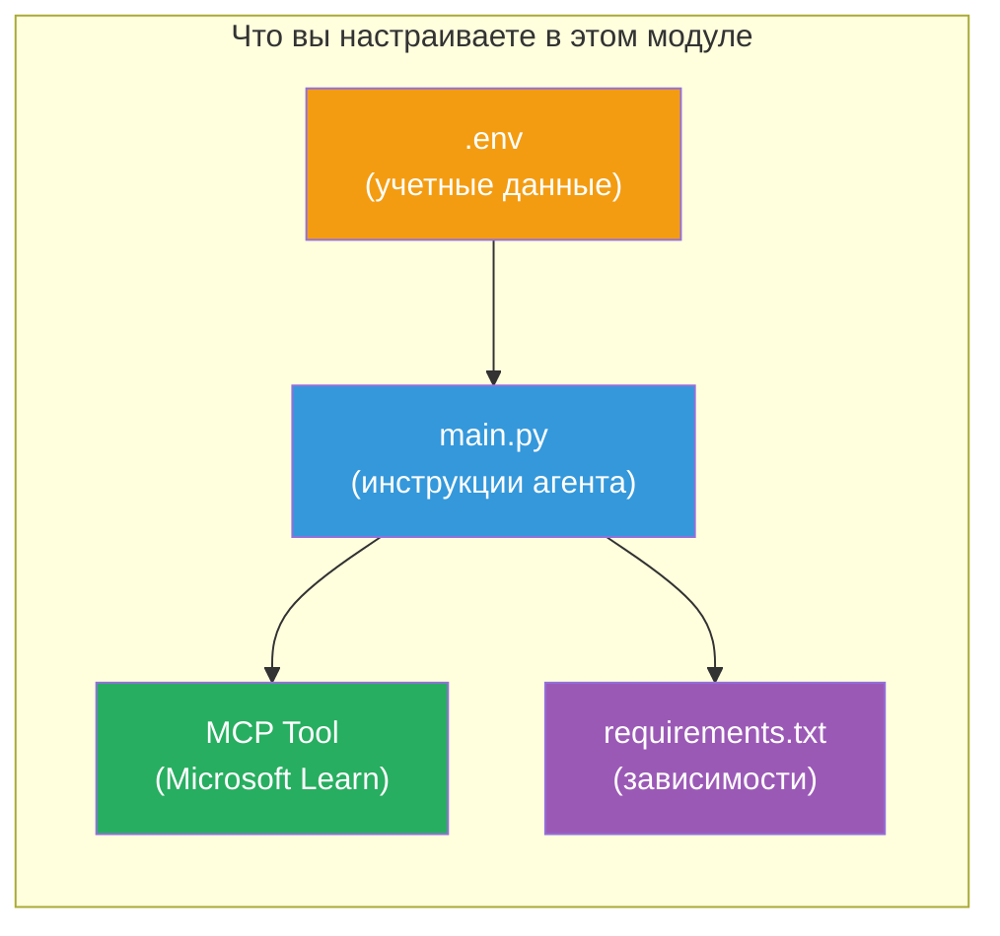

# Модуль 3 - Настройка агентов, инструмента MCP и окружения

В этом модуле вы кастомизируете сгенерированный проект с несколькими агентами. Вы напишете инструкции для всех четырёх агентов, настроите инструмент MCP для Microsoft Learn, сконфигурируете переменные окружения и установите зависимости.


> **Справка:** Полный рабочий код находится в [`PersonalCareerCopilot/main.py`](../../../../../workshop/lab02-multi-agent/PersonalCareerCopilot/main.py). Используйте его как ориентир при создании собственного решения.

---

## Шаг 1: Настройка переменных окружения

1. Откройте файл **`.env`** в корне вашего проекта.
2. Заполните данные вашего проекта Foundry:

   ```env
   PROJECT_ENDPOINT=https://<your-account>.services.ai.azure.com/api/projects/<your-project>
   MODEL_DEPLOYMENT_NAME=gpt-4.1-mini
   ```

3. Сохраните файл.

### Где найти эти значения

| Значение | Где найти |
|----------|------------|
| **Endpoint проекта** | Боковая панель Microsoft Foundry → кликните по вашему проекту → URL endpoint в деталях |
| **Имя развертывания модели** | Боковая панель Foundry → разверните проект → **Models + endpoints** → имя рядом с развернутой моделью |

> **Безопасность:** Никогда не коммитьте `.env` в систему контроля версий. Добавьте его в `.gitignore`, если это ещё не сделано.

### Соответствие переменных окружения

`main.py` для нескольких агентов читает как стандартные, так и специфичные для этого воркшопа имена переменных окружения:

```python
PROJECT_ENDPOINT = os.getenv("AZURE_AI_PROJECT_ENDPOINT") or os.getenv("PROJECT_ENDPOINT")
MODEL_DEPLOYMENT_NAME = os.getenv(
    "AZURE_AI_MODEL_DEPLOYMENT_NAME",
    os.getenv("MODEL_DEPLOYMENT_NAME", "gpt-4.1-mini"),
)
MICROSOFT_LEARN_MCP_ENDPOINT = os.getenv(
    "MICROSOFT_LEARN_MCP_ENDPOINT", "https://learn.microsoft.com/api/mcp"
)
```

Для MCP endpoint задано разумное значение по умолчанию — его не нужно указывать в `.env`, если вы не хотите переопределить его.

---

## Шаг 2: Напишите инструкции для агентов

Это самый важный шаг. Каждый агент нуждается в тщательно продуманных инструкциях, которые определяют его роль, формат вывода и правила. Откройте `main.py` и создайте (или измените) константы инструкций.

### 2.1 Агент парсинга резюме

```python
RESUME_PARSER_INSTRUCTIONS = """\
You are the Resume Parser.
Extract resume text into a compact, structured profile for downstream matching.

Output exactly these sections:
1) Candidate Profile
2) Technical Skills (grouped categories)
3) Soft Skills
4) Certifications & Awards
5) Domain Experience
6) Notable Achievements

Rules:
- Use only explicit or strongly implied evidence.
- Do not invent skills, titles, or experience.
- Keep concise bullets; no long paragraphs.
- If input is not a resume, return a short warning and request resume text.
"""
```

**Почему такие разделы?** MatchingAgent нуждается в структурированных данных для оценки. Единообразные разделы обеспечивают надежную передачу данных между агентами.

### 2.2 Агент описания вакансии

```python
JOB_DESCRIPTION_INSTRUCTIONS = """\
You are the Job Description Analyst.
Extract a structured requirement profile from a JD.

Output exactly these sections:
1) Role Overview
2) Required Skills
3) Preferred Skills
4) Experience Required
5) Certifications Required
6) Education
7) Domain / Industry
8) Key Responsibilities

Rules:
- Keep required vs preferred clearly separated.
- Only use what the JD states; do not invent hidden requirements.
- Flag vague requirements briefly.
- If input is not a JD, return a short warning and request JD text.
"""
```

**Почему разделение на обязательные и предпочтительные навыки?** MatchingAgent использует разные веса для каждого (Обязательные навыки = 40 пунктов, Предпочтительные навыки = 10 пунктов).

### 2.3 Агент сопоставления

```python
MATCHING_AGENT_INSTRUCTIONS = """\
You are the Matching Agent.
Compare parsed resume output vs JD output and produce an evidence-based fit report.

Scoring (100 total):
- Required Skills 40
- Experience 25
- Certifications 15
- Preferred Skills 10
- Domain Alignment 10

Output exactly these sections:
1) Fit Score (with breakdown math)
2) Matched Skills
3) Missing Skills
4) Partially Matched
5) Experience Alignment
6) Certification Gaps
7) Overall Assessment

Rules:
- Be objective and evidence-only.
- Keep partial vs missing separate.
- Keep Missing Skills precise; it feeds roadmap planning.
"""
```

**Почему явное оценивание?** Воспроизводимое оценивание позволяет сравнивать результаты и отлаживать ошибки. Шкала в 100 баллов проста для понимания конечными пользователями.

### 2.4 Агент анализа разрывов

```python
GAP_ANALYZER_INSTRUCTIONS = """\
You are the Gap Analyzer and Roadmap Planner.
Create a practical upskilling plan from the matching report.

Microsoft Learn MCP usage (required):
- For EVERY High and Medium priority gap, call tool `search_microsoft_learn_for_plan`.
- Use returned Learn links in Suggested Resources.
- Prefer Microsoft Learn for free resources.

CRITICAL: You MUST produce a SEPARATE detailed gap card for EVERY skill listed in
the Missing Skills and Certification Gaps sections of the matching report. Do NOT
skip or combine gaps. Do NOT summarize multiple gaps into one card.

Output format:
1) Personalized Learning Roadmap for [Role Title]
2) One DETAILED card per gap (produce ALL cards, not just the first):
   - Skill
   - Priority (High/Medium/Low)
   - Current Level
   - Target Level
   - Suggested Resources (include Learn URL from tool results)
   - Estimated Time
   - Quick Win Project
3) Recommended Learning Order (numbered list)
4) Timeline Summary (week-by-week)
5) Motivational Note

Rules:
- Produce every gap card before writing the summary sections.
- Keep it specific, realistic, and actionable.
- Tailor to candidate's existing stack.
- If fit >= 80, focus on polish/interview readiness.
- If fit < 40, be honest and provide a staged path.
"""
```

**Почему подчёркнуто "КРИТИЧНО"?** Без явных инструкций генерировать ВСЕ карточки разрывов модель обычно создаёт всего 1-2 карты и резюмирует остальные. Блок "КРИТИЧНО" предотвращает усечение.

---

## Шаг 3: Определите инструмент MCP

GapAnalyzer использует инструмент, который вызывает [сервер MCP Microsoft Learn](https://learn.microsoft.com/azure/foundry/agents/how-to/tools/model-context-protocol). Добавьте его в `main.py`:

```python
import json
from agent_framework import tool
from mcp.client.session import ClientSession
from mcp.client.streamable_http import streamable_http_client

@tool
async def search_microsoft_learn_for_plan(
    skill: str, role: str = "", max_results: int = 5
) -> str:
    """Search Microsoft Learn MCP and return curated official links for roadmap planning."""
    query = " ".join(part for part in [skill, role, "learning path module"] if part).strip()
    query = query or "job skills learning path"

    try:
        async with streamable_http_client(MICROSOFT_LEARN_MCP_ENDPOINT) as (
            read_stream, write_stream, _,
        ):
            async with ClientSession(read_stream, write_stream) as session:
                await session.initialize()
                result = await session.call_tool(
                    "microsoft_docs_search", {"query": query}
                )

        if not result.content:
            return (
                "No results returned from Microsoft Learn MCP. "
                "Fallback: https://learn.microsoft.com/training/support/catalog-api"
            )

        payload_text = getattr(result.content[0], "text", "")
        data = json.loads(payload_text) if payload_text else {}
        items = data.get("results", [])[:max(1, min(max_results, 10))]

        if not items:
            return f"No direct Microsoft Learn results found for '{skill}'."

        lines = [f"Microsoft Learn resources for '{skill}':"]
        for i, item in enumerate(items, start=1):
            title = item.get("title") or item.get("url") or "Microsoft Learn Resource"
            url = item.get("url") or item.get("link") or ""
            lines.append(f"{i}. {title} - {url}".rstrip(" -"))
        return "\n".join(lines)
    except Exception as ex:
        return (
            f"Microsoft Learn MCP lookup unavailable. Reason: {ex}. "
            "Fallbacks: https://learn.microsoft.com/api/mcp"
        )
```

### Как работает инструмент

| Шаг | Что происходит |
|-----|----------------|
| 1 | GapAnalyzer решает, что ему нужны ресурсы по навыку (например, "Kubernetes") |
| 2 | Фреймворк вызывает `search_microsoft_learn_for_plan(skill="Kubernetes")` |
| 3 | Функция устанавливает [Streamable HTTP](https://learn.microsoft.com/agent-framework/agents/tools/hosted-mcp-tools) соединение с `https://learn.microsoft.com/api/mcp` |
| 4 | Вызывает `microsoft_docs_search` на [сервере MCP](https://learn.microsoft.com/azure/foundry/agents/how-to/tools/model-context-protocol) |
| 5 | MCP сервер возвращает результаты поиска (заголовок + URL) |
| 6 | Функция форматирует результаты в нумерованный список |
| 7 | GapAnalyzer включает URL в карточку разрыва |

### Зависимости MCP

Клиентские библиотеки MCP включены транзитивно через [`agent-framework-core`](https://learn.microsoft.com/agent-framework/overview/). Вам **не нужно** добавлять их отдельно в `requirements.txt`. Если возникают ошибки импорта, проверьте:

```powershell
pip list | Select-String "mcp"
```

Ожидается, что пакет `mcp` установлен (версия 1.x или выше).

---

## Шаг 4: Свяжите агентов и рабочий процесс

### 4.1 Создайте агентов с контекстными менеджерами

```python
from contextlib import asynccontextmanager

@asynccontextmanager
async def create_agents():
    async with (
        get_credential() as credential,
        AzureAIAgentClient(
            project_endpoint=PROJECT_ENDPOINT,
            model_deployment_name=MODEL_DEPLOYMENT_NAME,
            credential=credential,
        ).as_agent(
            name="ResumeParser",
            instructions=RESUME_PARSER_INSTRUCTIONS,
        ) as resume_parser,
        AzureAIAgentClient(
            project_endpoint=PROJECT_ENDPOINT,
            model_deployment_name=MODEL_DEPLOYMENT_NAME,
            credential=credential,
        ).as_agent(
            name="JobDescriptionAgent",
            instructions=JOB_DESCRIPTION_INSTRUCTIONS,
        ) as jd_agent,
        AzureAIAgentClient(
            project_endpoint=PROJECT_ENDPOINT,
            model_deployment_name=MODEL_DEPLOYMENT_NAME,
            credential=credential,
        ).as_agent(
            name="MatchingAgent",
            instructions=MATCHING_AGENT_INSTRUCTIONS,
        ) as matching_agent,
        AzureAIAgentClient(
            project_endpoint=PROJECT_ENDPOINT,
            model_deployment_name=MODEL_DEPLOYMENT_NAME,
            credential=credential,
        ).as_agent(
            name="GapAnalyzer",
            instructions=GAP_ANALYZER_INSTRUCTIONS,
            tools=[search_microsoft_learn_for_plan],
        ) as gap_analyzer,
    ):
        yield resume_parser, jd_agent, matching_agent, gap_analyzer
```

**Основные моменты:**
- Каждый агент имеет **собственный** экземпляр `AzureAIAgentClient`
- Только GapAnalyzer получает `tools=[search_microsoft_learn_for_plan]`
- `get_credential()` возвращает [`ManagedIdentityCredential`](https://learn.microsoft.com/python/api/overview/azure/identity-readme#managed-identity-support) в Azure, и [`DefaultAzureCredential`](https://learn.microsoft.com/azure/developer/python/sdk/authentication/credential-chains#defaultazurecredential-overview) локально

### 4.2 Постройте граф рабочего процесса

```python
def create_workflow(resume_parser, jd_agent, matching_agent, gap_analyzer):
    workflow = (
        WorkflowBuilder(
            name="ResumeJobFitEvaluator",
            start_executor=resume_parser,
            output_executors=[gap_analyzer],
        )
        .add_edge(resume_parser, jd_agent)
        .add_edge(resume_parser, matching_agent)
        .add_edge(jd_agent, matching_agent)
        .add_edge(matching_agent, gap_analyzer)
        .build()
    )
    return workflow.as_agent()
```

> См. [Рабочие процессы как агенты](https://learn.microsoft.com/agent-framework/workflows/as-agents) для понимания паттерна `.as_agent()`.

### 4.3 Запустите сервер

```python
async def main() -> None:
    validate_configuration()
    async with create_agents() as (resume_parser, jd_agent, matching_agent, gap_analyzer):
        agent = create_workflow(resume_parser, jd_agent, matching_agent, gap_analyzer)
        from azure.ai.agentserver.agentframework import from_agent_framework
        await from_agent_framework(agent).run_async()

if __name__ == "__main__":
    asyncio.run(main())
```

---

## Шаг 5: Создайте и активируйте виртуальное окружение

### 5.1 Создайте окружение

```powershell
cd workshop\lab02-multi-agent\PersonalCareerCopilot
python -m venv .venv
```

### 5.2 Активируйте его

**PowerShell (Windows):**
```powershell
.\.venv\Scripts\Activate.ps1
```

**macOS/Linux:**
```bash
source .venv/bin/activate
```

### 5.3 Установите зависимости

```powershell
pip install -r requirements.txt
```

> **Примечание:** Строка `agent-dev-cli --pre` в `requirements.txt` гарантирует установку последней предварительной версии. Это необходимо для совместимости с `agent-framework-core==1.0.0rc3`.

### 5.4 Проверьте установку

```powershell
pip list | Select-String "agent-framework|agentserver|agent-dev"
```

Ожидаемый вывод:
```
agent-dev-cli                  0.0.1b260316
agent-framework-azure-ai       1.0.0rc3
agent-framework-core            1.0.0rc3
azure-ai-agentserver-agentframework 1.0.0b16
azure-ai-agentserver-core      1.0.0b16
```

> **Если `agent-dev-cli` показывает старую версию** (например, `0.0.1b260119`), Agent Inspector не сможет работать и выдаст ошибки 403/404. Обновите: `pip install agent-dev-cli --pre --upgrade`

---

## Шаг 6: Проверьте аутентификацию

Запустите ту же проверку аутентификации, что и в Лабораторной 01:

```powershell
az account show --query "{name:name, id:id}" --output table
```

Если она не проходит, выполните [`az login`](https://learn.microsoft.com/cli/azure/authenticate-azure-cli-interactively).

В многоагентных рабочих процессах все четыре агента используют одинаковые учётные данные. Если аутентификация проходит у одного, она работает у всех.

---

### Контрольный список

- [ ] В `.env` указаны корректные значения `PROJECT_ENDPOINT` и `MODEL_DEPLOYMENT_NAME`
- [ ] Все 4 константы инструкций агентов определены в `main.py` (ResumeParser, JD Agent, MatchingAgent, GapAnalyzer)
- [ ] Инструмент MCP `search_microsoft_learn_for_plan` определён и зарегистрирован у GapAnalyzer
- [ ] `create_agents()` создаёт всех 4 агентов с индивидуальными экземплярами `AzureAIAgentClient`
- [ ] `create_workflow()` строит правильный граф с помощью `WorkflowBuilder`
- [ ] Виртуальное окружение создано и активировано (`(.venv)` видно)
- [ ] `pip install -r requirements.txt` завершается без ошибок
- [ ] `pip list` показывает все ожидаемые пакеты нужных версий (rc3 / b16)
- [ ] Команда `az account show` возвращает ваш подписочный план

---

**Предыдущий:** [02 - Scaffold Multi-Agent Project](02-scaffold-multi-agent.md) · **Следующий:** [04 - Orchestration Patterns →](04-orchestration-patterns.md)

---

<!-- CO-OP TRANSLATOR DISCLAIMER START -->
**Отказ от ответственности**:
Этот документ был переведен с помощью сервиса автоматического перевода [Co-op Translator](https://github.com/Azure/co-op-translator). Хотя мы стремимся к точности, пожалуйста, имейте в виду, что автоматические переводы могут содержать ошибки и неточности. Оригинальный документ на его родном языке следует считать авторитетным источником. Для получения критически важной информации рекомендуется профессиональный перевод человеком. Мы не несем ответственности за любые недоразумения или неверные толкования, возникшие в результате использования этого перевода.
<!-- CO-OP TRANSLATOR DISCLAIMER END -->