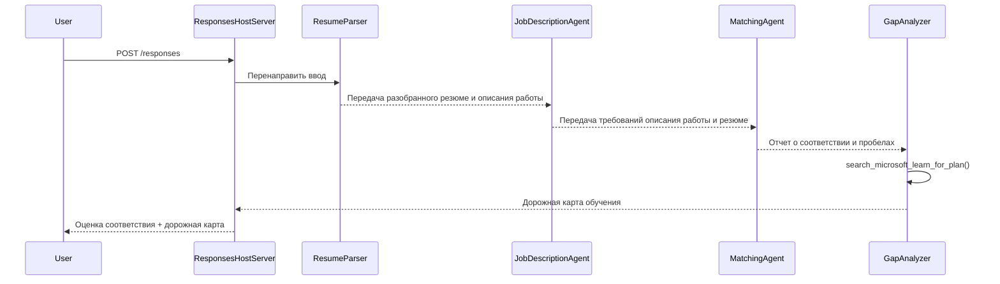

# Модуль 3 - Настройка инструкций, окружения и установка зависимостей

⏱️ ~15 мин

В этом модуле вы превратите заготовку в **ваш** многоагентный рабочий процесс — настроив переменные окружения, написав инструкции для агентов, добавив инструмент MCP, связав граф рабочего процесса и установив зависимости.

> **Справка:** Полный рабочий код находится в [`PersonalCareerCopilot/main.py`](../../../../../workshop/lab02-multi-agent/PersonalCareerCopilot/main.py). Используйте его в качестве ориентира при построении собственного графа рабочего процесса и блоков подсказок.

---

## Как связаны четыре агента


```mermaid
sequenceDiagram
    participant User
    participant Server as ResponsesHostServer
    participant RP as ResumeParser
    participant JD as JobDescriptionAgent
    participant MA as MatchingAgent
    participant GA as GapAnalyzer

    User->>Server: POST /responses
    Server->>RP: Перенаправить ввод
    RP-->>JD: Передача разобранного резюме и описания работы
    JD-->>MA: Передача требований описания работы и резюме
    MA-->>GA: Отчет о соответствии и пробелах
    GA->>GA: search_microsoft_learn_for_plan()
    GA-->>Server: Дорожная карта обучения
    Server-->>User: Оценка соответствия + дорожная карта
```

---

## Шаг 1: Настройка переменных окружения

1. Откройте файл **`.env`** в корне вашего проекта (созданный мастером scaffold).
2. Замените заполнители на реальные значения из Лаба 01.

<details open>
<summary><strong>🅰️ Путь A - Подписка Foundry</strong></summary>

```env
FOUNDRY_PROJECT_ENDPOINT=https://<your-account>.services.ai.azure.com/api/projects/<your-project>
AZURE_AI_MODEL_DEPLOYMENT_NAME=gpt-4.1-mini
```

> **Где найти значения:** См. [Лабораторная 01, Модуль 1](../../lab01-single-agent/docs/01-setup.md#deploy-a-model--assign-rbac).

</details>

<details open>
<summary><strong>🅱️ Путь B – Foundry Local</strong></summary>

```env
FOUNDRY_PROJECT_ENDPOINT=http://localhost:5273/v1
AZURE_AI_MODEL_DEPLOYMENT_NAME=phi-4-mini
```

> Все вычисления выполняются на вашем компьютере — данные не покидают ваше устройство. Запустите `foundry model list`, чтобы подтвердить точный алиас модели. Единственный исходящий запрос — вызов инструмента MCP на `https://learn.microsoft.com/api/mcp`.

> **Где найти значения:** См. [Лабораторная 01, Модуль 1 – локальный путь](../../lab01-single-agent/docs/01-setup.md#step-2-set-up-based-on-your-access).

</details>

> **Безопасность:** Никогда не коммитьте `.env` в систему контроля версий. Файл должен уже быть в `.gitignore`.

---

## Шаг 2: Написание инструкций для агентов

Инструкции определяют роль каждого агента, формат вывода и правила. Откройте `main.py` и определите (или замените) четыре константы инструкций — полные строки находятся в [`PersonalCareerCopilot/main.py`](../../../../../workshop/lab02-multi-agent/PersonalCareerCopilot/main.py).

### 2.1 `RESUME_PARSER_INSTRUCTIONS`
Анализирует резюме в структурированный профиль кандидата **и** копирует описание вакансии дословно в `[JOB DESCRIPTION PASS-THROUGH]`. Оба отмеченных раздела должны быть в выводе.

> **Зачем нужен проходящий текст?** При `context_mode="last_agent"` ResumeParser — **единственный** агент, который видит исходное сообщение пользователя. Если он не передаст описание вакансии дальше, следующие агенты его не увидят.

### 2.2 `JOB_DESCRIPTION_INSTRUCTIONS`
Считывает `[PARSED RESUME]` и `[JOB DESCRIPTION PASS-THROUGH]` из вывода ResumeParser. Выдает `[JD REQUIREMENTS]` (структурированные требования) и `[PARSED RESUME PASS-THROUGH]` (дословную копию резюме для MatchingAgent).

### 2.3 `MATCHING_AGENT_INSTRUCTIONS`
Считывает `[JD REQUIREMENTS]` и `[PARSED RESUME PASS-THROUGH]`. Создает отчет по степени соответствия (0–100) с разбивкой по расчетам, совпадающим навыкам, отсутствующим навыкам и соответствию опыту.

### 2.4 `GAP_ANALYZER_INSTRUCTIONS`
Считывает отчет о соответствии. Для **каждого** отсутствующего навыка вызывает `search_microsoft_learn_for_plan` для получения ресурсов Microsoft Learn. Создает одну подробную карточку пропуска по навыкам и план обучения по неделям.

---

## Шаг 3: Добавление инструмента MCP

GapAnalyzer вызывает [сервер Microsoft Learn MCP](https://learn.microsoft.com/azure/foundry/agents/how-to/tools/model-context-protocol), чтобы получить реальные обучающие материалы для каждого пробела в навыках. Полная функция `search_microsoft_learn_for_plan` находится в [`PersonalCareerCopilot/main.py`](../../../../../workshop/lab02-multi-agent/PersonalCareerCopilot/main.py).

Зарегистрируйте инструмент на GapAnalyzer при создании агента:

```python
gap_analyzer = Agent(
    client=client,
    instructions=GAP_ANALYZER_INSTRUCTIONS,
    name="GapAnalyzer",
    tools=[search_microsoft_learn_for_plan],
)
```

> Смотрите [`PersonalCareerCopilot/main.py`](../../../../../workshop/lab02-multi-agent/PersonalCareerCopilot/main.py) для полного графа `WorkflowBuilder` с `FoundryChatClient`, `AgentExecutor` и всеми вызовами `add_edge()`.

---

## Шаг 4: Создайте виртуальное окружение и установите зависимости

> ⚠️ **Не пропускайте этот шаг.** Без установленных зависимостей отладка с F5 не будет работать.

### 4.1 Создайте виртуальное окружение

```powershell
python -m venv .venv
```

### 4.2 Активируйте его

| ОС | Команда |
|----|---------|
| **Windows (PowerShell)** | `.\.venv\Scripts\Activate.ps1` |
| **Windows (CMD)** | `.venv\Scripts\activate.bat` |
| **macOS / Linux** | `source .venv/bin/activate` |

В командной строке должна появиться метка `(.venv)`.

### 4.3 Установите зависимости

```powershell
pip install -r requirements.txt
```

### 4.4 Проверьте

```powershell
pip list | Select-String "agent-framework|mcp|debugpy"
```

Ожидается наличие в списке: `agent-framework-foundry`, `agent-framework-foundry-hosting`, `mcp` и `debugpy`.

---

## Шаг 5: Проверьте аутентификацию

<details open>
<summary><strong>🅰️ Путь A - Учетные данные Azure</strong></summary>

```powershell
az account show --query "{name:name, id:id}" --output table
```

Если не сработает, выполните [`az login`](https://learn.microsoft.com/cli/azure/authenticate-azure-cli-interactively).

Все четыре агента используют один `FoundryChatClient` и один `DefaultAzureCredential`. Если аутентификация прошла успешно для одного, она работает для всех.

</details>

<details open>
<summary><strong>🅱️ Путь B - Foundry Local</strong></summary>

Для локального тестирования аутентификация не требуется.

</details>

---

### ✅ Контрольная точка

> **Не переходите к Модулю 04**, пока: **(1)** в приглашении отображается `(.venv)` И **(2)** команда `pip install -r requirements.txt` успешно завершилась.

- [ ] `.env` содержит рабочие адрес и имя развернутой модели (не заполнители)
- [ ] Все 4 константы инструкций агентов определены в `main.py` (ResumeParser, JD Agent, MatchingAgent, GapAnalyzer)
- [ ] Инструмент MCP `search_microsoft_learn_for_plan` определён и зарегистрирован на GapAnalyzer
- [ ] Созданы объекты `FoundryChatClient` + 4 `Agent` + 4 `AgentExecutor` в функции `main()`
- [ ] `WorkflowBuilder` строит правильный последовательный граф со всеми 3 вызовами `add_edge()`
- [ ] Виртуальное окружение создано и активировано (виден `(.venv)` в приглашении)
- [ ] `pip install -r requirements.txt` завершена без ошибок
- [ ] **Путь A:** команда `az account show` прошла успешно ИЛИ в VS Code на иконке аккаунтов отображается вошедший аккаунт

---

**Предыдущий:** [02 - Scaffold Multi-Agent Project](02-scaffold-multi-agent.md) · **Следующий:** [04 - Orchestration Patterns →](04-orchestration-patterns.md)

---

<!-- CO-OP TRANSLATOR DISCLAIMER START -->
**Отказ от ответственности**:
Этот документ был переведен с использованием сервиса машинного перевода [Co-op Translator](https://github.com/Azure/co-op-translator). Несмотря на наши усилия по обеспечению точности, имейте в виду, что автоматический перевод может содержать ошибки или неточности. Оригинальный документ на его исходном языке следует считать авторитетным источником. Для получения критически важной информации рекомендуется обратиться к профессиональному человеческому переводу. Мы не несем ответственности за любые недоразумения или неправильные толкования, возникшие в результате использования этого перевода.
<!-- CO-OP TRANSLATOR DISCLAIMER END -->