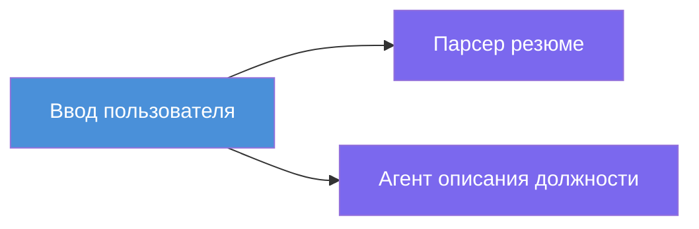
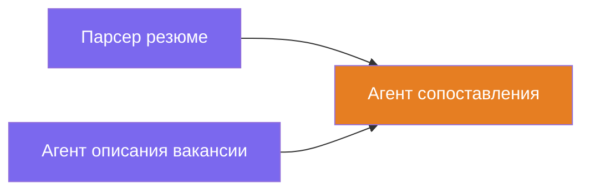
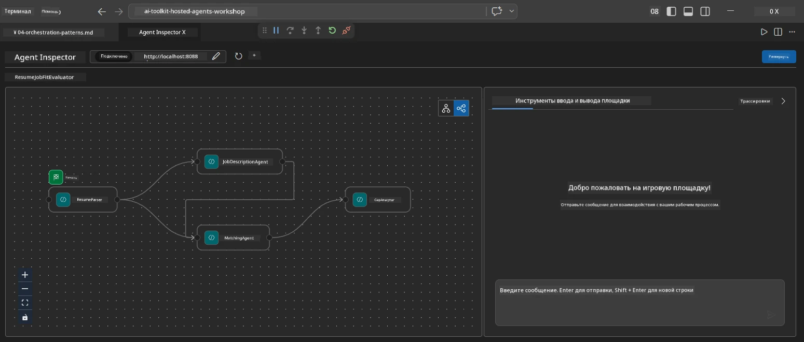
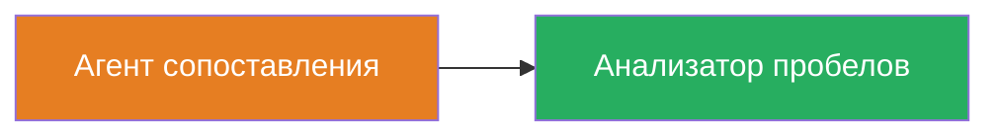
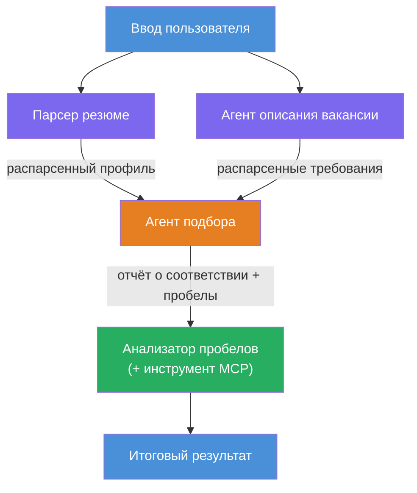
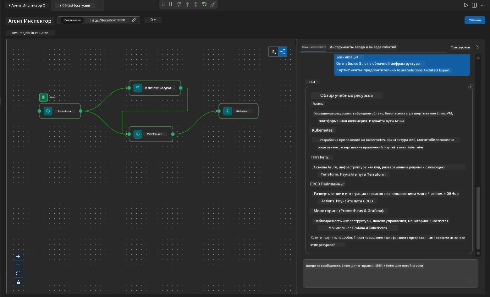

# Модуль 4 - Шаблоны оркестрации

В этом модуле вы изучите шаблоны оркестрации, используемые в Resume Job Fit Evaluator, и научитесь читать, изменять и расширять граф рабочего процесса. Понимание этих шаблонов имеет важное значение для отладки проблем с потоками данных и создания собственных [многоагентных рабочих процессов](https://learn.microsoft.com/agent-framework/workflows/).

---

## Шаблон 1: Fan-out (параллельное разветвление)

Первый шаблон в рабочем процессе — **fan-out** — один вход отправляется одновременно нескольким агентам.


В коде это происходит потому, что `resume_parser` является `start_executor` — он первым получает сообщение пользователя. Затем, поскольку и `jd_agent`, и `matching_agent` имеют ребра от `resume_parser`, фреймворк направляет вывод `resume_parser` к обоим агентам:

```python
.add_edge(resume_parser, jd_agent)         # Вывод ResumeParser → JD Agent
.add_edge(resume_parser, matching_agent)   # Вывод ResumeParser → MatchingAgent
```

**Почему это работает:** ResumeParser и JD Agent обрабатывают разные аспекты одного и того же ввода. Запуск их параллельно уменьшает общую задержку по сравнению с последовательным запуском.

### Когда использовать fan-out

| Случай использования | Пример |
|----------------------|---------|
| Независимые подзадачи | Парсинг резюме против парсинга JD |
| Избыточность / голосование | Два агента анализируют одни и те же данные, третий выбирает лучший ответ |
| Вывод в нескольких форматах | Один агент генерирует текст, другой — структурированный JSON |

---

## Шаблон 2: Fan-in (агрегация)

Второй шаблон — **fan-in** — несколько выходных данных агентов собираются и отправляются одному нижестоящему агенту.


В коде:

```python
.add_edge(resume_parser, matching_agent)   # Вывод ResumeParser → MatchingAgent
.add_edge(jd_agent, matching_agent)        # Вывод JD Agent → MatchingAgent
```

**Ключевое поведение:** Когда у агента есть **два или более входящих ребра**, фреймворк автоматически ждет завершения **всех** верхнеуровневых агентов, прежде чем запускать нижестоящего агента. MatchingAgent не запускается, пока не завершатся оба: ResumeParser и JD Agent.

### Что получает MatchingAgent

Фреймворк конкатенирует выводы всех верхнеуровневых агентов. Входные данные MatchingAgent выглядят так:

```
[ResumeParser output]
---
Candidate Profile:
  Name: Jane Doe
  Technical Skills: Python, Azure, Kubernetes, ...
  ...

[JobDescriptionAgent output]
---
Role Overview: Senior Cloud Engineer
Required Skills: Python, Azure, Terraform, ...
...
```

> **Примечание:** Точный формат конкатенации зависит от версии фреймворка. Инструкции для агента должны быть написаны так, чтобы справляться как со структурированным, так и с неструктурированным выводом сверху.



---

## Шаблон 3: Последовательная цепочка

Третий шаблон — **последовательное связывание** — вывод одного агента напрямую передается следующему.


В коде:

```python
.add_edge(matching_agent, gap_analyzer)    # Вывод MatchingAgent → GapAnalyzer
```

Это самый простой шаблон. GapAnalyzer получает оценку соответствия от MatchingAgent, сопоставленные / отсутствующие навыки и пробелы. Затем он вызывает [инструмент MCP](https://learn.microsoft.com/azure/foundry/agents/how-to/tools/model-context-protocol) для каждого пробела, чтобы получить ресурсы Microsoft Learn.

---

## Полный граф

Объединение всех трех шаблонов производит полный рабочий процесс:


### Временная шкала выполнения

```mermaid
gantt
    title Таймлайн выполнения агента
    dateFormat X
    axisFormat %s

    section Параллельно
    Resume Parser       :rp, 0, 3
    JD Agent            :jd, 0, 2

    section Последовательно
    Matching Agent      :ma, 3, 5
    Gap Analyzer        :ga, 5, 9
```


> Общее время от запуска до завершения примерно `max(ResumeParser, JD Agent) + MatchingAgent + GapAnalyzer`. GapAnalyzer обычно самый медленный, потому что делает несколько вызовов инструмента MCP (по одному на каждый пробел).

---

## Чтение кода WorkflowBuilder

Вот полная функция `create_workflow()` из `main.py` с аннотациями:

```python
def create_workflow(resume_parser, jd_agent, matching_agent, gap_analyzer):
    workflow = (
        WorkflowBuilder(
            name="ResumeJobFitEvaluator",

            # Первый агент, получающий ввод от пользователя
            start_executor=resume_parser,

            # Агент(ы), чей вывод становится окончательным ответом
            output_executors=[gap_analyzer],
        )
        # Распределение: вывод ResumeParser идет как в JD Agent, так и в MatchingAgent
        .add_edge(resume_parser, jd_agent)
        .add_edge(resume_parser, matching_agent)

        # Слияние: MatchingAgent ожидает и ResumeParser, и JD Agent
        .add_edge(jd_agent, matching_agent)

        # Последовательность: вывод MatchingAgent подается на GapAnalyzer
        .add_edge(matching_agent, gap_analyzer)

        .build()
    )
    return workflow.as_agent()
```

### Таблица с кратким описанием ребер

| # | Ребро | Шаблон | Эффект |
|---|-------|--------|--------|
| 1 | `resume_parser → jd_agent` | Fan-out | JD Agent получает вывод ResumeParser (плюс исходный ввод пользователя) |
| 2 | `resume_parser → matching_agent` | Fan-out | MatchingAgent получает вывод ResumeParser |
| 3 | `jd_agent → matching_agent` | Fan-in | MatchingAgent также получает вывод JD Agent (ждет оба) |
| 4 | `matching_agent → gap_analyzer` | Последовательный | GapAnalyzer получает отчет соответствия + список пробелов |

---

## Изменение графа

### Добавление нового агента

Чтобы добавить пятого агента (например, **InterviewPrepAgent**, который генерирует вопросы для собеседования на основе анализа пробелов):

```python
# 1. Определить инструкции
INTERVIEW_PREP_INSTRUCTIONS = """\
You are the Interview Prep Agent.
Given a gap analysis and fit report, generate 10 targeted interview questions
the candidate should prepare for.
"""

# 2. Создать агента (внутри блока async with)
AzureAIAgentClient(
    project_endpoint=PROJECT_ENDPOINT,
    model_deployment_name=MODEL_DEPLOYMENT_NAME,
    credential=credential,
).as_agent(
    name="InterviewPrepAgent",
    instructions=INTERVIEW_PREP_INSTRUCTIONS,
) as interview_prep,

# 3. Добавить связи в create_workflow()
.add_edge(matching_agent, interview_prep)   # получает отчет о подгонке
.add_edge(gap_analyzer, interview_prep)     # также получает gap cards

# 4. Обновить output_executors
output_executors=[interview_prep],  # теперь финальный агент
```

### Изменение порядка выполнения

Чтобы JD Agent запускался **после** ResumeParser (последовательно, а не параллельно):

```python
# Удалить: .add_edge(resume_parser, jd_agent) ← уже существует, сохранить
# Удалите неявный параллелизм, НЕ позволяя jd_agent напрямую получать ввод пользователя
# start_executor сначала отправляет данные в resume_parser, а jd_agent получает
# выходные данные resume_parser через ребро. Это делает их последовательными.
```

> **Важно:** `start_executor` — единственный агент, который получает исходный ввод пользователя. Все остальные агенты получают вывод своих верхнеуровневых ребер. Если агент должен также получить исходный ввод пользователя, у него должно быть ребро от `start_executor`.

---

## Распространенные ошибки в графе

| Ошибка | Симптом | Исправление |
|--------|---------|-------------|
| Отсутствует ребро к `output_executors` | Агент работает, но вывод пустой | Убедитесь, что существует путь от `start_executor` ко всем агентам в `output_executors` |
| Циклическая зависимость | Бесконечный цикл или таймаут | Проверьте, что ни один агент не возвращается к верхнеуровневому агенту |
| Агент в `output_executors` без входящего ребра | Пустой вывод | Добавьте хотя бы одно `add_edge(source, that_agent)` |
| Несколько `output_executors` без fan-in | Вывод содержит ответ только одного агента | Используйте одного агента-агрегатора на выходе или принимайте несколько выводов |
| Отсутствует `start_executor` | `ValueError` во время сборки | Всегда указывайте `start_executor` в `WorkflowBuilder()` |

---

## Отладка графа

### Использование Agent Inspector

1. Запустите агента локально (F5 или терминал - см. [Модуль 5](05-test-locally.md)).
2. Откройте Agent Inspector (`Ctrl+Shift+P` → **Foundry Toolkit: Open Agent Inspector**).
3. Отправьте тестовое сообщение.
4. В панели отклика инспектора найдите **потоковый вывод** — он показывает вклад каждого агента последовательно.



### Использование логирования

Добавьте логирование в `main.py` для отслеживания потока данных:

```python
import logging
logger = logging.getLogger("resume-job-fit")

# В create_workflow(), после построения:
logger.info("Workflow graph built with edges: RP→JD, RP→MA, JD→MA, MA→GA")
```

Логи сервера показывают порядок запуска агентов и вызовы инструмента MCP:

```
INFO:resume-job-fit:Starting Resume -> Job Fit Evaluator HTTP server...
INFO:resume-job-fit:Server running on http://localhost:8088
INFO:agent_framework:Executing agent: ResumeParser
INFO:agent_framework:Executing agent: JobDescriptionAgent
INFO:agent_framework:Waiting for upstream agents: ResumeParser, JobDescriptionAgent
INFO:agent_framework:Executing agent: MatchingAgent
INFO:agent_framework:Executing agent: GapAnalyzer
INFO:agent_framework:Tool call: search_microsoft_learn_for_plan(skill="Kubernetes")
POST https://learn.microsoft.com/api/mcp → 200
INFO:agent_framework:Tool call: search_microsoft_learn_for_plan(skill="Terraform")
POST https://learn.microsoft.com/api/mcp → 200
```

---

### Контрольный список

- [ ] Вы можете идентифицировать три шаблона оркестрации в рабочем процессе: fan-out, fan-in и последовательную цепочку
- [ ] Вы понимаете, что агенты с несколькими входящими ребрами ждут завершения всех верхнеуровневых агентов
- [ ] Вы умеете читать код `WorkflowBuilder` и сопоставлять каждый вызов `add_edge()` с визуальным графом
- [ ] Вы понимаете временную последовательность выполнения: параллельные агенты работают сначала, затем агрегация, затем последовательное выполнение
- [ ] Вы знаете, как добавить нового агента в граф (определение инструкций, создание агента, добавление ребер, обновление вывода)
- [ ] Вы можете выявлять распространенные ошибки графа и их симптомы

---

**Предыдущий:** [03 - Настройка агентов и окружения](03-configure-agents.md) · **Следующий:** [05 - Локальное тестирование →](05-test-locally.md)

---

<!-- CO-OP TRANSLATOR DISCLAIMER START -->
**Отказ от ответственности**:  
Этот документ был переведен с помощью сервиса AI-перевода [Co-op Translator](https://github.com/Azure/co-op-translator). Несмотря на наши усилия обеспечить точность, пожалуйста, учитывайте, что автоматический перевод может содержать ошибки или неточности. Оригинальный документ на родном языке следует считать авторитетным источником. Для критически важной информации рекомендуется обратиться к профессиональному человеческому переводу. Мы не несем ответственности за любые недоразумения или неправильные толкования, возникающие в результате использования данного перевода.
<!-- CO-OP TRANSLATOR DISCLAIMER END -->