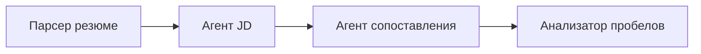
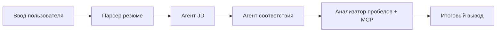

# Модуль 4 - Шаблоны оркестрации

⏱️ ~10 мин

В этом модуле вы изучите шаблоны оркестрации, используемые в Resume Job Fit Evaluator, и научитесь читать, изменять и расширять граф рабочего процесса. Понимание этих шаблонов важно для устранения проблем с потоком данных и создания собственных [многоагентных рабочих процессов](https://learn.microsoft.com/agent-framework/workflows/).

---

## Шаблон 1: Последовательная цепочка

Основной шаблон в рабочем процессе — **последовательная цепочка** — выход каждого агента напрямую передаётся следующему.


```mermaid
flowchart LR
    RP[Парсер резюме] --> JD[Агент JD]
    JD --> MA[Агент сопоставления]
    MA --> GA[Анализатор пробелов]
```

В коде каждый вызов `add_edge()` создаёт один шаг в цепочке:

```python
.add_edge(resume_executor, jd_executor)       # Результат ResumeParser → JD Agent
.add_edge(jd_executor, matching_executor)     # Результат JD Agent → MatchingAgent
.add_edge(matching_executor, gap_executor)    # Результат MatchingAgent → GapAnalyzer
```

> **Почему последовательная, а не развилка/слияние?** `WorkflowBuilder` использует **OR-семантику** для входящих рёбер: исполнитель вниз по потоку запускается, как только завершится **любой** предшественник. Если у `matching_executor` было бы два входящих ребра (от `resume_executor` и `jd_executor`), он запустился бы дважды — один раз после завершения ResumeParser и ещё раз после завершения JD Agent — из-за этого GapAnalyzer также запустился бы дважды, и выходные данные появились бы дважды. Последовательная цепочка полностью избегает этой проблемы.

## Шаблон 2: Передача содержимого

Поскольку `context_mode="last_agent"` означает, что каждый исполнитель видит только выходные данные своего **прямого предшественника**, агенты в последовательной цепочке должны явно передавать любые данные, необходимые агентам вниз по потоку.

В этом рабочем процессе:
- **ResumeParser** копирует JD дословно в `[JOB DESCRIPTION PASS-THROUGH]` (чтобы JD Agent мог его найти).
- **JD Agent** копирует `[PARSED RESUME]` дословно в `[PARSED RESUME PASS-THROUGH]` (чтобы MatchingAgent мог сравнить оба профиля).

```
ResumeParser output
└─ [PARSED RESUME]               ← extracted by JD Agent
└─ [JOB DESCRIPTION PASS-THROUGH] ← extracted by JD Agent

JD Agent output
└─ [JD REQUIREMENTS]             ← extracted by MatchingAgent
└─ [PARSED RESUME PASS-THROUGH]  ← extracted by MatchingAgent
```

Каждый раздел передачи должен копироваться **дословно** — его суммирование или перефразирование ломает работу вниз по потоку зависящего агента.

---

## Полный граф

Комбинирование шаблонов последовательной цепочки и передачи содержимого даёт полный рабочий процесс:


```mermaid
flowchart LR
    U[Ввод пользователя] --> RP[Парсер резюме]
    RP --> JD[Агент JD]
    JD --> MA[Агент соответствия]
    MA --> GA[Анализатор пробелов + MCP]
    GA --> O[Итоговый вывод]
```

Агент Inspector показывает ту же структуру графа, когда агент работает локально. Смотрите [Модуль 5 — Тестирование локально](05-test-locally.md) для скриншотов.

---

## Чтение кода WorkflowBuilder

Полная функция `create_workflow()` находится в [`PersonalCareerCopilot/main.py`](../../../../../workshop/lab02-multi-agent/PersonalCareerCopilot/main.py). Три вызова `add_edge()` строят последовательную цепочку:

| # | Ребро | Эффект |
|---|-------|---------|
| 1 | `resume_executor → jd_executor` | JD Agent получает `[PARSED RESUME]` + `[JOB DESCRIPTION PASS-THROUGH]` |
| 2 | `jd_executor → matching_executor` | MatchingAgent получает `[JD REQUIREMENTS]` + `[PARSED RESUME PASS-THROUGH]` |
| 3 | `matching_executor → gap_executor` | GapAnalyzer получает отчёт о соответствии + список пробелов |

---

## Изменение графа

### Добавление нового агента

Чтобы добавить пятого агента (например, **InterviewPrepAgent** после GapAnalyzer):

1. Определите константу `INTERVIEW_PREP_INSTRUCTIONS`.
2. Создайте объекты `Agent` + `AgentExecutor` (по той же схеме, что и для существующих четырёх).
3. Добавьте `.add_edge(gap_executor, interview_exec)` в `WorkflowBuilder`.
4. Обновите `output_executors=[interview_exec]`.

> **Важно:** `start_executor` — единственный агент, который получает необработанный ввод пользователя. Все остальные агенты получают вывод с их предыдущего ребра.

---

## Распространённые ошибки графа

| Ошибка | Симптом | Исправление |
|--------|---------|------------|
| Отсутствует ребро к `output_executors` | Агент запускается, но вывод пуст | Убедитесь, что существует путь от `start_executor` к каждому агенту в `output_executors` |
| Циклическая зависимость | Бесконечный цикл или тайм-аут | Проверьте, что ни один агент не ссылается обратно на агента выше по потоку |
| Агент в `output_executors` без входящего ребра | Пустой вывод | Добавьте хотя бы одно `add_edge(source, that_agent)` |
| Несколько `output_executors` без слияния (fan-in) | Вывод содержит ответы только одного агента | Используйте одного выходного агента, который агрегирует, или принимайте несколько выводов |
| Отсутствует `start_executor` | `ValueError` при сборке | Всегда указывайте `start_executor` в `WorkflowBuilder()` |

---

## Отладка графа

### Использование Agent Inspector

1. Запустите агента локально с помощью F5.
2. Откройте Agent Inspector (`Ctrl+Shift+P` → **Foundry Toolkit: Open Agent Inspector**).
3. Отправьте тестовое сообщение.
4. В панели ответа Инспектора смотрите на **потоковый вывод** — он показывает последовательный вклад каждого агента.


### Использование логирования

Добавьте логирование в `main.py` для отслеживания потока данных:

```python
import logging
logger = logging.getLogger("resume-job-fit")

# В main(), после построения рабочего процесса:
logger.info("Workflow graph built with edges: RP→JD, JD→MA, MA→GA")
```

В логах сервера отображается порядок выполнения агентов и вызовы MCP tools:

```
INFO:agent_framework:Executing agent: ResumeParser
INFO:agent_framework:Executing agent: JobDescriptionAgent
INFO:agent_framework:Executing agent: MatchingAgent
INFO:agent_framework:Executing agent: GapAnalyzer
INFO:agent_framework:Tool call: search_microsoft_learn_for_plan(skill="Kubernetes")
POST https://learn.microsoft.com/api/mcp → 200
INFO:agent_framework:Tool call: search_microsoft_learn_for_plan(skill="Terraform")
POST https://learn.microsoft.com/api/mcp → 200
```

---

### Контрольная точка

- [ ] Вы можете определить два шаблона оркестрации в рабочем процессе: последовательная цепочка и передача содержимого
- [ ] Вы понимаете, почему `context_mode="last_agent"` требует явной передачи данных между агентами
- [ ] Вы умеете читать код `WorkflowBuilder` и сопоставлять каждый вызов `add_edge()` с визуальным графом
- [ ] Вы знаете, как добавить нового агента в конец цепочки
- [ ] Вы можете выявлять распространённые ошибки графа и их симптомы

---

**Предыдущий:** [03 - Настройка агентов и среды](03-configure-agents.md) · **Следующий:** [05 - Тестирование локально →](05-test-locally.md)

---

<!-- CO-OP TRANSLATOR DISCLAIMER START -->
**Отказ от ответственности**:
Этот документ был переведен с использованием сервиса машинного перевода [Co-op Translator](https://github.com/Azure/co-op-translator). Несмотря на наши усилия по обеспечению точности, имейте в виду, что автоматический перевод может содержать ошибки или неточности. Оригинальный документ на его исходном языке следует считать авторитетным источником. Для получения критически важной информации рекомендуется обратиться к профессиональному человеческому переводу. Мы не несем ответственности за любые недоразумения или неправильные толкования, возникшие в результате использования этого перевода.
<!-- CO-OP TRANSLATOR DISCLAIMER END -->