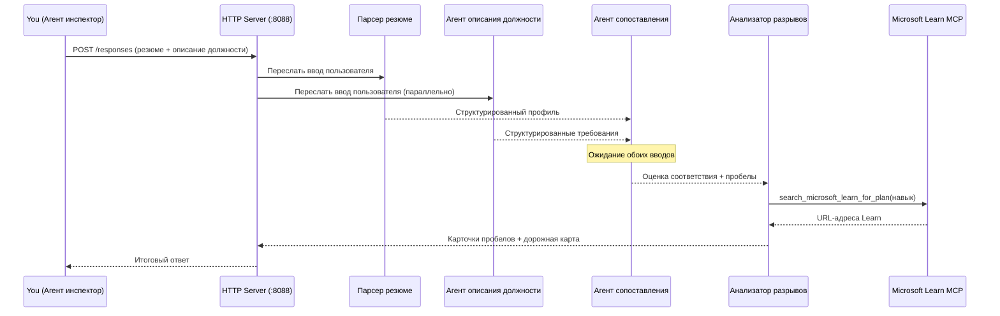
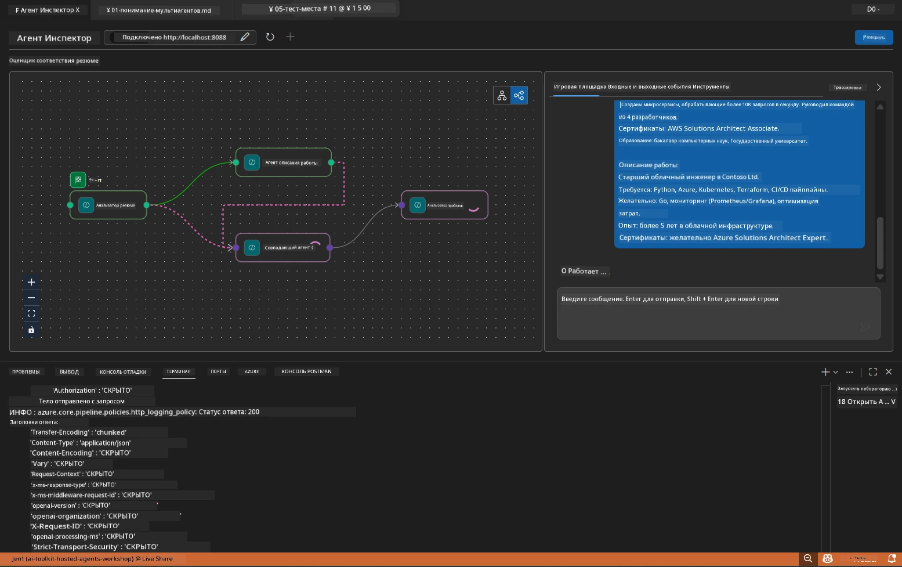

# Модуль 5 - Локальное тестирование (Мультиагент)

В этом модуле вы запускаете мультиагентный рабочий процесс локально, тестируете его с помощью Agent Inspector и проверяете, что все четыре агента и инструмент MCP работают корректно перед развертыванием в Foundry.

### Что происходит во время локального теста


---

## Шаг 1: Запуск серверного агента

### Вариант A: Использование задачи VS Code (рекомендуется)

1. Нажмите `Ctrl+Shift+P` → введите **Tasks: Run Task** → выберите **Run Lab02 HTTP Server**.
2. Задача запускает сервер с debugpy на порту `5679` и агента на порту `8088`.
3. Дождитесь, пока в выводе появится:

```
INFO:resume-job-fit:Starting Resume -> Job Fit Evaluator HTTP server...
INFO:resume-job-fit:Server running on http://localhost:8088
```

### Вариант B: Ручной запуск через терминал

```powershell
cd workshop\lab02-multi-agent\PersonalCareerCopilot
```

Активируйте виртуальное окружение:

**PowerShell (Windows):**
```powershell
.\.venv\Scripts\Activate.ps1
```

**macOS/Linux:**
```bash
source .venv/bin/activate
```

Запустите сервер:

```powershell
python -m debugpy --listen 127.0.0.1:5679 -m agentdev run main.py --verbose --port 8088
```

### Вариант C: Использование F5 (режим отладки)

1. Нажмите `F5` или зайдите в **Run and Debug** (`Ctrl+Shift+D`).
2. Выберите конфигурацию запуска **Lab02 - Multi-Agent** из выпадающего списка.
3. Сервер запускается с поддержкой точек останова.

> **Подсказка:** Режим отладки позволяет устанавливать точки останова внутри функции `search_microsoft_learn_for_plan()` для проверки ответов MCP, или внутри строк инструкций агентов, чтобы увидеть, что получает каждый агент.

---

## Шаг 2: Открыть Agent Inspector

1. Нажмите `Ctrl+Shift+P` → введите **Foundry Toolkit: Open Agent Inspector**.
2. Agent Inspector откроется в браузере по адресу `http://localhost:5679`.
3. Вы должны увидеть интерфейс агента, готовый принимать сообщения.

> **Если Agent Inspector не открывается:** Убедитесь, что сервер полностью запущен (вы видите в логе сообщение "Server running"). Если порт 5679 занят, смотрите [Модуль 8 - Устранение неисправностей](08-troubleshooting.md).

---

## Шаг 3: Запуск базовых тестов

Выполните эти три теста по порядку. Каждый тест проверяет все более сложные части рабочего процесса.

### Тест 1: Базовое резюме + описание вакансии

Вставьте следующее в Agent Inspector:

```
Resume:
Jane Doe
Senior Software Engineer with 5 years of experience in Python, Django, and AWS.
Built microservices handling 10K+ requests/second. Led a team of 4 developers.
Certifications: AWS Solutions Architect Associate.
Education: B.S. Computer Science, State University.

Job Description:
Senior Cloud Engineer at Contoso Ltd.
Required: Python, Azure, Kubernetes, Terraform, CI/CD pipelines.
Preferred: Go, monitoring (Prometheus/Grafana), cost optimization.
Experience: 5+ years in cloud infrastructure.
Certifications: Azure Solutions Architect Expert preferred.
```

**Ожидаемая структура ответа:**

Ответ должен содержать вывод всех четырёх агентов в последовательности:

1. **Вывод Resume Parser** – структурированный профиль кандидата с навыками, сгруппированными по категориям
2. **Вывод JD Agent** – структурированные требования с разделением обязательных и предпочтительных навыков
3. **Вывод Matching Agent** – оценка соответствия (0-100) с подробным разбором, перечислением совпавших навыков, пропущенных навыков, и пробелов
4. **Вывод Gap Analyzer** – отдельные карточки пробелов по каждому пропущенному навыку, каждая с URL Microsoft Learn



### Что проверить в Тесте 1

| Проверка | Ожидается | Выполнено? |
|----------|-----------|------------|
| Ответ содержит оценку соответствия | Число от 0 до 100 с подробным разбором | |
| Перечислены совпавшие навыки | Python, CI/CD (частично), и др. | |
| Перечислены отсутствующие навыки | Azure, Kubernetes, Terraform и др. | |
| Есть карточки пробелов на каждый отсутствующий навык | Одна карточка на каждый навык | |
| Присутствуют URL Microsoft Learn | Реальные ссылки на `learn.microsoft.com` | |
| В ответе нет сообщений об ошибках | Чистый структурированный вывод | |

### Тест 2: Проверка работы инструмента MCP

Во время выполнения Теста 1 проверьте **серверный терминал** на наличие записей MCP:

```
GET https://learn.microsoft.com/api/mcp → 405 (Method Not Allowed)
POST https://learn.microsoft.com/api/mcp → 200
DELETE https://learn.microsoft.com/api/mcp → 405 (Method Not Allowed)
```

| Запись в логе | Значение | Ожидается? |
|--------------|----------|------------|
| `GET ... → 405` | MCP клиент пробует GET во время инициализации | Да — нормально |
| `POST ... → 200` | Фактический вызов инструмента на сервер MCP Microsoft Learn | Да — это реальный вызов |
| `DELETE ... → 405` | MCP клиент пробует DELETE во время очистки | Да — нормально |
| `POST ... → 4xx/5xx` | Вызов инструмента завершился ошибкой | Нет — смотрите [Устранение неисправностей](08-troubleshooting.md) |

> **Ключевой момент:** Строки `GET 405` и `DELETE 405` — **ожидаемое поведение**. Беспокоиться следует, только если вызовы `POST` возвращают коды статуса не 200.

### Тест 3: Крайний случай — кандидат с высоким соответствием

Вставьте резюме, максимально соответствующее описанию вакансии, чтобы проверить, как GapAnalyzer обрабатывает сценарий высокого соответствия:

```
Resume:
Alex Chen
Senior Cloud Engineer with 7 years of experience.
Skills: Python, Azure (AKS, Functions, DevOps), Kubernetes, Terraform, CI/CD (GitHub Actions, Azure Pipelines), Go, Prometheus, Grafana, cost optimization.
Certifications: Azure Solutions Architect Expert, Azure DevOps Engineer Expert.
Led infrastructure migration to Azure for 3 enterprise clients.
Education: M.S. Computer Science, Tech University.

Job Description:
Senior Cloud Engineer at Contoso Ltd.
Required: Python, Azure, Kubernetes, Terraform, CI/CD pipelines.
Preferred: Go, monitoring (Prometheus/Grafana), cost optimization.
Experience: 5+ years in cloud infrastructure.
Certifications: Azure Solutions Architect Expert preferred.
```

**Ожидаемое поведение:**
- Оценка соответствия должна быть **80+** (большинство навыков совпадает)
- Карточки пробелов должны сосредотачиваться на совершенствовании/готовности к собеседованию, а не на базовом обучении
- В инструкциях GapAnalyzer указано: "Если соответствие >= 80, сосредоточиться на совершенствовании/готовности к собеседованию"

---

## Шаг 4: Проверка полноты вывода

После выполнения тестов убедитесь, что вывод соответствует следующим критериям:

### Контрольный список структуры вывода

| Раздел | Агент | Присутствует? |
|--------|-------|---------------|
| Профиль кандидата | Resume Parser | |
| Технические навыки (сгруппированные) | Resume Parser | |
| Обзор роли | JD Agent | |
| Обязательные и предпочтительные навыки | JD Agent | |
| Оценка соответствия с подробным разбором | Matching Agent | |
| Совпавшие / отсутствующие / частичные навыки | Matching Agent | |
| Карточка пробела на каждый отсутствующий навык | Gap Analyzer | |
| URL Microsoft Learn в карточках пробелов | Gap Analyzer (MCP) | |
| Порядок обучения (нумерованный) | Gap Analyzer | |
| Итоговое резюме по срокам | Gap Analyzer | |

### Распространённые проблемы на этом этапе

| Проблема | Причина | Решение |
|----------|---------|---------|
| Только 1 карточка пробелов (остальные обрезаны) | В инструкциях GapAnalyzer отсутствует блок CRITICAL | Добавьте параграф `CRITICAL:` в `GAP_ANALYZER_INSTRUCTIONS` — см. [Модуль 3](03-configure-agents.md) |
| Нет URL Microsoft Learn | Недоступна точка MCP | Проверьте интернет-соединение. Убедитесь, что `MICROSOFT_LEARN_MCP_ENDPOINT` в `.env` равен `https://learn.microsoft.com/api/mcp` |
| Пустой ответ | Не задан `PROJECT_ENDPOINT` или `MODEL_DEPLOYMENT_NAME` | Проверьте значения в `.env`. Выполните в терминале `echo $env:PROJECT_ENDPOINT` |
| Оценка соответствия 0 или отсутствует | MatchingAgent не получил данные сверху | Убедитесь, что `add_edge(resume_parser, matching_agent)` и `add_edge(jd_agent, matching_agent)` есть в `create_workflow()` |
| Агент запускается и сразу завершается | Ошибка импорта или отсутствует зависимость | Снова выполните `pip install -r requirements.txt`. Проверьте терминал на наличие трассировок ошибок |
| Ошибка `validate_configuration` | Отсутствуют переменные окружения | Создайте файл `.env` с `PROJECT_ENDPOINT=<ваш-конечный-точка>` и `MODEL_DEPLOYMENT_NAME=<ваша-модель>` |

---

## Шаг 5: Тестирование с вашими данными (опционально)

Попробуйте вставить собственное резюме и реальное описание вакансии. Это поможет проверить:

- Агенты корректно работают с разными форматами резюме (хронологическим, функциональным, гибридным)
- JD Agent поддерживает разные стили описания вакансии (маркированные списки, абзацы, структурированные данные)
- Инструмент MCP возвращает релевантные ресурсы по реальным навыкам
- Карточки пробелов персонализированы под ваш конкретный опыт

> **Примечание о конфиденциальности:** При локальном тестировании ваши данные остаются на вашем устройстве и отправляются только в ваше развертывание Azure OpenAI. Они не записываются и не сохраняются инфраструктурой мастерской. При желании используйте условные имена (например, "Иван Иванов" вместо настоящего имени).

---

### Контрольный список

- [ ] Сервер успешно запущен на порту `8088` (в логе есть "Server running")
- [ ] Agent Inspector открыт и подключён к агенту
- [ ] Тест 1: Полный ответ с оценкой соответствия, совпавшими/пропущенными навыками, карточками пробелов и ссылками Microsoft Learn
- [ ] Тест 2: Логи MCP показывают `POST ... → 200` (успешные вызовы инструмента)
- [ ] Тест 3: Кандидат с высоким соответствием получает оценку 80+ с рекомендациями на совершенствование
- [ ] Все карточки пробелов на месте (одна на каждый пропущенный навык, без обрезки)
- [ ] В серверном терминале нет ошибок или трассировок

---

**Предыдущий:** [04 - Шаблоны оркестрации](04-orchestration-patterns.md) · **Следующий:** [06 - Развёртывание в Foundry →](06-deploy-to-foundry.md)

---

<!-- CO-OP TRANSLATOR DISCLAIMER START -->
**Отказ от ответственности**:  
Этот документ был переведен с использованием сервиса автоматического перевода [Co-op Translator](https://github.com/Azure/co-op-translator). Несмотря на наши усилия обеспечить точность, имейте в виду, что автоматический перевод может содержать ошибки или неточности. Оригинальный документ на его исходном языке следует считать авторитетным источником. Для важной информации рекомендуется профессиональный перевод человеком. Мы не несем ответственности за любые недоразумения или неправильные толкования, возникшие в результате использования этого перевода.
<!-- CO-OP TRANSLATOR DISCLAIMER END -->