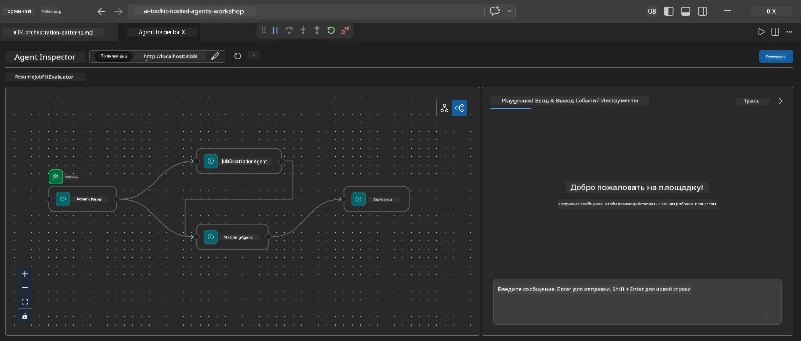
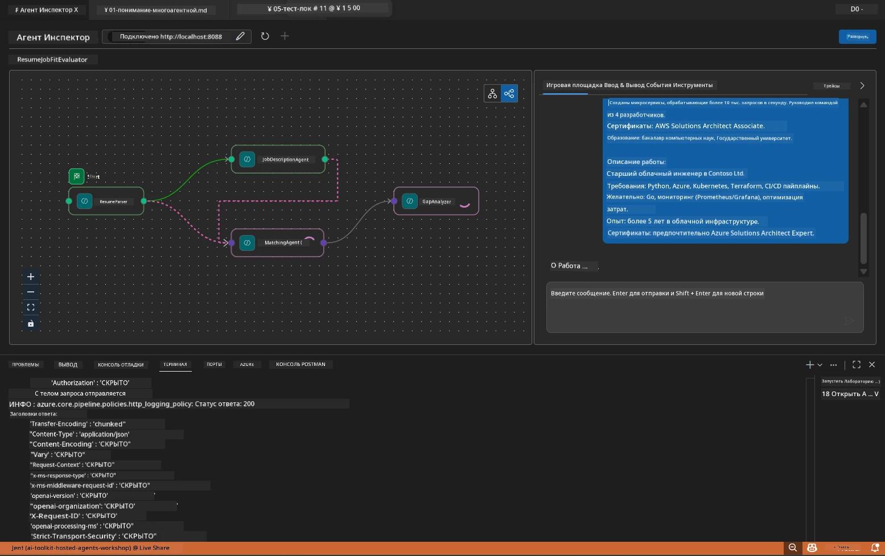
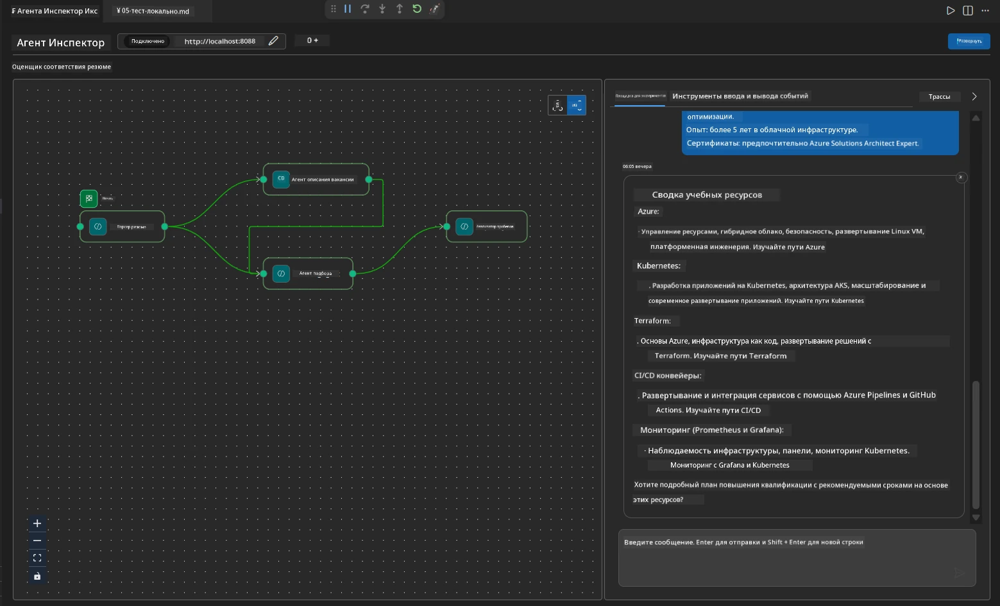

# Модуль 5 - Локальное тестирование

⏱️ ~15 мин

В этом модуле вы запускаете многопользовательский рабочий процесс локально, тестируете его с помощью Agent Inspector и проверяете, что все четыре агента и инструмент MCP работают правильно перед развертыванием.

---

## Шаг 1: Запустите сервер агента

### Вариант А: Использование задачи VS Code (рекомендуется)

1. Откройте `workshop/lab02-multi-agent/PersonalCareerCopilot/` как папку в VS Code.
2. Нажмите `Ctrl+Shift+P` → введите **Tasks: Run Task** → выберите **Run Agent HTTP Server**.
3. Задача запускает сервер с прикрепленным debugpy на порту `5679` и агента на порту `8088`.
4. Дождитесь вывода:

```
INFO:resume-job-fit:Starting Resume -> Job Fit Evaluator HTTP server...
INFO:resume-job-fit:Server running on http://localhost:8088
```

### Вариант B: Использование F5 (режим отладки)

1. Нажмите `F5` → выберите **Debug Local Agent HTTP Server**.
2. Сервер запускается с полной поддержкой точек останова — полезно для проверки ответов MCP или вывода агента.

---

## Шаг 2: Откройте Agent Inspector

1. Нажмите `Ctrl+Shift+P` → введите **Foundry Toolkit: Open Agent Inspector**.
2. Agent Inspector откроется как панель VS Code, подключенная к `http://localhost:8088`.
3. Вы должны увидеть интерфейс агента, готовый принимать сообщения.



> **Если Agent Inspector не открывается:** Убедитесь, что сервер полностью запущен (вы видите лог "Server running"). Если порт 5679 занят, смотрите [Модуль 8 - Устранение неполадок](08-troubleshooting.md).

---

## Шаг 2b: (необязательно) Откройте Workflow Visualizer

Foundry Toolkit включает в себя визуализатор рабочего процесса в реальном времени, который показывает, как агенты взаимодействуют во время исполнения графа. Это особенно полезно для отладки мультиагентных систем.

1. Нажмите `Ctrl+Shift+P` → введите **Foundry Toolkit: Open Visualizer for Hosted Agents**.
2. Откроется новая вкладка VS Code с живой визуализацией выполнения.
3. При отправке сообщений в Agent Inspector визуализатор обновляется автоматически — зеленые узлы означают завершенных агентов, а анимированные ребра показывают поток данных между ними.

> **Конфликт портов:** Если порт визуализатора уже занят, измените его в настройках VS Code → **Extensions** → **Microsoft Foundry Configuration** → **Hosted Agents: Visualizer Port**.

---

## Шаг 3: Запустите быстрые тесты

Выполните эти три теста по порядку. Каждый тест проверяет всё более сложные части рабочего процесса.

### Тест 1: Базовое резюме + описание вакансии

Вставьте следующее в Agent Inspector:

```
Resume:
Jane Doe
Senior Software Engineer with 5 years of experience in Python, Django, and AWS.
Built microservices handling 10K+ requests/second. Led a team of 4 developers.
Certifications: AWS Solutions Architect Associate.
Education: B.S. Computer Science, State University.

Job Description:
Senior Cloud Engineer at Contoso Ltd.
Required: Python, Azure, Kubernetes, Terraform, CI/CD pipelines.
Preferred: Go, monitoring (Prometheus/Grafana), cost optimization.
Experience: 5+ years in cloud infrastructure.
Certifications: Azure Solutions Architect Expert preferred.
```

**Ожидаемая структура ответа:**

Ответ должен содержать вывод от всех четырех агентов последовательно:

1. **Вывод Resume Parser** — две размеченные секции: `[PARSED RESUME]` (профиль кандидата с сгруппированными навыками) и `[JOB DESCRIPTION PASS-THROUGH]` (текст описания вакансии дословно, который поступает в JD Agent)
2. **Вывод JD Agent** — структурированные требования с разделением на обязательные и предпочтительные навыки
3. **Вывод Matching Agent** — оценка соответствия (0-100) с детализацией, подходящие навыки, отсутствующие навыки, пробелы
4. **Вывод Gap Analyzer** — отдельные карточки с пропущенными навыками, каждая с URL Microsoft Learn





### Что проверить в Тесте 1

| Проверка | Ожидаемо | Результат? |
|-------|----------|-------|
| Ответ содержит оценку соответствия | Число от 0 до 100 с детализацией | |
| Перечислены совпадающие навыки | Python, CI/CD (частично), и др. | |
| Перечислены отсутствующие навыки | Azure, Kubernetes, Terraform и др. | |
| Карточки пропусков есть для каждого отсутствующего навыка | Одна карточка на навык | |
| Присутствуют URL Microsoft Learn | Реальные ссылки с learn.microsoft.com | |
| Нет сообщений об ошибках в ответе | Чистый структурированный вывод | |

### Тест 2: Крайний случай – кандидат с высоким соответствием

Вставьте резюме, которое сильно совпадает с JD, чтобы проверить, как GapAnalyzer справляется с высокими показателями соответствия:

```
Resume:
Alex Chen
Senior Cloud Engineer with 7 years of experience.
Skills: Python, Azure (AKS, Functions, DevOps), Kubernetes, Terraform, CI/CD (GitHub Actions, Azure Pipelines), Go, Prometheus, Grafana, cost optimization.
Certifications: Azure Solutions Architect Expert, Azure DevOps Engineer Expert.
Led infrastructure migration to Azure for 3 enterprise clients.
Education: M.S. Computer Science, Tech University.

Job Description:
Senior Cloud Engineer at Contoso Ltd.
Required: Python, Azure, Kubernetes, Terraform, CI/CD pipelines.
Preferred: Go, monitoring (Prometheus/Grafana), cost optimization.
Experience: 5+ years in cloud infrastructure.
Certifications: Azure Solutions Architect Expert preferred.
```

**Ожидаемое поведение:**
- Оценка соответствия должна быть **80+** (большинство навыков совпадают)
- Карточки пробелов должны больше фокусироваться на доводке/готовности к собеседованию, чем на базовом обучении
- Инструкции GapAnalyzer гласят: "Если соответствие >= 80, сосредоточьтесь на доводке/готовности к собеседованию"

---

## Шаг 4: Тестируйте с собственными данными (необязательно)

Попробуйте вставить своё резюме и реальное описание вакансии. Это поможет проверить:

- Агенты обрабатывают разные форматы резюме (хронологический, функциональный, гибридный)
- JD Agent обрабатывает различные стили описаний вакансий (маркированные списки, абзацы, структурированные)
- Инструмент MCP возвращает релевантные ресурсы для настоящих навыков
- Карточки пробелов персонализированы под ваш конкретный опыт

> **Конфиденциальность – Путь A (Foundry cloud):** Текст резюме и JD отправляется для обработки на вашем Azure OpenAI. Он не логируется и не сохраняется в инфраструктуре мастерской. Используйте фиктивные имена (например, "Jane Doe"), если предпочитаете.
>
> **Конфиденциальность – Путь B (Foundry Local):** Все четыре вывода агентов выполняются полностью на вашем устройстве. Ваше резюме и описание вакансии **никогда не покидают ваше устройство**. Единственный исходящий вызов — запрос MCP инструмента для получения ресурсов с `https://learn.microsoft.com/api/mcp`; этот запрос содержит только название навыка, а не ваши персональные данные.

---

### Контрольная точка

- [ ] Сервер успешно запущен на порту `8088` (в логе отображается "Server running")
- [ ] Agent Inspector открыт и подключен к агенту
- [ ] Тест 1: Полный ответ с оценкой соответствия, совпадающими/отсутствующими навыками, карточками пробелов и ссылками Microsoft Learn
- [ ] Тест 2: Кандидат с высоким соответствием получает оценку 80+ с рекомендациями по доводке
- [ ] Все карточки пробелов присутствуют (по одной на каждый отсутствующий навык, без усечения)
- [ ] Нет ошибок или стектрейсов в терминале сервера

---

**Назад:** [04 - Orchestration Patterns](04-orchestration-patterns.md) · **Далее:** [06 - Deploy to Foundry →](06-deploy-to-foundry.md)

---

<!-- CO-OP TRANSLATOR DISCLAIMER START -->
**Отказ от ответственности**:
Этот документ был переведен с использованием сервиса машинного перевода [Co-op Translator](https://github.com/Azure/co-op-translator). Несмотря на наши усилия по обеспечению точности, имейте в виду, что автоматический перевод может содержать ошибки или неточности. Оригинальный документ на его исходном языке следует считать авторитетным источником. Для получения критически важной информации рекомендуется обратиться к профессиональному человеческому переводу. Мы не несем ответственности за любые недоразумения или неправильные толкования, возникшие в результате использования этого перевода.
<!-- CO-OP TRANSLATOR DISCLAIMER END -->