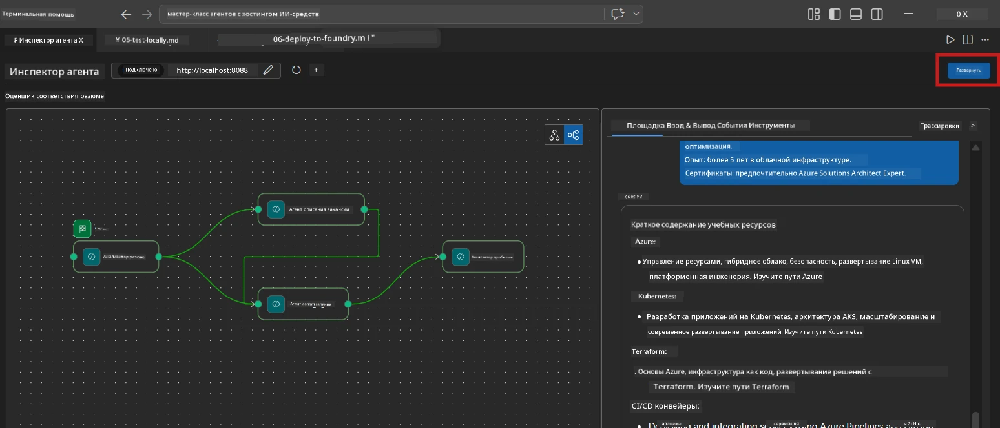
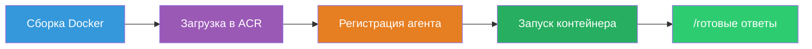
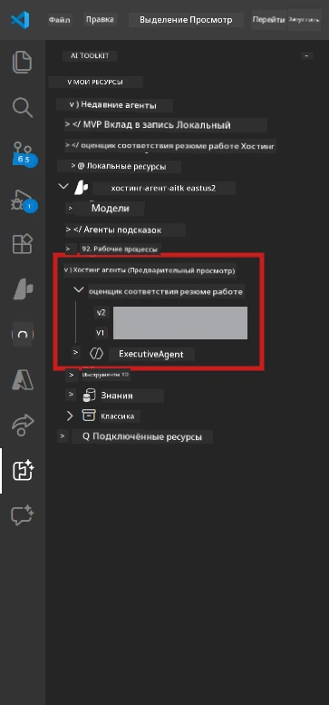

# Модуль 6 - Развертывание в Foundry Agent Service

В этом модуле вы развернете ваша локально протестированная многокомпонентная рабочая процедура в [Microsoft Foundry](https://learn.microsoft.com/azure/foundry/agents/concepts/hosted-agents) как **Хостинг-агент**. Процесс развертывания создаёт образ Docker-контейнера, загружает его в [Azure Container Registry (ACR)](https://learn.microsoft.com/azure/container-registry/container-registry-intro) и создает версию хостинг-агента в [Foundry Agent Service](https://learn.microsoft.com/azure/foundry/agents/how-to/publish-agent).

> **Ключевое отличие от Лаборатории 01:** Процесс развертывания идентичен. Foundry рассматривает вашу многокомпонентную рабочую процедуру как единого хостинг-агента — сложность внутри контейнера, но точка развертывания остаётся той же: `/responses`.

---

## Проверка предпосылок

Перед развертыванием проверьте каждый пункт ниже:

1. **Агент проходит локальные smoke-тесты:**
   - Вы завершили все 3 теста в [Модуле 5](05-test-locally.md) и рабочий процесс вывел полный результат с карточками разрывов и URL Microsoft Learn.

2. **У вас есть роль [Azure AI User](https://learn.microsoft.com/azure/foundry/concepts/rbac-foundry):**
   - Назначена в [Лаборатории 01, Модуль 2](../../lab01-single-agent/docs/02-create-foundry-project.md). Проверьте:
   - [Портал Azure](https://portal.azure.com) → ваш ресурс Foundry **проекта** → **Управление доступом (IAM)** → **Назначения ролей** → подтвердите, что ваша учетная запись указана с ролью **[Azure AI User](https://aka.ms/foundry-ext-project-role)**.

3. **Вы вошли в Azure в VS Code:**
   - Проверьте иконку учетных записей в левом нижнем углу VS Code. Имя вашей учетной записи должно быть видно.

4. **`agent.yaml` содержит правильные значения:**
   - Откройте `PersonalCareerCopilot/agent.yaml` и проверьте:
     ```yaml
     environment_variables:
       - name: PROJECT_ENDPOINT
         value: ${PROJECT_ENDPOINT}
       - name: MODEL_DEPLOYMENT_NAME
         value: ${MODEL_DEPLOYMENT_NAME}
     ```
   - Эти значения должны соответствовать переменным окружения, которые читает ваш `main.py`.

5. **`requirements.txt` содержит правильные версии:**
   ```
   agent-framework-azure-ai==1.0.0rc3
   agent-framework-core==1.0.0rc3
   azure-ai-agentserver-agentframework==1.0.0b16
   azure-ai-agentserver-core==1.0.0b16
   debugpy
   agent-dev-cli --pre
   ```

---

## Шаг 1: Запуск развертывания

### Вариант A: Развертывание из Agent Inspector (рекомендуется)

Если агент запущен через F5 с открытым Agent Inspector:

1. Посмотрите в **правый верхний угол** панели Agent Inspector.
2. Нажмите кнопку **Deploy** (облако с стрелкой вверх ↑).
3. Откроется мастер развертывания.



### Вариант B: Развертывание из Command Palette

1. Нажмите `Ctrl+Shift+P`, чтобы открыть **Command Palette**.
2. Введите: **Microsoft Foundry: Deploy Hosted Agent** и выберите её.
3. Откроется мастер развертывания.

---

## Шаг 2: Настройка развертывания

### 2.1 Выбор целевого проекта

1. В выпадающем списке отобразятся ваши проекты Foundry.
2. Выберите проект, который вы использовали на протяжении всего воркшопа (например, `workshop-agents`).

### 2.2 Выбор файла агент-контейнера

1. Вас попросят выбрать точку входа агента.
2. Перейдите в `workshop/lab02-multi-agent/PersonalCareerCopilot/` и выберите **`main.py`**.

### 2.3 Настройка ресурсов

| Параметр | Рекомендуемое значение | Примечания |
|---------|------------------|-------|
| **CPU** | `0.25` | По умолчанию. Многокомпонентным рабочим процедурам не нужно больше CPU, так как вызовы модели зависят от I/O |
| **Память** | `0.5Gi` | По умолчанию. Увеличьте до `1Gi`, если добавляете инструменты для обработки больших данных |

---

## Шаг 3: Подтвердите и разверните

1. Мастер покажет сводку развертывания.
2. Проверьте и нажмите **Confirm and Deploy**.
3. Следите за прогрессом в VS Code.

### Что происходит во время развертывания

Смотрите панель **Output** VS Code (выберите выпадающий список "Microsoft Foundry"):


1. **Docker build** - Создаёт контейнер из вашего `Dockerfile`:
   ```
   Step 1/6 : FROM python:3.14-slim
   Step 2/6 : WORKDIR /app
   ...
   Successfully built abc123def456
   ```

2. **Docker push** - Загружает образ в ACR (1-3 минуты при первом развертывании).

3. **Регистрация агента** - Foundry создает хостинг-агента с метаданными из `agent.yaml`. Имя агента — `resume-job-fit-evaluator`.

4. **Запуск контейнера** - Контейнер запускается в управляющей инфраструктуре Foundry с системным управляемым идентификатором.

> **Первое развертывание медленнее** (Docker загружает все слои). Последующие развертывания используют кэш и идут быстрее.

### Особенности многокомпонентного агента

- **Все четыре агента в одном контейнере.** Foundry видит одного хостинг-агента. Граф WorkflowBuilder выполняется внутри.
- **Вызовы MCP осуществляются наружу.** Контейнеру нужен доступ в интернет для `https://learn.microsoft.com/api/mcp`. Управляемая инфраструктура Foundry предоставляет этот доступ по умолчанию.
- **[Managed Identity](https://learn.microsoft.com/python/api/overview/azure/identity-readme#managed-identity-support).** В хостинг-среде `get_credential()` в `main.py` возвращает `ManagedIdentityCredential()` (потому что задан `MSI_ENDPOINT`). Это происходит автоматически.

---

## Шаг 4: Проверка статуса развертывания

1. Откройте боковую панель **Microsoft Foundry** (кликните иконку Foundry на панели активностей).
2. Раскройте **Hosted Agents (Preview)** в вашем проекте.
3. Найдите **resume-job-fit-evaluator** (или имя вашего агента).
4. Кликните по имени агента → раскройте версии (например, `v1`).
5. Кликните на версию → проверьте **Container Details** → **Status**:



| Статус | Значение |
|--------|---------|
| **Started** / **Running** | Контейнер запущен, агент готов к работе |
| **Pending** | Контейнер запускается (подождите 30-60 секунд) |
| **Failed** | Контейнер не запустился (проверьте логи - см. ниже) |

> **Запуск многокомпонентного агента занимает больше времени,** чем одиночного, так как контейнер создаёт 4 экземпляра агента при запуске. Статус "Pending" до 2 минут — это нормально.

---

## Частые ошибки развертывания и их решения

### Ошибка 1: Отказано в доступе - `agents/write`

```
Error: lacks the required data action 
Microsoft.CognitiveServices/accounts/AIServices/agents/write
```

**Решение:** Назначьте роль **[Azure AI User](https://learn.microsoft.com/azure/foundry/concepts/rbac-foundry)** на уровне **проекта**. Пошаговые инструкции смотрите в [Модуле 8 - Устранение неполадок](08-troubleshooting.md).

### Ошибка 2: Docker не запущен

```
Error: Docker build failed / Cannot connect to Docker daemon
```

**Решение:**
1. Запустите Docker Desktop.
2. Дождитесь сообщения "Docker Desktop is running".
3. Проверьте: `docker info`
4. **Windows:** Убедитесь, что бекенд WSL 2 включён в настройках Docker Desktop.
5. Повторите попытку.

### Ошибка 3: Ошибка `pip install` во время сборки Docker

```
Error: Could not find a version that satisfies the requirement agent-dev-cli
```

**Решение:** Флаг `--pre` в `requirements.txt` обрабатывается иначе в Docker. Убедитесь, что ваш `requirements.txt` содержит:
```
agent-dev-cli --pre
```

Если Docker всё равно не собирается, создайте `pip.conf` или передайте `--pre` через аргумент сборки. См. [Модуль 8](08-troubleshooting.md).

### Ошибка 4: MCP-инструмент не работает в хостинг-агенте

Если Gap Analyzer перестаёт генерировать URL Microsoft Learn после развертывания:

**Причина:** Сетевая политика может блокировать исходящий HTTPS трафик из контейнера.

**Решение:**
1. Обычно это не проблема с настройками по умолчанию Foundry.
2. Если возникает, проверьте, не блокирует ли NSG виртуальной сети проекта Foundry исходящий HTTPS.
3. MCP-инструмент имеет встроенные запасные URL, поэтому агент всё равно выдаст результат (без живых URL).

---

### Контрольный список

- [ ] Команда развертывания успешно завершена без ошибок в VS Code
- [ ] Агент отображается в **Hosted Agents (Preview)** боковой панели Foundry
- [ ] Имя агента — `resume-job-fit-evaluator` (или выбранное вами)
- [ ] Статус контейнера показывает **Started** или **Running**
- [ ] (Если были ошибки) Вы выявили ошибку, применили исправление и успешно повторно развернули

---

**Предыдущий:** [05 - Локальное тестирование](05-test-locally.md) · **Следующий:** [07 - Проверка в Playground →](07-verify-in-playground.md)

---

<!-- CO-OP TRANSLATOR DISCLAIMER START -->
**Отказ от ответственности**:  
Этот документ был переведен с помощью сервиса автоматического перевода [Co-op Translator](https://github.com/Azure/co-op-translator). Хотя мы и стремимся к точности, пожалуйста, имейте в виду, что автоматические переводы могут содержать ошибки или неточности. Исходный документ на его родном языке следует считать авторитетным источником. Для получения важной информации рекомендуется профессиональный перевод человеком. Мы не несем ответственности за любые недоразумения или неправильные толкования, возникшие в результате использования этого перевода.
<!-- CO-OP TRANSLATOR DISCLAIMER END -->