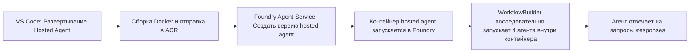
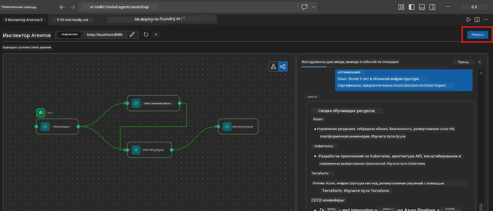
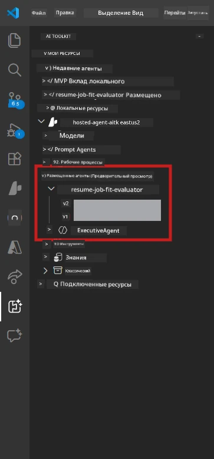

# Модуль 6 - Развертывание в Foundry Agent Service

⏱️ ~10 минут

В этом модуле вы развернете ваш локально протестированный мультиагентный рабочий процесс в [Microsoft Foundry](https://learn.microsoft.com/azure/foundry/agents/concepts/hosted-agents) как **Hosted Agent** (хостинг-агент). Процесс развертывания строит Docker-образ контейнера, отправляет его в [Azure Container Registry (ACR)](https://learn.microsoft.com/azure/container-registry/container-registry-intro) и создает версию хостинг-агента в [Foundry Agent Service](https://learn.microsoft.com/azure/foundry/agents/how-to/publish-agent).

> **Ключевое отличие от лабораторной работы 01:** процесс развертывания идентичен. Foundry воспринимает ваш мультиагентный рабочий процесс как одного хостинг-агента – сложность внутри контейнера, но точка развертывания вся та же `/responses` endpoint.

### Конвейер развертывания


```mermaid
flowchart LR
    A[VS Code: Развертывание Hosted Agent] --> B[Сборка Docker и отправка в ACR]
    B --> C[Foundry Agent Service: Создать версию hosted agent]
    C --> D[Контейнер hosted agent запускается в Foundry]
    D --> E[WorkflowBuilder последовательно запускает 4 агента внутри контейнера]
    E --> F[Агент отвечает на запросы /responses]
```

---

## Проверка предварительных требований

Перед развертыванием проверьте каждое из следующих условий:

1. **Агент проходит локальные тесты:**
   - Вы завершили все 3 теста в [Модуле 5](05-test-locally.md), и рабочий процесс дал полный вывод с gap-картами и URL-адресами Microsoft Learn.

2. **У вас есть роль [Foundry User](https://learn.microsoft.com/azure/foundry/concepts/rbac-foundry)** (для развертывания требуется минимум **Foundry Project Manager** на уровне проекта):

   > **Примечание:** роли Foundry RBAC недавно были переименованы — **Foundry User**, **Foundry Owner** и **Foundry Project Manager** ранее назывались Azure AI User, Azure AI Owner и Azure AI Project Manager. Идентификаторы ролей и разрешения не изменились.

   - Проверьте в [Azure Portal](https://portal.azure.com) → ваш ресурс проекта Foundry → **Контроль доступа (IAM)** → **Назначения ролей** → подтвердите, что в списке для вашей учетной записи есть **Foundry User** (или роль выше).

3. **Вы вошли в Azure в VS Code:**
   - Проверьте иконку аккаунтов в левом нижнем углу VS Code. Имя вашей учетной записи должно отображаться.

4. **`agent.yaml` содержит правильные значения:**
   - Откройте `PersonalCareerCopilot/agent.yaml` и проверьте:
     ```yaml
     environment_variables:
       - name: AZURE_AI_MODEL_DEPLOYMENT_NAME
         value: ${AZURE_AI_MODEL_DEPLOYMENT_NAME}
     ```
   - `FOUNDRY_PROJECT_ENDPOINT` здесь **НЕ** прописан — Foundry добавляет его во время выполнения. Только `AZURE_AI_MODEL_DEPLOYMENT_NAME` нужно указывать.

5. **`requirements.txt` содержит правильные версии:**
   ```
   agent-framework-foundry
   agent-framework-foundry-hosting
   mcp<2,>=1.24.0
   debugpy
   ```

---

## Шаг 1: Начало развертывания

### Вариант А: Развернуть из Agent Inspector (рекомендуется)

Если агент запущен через F5 с открытым Agent Inspector:

1. Посмотрите в **правом верхнем углу** панели Agent Inspector.
2. Нажмите кнопку **Deploy** (значок облака со стрелкой вверх ↑).
3. Откроется мастер развертывания.



### Вариант B: Развернуть через Command Palette

1. Нажмите `Ctrl+Shift+P`, чтобы открыть **Command Palette**.
2. Введите: **Foundry Toolkit: Deploy Hosted Agent** и выберите.
3. Откроется мастер развертывания.

---

## Шаг 2: Настройка развертывания

### 2.1 Выберите целевой проект

1. Появится выпадающий список ваших проектов Foundry.
2. Выберите проект, который вы использовали на протяжении всей рабочей сессии (например, `workshop-agents`).

### 2.2 Выберите файл контейнерного агента

1. Вас попросят выбрать точку входа агента.
2. Перейдите в `workshop/lab02-multi-agent/PersonalCareerCopilot/` и выберите **`main.py`**.

### 2.3 Настройте ресурсы

| Параметр | Рекомендуемое значение | Примечания |
|---------|-----------------------|------------|
| **Метод развертывания** | **Container** (рекомендуется) или **Code** | Контейнер собирает Docker-образ; Code загружает исходники в ZIP (превью) |
| **Реестр контейнеров** | **Default ACR** | Foundry создает и управляет им для вас |
| **CPU** | `0.25` | По умолчанию. Мультиагентным рабочим процессам не требуется больше CPU, потому что вызовы модели являются I/O-зависимыми |
| **Память** | `0.5Gi` | По умолчанию. Увеличьте до `1Gi`, если добавляете инструменты для обработки больших данных |

---

## Шаг 3: Подтвердить и развернуть

1. Мастер показывает сводку развертывания.
2. Проверьте и нажмите **Confirm and Deploy**.
3. Следите за прогрессом в VS Code.

### Что происходит во время развертывания

Следите за панелью **Output** в VS Code (выберите в выпадающем списке "Microsoft Foundry"):

1. **Сборка Docker** — строится контейнер из вашего `Dockerfile`
   ```
   Step 1/6 : FROM python:3.12-slim
   Step 2/6 : WORKDIR /app
   ...
   Successfully built abc123def456
   ```

2. **Отправка Docker** — загружается образ в ACR (1-3 минуты при первом развертывании).

3. **Регистрация агента** — Foundry создает хостинг-агента с метаданными из `agent.yaml`. Имя агента — `resume-job-fit-evaluator`.

4. **Запуск контейнера** — контейнер запускается в управляемой инфраструктуре Foundry с системной управляемой учетной записью.

> **Первое развертывание медленнее** (Docker отправляет все слои). Последующие развертывания используют кешированные слои и идут быстрее.

### Особенности мультиагентной среды

- **Все четыре агента находятся в одном контейнере.** Foundry видит одного хостинг-агента. Граф WorkflowBuilder работает внутри.
- **Вызовы MCP идут наружу.** Контейнеру необходим доступ в интернет к `https://learn.microsoft.com/api/mcp`. Управляемая инфраструктура Foundry обеспечивает этот доступ по умолчанию.
- **[Управляемая учетная запись](https://learn.microsoft.com/azure/foundry/agents/concepts/agent-identity).** Foundry автоматически создает **выделенную учетную запись Entra** для каждого хостинг-агента при развертывании. В хостинг-среде `DefaultAzureCredential` автоматически разрешает эту учетную запись агента — ручная настройка управляемой учетной записи не требуется.

---

## Шаг 4: Проверка статуса развертывания

1. Откройте боковую панель **Microsoft Foundry** (кликните на иконку Foundry в панели активности).
2. Разверните **Hosted Agents (Preview)** в вашем проекте.
3. Найдите **resume-job-fit-evaluator** (или имя вашего агента).
4. Кликните по имени агента → разверните версии (например, `v1`).
5. Кликните по версии → проверьте **Container Details** → **Status**:



| Статус | Значение |
|--------|----------|
| **active** | Агент запущен и готов принимать запросы |
| **creating** | Контейнер запускается (подождите 30–60 секунд) |
| **failed** | Контейнер не запустился (проверьте логи — см. ниже) |

> **Примечание:** боковая панель VS Code может показывать метки вроде "Running" или "Started", в то время как статус API — `active`/`creating`. Любое из отображений обозначает одно и то же.

> **Запуск мультиагента занимает больше времени**, чем одиночного агента, потому что контейнер создает 4 экземпляра агента при запуске. Статус `creating` в течение до 2 минут — норма.

---

## Распространённые ошибки развертывания и способы их исправления

### Ошибка 1: Permission denied - `agents/write`

```
Error: lacks the required data action 
Microsoft.CognitiveServices/accounts/AIServices/agents/write
```

**Исправление:** Назначьте роль **[Foundry User](https://learn.microsoft.com/azure/foundry/concepts/rbac-foundry)** (ранее **Azure AI User**) на уровне **проекта**. См. [Модуль 8 - Устранение неисправностей](08-troubleshooting.md) для поэтапных инструкций.

### Ошибка 2: Docker не запущен

```
Error: Docker build failed / Cannot connect to Docker daemon
```

**Исправление:**
1. Запустите Docker Desktop.
2. Дождитесь сообщения "Docker Desktop is running".
3. Проверьте командой: `docker info`
4. **Windows:** Убедитесь в включении бэкенда WSL 2 в настройках Docker Desktop.
5. Повторите попытку.

### Ошибка 3: ошибка pip install при сборке Docker

```
Error: Could not find a version that satisfies the requirement agent-framework-foundry
```

**Исправление:** Проверьте, что `requirements.txt` соответствует:
```
agent-framework-foundry
agent-framework-foundry-hosting
mcp<2,>=1.24.0
debugpy
```

Если сборка по-прежнему не удается, возможно, ваша сеть Docker блокирует PyPI. Проверьте параметры прокси с помощью `docker info`.

### Ошибка 4: инструмент MCP не работает в хостинг-агенте

Если Gap Analyzer перестает генерировать URL Microsoft Learn после развертывания:

**Причина:** Сетевая политика может блокировать выходящие HTTPS-запросы из контейнера.

**Исправление:**
1. Обычно с настройками по умолчанию Foundry это не проблема.
2. Если возникает, проверьте, не блокирует ли NSG виртуальной сети проекта Foundry исходящие HTTPS-запросы.
3. Инструмент MCP имеет встроенные запасные URL, поэтому агент все равно будет выдавать вывод (без активных URL).

---

### Контрольная точка

- [ ] Команда развертывания выполнена без ошибок в VS Code
- [ ] Агент отображается в разделе **Hosted Agents (Preview)** боковой панели Foundry
- [ ] Имя агента — `resume-job-fit-evaluator` (или выбранное вами)
- [ ] Статус контейнера показывает **Started** или **Running**
- [ ] (Если были ошибки) Вы определили ошибку, применили исправление и успешно развернули заново

---

**Предыдущий:** [05 - Тестирование локально](05-test-locally.md) · **Следующий:** [07 - Проверка в Playground →](07-verify-in-playground.md)

---

<!-- CO-OP TRANSLATOR DISCLAIMER START -->
**Отказ от ответственности**:
Этот документ был переведен с использованием сервиса машинного перевода [Co-op Translator](https://github.com/Azure/co-op-translator). Несмотря на наши усилия по обеспечению точности, имейте в виду, что автоматический перевод может содержать ошибки или неточности. Оригинальный документ на его исходном языке следует считать авторитетным источником. Для получения критически важной информации рекомендуется обратиться к профессиональному человеческому переводу. Мы не несем ответственности за любые недоразумения или неправильные толкования, возникшие в результате использования этого перевода.
<!-- CO-OP TRANSLATOR DISCLAIMER END -->