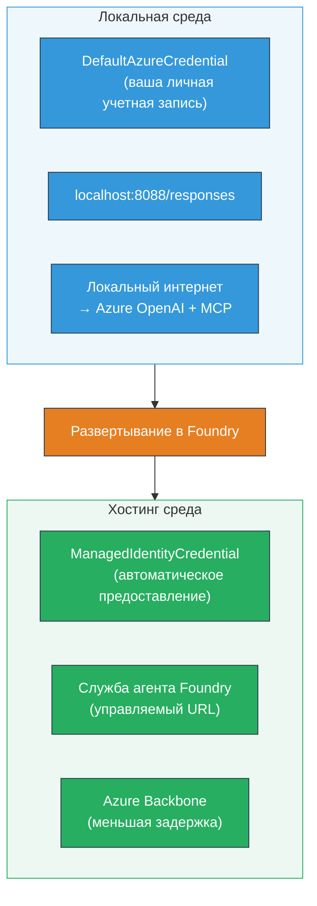

# Модуль 7 - Проверка в Playground

В этом модуле вы тестируете развернутый многоагентный рабочий процесс как в **VS Code**, так и в **[Foundry Portal](https://ai.azure.com)**, подтверждая, что агент ведет себя одинаково с локальным тестированием.

---

## Зачем проверять после развертывания?

Ваш многоагентный рабочий процесс идеально работал локально, тогда зачем проверять снова? Хостинговая среда отличается по нескольким параметрам:


| Различие | Локально | Хостинг |
|-----------|-------|--------|
| **Идентичность** | [`DefaultAzureCredential`](https://learn.microsoft.com/azure/developer/python/sdk/authentication/credential-chains#defaultazurecredential-overview) (ваша личная авторизация) | [`ManagedIdentityCredential`](https://learn.microsoft.com/python/api/overview/azure/identity-readme#managed-identity-support) (автоматически предоставляется) |
| **Конечная точка** | `http://localhost:8088/responses` | конечная точка [Foundry Agent Service](https://learn.microsoft.com/azure/foundry/agents/concepts/hosted-agents) (управляемый URL) |
| **Сеть** | Локальный компьютер → Azure OpenAI + исходящий трафик MCP | Магистраль Azure (меньшая задержка между сервисами) |
| **Подключение к MCP** | Локальный интернет → `learn.microsoft.com/api/mcp` | Исходящий трафик контейнера → `learn.microsoft.com/api/mcp` |

Если любая переменная окружения настроена неправильно, RBAC отличается или исходящий трафик MCP заблокирован, вы поймаете это здесь.

---

## Вариант A: Тестирование в VS Code Playground (рекомендуется сначала)

[Расширение Foundry](https://marketplace.visualstudio.com/items?itemName=TeamsDevApp.vscode-ai-foundry) включает интегрированный Playground, который позволяет общаться с вашим развернутым агентом, не покидая VS Code.

### Шаг 1: Перейдите к вашему хостинг-агенту

1. Нажмите на иконку **Microsoft Foundry** в **Activity Bar** VS Code (левая боковая панель), чтобы открыть панель Foundry.
2. Разверните ваш подключенный проект (например, `workshop-agents`).
3. Разверните **Hosted Agents (Preview)**.
4. Вы увидите имя вашего агента (например, `resume-job-fit-evaluator`).

### Шаг 2: Выберите версию

1. Нажмите на имя агента, чтобы развернуть его версии.
2. Кликните на развернутую версию (например, `v1`).
3. Откроется **детальная панель** с данными контейнера.
4. Проверьте, что статус — **Started** или **Running**.

### Шаг 3: Откройте Playground

1. В детальной панели нажмите кнопку **Playground** (или кликните правой кнопкой по версии → **Open in Playground**).
2. Вкладка с интерфейсом чата откроется в VS Code.

### Шаг 4: Запустите тесты на базовое взаимодействие

Используйте те же 3 теста из [Модуля 5](05-test-locally.md). Введите каждое сообщение в поле ввода Playground и нажмите **Send** (или **Enter**).

#### Тест 1 - Полное резюме + JD (стандартный поток)

Вставьте полный промпт резюме + JD из Модуля 5, Тест 1 (Jane Doe + Senior Cloud Engineer в Contoso Ltd).

**Ожидается:**
- Оценка соответствия с разбором по математике (шкала 100 баллов)
- Раздел совпавших навыков
- Раздел отсутствующих навыков
- **Одна карточка пробела на каждый отсутствующий навык** с URL Microsoft Learn
- Дорожная карта обучения с таймлайном

#### Тест 2 - Быстрый короткий тест (минимальный ввод)

```
RESUME: 3 years Python developer, knows Django and PostgreSQL, no cloud experience.

JOB: Cloud DevOps Engineer requiring AWS, Kubernetes, Terraform, CI/CD. 5 years needed.
```

**Ожидается:**
- Более низкая оценка соответствия (< 40)
- Честная оценка со ступенчатым учебным планом
- Несколько карточек пробелов (AWS, Kubernetes, Terraform, CI/CD, пробел в опыте)

#### Тест 3 - Кандидат с высокой соответствием

```
RESUME:
10 years Azure Cloud Architect. AZ-305 certified. Expert in AKS, Terraform, Azure DevOps, 
Azure Functions, Helm, Prometheus, Grafana, Python, Go. Led platform team of 8.

JOB:
Senior Cloud Engineer. Required: AKS, Terraform, Azure DevOps, Python. Preferred: Helm, Go.
5+ years experience. AZ-305 preferred.
```

**Ожидается:**
- Высокая оценка соответствия (≥ 80)
- Акцент на готовность к интервью и оттачивание навыков
- Мало или нет карточек пробелов
- Короткий таймлайн, ориентированный на подготовку

### Шаг 5: Сравните с локальными результатами

Откройте ваши заметки или вкладку браузера из Модуля 5, где вы сохранили локальные ответы. Для каждого теста:

- Имеет ли ответ **ту же структуру** (оценка соответствия, карточки пробелов, дорожная карта)?
- Следует ли он **той же методике оценки** (разбор на шкале из 100)?
- Присутствуют ли **URL Microsoft Learn** в карточках пробелов?
- Есть ли **одна карточка пробела на каждый отсутствующий навык** (не усечена)?

> **Незначительные различия в формулировках нормальны** — модель недетерминирована. Обращайте внимание на структуру, согласованность оценки и использование инструментов MCP.

---

## Вариант B: Тестирование в Foundry Portal

[Foundry Portal](https://ai.azure.com) предоставляет веб-базированную площадку, полезную для совместного использования с коллегами или заинтересованными сторонами.

### Шаг 1: Откройте Foundry Portal

1. Откройте браузер и перейдите на [https://ai.azure.com](https://ai.azure.com).
2. Войдите в систему, используя ту же учетную запись Azure, что и во время работы с учебным материалом.

### Шаг 2: Перейдите к вашему проекту

1. На главной странице найдите **Недавние проекты** в левой боковой панели.
2. Кликните название вашего проекта (например, `workshop-agents`).
3. Если его нет в списке, нажмите **Все проекты** и найдите его.

### Шаг 3: Найдите вашего развернутого агента

1. В левой навигации проекта нажмите **Build** → **Agents** (или найдите раздел **Agents**).
2. Вы увидите список агентов. Найдите вашего развернутого агента (например, `resume-job-fit-evaluator`).
3. Щелкните по имени агента, чтобы открыть страницу с деталями.

### Шаг 4: Откройте Playground

1. На странице деталей агента посмотрите на верхнюю панель инструментов.
2. Нажмите **Open in playground** (или **Try in playground**).
3. Откроется интерфейс чата.

### Шаг 5: Запустите те же тесты на базовое взаимодействие

Повторите все 3 теста из раздела VS Code Playground выше. Сравните каждый ответ с локальными результатами (Модуль 5) и результатами VS Code Playground (Вариант A выше).

---

## Особая проверка многоагентных сценариев

Помимо базовой корректности, проверьте следующие особенности многоагентного взаимодействия:

### Выполнение инструментов MCP

| Проверка | Как проверить | Условие прохождения |
|-------|---------------|----------------|
| Вызовы MCP успешны | Карточки пробелов содержат URL `learn.microsoft.com` | Настоящие URL, не сообщения-заглушки |
| Множество вызовов MCP | Каждая карточка пробелов с высоким/средним приоритетом имеет ресурсы | Не только первая карточка пробела |
| Работа резервного сценария MCP | Если URL отсутствуют, проверьте наличие текста резервного варианта | Агент все равно выдает карточки пробелов (с URL или без) |

### Координация агентов

| Проверка | Как проверить | Условие прохождения |
|-------|---------------|----------------|
| Все 4 агента запущены | Вывод содержит оценку соответствия И карточки пробелов | Оценка от MatchingAgent, карточки от GapAnalyzer |
| Параллельный запуск | Время ответа разумное (< 2 мин) | Если > 3 мин, параллельное выполнение возможно не работает |
| Целостность потока данных | Карточки пробелов ссылаются на навыки из отчета matching | Нет выдуманных навыков, которых нет в JD |

---

## Руководство по валидации

Используйте эту таблицу для оценки работы многоагентного рабочего процесса в хостинге:

| № | Критерий | Условие прохождения | Пройдено? |
|---|----------|---------------------|-----------|
| 1 | **Функциональная корректность** | Агент отвечает на резюме + JD с оценкой соответствия и анализом пробелов | |
| 2 | **Согласованность оценки** | Оценка соответствия использует шкалу в 100 баллов с разбором | |
| 3 | **Полнота карточек пробелов** | Одна карточка на каждый отсутствующий навык (не усечена и не объединена) | |
| 4 | **Интеграция MCP** | Карточки пробелов содержат настоящие URL Microsoft Learn | |
| 5 | **Структурная согласованность** | Структура вывода совпадает для локального и хостинг-запусков | |
| 6 | **Время отклика** | Хостинг-агент отвечает менее чем за 2 минуты для полного анализа | |
| 7 | **Отсутствие ошибок** | Нет ошибок HTTP 500, таймаутов или пустых ответов | |

> «Пройдено» означает, что все 7 критериев выполнены для всех 3 тестов в хотя бы одной площадке (VS Code или Portal).

---

## Устранение неполадок в Playground

| Симптом | Вероятная причина | Решение |
|---------|-------------------|---------|
| Playground не загружается | Статус контейнера не "Started" | Вернитесь к [Модулю 6](06-deploy-to-foundry.md), проверьте статус развертывания. Подождите, если "Pending" |
| Агент возвращает пустой ответ | Несовпадение имени развертывания модели | Проверьте в `agent.yaml` → `environment_variables` → `MODEL_DEPLOYMENT_NAME` соответствует развернутой модели |
| Агент возвращает сообщение об ошибке | Отсутствуют права [RBAC](https://learn.microsoft.com/azure/foundry/concepts/rbac-foundry) | Назначьте роль **[Azure AI User](https://aka.ms/foundry-ext-project-role)** в пределах проекта |
| В карточках пробелов нет URL Microsoft Learn | MCP исходящий трафик заблокирован или сервер MCP недоступен | Проверьте, может ли контейнер достучаться до `learn.microsoft.com`. См. [Модуль 8](08-troubleshooting.md) |
| Только 1 карточка пробела (усечена) | В инструкциях GapAnalyzer отсутствует блок "CRITICAL" | Пересмотрите [Модуль 3, Шаг 2.4](03-configure-agents.md) |
| Оценка соответствия сильно отличается от локальной | Развернута другая модель или инструкции | Сравните env vars в `agent.yaml` с локальным `.env`. При необходимости переверните заново |
| "Агент не найден" в Portal | Развертывание еще не завершено или завершилось с ошибкой | Подождите 2 минуты, обновите страницу. Если нет, разверните заново из [Модуля 6](06-deploy-to-foundry.md) |

---

### Контрольный список

- [ ] Протестирован агент в VS Code Playground — все 3 теста пройдены
- [ ] Протестирован агент в Playground [Foundry Portal](https://ai.azure.com) — все 3 теста пройдены
- [ ] Ответы структурно совпадают с локальным тестированием (оценка, карточки пробелов, дорожная карта)
- [ ] В карточках пробелов присутствуют URL Microsoft Learn (инструмент MCP работает в хостинговой среде)
- [ ] Одна карточка пробела на каждый отсутствующий навык (без усечения)
- [ ] Нет ошибок или таймаутов во время тестирования
- [ ] Заполнена таблица валидации (все 7 критериев пройдены)

---

**Предыдущий:** [06 - Deploy to Foundry](06-deploy-to-foundry.md) · **Следующий:** [08 - Troubleshooting →](08-troubleshooting.md)

---

<!-- CO-OP TRANSLATOR DISCLAIMER START -->
**Отказ от ответственности**:  
Этот документ был переведен с использованием сервиса автоматического перевода [Co-op Translator](https://github.com/Azure/co-op-translator). Несмотря на наши усилия обеспечить точность, пожалуйста, учитывайте, что автоматический перевод может содержать ошибки или неточности. Оригинальный документ на его родном языке следует считать авторитетным источником. Для критически важной информации рекомендуется профессиональный перевод человеком. Мы не несем ответственности за любые недоразумения или неправильные толкования, возникшие в результате использования данного перевода.
<!-- CO-OP TRANSLATOR DISCLAIMER END -->