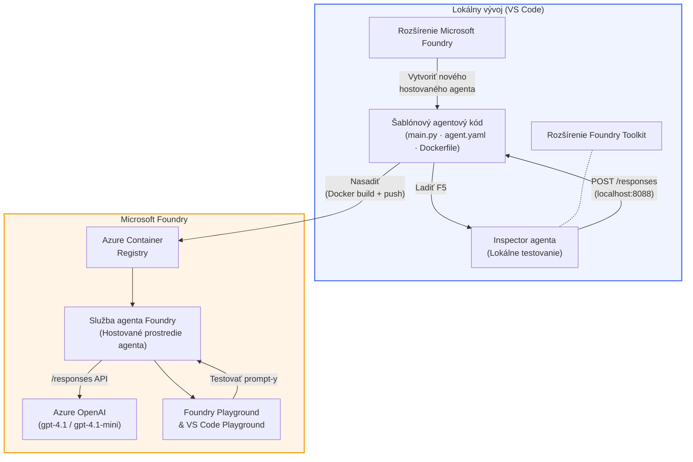

# Foundry Toolkit + Workshop o hosted agentoch Foundry

[](https://www.python.org/)
[](https://github.com/microsoft/agents)
[](https://learn.microsoft.com/azure/ai-foundry/agents/concepts/hosted-agents/)
[](https://ai.azure.com/)
[](https://learn.microsoft.com/azure/ai-services/openai/)
[](https://learn.microsoft.com/cli/azure/install-azure-cli)
[](https://learn.microsoft.com/azure/developer/azure-developer-cli/install-azd)
[](https://www.docker.com/)
[](https://marketplace.visualstudio.com/items?itemName=ms-windows-ai-studio.windows-ai-studio)
[](LICENSE)

Vytvárajte, testujte a nasadzujte AI agentov do **Microsoft Foundry Agent Service** ako **Hosted Agents** - úplne z VS Code pomocou **Microsoft Foundry rozšírenia** a **Foundry Toolkit**.

> **Hosted Agents sú momentálne v ukážkovej prevádzke (preview).** Podporované regióny sú obmedzené - pozrite si [dostupnosť regiónov](https://learn.microsoft.com/azure/foundry/agents/concepts/hosted-agents#region-availability).

> Priečinok `agent/` v každom laboratory je **automaticky generovaný** Foundry rozšírením - potom kód prispôsobíte, testujete lokálne a nasadíte.

### 🌐 Podpora viacerých jazykov

#### Podporované cez GitHub Action (automatizované a vždy aktuálne)

<!-- CO-OP TRANSLATOR LANGUAGES TABLE START -->
[Arabčina](../ar/README.md) | [Bengálčina](../bn/README.md) | [Bulharčina](../bg/README.md) | [Barmský (Mjanmarsko)](../my/README.md) | [Čínština (zjednodušená)](../zh-CN/README.md) | [Čínština (tradičná, Hongkong)](../zh-HK/README.md) | [Čínština (tradičná, Macao)](../zh-MO/README.md) | [Čínština (tradičná, Taiwan)](../zh-TW/README.md) | [Chorvátčina](../hr/README.md) | [Čeština](../cs/README.md) | [Dánčina](../da/README.md) | [Holandčina](../nl/README.md) | [Estónčina](../et/README.md) | [Fínčina](../fi/README.md) | [Francúzština](../fr/README.md) | [Nemčina](../de/README.md) | [Gréčtina](../el/README.md) | [Hebrejčina](../he/README.md) | [Hindčina](../hi/README.md) | [Maďarčina](../hu/README.md) | [Indonézština](../id/README.md) | [Taliančina](../it/README.md) | [Japončina](../ja/README.md) | [Kannadčina](../kn/README.md) | [Khmerčina](../km/README.md) | [Kórejčina](../ko/README.md) | [Litovčina](../lt/README.md) | [Malajčina](../ms/README.md) | [Malayalam](../ml/README.md) | [Maráthčina](../mr/README.md) | [Nepálčina](../ne/README.md) | [Nigérijský pidžin](../pcm/README.md) | [Nórčina](../no/README.md) | [Perzština (Farsi)](../fa/README.md) | [Poľština](../pl/README.md) | [Portugalčina (Brazília)](../pt-BR/README.md) | [Portugalčina (Portugalsko)](../pt-PT/README.md) | [Pandžábčina (Gurmukhi)](../pa/README.md) | [Rumunčina](../ro/README.md) | [Ruština](../ru/README.md) | [Srbčina (cyrilika)](../sr/README.md) | [Slovenčina](./README.md) | [Slovinčina](../sl/README.md) | [Španielčina](../es/README.md) | [Swahelčina](../sw/README.md) | [Švédčina](../sv/README.md) | [Tagalog (Filipíny)](../tl/README.md) | [Tamil](../ta/README.md) | [Telugu](../te/README.md) | [Thajčina](../th/README.md) | [Turečtina](../tr/README.md) | [Ukrajinčina](../uk/README.md) | [Urdčina](../ur/README.md) | [Vietnamčina](../vi/README.md)

> **Radšej klonovať lokálne?**
>
> Tento repozitár obsahuje viac než 50 jazykových prekladov, čo výrazne zväčšuje veľkosť stiahnutia. Ak chcete klonovať bez prekladov, použite sparse checkout:
>
> **Bash / macOS / Linux:**
> ```bash
> git clone --filter=blob:none --sparse https://github.com/microsoft-foundry/Foundry_Toolkit_for_VSCode_Lab.git
> cd Foundry_Toolkit_for_VSCode_Lab
> git sparse-checkout set --no-cone '/*' '!translations' '!translated_images'
> ```
>
> **CMD (Windows):**
> ```cmd
> git clone --filter=blob:none --sparse https://github.com/microsoft-foundry/Foundry_Toolkit_for_VSCode_Lab.git
> cd Foundry_Toolkit_for_VSCode_Lab
> git sparse-checkout set --no-cone "/*" "!translations" "!translated_images"
> ```
>
> Toto vám poskytne všetko potrebné na dokončenie kurzu s oveľa rýchlejším stiahnutím.
<!-- CO-OP TRANSLATOR LANGUAGES TABLE END -->

---

## Architektúra


**Priebeh:** Foundry rozšírenie generuje skelet agenta → prispôsobíte kód a inštrukcie → testujete lokálne s Agent Inspector → nasadíte do Foundry (Docker image uploadnutý do ACR) → overíte v Playground.

---

## Čo vytvoríte

| Laboratórium | Popis | Stav |
|--------------|-------|-------|
| **Lab 01 - Jediný agent** | Vytvorte **"Vysvetli to ako manažérovi" agenta**, otestujte ho lokálne a nasadte do Foundry | ✅ K dispozícii |
| **Lab 02 - Multi-agentný pracovný tok** | Vytvorte **"Životopis → hodnotiaci agent vhodnosti na pracovnú pozíciu"** - 4 agenti spolupracujú na hodnotení životopisu a vytvorení plánu učenia | ✅ K dispozícii |

---

## Spoznajte Executive Agenta

V tomto workshope vytvoríte **"Vysvetli to ako manažérovi" agenta** - AI agenta, ktorý vezme zložité technické termíny a prevedie ich do pokojného, reprezentatívneho zhrnutia vhodného na rokovania. Pretože úprimne, nikto v C-suite nechce počuť o "vyčerpaní thread poolu spôsobenom synchronnými volaniami predstavenými vo verzii 3.2."

Tohto agenta som vytvoril po príliš mnohých situáciách, keď moja dokonale spracovaná analýza incidentu dostala odpoveď: *"Takže... je webová stránka nefunkčná alebo nie?"*

### Ako to funguje

Dáte mu technickú aktualizáciu. Agent vráti zhrnutie pre manažéra - tri základné body, žiadny žargón, žiadne stack trace alebo existenčné obavy. Len **čo sa stalo**, **dopad na biznis** a **ďalší krok**.

### Pozrite si to v akcii

**Vy hovoríte:**
> "Zvýšila sa latencia API kvôli vyčerpaniu thread poolu spôsobenému synchronnými volaniami predstavenými vo verzii 3.2."

**Agent odpovedá:**

> **Executive zhrnutie:**
> - **Čo sa stalo:** Po poslednom vydaní systém spomalil.
> - **Dopad na biznis:** Niektorí používatelia zažili oneskorenia pri používaní služby.
> - **Ďalší krok:** Zmena bola stiahnutá a pripravuje sa oprava pred opätovným nasadením.

### Prečo tento agent?

Je to úplne jednoduchý, jednoúčelový agent - ideálny na naučenie sa pracovného toku hosted agentov od začiatku do konca bez komplikovaných nástrojov. A úprimne? Každý technický tím by takéhoto agenta potreboval.

---

## Štruktúra workshopu

```
📂 Foundry_Toolkit_for_VSCode_Lab/
├── 📄 README.md                      ← You are here
├── 📂 ExecutiveAgent/                ← Standalone hosted agent project
│   ├── agent.yaml
│   ├── Dockerfile
│   ├── main.py
│   └── requirements.txt
└── 📂 workshop/
    ├── 📂 lab01-single-agent/        ← Full lab: docs + agent code
    │   ├── README.md                 ← Hands-on lab instructions
    │   ├── 📂 docs/                  ← Step-by-step tutorial modules
    │   │   ├── 00-prerequisites.md
    │   │   ├── 01-install-foundry-toolkit.md
    │   │   ├── 02-create-foundry-project.md
    │   │   ├── 03-create-hosted-agent.md
    │   │   ├── 04-configure-and-code.md
    │   │   ├── 05-test-locally.md
    │   │   ├── 06-deploy-to-foundry.md
    │   │   ├── 07-verify-in-playground.md
    │   │   └── 08-troubleshooting.md
    │   └── 📂 agent/                 ← Reference solution (auto-scaffolded by Foundry extension)
    │       ├── agent.yaml
    │       ├── Dockerfile
    │       ├── main.py
    │       └── requirements.txt
    └── 📂 lab02-multi-agent/         ← Resume → Job Fit Evaluator
        ├── README.md                 ← Hands-on lab instructions (end-to-end)
        ├── 📂 docs/                  ← Step-by-step tutorial modules
        │   ├── 00-prerequisites.md
        │   ├── 01-understand-multi-agent.md
        │   ├── 02-scaffold-multi-agent.md
        │   ├── 03-configure-agents.md
        │   ├── 04-orchestration-patterns.md
        │   ├── 05-test-locally.md
        │   ├── 06-deploy-to-foundry.md
        │   ├── 07-verify-in-playground.md
        │   └── 08-troubleshooting.md
        └── 📂 PersonalCareerCopilot/ ← Reference solution (multi-agent workflow)
            ├── agent.yaml
            ├── Dockerfile
            ├── main.py
            └── requirements.txt
```

> **Poznámka:** Priečinok `agent/` v každom laboratornom cvičení je to, čo **Microsoft Foundry rozšírenie** vytvorí, keď spustíte `Microsoft Foundry: Create a New Hosted Agent` z Command Palette. Súbory sa potom prispôsobujú inštrukciami, nástrojmi a konfiguráciou agenta. Lab 01 vás prevedie vytvorením tohto od základov.

---

## Začíname

### 1. Klonujte repozitár

```bash
git clone https://github.com/microsoft-foundry/Foundry_Toolkit_for_VSCode_Lab.git
cd Foundry_Toolkit_for_VSCode_Lab
```

### 2. Nastavte si virtuálne prostredie pre Python

```bash
python -m venv venv
```

Aktivujte ho:

- **Windows (PowerShell):**
  ```powershell
  .\venv\Scripts\Activate.ps1
  ```
- **macOS / Linux:**
  ```bash
  source venv/bin/activate
  ```

### 3. Nainštalujte závislosti

```bash
pip install -r workshop/lab01-single-agent/agent/requirements.txt
```

### 4. Nakonfigurujte premenné prostredia

Skopírujte príklad `.env` súboru v priečinku agenta a vyplňte svoje hodnoty:

```bash
cp workshop/lab01-single-agent/agent/.env.example workshop/lab01-single-agent/agent/.env
```

Upravte `workshop/lab01-single-agent/agent/.env`:

```env
AZURE_AI_PROJECT_ENDPOINT=https://<your-account>.services.ai.azure.com/api/projects/<your-project>
MODEL_DEPLOYMENT_NAME=<your-model-deployment-name>
```

### 5. Nasledujte workshopy

Každý laboratórium má vlastné moduly. Začnite s **Lab 01** pre základy, potom prejdite na **Lab 02** pre multi-agentné pracovné toky.

#### Lab 01 - Jediný agent ([plné inštrukcie](workshop/lab01-single-agent/README.md))

| # | Modul | Odkaz |
|---|--------|------|
| 1 | Prečítajte si požiadavky | [00-prerequisites.md](workshop/lab01-single-agent/docs/00-prerequisites.md) |
| 2 | Nainštalujte Foundry Toolkit a Foundry rozšírenie | [01-install-foundry-toolkit.md](workshop/lab01-single-agent/docs/01-install-foundry-toolkit.md) |
| 3 | Vytvorte Foundry projekt | [02-create-foundry-project.md](workshop/lab01-single-agent/docs/02-create-foundry-project.md) |
| 4 | Vytvorte hosted agenta | [03-create-hosted-agent.md](workshop/lab01-single-agent/docs/03-create-hosted-agent.md) |
| 5 | Nakonfigurujte inštrukcie a prostredie | [04-configure-and-code.md](workshop/lab01-single-agent/docs/04-configure-and-code.md) |
| 6 | Testujte lokálne | [05-test-locally.md](workshop/lab01-single-agent/docs/05-test-locally.md) |
| 7 | Nasadte do Foundry | [06-deploy-to-foundry.md](workshop/lab01-single-agent/docs/06-deploy-to-foundry.md) |
| 8 | Overte v playground | [07-verify-in-playground.md](workshop/lab01-single-agent/docs/07-verify-in-playground.md) |
| 9 | Riešenie problémov | [08-troubleshooting.md](workshop/lab01-single-agent/docs/08-troubleshooting.md) |

#### Lab 02 - Multi-agentný pracovný tok ([plné inštrukcie](workshop/lab02-multi-agent/README.md))

| # | Modul | Odkaz |
|---|--------|------|
| 1 | Požiadavky (Lab 02) | [00-prerequisites.md](workshop/lab02-multi-agent/docs/00-prerequisites.md) |
| 2 | Pochopte architektúru multi-agenta | [01-understand-multi-agent.md](workshop/lab02-multi-agent/docs/01-understand-multi-agent.md) |
| 3 | Vygenerujte multi-agentný projekt | [02-scaffold-multi-agent.md](workshop/lab02-multi-agent/docs/02-scaffold-multi-agent.md) |
| 4 | Nakonfigurujte agentov a prostredie | [03-configure-agents.md](workshop/lab02-multi-agent/docs/03-configure-agents.md) |
| 5 | Vzorce orchestrácie | [04-orchestration-patterns.md](workshop/lab02-multi-agent/docs/04-orchestration-patterns.md) |
| 6 | Testujte lokálne (multi-agent) | [05-test-locally.md](workshop/lab02-multi-agent/docs/05-test-locally.md) |
| 7 | Nasadiť do Foundry | [06-deploy-to-foundry.md](workshop/lab02-multi-agent/docs/06-deploy-to-foundry.md) |
| 8 | Overiť v playground | [07-verify-in-playground.md](workshop/lab02-multi-agent/docs/07-verify-in-playground.md) |
| 9 | Riešenie problémov (multi-agent) | [08-troubleshooting.md](workshop/lab02-multi-agent/docs/08-troubleshooting.md) |

---

## Správca

<table>
<tr>
    <td align="center"><a href="https://github.com/ShivamGoyal03">
        <br />
        <sub><b>Shivam Goyal</b></sub>
    </a><br />
    </td>
</tr>
</table>

---

## Požadované oprávnenia (rýchla referencia)

| Scenár | Požadované role |
|----------|---------------|
| Vytvoriť nový Foundry projekt | **Azure AI Owner** na Foundry zdroji |
| Nasadiť do existujúceho projektu (nové zdroje) | **Azure AI Owner** + **Contributor** na predplatnom |
| Nasadiť do plne nakonfigurovaného projektu | **Reader** na účte + **Azure AI User** na projekte |

> **Dôležité:** Role Azure `Owner` a `Contributor` zahŕňajú iba *manažérske* oprávnenia, nie oprávnenia na *vývoj* (akcie nad dátami). Na vytváranie a nasadzovanie agentov potrebujete **Azure AI User** alebo **Azure AI Owner**.

---

## Odkazy

- [Rýchly štart: Nasadenie prvého hosteného agenta (VS Code)](https://learn.microsoft.com/azure/foundry/agents/quickstarts/quickstart-hosted-agent)
- [Čo sú hostení agenti?](https://learn.microsoft.com/azure/foundry/agents/concepts/hosted-agents)
- [Vytvárajte pracovné postupy hostených agentov vo VS Code](https://learn.microsoft.com/azure/foundry/agents/how-to/vs-code-agents-workflow-pro-code)
- [Nasadiť hosteného agenta](https://learn.microsoft.com/azure/foundry/agents/how-to/deploy-hosted-agent)
- [RBAC pre Microsoft Foundry](https://learn.microsoft.com/azure/foundry/concepts/rbac-foundry)
- [Príklad Architecture Review Agenta](https://github.com/Azure-Samples/agent-architecture-review-sample) - Skutočný hostený agent s MCP nástrojmi, diagramami Excalidraw a duálnym nasadením

---


## Licencia

[MIT](../../LICENSE)

---

<!-- CO-OP TRANSLATOR DISCLAIMER START -->
**Zrieknutie sa zodpovednosti**:  
Tento dokument bol preložený pomocou AI prekladateľskej služby [Co-op Translator](https://github.com/Azure/co-op-translator). Aj keď sa snažíme o presnosť, vezmite prosím na vedomie, že automatizované preklady môžu obsahovať chyby alebo nepresnosti. Originálny dokument v jeho pôvodnom jazyku by mal byť považovaný za autoritatívny zdroj. Pre dôležité informácie sa odporúča profesionálny ľudský preklad. Nie sme zodpovední za akékoľvek nedorozumenia alebo nesprávne výklady vyplývajúce z použitia tohto prekladu.
<!-- CO-OP TRANSLATOR DISCLAIMER END -->