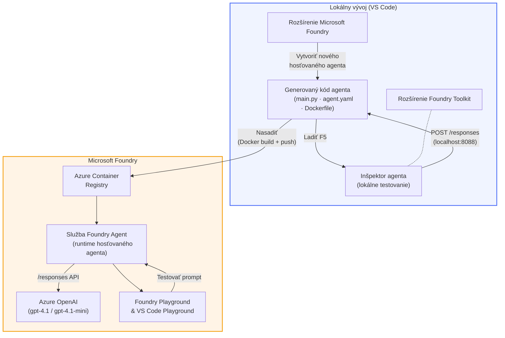

# Foundry Toolkit + Foundry Hosted Agents Workshop

[](https://www.python.org/)
[](https://github.com/microsoft/agents)
[](https://learn.microsoft.com/azure/ai-foundry/agents/concepts/hosted-agents/)
[](https://ai.azure.com/)
[](https://learn.microsoft.com/azure/ai-services/openai/)
[](https://learn.microsoft.com/cli/azure/install-azure-cli)
[](https://learn.microsoft.com/azure/developer/azure-developer-cli/install-azd)
[](https://www.docker.com/)
[](https://marketplace.visualstudio.com/items?itemName=ms-windows-ai-studio.windows-ai-studio)
[](LICENSE)

Vytvorte, otestujte a nasadzujte AI agentov do **Microsoft Foundry Agent Service** ako **Hosted Agents** – úplne z VS Code pomocou **Microsoft Foundry extension** a **Foundry Toolkit**.

> **Hosted Agents sú momentálne v náhľadovej fáze.** Podporované regióny sú limitované – pozrite si [dostupnosť regiónov](https://learn.microsoft.com/azure/foundry/agents/concepts/hosted-agents#region-availability).

> Priečinok `agent/` v každom labore je **automaticky vytváraný** rozšírením Foundry – vy potom upravujete kód, testujete lokálne a nasadzujete.

<!-- CO-OP TRANSLATOR LANGUAGES TABLE START -->
[Arabic](../ar/README.md) | [Bengali](../bn/README.md) | [Bulgarian](../bg/README.md) | [Burmese (Myanmar)](../my/README.md) | [Chinese (Simplified)](../zh-CN/README.md) | [Chinese (Traditional, Hong Kong)](../zh-HK/README.md) | [Chinese (Traditional, Macau)](../zh-MO/README.md) | [Chinese (Traditional, Taiwan)](../zh-TW/README.md) | [Croatian](../hr/README.md) | [Czech](../cs/README.md) | [Danish](../da/README.md) | [Dutch](../nl/README.md) | [Estonian](../et/README.md) | [Finnish](../fi/README.md) | [French](../fr/README.md) | [German](../de/README.md) | [Greek](../el/README.md) | [Hebrew](../he/README.md) | [Hindi](../hi/README.md) | [Hungarian](../hu/README.md) | [Indonesian](../id/README.md) | [Italian](../it/README.md) | [Japanese](../ja/README.md) | [Kannada](../kn/README.md) | [Khmer](../km/README.md) | [Korean](../ko/README.md) | [Lithuanian](../lt/README.md) | [Malay](../ms/README.md) | [Malayalam](../ml/README.md) | [Marathi](../mr/README.md) | [Nepali](../ne/README.md) | [Nigerian Pidgin](../pcm/README.md) | [Norwegian](../no/README.md) | [Persian (Farsi)](../fa/README.md) | [Polish](../pl/README.md) | [Portuguese (Brazil)](../pt-BR/README.md) | [Portuguese (Portugal)](../pt-PT/README.md) | [Punjabi (Gurmukhi)](../pa/README.md) | [Romanian](../ro/README.md) | [Russian](../ru/README.md) | [Serbian (Cyrillic)](../sr/README.md) | [Slovak](./README.md) | [Slovenian](../sl/README.md) | [Spanish](../es/README.md) | [Swahili](../sw/README.md) | [Swedish](../sv/README.md) | [Tagalog (Filipino)](../tl/README.md) | [Tamil](../ta/README.md) | [Telugu](../te/README.md) | [Thai](../th/README.md) | [Turkish](../tr/README.md) | [Ukrainian](../uk/README.md) | [Urdu](../ur/README.md) | [Vietnamese](../vi/README.md)

> **Preferujete si klonovať lokálne?**
>
> Tento repozitár obsahuje viac než 50 jazykových prekladov, čo výrazne zväčšuje veľkosť stiahnutia. Ak chcete klonovať bez prekladov, použite sparse checkout:
>
> **Bash / macOS / Linux:**
> ```bash
> git clone --filter=blob:none --sparse https://github.com/microsoft-foundry/Foundry_Toolkit_for_VSCode_Lab.git
> cd Foundry_Toolkit_for_VSCode_Lab
> git sparse-checkout set --no-cone '/*' '!translations' '!translated_images'
> ```
>
> **CMD (Windows):**
> ```cmd
> git clone --filter=blob:none --sparse https://github.com/microsoft-foundry/Foundry_Toolkit_for_VSCode_Lab.git
> cd Foundry_Toolkit_for_VSCode_Lab
> git sparse-checkout set --no-cone "/*" "!translations" "!translated_images"
> ```
>
> Toto vám poskytne všetko potrebné na dokončenie kurzu s oveľa rýchlejším stiahnutím.
<!-- CO-OP TRANSLATOR LANGUAGES TABLE END -->

---

## Architektúra


**Priebeh:** Rozšírenie Foundry vytvorí základ agenta → vy prispôsobíte kód a inštrukcie → testujete lokálne pomocou Agent Inspector → nasadíte do Foundry (Docker image sa pushne do ACR) → overíte v Playground.

---

## Čo budete vytvárať

| Laboratórium | Popis | Stav |
|--------------|--------|-------|
| **Lab 01 - Jednoduchý agent** | Vytvorte **agenta "Vysvetli to ako manažérovi"**, otestujte lokálne a nasadte do Foundry | ✅ Dostupné |
| **Lab 02 - Multiagentný workflow** | Vytvorte **"Vyhodnotenie vhodnosti životopisu na pracovnú pozíciu"** – 4 agenti spolupracujú na skórovaní životopisu a vytvorení učebnej cesty | ✅ Dostupné |

---

## Spoznajte Execute Agent

V tomto workshope vytvoríte **agenta "Vysvetli to ako manažérovi"** – AI agenta, ktorý preloží zložité technické termíny do pokojného, jednoduchého zhrnutia vhodného do zasadačky. Pretože po pravde, nikto na vrcholovej úrovni nechce počuť o "vyčerpaní thread pool spôsobenom synchronnými volaniami zavedenými vo verzii 3.2."

Tento agent vznikol po príliš veľa prípadoch, kedy moja perfektne napísaná post-mortem analýza dostala odpoveď: *"Takže... je web stránka dole alebo nie?"*

### Ako funguje

Dáte mu technickú aktualizáciu. On vám vráti výkonné zhrnutie – tri hlavné body, bez žargónu, bez stack traceov, bez existenciálneho trápenia. Len **čo sa stalo**, **vplyv na biznis** a **ďalší krok**.

### Pozrite sa na to v akcii

**Vy hovoríte:**
> "API latencia sa zvýšila kvôli vyčerpaniu thread pool, spôsobenému synchronnými volaniami zavedenými vo verzii 3.2."

**Agent odpovedá:**

> **Výkonné zhrnutie:**
> - **Čo sa stalo:** Po poslednom vydaní sa systém spomalil.
> - **Vplyv na biznis:** Niektorí používatelia pocítili oneskorenia pri používaní služby.
> - **Ďalší krok:** Zmena bola stiahnutá späť a pripravuje sa oprava pred opätovným nasadením.

### Prečo tento agent?

Je to veľmi jednoduchý, jednoúčelový agent – ideálny na naučenie sa pracovného postupu s hosted agentami od začiatku do konca bez zbytočného zložitého nástrojarstva. A úprimne? Každý inžiniersky tím by mohol takéhoto použiť.

---

## Štruktúra workshopu

```
📂 Foundry_Toolkit_for_VSCode_Lab/
├── 📄 README.md                      ← You are here
├── 📂 ExecutiveAgent/                ← Standalone hosted agent project
│   ├── agent.yaml
│   ├── Dockerfile
│   ├── main.py
│   └── requirements.txt
└── 📂 workshop/
    ├── 📂 lab01-single-agent/        ← Full lab: docs + agent code
    │   ├── README.md                 ← Hands-on lab instructions
    │   ├── 📂 docs/                  ← Step-by-step tutorial modules
    │   │   ├── 00-prerequisites.md
    │   │   ├── 01-install-foundry-toolkit.md
    │   │   ├── 02-create-foundry-project.md
    │   │   ├── 03-create-hosted-agent.md
    │   │   ├── 04-configure-and-code.md
    │   │   ├── 05-test-locally.md
    │   │   ├── 06-deploy-to-foundry.md
    │   │   ├── 07-verify-in-playground.md
    │   │   └── 08-troubleshooting.md
    │   └── 📂 agent/                 ← Reference solution (auto-scaffolded by Foundry extension)
    │       ├── agent.yaml
    │       ├── Dockerfile
    │       ├── main.py
    │       └── requirements.txt
    └── 📂 lab02-multi-agent/         ← Resume → Job Fit Evaluator
        ├── README.md                 ← Hands-on lab instructions (end-to-end)
        ├── 📂 docs/                  ← Step-by-step tutorial modules
        │   ├── 00-prerequisites.md
        │   ├── 01-understand-multi-agent.md
        │   ├── 02-scaffold-multi-agent.md
        │   ├── 03-configure-agents.md
        │   ├── 04-orchestration-patterns.md
        │   ├── 05-test-locally.md
        │   ├── 06-deploy-to-foundry.md
        │   ├── 07-verify-in-playground.md
        │   └── 08-troubleshooting.md
        └── 📂 PersonalCareerCopilot/ ← Reference solution (multi-agent workflow)
            ├── agent.yaml
            ├── Dockerfile
            ├── main.py
            └── requirements.txt
```

> **Poznámka:** Priečinok `agent/` v každom laboratóriu je to, čo **Microsoft Foundry extension** vygeneruje, keď z Command Palette spustíte `Microsoft Foundry: Create a New Hosted Agent`. Súbory potom upravujete podľa svojich inštrukcií, nástrojov a konfigurácie agenta. Lab 01 vás prevedie vytvorením od začiatku.

---

## Začíname

### 1. Klonovanie repozitára

```bash
git clone https://github.com/microsoft-foundry/Foundry_Toolkit_for_VSCode_Lab.git
cd Foundry_Toolkit_for_VSCode_Lab
```

### 2. Nastavenie Python virtuálneho prostredia

```bash
python -m venv venv
```

Aktivujte ho:

- **Windows (PowerShell):**
  ```powershell
  .\venv\Scripts\Activate.ps1
  ```
- **macOS / Linux:**
  ```bash
  source venv/bin/activate
  ```

### 3. Inštalácia závislostí

```bash
pip install -r workshop/lab01-single-agent/agent/requirements.txt
```

### 4. Nastavenie premenných prostredia

Skopírujte príklad `.env` súboru v priečinku agenta a vyplňte svoje hodnoty:

```bash
cp workshop/lab01-single-agent/agent/.env.example workshop/lab01-single-agent/agent/.env
```

Upravte `workshop/lab01-single-agent/agent/.env`:

```env
AZURE_AI_PROJECT_ENDPOINT=https://<your-account>.services.ai.azure.com/api/projects/<your-project>
MODEL_DEPLOYMENT_NAME=<your-model-deployment-name>
```

### 5. Postupujte podľa workshop labov

Každý lab je samostatný so svojimi modulmi. Začnite s **Lab 01** na naučenie základov, potom prejdite na **Lab 02** pre multiagentné workflow.

#### Lab 01 - Jednoduchý agent ([plné inštrukcie](workshop/lab01-single-agent/README.md))

| # | Modul | Odkaz |
|---|-------|-------|
| 1 | Prečítajte si požiadavky | [00-prerequisites.md](workshop/lab01-single-agent/docs/00-prerequisites.md) |
| 2 | Nainštalujte Foundry Toolkit a rozšírenie Foundry | [01-install-foundry-toolkit.md](workshop/lab01-single-agent/docs/01-install-foundry-toolkit.md) |
| 3 | Vytvorte Foundry projekt | [02-create-foundry-project.md](workshop/lab01-single-agent/docs/02-create-foundry-project.md) |
| 4 | Vytvorte hosted agenta | [03-create-hosted-agent.md](workshop/lab01-single-agent/docs/03-create-hosted-agent.md) |
| 5 | Nakonfigurujte inštrukcie a prostredie | [04-configure-and-code.md](workshop/lab01-single-agent/docs/04-configure-and-code.md) |
| 6 | Testujte lokálne | [05-test-locally.md](workshop/lab01-single-agent/docs/05-test-locally.md) |
| 7 | Nasadzujte do Foundry | [06-deploy-to-foundry.md](workshop/lab01-single-agent/docs/06-deploy-to-foundry.md) |
| 8 | Overte v playground | [07-verify-in-playground.md](workshop/lab01-single-agent/docs/07-verify-in-playground.md) |
| 9 | Riešenie problémov | [08-troubleshooting.md](workshop/lab01-single-agent/docs/08-troubleshooting.md) |

#### Lab 02 - Multiagentný workflow ([plné inštrukcie](workshop/lab02-multi-agent/README.md))

| # | Modul | Odkaz |
|---|-------|-------|
| 1 | Požiadavky (Lab 02) | [00-prerequisites.md](workshop/lab02-multi-agent/docs/00-prerequisites.md) |
| 2 | Porozumenie multiagentnej architektúre | [01-understand-multi-agent.md](workshop/lab02-multi-agent/docs/01-understand-multi-agent.md) |
| 3 | Vytvorenie multiagentného projektu | [02-scaffold-multi-agent.md](workshop/lab02-multi-agent/docs/02-scaffold-multi-agent.md) |
| 4 | Konfigurácia agentov a prostredia | [03-configure-agents.md](workshop/lab02-multi-agent/docs/03-configure-agents.md) |
| 5 | Vzory orchestrácie | [04-orchestration-patterns.md](workshop/lab02-multi-agent/docs/04-orchestration-patterns.md) |
| 6 | Testovanie lokálne (multi-agent) | [05-test-locally.md](workshop/lab02-multi-agent/docs/05-test-locally.md) |
| 7 | Nasadenie do Foundry | [06-deploy-to-foundry.md](workshop/lab02-multi-agent/docs/06-deploy-to-foundry.md) |
| 8 | Overenie v playgounde | [07-verify-in-playground.md](workshop/lab02-multi-agent/docs/07-verify-in-playground.md) |
| 9 | Riešenie problémov (multi-agent) | [08-troubleshooting.md](workshop/lab02-multi-agent/docs/08-troubleshooting.md) |

---

## Správca

<table>
<tr>
    <td align="center"><a href="https://github.com/ShivamGoyal03">
        <br />
        <sub><b>Shivam Goyal</b></sub>
    </a><br />
    </td>
</tr>
</table>

---

## Vyžadované povolenia (rýchly prehľad)

| Scenár | Vyžadované roly |
|----------|---------------|
| Vytvoriť nový projekt Foundry | **Azure AI Owner** na Foundry zdroji |
| Nasadiť do existujúceho projektu (nové zdroje) | **Azure AI Owner** + **Contributor** na predplatnom |
| Nasadiť do plne nakonfigurovaného projektu | **Reader** na účte + **Azure AI User** na projekte |

> **Dôležité:** Role Azure `Owner` a `Contributor` obsahujú iba *správu* povolení, nie *vývojové* (akcie s dátami) povolenia. Na tvorbu a nasadenie agentov potrebujete **Azure AI User** alebo **Azure AI Owner**.

---

## Referencie

- [Rýchly štart: Nasadte svoj prvý hostený agent (VS Code)](https://learn.microsoft.com/azure/foundry/agents/quickstarts/quickstart-hosted-agent)
- [Čo sú hostené agenti?](https://learn.microsoft.com/azure/foundry/agents/concepts/hosted-agents)
- [Vytváranie pracovných tokov hostených agentov vo VS Code](https://learn.microsoft.com/azure/foundry/agents/how-to/vs-code-agents-workflow-pro-code)
- [Nasadiť hosteného agenta](https://learn.microsoft.com/azure/foundry/agents/how-to/deploy-hosted-agent)
- [RBAC pre Microsoft Foundry](https://learn.microsoft.com/azure/foundry/concepts/rbac-foundry)
- [Ukážka architektonickej kontroly agenta](https://github.com/Azure-Samples/agent-architecture-review-sample) - Skutočný hostený agent s nástrojmi MCP, diagramami Excalidraw a dvojitým nasadením

---


## Licencia

[MIT](../../LICENSE)

---

<!-- CO-OP TRANSLATOR DISCLAIMER START -->
**Zrieknutie sa zodpovednosti**:
Tento dokument bol preložený pomocou AI prekladateľskej služby [Co-op Translator](https://github.com/Azure/co-op-translator). Hoci sa snažíme o presnosť, vezmite prosím na vedomie, že automatizované preklady môžu obsahovať chyby alebo nepresnosti. Originálny dokument v jeho pôvodnom jazyku by mal byť považovaný za autoritatívny zdroj. Pre kritické informácie sa odporúča profesionálny ľudský preklad. Nezodpovedáme za akékoľvek nedorozumenia alebo nesprávne interpretácie vyplývajúce z použitia tohto prekladu.
<!-- CO-OP TRANSLATOR DISCLAIMER END -->