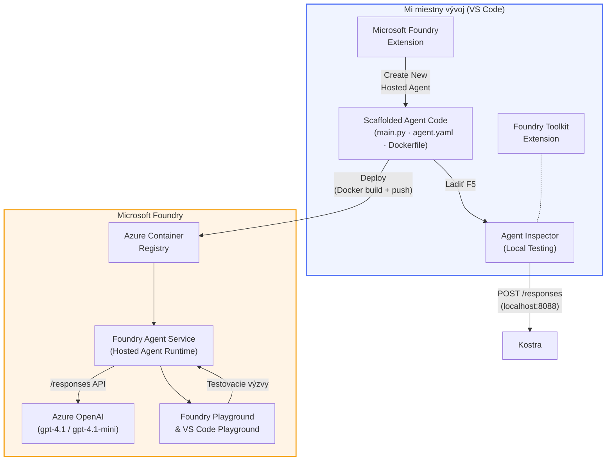

# Foundry Toolkit + Workshop o hostovaných agentoch Foundry

[](https://www.python.org/)
[](https://github.com/microsoft/agents)
[](https://learn.microsoft.com/azure/foundry/agents/concepts/hosted-agents)
[](https://ai.azure.com/)
[](https://learn.microsoft.com/azure/ai-services/openai/)
[](https://learn.microsoft.com/cli/azure/install-azure-cli)
[](https://learn.microsoft.com/azure/developer/azure-developer-cli/install-azd)
[](https://www.docker.com/)
[](https://marketplace.visualstudio.com/items?itemName=ms-windows-ai-studio.windows-ai-studio)
[](LICENSE)

Vytvárajte, testujte a nasadzujte AI agentov do **Microsoft Foundry Agent Service** ako **hostovaných agentov** - všetko priamo z VS Code pomocou **rozšírenia Microsoft Foundry** a **Foundry Toolkit**.

> **Hostovaní agenti sú momentálne v prevádzke ako preview.** Podporované regióny sú obmedzené - pozrite si [dostupnosť regiónov](https://learn.microsoft.com/azure/foundry/agents/concepts/hosted-agents#region-availability).

> Priečinok `agent/` v každom labore je **automaticky pripravovaný** rozšírením Foundry - potom upravíte kód, testujete lokálne a nasadíte.

### 🌐 Podpora viacerých jazykov

#### Podporované cez GitHub Action (automatizované a vždy aktuálne)

<!-- CO-OP TRANSLATOR LANGUAGES TABLE START -->
[Arabic](../ar/README.md) | [Bengali](../bn/README.md) | [Bulgarian](../bg/README.md) | [Burmese (Myanmar)](../my/README.md) | [Chinese (Simplified)](../zh-CN/README.md) | [Chinese (Traditional, Hong Kong)](../zh-HK/README.md) | [Chinese (Traditional, Macau)](../zh-MO/README.md) | [Chinese (Traditional, Taiwan)](../zh-TW/README.md) | [Croatian](../hr/README.md) | [Czech](../cs/README.md) | [Danish](../da/README.md) | [Dutch](../nl/README.md) | [Estonian](../et/README.md) | [Finnish](../fi/README.md) | [French](../fr/README.md) | [German](../de/README.md) | [Greek](../el/README.md) | [Hebrew](../he/README.md) | [Hindi](../hi/README.md) | [Hungarian](../hu/README.md) | [Indonesian](../id/README.md) | [Italian](../it/README.md) | [Japanese](../ja/README.md) | [Kannada](../kn/README.md) | [Khmer](../km/README.md) | [Korean](../ko/README.md) | [Lithuanian](../lt/README.md) | [Malay](../ms/README.md) | [Malayalam](../ml/README.md) | [Marathi](../mr/README.md) | [Nepali](../ne/README.md) | [Nigerian Pidgin](../pcm/README.md) | [Norwegian](../no/README.md) | [Persian (Farsi)](../fa/README.md) | [Polish](../pl/README.md) | [Portuguese (Brazil)](../pt-BR/README.md) | [Portuguese (Portugal)](../pt-PT/README.md) | [Punjabi (Gurmukhi)](../pa/README.md) | [Romanian](../ro/README.md) | [Russian](../ru/README.md) | [Serbian (Cyrillic)](../sr/README.md) | [Slovak](./README.md) | [Slovenian](../sl/README.md) | [Spanish](../es/README.md) | [Swahili](../sw/README.md) | [Swedish](../sv/README.md) | [Tagalog (Filipino)](../tl/README.md) | [Tamil](../ta/README.md) | [Telugu](../te/README.md) | [Thai](../th/README.md) | [Turkish](../tr/README.md) | [Ukrainian](../uk/README.md) | [Urdu](../ur/README.md) | [Vietnamese](../vi/README.md)

> **Radšej klonovať lokálne?**
>
> Tento repozitár obsahuje viac ako 50 jazykových prekladov, čo výrazne zväčšuje veľkosť na stiahnutie. Ak chcete klonovať bez prekladov, použite sparse checkout:
>
> **Bash / macOS / Linux:**
> ```bash
> git clone --filter=blob:none --sparse https://github.com/microsoft-foundry/Foundry_Toolkit_for_VSCode_Lab.git
> cd Foundry_Toolkit_for_VSCode_Lab
> git sparse-checkout set --no-cone '/*' '!translations' '!translated_images'
> ```
>
> **CMD (Windows):**
> ```cmd
> git clone --filter=blob:none --sparse https://github.com/microsoft-foundry/Foundry_Toolkit_for_VSCode_Lab.git
> cd Foundry_Toolkit_for_VSCode_Lab
> git sparse-checkout set --no-cone "/*" "!translations" "!translated_images"
> ```
>
> Toto vám poskytne všetko, čo potrebujete na dokončenie kurzu s oveľa rýchlejším sťahovaním.
<!-- CO-OP TRANSLATOR LANGUAGES TABLE END -->

---

## Architektúra


```mermaid
flowchart TB
    subgraph Local["Mi miestny vývoj (VS Code)"]
        direction TB
        FE["Microsoft Foundry
        Extension"]
        FoundryToolkit["Foundry Toolkit
        Extension"]
        Scaffold["Scaffolded Agent Code
        (main.py · agent.yaml · Dockerfile)"]
        Inspector["Agent Inspector
        (Local Testing)"]
        FE -- "Create New
        Hosted Agent" --> Scaffold
        Scaffold -- "Ladiť F5" --> Inspector
        FoundryToolkit -.- Inspector
    end

    subgraph Cloud["Microsoft Foundry"]
        direction TB
        ACR["Azure Container
        Registry"]
        AgentService["Foundry Agent Service
        (Hosted Agent Runtime)"]
        Model["Azure OpenAI
        (gpt-4.1 / gpt-4.1-mini)"]
        Playground["Foundry Playground
        & VS Code Playground"]
        ACR --> AgentService
        AgentService -- "/responses API" --> Model
        AgentService --> Playground
    end

    Scaffold -- "Deploy
    (Docker build + push)" --> ACR
    Inspector -- "POST /responses
    (localhost:8088)" --> Kostra
    Playground -- "Testovacie výzvy" --> AgentService

    style Local fill:#f0f4ff,stroke:#4a6cf7,stroke-width:2px
    style Cloud fill:#fff4e6,stroke:#f59e0b,stroke-width:2px
```

**Priebeh:** Rozšírenie Foundry pripraví agenta → vy prispôsobíte kód a inštrukcie → testujete lokálne pomocou Agent Inspector → nasadíte do Foundry (Docker image sa pushne do ACR) → overíte v Playground.

---

## Čo postavíte

| Laboratórium | Popis | Stav |
|-----|-------------|--------|
| **Laboratórium 01 - Jediný agent** | Vybudujte **"Vysvetli to ako manažérovi" agenta**, otestujte ho lokálne a nasadte do Foundry | ✅ Dostupné |
| **Laboratórium 02 - Multi-Agentný workflow** | Vybudujte **"Hodnotiť životopis → Hodnotenie fit do práce"** - 4 agenti spolupracujú na ohodnotení vhodnosti životopisu a generovaní učebnej cesty | ✅ Dostupné |

---

## Spoznajte Executive Agenta

V tomto workshope postavíte **"Vysvetli to ako manažérovi" agenta** - AI agenta, ktorý berie zložité technické termíny a prekladá ich do pokojného, pripraveného pre predstavenstvo zhrnutia. Pretože buďme úprimní, nikto v vrcholovom manažmente nechce počuť o "vyčerpaní thread pool spôsobenom synchronnými volaniami zavedenými vo verzii 3.2."

Tento agenta som postavil po niekoľkých incidentoch, keď moja dokonale vytvorená post-mortem analýza skutočne vyvolala odpoveď: *"Takže... stránka je výpadková alebo nie?"*

### Ako funguje

Zadáte mu technickú aktualizáciu. Vráti vám výkonný súhrn - tri bodky, žiadny žargón, žiadne stopy zásobníka, žiadny existenciálny strach. Len **čo sa stalo**, **dopad na biznis** a **ďalší krok**.

### Pozrite si to v akcii

**Poviete:**
> "Latencia API sa zvýšila kvôli vyčerpaniu thread pool spôsobenému synchronnými volaniami zavedenými vo verzii 3.2."

**Agent odpovie:**

> **Výkonný súhrn:**
> - **Čo sa stalo:** Po poslednom vydaní sa systém spomalil.
> - **Dopad na biznis:** Niektorí používatelia zaznamenali oneskorenia pri používaní služby.
> - **Ďalší krok:** Zmena bola vrátená späť a pripravuje sa oprava pred opätovným nasadením.

### Prečo tento agent?

Je to úplne jednoduchý, jednopurpose agent - ideálny na učenie sa workflow hostovaných agentov od začiatku do konca bez uviaznutia v zložitých nástrojoch. A úprimne? Každý inžiniersky tím by mohol takéhoto agenta využiť.

---

## Štruktúra workshopu

```
📂 Foundry_Toolkit_for_VSCode_Lab/
├── 📄 README.md                      ← You are here
└── 📂 workshop/
    ├── 📂 lab01-single-agent/        ← Full lab: docs + agent code
    │   ├── README.md                 ← Hands-on lab instructions
    │   ├── 📂 docs/                  ← Step-by-step tutorial modules
    │   │   ├── 00-prerequisites.md
    │   │   ├── 01-setup.md
    │   │   ├── 02-create-hosted-agent.md
    │   │   ├── 03-configure-and-code.md
    │   │   ├── 04-test-locally.md
    │   │   ├── 05-deploy-to-foundry.md
    │   │   ├── 06-verify-in-playground.md
    │   │   ├── 07-summary.md
    │   │   └── 08-troubleshooting.md
    │   └── 📂 agent/                 ← Reference solution (auto-scaffolded by Foundry extension)
    │       ├── agent.yaml
    │       ├── Dockerfile
    │       ├── main.py
    │       └── requirements.txt
    └── 📂 lab02-multi-agent/         ← Resume → Job Fit Evaluator
        ├── README.md                 ← Hands-on lab instructions (end-to-end)
        ├── 📂 docs/                  ← Step-by-step tutorial modules
        │   ├── 00-prerequisites.md
        │   ├── 01-understand-multi-agent.md
        │   ├── 02-scaffold-multi-agent.md
        │   ├── 03-configure-agents.md
        │   ├── 04-orchestration-patterns.md
        │   ├── 05-test-locally.md
        │   ├── 06-deploy-to-foundry.md
        │   ├── 07-verify-in-playground.md
        │   └── 08-troubleshooting.md
        └── 📂 PersonalCareerCopilot/ ← Reference solution (multi-agent workflow)
            ├── agent.yaml
            ├── Dockerfile
            ├── main.py
            └── requirements.txt
```

> **Poznámka:** Priečinok `agent/` v každom laboratóriu je to, čo generuje **rozšírenie Microsoft Foundry**, keď spustíte `Microsoft Foundry: Create a New Hosted Agent` v Command Palette. Následne sa súbory upravia s inštrukciami, nástrojmi a konfiguráciou vášho agenta. Laboratórium 01 vás prevedie vytvorením tohto od základu.

---

## Začíname

### 1. Klonujte repozitár

```bash
git clone https://github.com/microsoft-foundry/Foundry_Toolkit_for_VSCode_Lab.git
cd Foundry_Toolkit_for_VSCode_Lab
```

### 2. Nastavte virtuálne prostredie Pythonu

```bash
python -m venv venv
```

Aktivujte ho:

- **Windows (PowerShell):**
  ```powershell
  .\venv\Scripts\Activate.ps1
  ```
- **macOS / Linux:**
  ```bash
  source venv/bin/activate
  ```

### 3. Nainštalujte závislosti

```bash
pip install -r workshop/lab01-single-agent/agent/requirements.txt
```

### 4. Nakonfigurujte premenné prostredia

Skopírujte príkladový súbor `.env` v priečinku agenta a vyplňte svoje hodnoty:

```bash
cp workshop/lab01-single-agent/agent/.env.example workshop/lab01-single-agent/agent/.env
```

Upraviť `workshop/lab01-single-agent/agent/.env`:

```env
AZURE_AI_PROJECT_ENDPOINT=https://<your-account>.services.ai.azure.com/api/projects/<your-project>
AZURE_AI_MODEL_DEPLOYMENT_NAME=<your-model-deployment-name>
```

### 5. Sledujte laboratóriá workshopu

Každé laboratórium je samostatné so svojimi modulmi. Začnite s **Laboratóriom 01**, aby ste sa naučili základy, potom pokračujte na **Laboratórium 02** pre workflow viacagentové.

#### Laboratórium 01 - Jediný agent ([plné inštrukcie](workshop/lab01-single-agent/README.md))

| # | Modul | Odkaz |
|---|--------|------|
| 1 | Prečítajte si predpoklady | [00-prerequisites.md](workshop/lab01-single-agent/docs/00-prerequisites.md) |
| 2 | Nainštalujte Foundry Toolkit & rozšírenie Foundry | [01-setup.md](workshop/lab01-single-agent/docs/01-setup.md) |
| 3 | Vytvorte projekt v Foundry | [01-setup.md](workshop/lab01-single-agent/docs/01-setup.md) |
| 4 | Vytvorte hostovaného agenta | [02-create-hosted-agent.md](workshop/lab01-single-agent/docs/02-create-hosted-agent.md) |
| 5 | Nakonfigurujte inštrukcie a prostredie | [03-configure-and-code.md](workshop/lab01-single-agent/docs/03-configure-and-code.md) |
| 6 | Testujte lokálne | [04-test-locally.md](workshop/lab01-single-agent/docs/04-test-locally.md) |
| 7 | Nasadte do Foundry | [05-deploy-to-foundry.md](workshop/lab01-single-agent/docs/05-deploy-to-foundry.md) |
| 8 | Overte v playgrounde | [06-verify-in-playground.md](workshop/lab01-single-agent/docs/06-verify-in-playground.md) |
| 9 | Riešenie problémov | [08-troubleshooting.md](workshop/lab01-single-agent/docs/08-troubleshooting.md) |

#### Laboratórium 02 - Multi-Agentný workflow ([plné inštrukcie](workshop/lab02-multi-agent/README.md))

| # | Modul | Odkaz |
|---|--------|------|
| 1 | Predpoklady (Laboratórium 02) | [00-prerequisites.md](workshop/lab02-multi-agent/docs/00-prerequisites.md) |
| 2 | Pochopenie multi-agentnej architektúry | [01-understand-multi-agent.md](workshop/lab02-multi-agent/docs/01-understand-multi-agent.md) |
| 3 | Príprava multi-agentného projektu | [02-scaffold-multi-agent.md](workshop/lab02-multi-agent/docs/02-scaffold-multi-agent.md) |
| 4 | Konfigurácia agentov a prostredia | [03-configure-agents.md](workshop/lab02-multi-agent/docs/03-configure-agents.md) |
| 5 | Orkestrácia vzorov | [04-orchestration-patterns.md](workshop/lab02-multi-agent/docs/04-orchestration-patterns.md) |
| 6 | Testovanie lokálne (multi-agentné) | [05-test-locally.md](workshop/lab02-multi-agent/docs/05-test-locally.md) |

| 7 | Nasadiť do Foundry | [06-deploy-to-foundry.md](workshop/lab02-multi-agent/docs/06-deploy-to-foundry.md) |
| 8 | Overiť v playground | [07-verify-in-playground.md](workshop/lab02-multi-agent/docs/07-verify-in-playground.md) |
| 9 | Riešenie problémov (multi-agent) | [08-troubleshooting.md](workshop/lab02-multi-agent/docs/08-troubleshooting.md) |

---

## Správca

<table>
<tr>
    <td align="center"><a href="https://github.com/ShivamGoyal03">
        <br />
        <sub><b>Shivam Goyal</b></sub>
    </a><br />
    </td>
</tr>
</table>

---

## Požadované povolenia (rýchla referencia)

| Scenár | Požadované roly |
|----------|---------------|
| Vytvoriť nový projekt Foundry | **Azure AI Owner** na Foundry zdroji |
| Nasadiť do existujúceho projektu (nové zdroje) | **Azure AI Owner** + **Contributor** na predplatnom |
| Nasadiť do plne nakonfigurovaného projektu | **Reader** na účte + **Azure AI User** na projekte |

> **Dôležité:** Azure roly `Owner` a `Contributor` obsahujú iba *správu* oprávnení, nie *vývojové* (akcie s dátami) oprávnenia. Na vytváranie a nasadenie agentov potrebujete **Azure AI User** alebo **Azure AI Owner**.

---

## Odkazy

- [Rýchly start: Nasadiť svoj prvý hosťovaný agent (VS Code)](https://learn.microsoft.com/azure/foundry/agents/quickstarts/quickstart-hosted-agent)
- [Čo sú hosťovaní agenti?](https://learn.microsoft.com/azure/foundry/agents/concepts/hosted-agents)
- [Vytvorte pracovné toky hosťovaných agentov vo VS Code](https://learn.microsoft.com/azure/foundry/agents/how-to/vs-code-agents-workflow-pro-code)
- [Nasadiť hosťovaného agenta](https://learn.microsoft.com/azure/foundry/agents/how-to/deploy-hosted-agent)
- [RBAC pre Microsoft Foundry](https://learn.microsoft.com/azure/foundry/concepts/rbac-foundry)
- [Príklad architektúry pre Agent Review](https://github.com/Azure-Samples/agent-architecture-review-sample) - Reálny hosťovaný agent s nástrojmi MCP, diagramami Excalidraw a duálnym nasadením

---


## Licencia

[MIT](../../LICENSE)

---

<!-- CO-OP TRANSLATOR DISCLAIMER START -->
**Vyhlásenie o zodpovednosti**:
Tento dokument bol preložený pomocou AI prekladateľskej služby [Co-op Translator](https://github.com/Azure/co-op-translator). Hoci sa snažíme o presnosť, vezmite prosím na vedomie, že automatické preklady môžu obsahovať chyby alebo nepresnosti. Pôvodný dokument v jeho natívnom jazyku by mal byť považovaný za autoritatívny zdroj. Pre kritické informácie sa odporúča profesionálny ľudský preklad. Nie sme zodpovední za žiadne nedorozumenia alebo nesprávne interpretácie vyplývajúce z použitia tohto prekladu.
<!-- CO-OP TRANSLATOR DISCLAIMER END -->