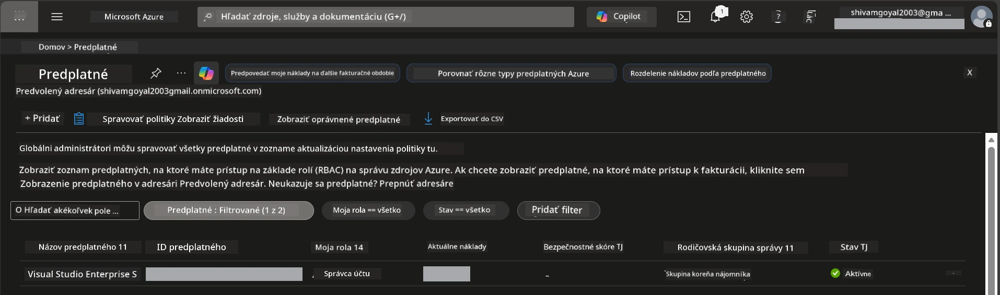

# Modul 0 - Predpoklady

Pred začatím workshopu si overte, či máte pripravené nasledujúce nástroje, prístupy a prostredie. Dodržujte každý krok nižšie - nepreskakujte.

---

## 1. Azure účet a predplatné

### 1.1 Vytvorte alebo overte svoje Azure predplatné

1. Otvorte prehliadač a prejdite na [https://azure.microsoft.com/free/](https://azure.microsoft.com/free/).
2. Ak nemáte Azure účet, kliknite na **Start free** a postupujte podľa registračného procesu. Budete potrebovať Microsoft účet (alebo si ho vytvoriť) a kreditnú kartu na overenie identity.
3. Ak už účet máte, prihláste sa na [https://portal.azure.com](https://portal.azure.com).
4. V Portáli kliknite na panel **Subscriptions** v ľavej navigácii (alebo vyhľadajte "Subscriptions" v hornej vyhľadávacej lište).
5. Overte, či vidíte aspoň jedno **Active** predplatné. Poznačte si **Subscription ID** - budete ho neskôr potrebovať.



### 1.2 Pochopte požadované RBAC role

Nasadenie [Hosted Agent](https://learn.microsoft.com/azure/foundry/agents/concepts/hosted-agents) vyžaduje oprávnenia na **data action**, ktoré štandardné Azure role `Owner` a `Contributor` neobsahujú. Budete potrebovať jednu z týchto [kombinácií rolí](https://learn.microsoft.com/azure/foundry/concepts/rbac-foundry#built-in-roles):

| Scenár | Požadované role | Kde ich priradiť |
|----------|---------------|----------------------|
| Vytvoriť nový Foundry projekt | **Azure AI Owner** na Foundry resurse | Foundry resource v Azure Portáli |
| Nasadiť do existujúceho projektu (nové zdroje) | **Azure AI Owner** + **Contributor** na predplatnom | Subscription + Foundry resource |
| Nasadiť do plne nakonfigurovaného projektu | **Reader** na konte + **Azure AI User** na projekte | Konto + Projekt v Azure Portáli |

> **Kľúčové:** Azure role `Owner` a `Contributor` pokrývajú iba *manažérske* oprávnenia (ARM operácie). Na *data actions* ako `agents/write` potrebujete [**Azure AI User**](https://learn.microsoft.com/azure/foundry/concepts/rbac-foundry#built-in-roles) (alebo vyššiu) rolu, ktorá je potrebná na vytváranie a nasadzovanie agentov. Tieto role si priradíte v [Module 2](02-create-foundry-project.md).

---

## 2. Inštalácia lokálnych nástrojov

Nainštalujte si každý z nasledujúcich nástrojov. Po inštalácii overte ich funkčnosť spustením kontrolného príkazu.

### 2.1 Visual Studio Code

1. Prejdite na [https://code.visualstudio.com/](https://code.visualstudio.com/).
2. Stiahnite inštalátor pre svoj operačný systém (Windows/macOS/Linux).
3. Spustite inštalátor s predvolenými nastaveniami.
4. Otvorte VS Code, aby ste potvrdili, že sa spustí.

### 2.2 Python 3.10+

1. Prejdite na [https://www.python.org/downloads/](https://www.python.org/downloads/).
2. Stiahnite Python 3.10 alebo novší (odporúčané 3.12+).
3. **Windows:** Počas inštalácie zaškrtnite **"Add Python to PATH"** na prvej obrazovke.
4. Otvorte terminál a overte:

   ```powershell
   python --version
   ```

   Očakávaný výstup: `Python 3.10.x` alebo vyšší.

### 2.3 Azure CLI

1. Prejdite na [https://learn.microsoft.com/cli/azure/install-azure-cli](https://learn.microsoft.com/cli/azure/install-azure-cli).
2. Postupujte podľa inštrukcií na inštaláciu pre váš OS.
3. Overte:

   ```powershell
   az --version
   ```

   Očakávané: `azure-cli 2.80.0` alebo vyšší.

4. Prihláste sa:

   ```powershell
   az login
   ```

### 2.4 Azure Developer CLI (azd)

1. Prejdite na [https://learn.microsoft.com/azure/developer/azure-developer-cli/install-azd](https://learn.microsoft.com/azure/developer/azure-developer-cli/install-azd).
2. Postupujte podľa inštrukcií na inštaláciu pre váš OS. Na Windows:

   ```powershell
   winget install microsoft.azd
   ```

3. Overte:

   ```powershell
   azd version
   ```

   Očakávané: `azd version 1.x.x` alebo vyšší.

4. Prihláste sa:

   ```powershell
   azd auth login
   ```

### 2.5 Docker Desktop (voliteľné)

Docker je potrebný iba v prípade, že chcete lokálne vytvoriť a otestovať kontajnerový obraz pred nasadením. Rozšírenie Foundry spracuje tvorbu kontajnerov automaticky počas nasadenia.

1. Prejdite na [https://docs.docker.com/get-docker/](https://docs.docker.com/get-docker/).
2. Stiahnite a nainštalujte Docker Desktop pre svoj OS.
3. **Windows:** Počas inštalácie si vyberte WSL 2 backend.
4. Spustite Docker Desktop a čakajte, kým v systémovej lište nezobrazí stav **"Docker Desktop is running"**.
5. Otvorte terminál a overte:

   ```powershell
   docker info
   ```

   Malo by sa vypísať info o Docker systéme bez chýb. Ak vidíte `Cannot connect to the Docker daemon`, počkajte ešte pár sekúnd, kým sa Docker úplne spustí.

---

## 3. Inštalácia rozšírení pre VS Code

Potrebujete tri rozšírenia. Nainštalujte ich **pred začiatkom** workshopu.

### 3.1 Microsoft Foundry pre VS Code

1. Otvorte VS Code.
2. Stlačte `Ctrl+Shift+X` na otvorenie panela Rozšírení.
3. Do vyhľadávacieho poľa napíšte **"Microsoft Foundry"**.
4. Nájdite **Microsoft Foundry for Visual Studio Code** (vydavateľ: Microsoft, ID: `TeamsDevApp.vscode-ai-foundry`).
5. Kliknite na **Install**.
6. Po inštalácii by sa mala v Activity Bar (ľavý bočný panel) zobraziť ikona **Microsoft Foundry**.

### 3.2 Foundry Toolkit

1. V paneli Rozšírení (`Ctrl+Shift+X`) vyhľadajte **"Foundry Toolkit"**.
2. Nájdite **Foundry Toolkit** (vydavateľ: Microsoft, ID: `ms-windows-ai-studio.windows-ai-studio`).
3. Kliknite na **Install**.
4. Ikona **Foundry Toolkit** by sa mala zobraziť v Activity Bar.

### 3.3 Python

1. V paneli Rozšírení vyhľadajte **"Python"**.
2. Nájdite **Python** (vydavateľ: Microsoft, ID: `ms-python.python`).
3. Kliknite na **Install**.

---

## 4. Prihlásenie do Azure z VS Code

[Microsoft Agent Framework](https://learn.microsoft.com/agent-framework/overview/) používa [`DefaultAzureCredential`](https://learn.microsoft.com/azure/developer/python/sdk/authentication/credential-chains#defaultazurecredential-overview) na autentifikáciu. Musíte byť prihlásení do Azure vo VS Code.

### 4.1 Prihlásenie cez VS Code

1. Pozrite do ľavého dolného rohu VS Code a kliknite na ikonu **Accounts** (siluetu osoby).
2. Kliknite na **Sign in to use Microsoft Foundry** (alebo **Sign in with Azure**).
3. Otvorí sa prehliadač - prihláste sa pomocou Azure účtu, ktorý má prístup k vášmu predplatnému.
4. Vráťte sa do VS Code. V ľavom dolnom rohu by ste mali vidieť meno účtu.

### 4.2 (Voliteľné) Prihlásenie cez Azure CLI

Ak ste nainštalovali Azure CLI a preferujete prihlasovanie cez CLI:

```powershell
az login
```

Toto otvorí prehliadač na prihlásenie. Po prihlásení nastavte správne predplatné:

```powershell
az account set --subscription "<your-subscription-id>"
```

Overte:

```powershell
az account show --query "{name:name, id:id, state:state}" --output table
```

Mali by ste vidieť meno predplatného, ID a stav = `Enabled`.

### 4.3 (Alternatívne) Autentifikácia prostredníctvom service principal

Pre CI/CD alebo zdieľané prostredia namiesto toho nastavte tieto environmentálne premenné:

```powershell
$env:AZURE_TENANT_ID = "<your-tenant-id>"
$env:AZURE_CLIENT_ID = "<your-client-id>"
$env:AZURE_CLIENT_SECRET = "<your-client-secret>"
```

---

## 5. Obmedzenia preview verzie

Pred pokračovaním si uvedomte súčasné obmedzenia:

- [**Hosted Agents**](https://learn.microsoft.com/azure/foundry/agents/concepts/hosted-agents) sú momentálne v **verejnej preview** - nie sú odporúčané pre produkčné prostredia.
- **Podporované regióny sú obmedzené** - skontrolujte [dostupnosť regiónu](https://learn.microsoft.com/azure/foundry/agents/concepts/hosted-agents#region-availability) pred vytváraním zdrojov. Ak vyberiete nepodporovaný región, nasadenie zlyhá.
- Balík `azure-ai-agentserver-agentframework` je predbežná verzia (`1.0.0b16`) - API sa môže meniť.
- Limit škálovania: hostované agenti podporujú 0-5 replík (vrátane scale-to-zero).

---

## 6. Kontrolný zoznam pred letom

Prejdite každý bod nižšie. Ak niektorý krok zlyhá, vráťte sa a opravte ho pred pokračovaním.

- [ ] VS Code sa otvorí bez chýb
- [ ] Python 3.10+ je v PATH (`python --version` vypíše `3.10.x` alebo vyšší)
- [ ] Azure CLI je nainštalovaný (`az --version` vypíše `2.80.0` alebo vyšší)
- [ ] Azure Developer CLI je nainštalovaný (`azd version` vypíše verziu)
- [ ] Rozšírenie Microsoft Foundry je nainštalované (ikona viditeľná v Activity Bar)
- [ ] Rozšírenie Foundry Toolkit je nainštalované (ikona viditeľná v Activity Bar)
- [ ] Rozšírenie Python je nainštalované
- [ ] Ste prihlásený do Azure vo VS Code (skontrolujte ikonu Accounts, dolný ľavý roh)
- [ ] `az account show` vráti vaše predplatné
- [ ] (Voliteľné) Docker Desktop beží (`docker info` vypíše systémové informácie bez chýb)

### Kontrolný bod

Otvorte Activity Bar vo VS Code a overte, či vidíte zobrazenia bočného panela **Foundry Toolkit** a **Microsoft Foundry**. Kliknite na každé z nich a overte, že sa načítajú bez chýb.

---

**Ďalšie:** [01 - Inštalácia Foundry Toolkit & Foundry rozšírenia →](01-install-foundry-toolkit.md)

---

<!-- CO-OP TRANSLATOR DISCLAIMER START -->
**Zrieknutie sa zodpovednosti**:  
Tento dokument bol preložený pomocou AI prekladateľskej služby [Co-op Translator](https://github.com/Azure/co-op-translator). Aj keď sa snažíme o presnosť, berte prosím na vedomie, že automatizované preklady môžu obsahovať chyby alebo nepresnosti. Originálny dokument v jeho pôvodnom jazyku by mal byť považovaný za autoritatívny zdroj. Pre kritické informácie sa odporúča profesionálny ľudský preklad. Nie sme zodpovední za žiadne nedorozumenia alebo nesprávne výklady vyplývajúce z použitia tohto prekladu.
<!-- CO-OP TRANSLATOR DISCLAIMER END -->