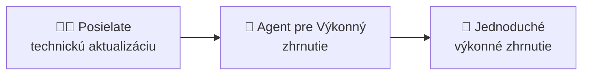

# Modul 0 - Úvod

⏱️ ~10 min

> [!WARNING]
> **Náhľad a obmedzenia:** [Hosťovaní agenti](https://learn.microsoft.com/azure/foundry/agents/concepts/hosted-agents) sú momentálne v **verejnom náhľade** - nie sú odporúčané pre produkčné záťaže. Upozorňujeme na nasledovné:
> - **Podporované regióny sú obmedzené** - skontrolujte [dostupnosť regiónu](https://learn.microsoft.com/azure/foundry/agents/concepts/hosted-agents#region-availability) pred vytvorením zdrojov. Ak si vyberiete nepodporovaný región, nasadenie zlyhá.
> - Balík `azure-ai-agentserver-agentframework` je predbežná verzia - API sa môžu medzi verziami meniť.
> - Limity škálovania: hosťovaní agenti podporujú 0–5 replík (vrátane škálovania na nulu).
> - Niektoré funkcie zobrazené v tejto workshope sa môžu meniť, keď sa služba posúva k GA.

## Čo si vybudujete

V tejto workshope si vytvoríte **agenta "Vysvetli mi to ako výkonnému manažérovi"** - hosťovaného AI agenta, ktorý berie zložité technické aktualizácie a prepíše ich ako jednoduché výkonné zhrnutia v angličtine.

```mermaid
flowchart LR
    A["🧑‍💻 Posielate\ntechnickú aktualizáciu"] --> B["🤖 Agent pre Výkonný\nzhrnutie"]
    B --> C["📝 Jednoduché\nvýkonné zhrnutie"]
```

**Agent používa:**
- **Microsoft Agent Framework** - pre logiku a štruktúru agenta
- **Foundry Toolkit pre VS Code** - na scaffolding, lokálne testovanie a nasadenie
- **AI model** (napr. `gpt-4.1-mini/gpt-5-mini`) - na generovanie zhrnutí

Na konci tohto laboratória budete mať funkčného agenta, ktorého môžete otestovať lokálne cez Agent Inspector a prípadne nasadiť do cloudu.

---

## Čo sú hosťovaní agenti?

**Hosťovaný agent** je AI agent, ktorý beží ako spravovaná služba v Microsoft Foundry. Namiesto správy vlastnej infraštruktúry zabalíte svoj kód agenta do kontajnera a Foundry sa postará o škálovanie, hosťovanie a vystavenie cez štandardný HTTP endpoint.

| Koncept | Čo to znamená |
|---------|--------------|
| **Agent** | Váš Python kód, ktorý prijíma správu používateľa, volá AI model a vracia štruktúrovanú odpoveď |
| **Hosťovaný** | Foundry spravuje váš kontajner za vás - žiadne VM, žiadne Kubernetes, žiadnu infraštruktúru na správu |
| **Protokol odpovedí** | Štandardné HTTP API (`POST /responses`), ktoré môže volávať akýkoľvek klient na interakciu s agentom |
| **Agent Inspector** | Lokálne testovacie UI (zaintegrované vo Foundry Toolkit), ktoré vám umožní komunikovať s agentom pred nasadením |

V tejto workshope prejdete od nuly až po plne hosťovaného agenta - alebo zastavíte pri lokálnom testovaní, ak chcete.

---

## Vyberte si svoju cestu

> ⚠️ **Pred pokračovaním si vyberte jednu cestu.** Váš výber určuje, ktoré nástroje nainštalujete a ktoré moduly budú použité. Neskôr môžete prejsť z Cesty B → Cestu A, ak získate predplatné.

<strong>🅰️ Cesta A - Azure cloud (vyžaduje predplatné Azure)</strong>

| | Detaily |
|---|---|
| **Pre koho je?** | Máte aktívne predplatné Azure a môžete vytvárať Foundry zdroje |
| **Model** | Azure OpenAI cez Foundry (napr. `gpt-4.1-mini/gpt-5-mini`) |
| **Moduly pokryté** | Všetky moduly (00–07) |
| **Nasadiť do cloudu?** | ✅ Áno - kompletné end-to-end nasadenie |

<strong>🅱️ Cesta B - Lokálne / bezplatná úroveň (predplatné Azure nie je potrebné)</strong>

| | Detaily |
|---|---|
| **Pre koho je?** | MVP, študenti alebo ktokoľvek bez prístupu k Azure |
| **Model** | **Foundry Local** (zadarmo, beží na vašom počítači) |
| **Moduly pokryté** | Moduly 00–04 (preskočiť nasadenie a overenie v cloude) |
| **Nasadiť do cloudu?** | ❌ Nie - iba lokálne testovanie cez Agent Inspector |

---

## Všetky cesty: požadované nástroje

Nainštalujte každý z nižšie uvedených nástrojov. Po inštalácii overte ich funkčnosť spustením kontroly.

| # | Nástroj | Verzia | Inštalácia | Overenie (očakávaný výstup) |
|---|---------|---------|------------|------------------------------|
| 1 | **Visual Studio Code** | Najnovšia | [code.visualstudio.com](https://code.visualstudio.com/) | Otvorí sa bez chýb |
| 2 | **Python** | 3.12 alebo novší | [python.org/downloads](https://www.python.org/downloads/) | `python --version` $\rightarrow$ `Python 3.12.x` |
| 3 | **Foundry Toolkit pre VS Code** | Najnovšia | ID rozšírenia: `ms-windows-ai-studio.windows-ai-studio` | Ikona Foundry v Activity Bar |
| 4 | **Python rozšírenie pre VS Code** | Najnovšia | ID rozšírenia: `ms-python.python` | Inštalované v paneli Rozšírenia |

> [!TIP]
> **Tipy na inštaláciu:**
> - **Python PATH (Windows):** Vždy zaškrtnite **"Add Python to PATH"** na prvej obrazovke inštalátora Pythonu. Bez toho príkaz `python` nebude rozpoznaný v termináli.
> - **Viacero verzií Pythonu:** Ak máte nainštalované Python 3.10 aj 3.12, použite `python3.12 -m venv .venv`, aby ste zabezpečili správnu verziu pre svoje virtuálne prostredie.
> - **Docker WSL 2 (Windows):** Počas inštalácie Docker Desktop sa uistite, že je vybraný **WSL 2 backend**. Docker s Hyper-V je pomalší a môže spôsobovať problémy s buildmi Foundry kontajnerov.
> - **Docker sa nespúšťa?** Po spustení Docker Desktop počkajte 30–60 sekúnd. Spustite `docker info` - ak vidíte "Cannot connect to the Docker daemon," Docker sa ešte inicializuje.
> - **Rozšírenia VS Code sa nenačítavajú?** Po inštalácii rozšírení obnovte okno: `Ctrl+Shift+P` → `Developer: Reload Window`.

> **Používatelia Windows:** Počas inštalácie Pythonu skontrolujte **"Add Python to PATH"**.

**Ďalej:** [01 - Nastavenie →](01-setup.md)

---

<!-- CO-OP TRANSLATOR DISCLAIMER START -->
**Vyhlásenie o zodpovednosti**:
Tento dokument bol preložený pomocou AI prekladateľskej služby [Co-op Translator](https://github.com/Azure/co-op-translator). Hoci sa snažíme o presnosť, vezmite prosím na vedomie, že automatické preklady môžu obsahovať chyby alebo nepresnosti. Pôvodný dokument v jeho natívnom jazyku by mal byť považovaný za autoritatívny zdroj. Pre kritické informácie sa odporúča profesionálny ľudský preklad. Nie sme zodpovední za žiadne nedorozumenia alebo nesprávne interpretácie vyplývajúce z použitia tohto prekladu.
<!-- CO-OP TRANSLATOR DISCLAIMER END -->