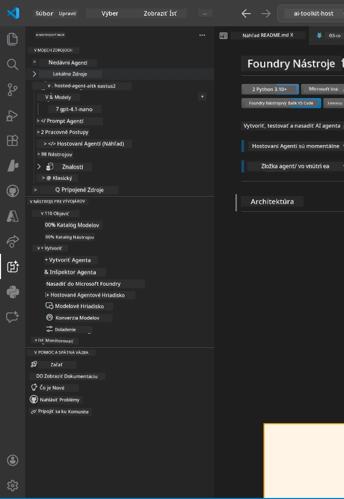
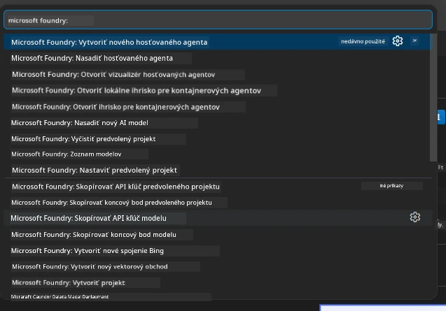

# Modul 1 - Inštalácia Foundry Toolkit & Foundry Extension

Tento modul vás prevedie inštaláciou a overením dvoch kľúčových rozšírení VS Code pre tento workshop. Ak ste ich už nainštalovali počas [Modulu 0](00-prerequisites.md), použite tento modul na overenie, či fungujú správne.

---

## Krok 1: Inštalácia rozšírenia Microsoft Foundry

Rozšírenie **Microsoft Foundry for VS Code** je váš hlavný nástroj na vytváranie Foundry projektov, nasadzovanie modelov, generovanie šablón hosted agentov a nasadzovanie priamo z VS Code.

1. Otvorte VS Code.
2. Stlačte `Ctrl+Shift+X` pre otvorenie panela **Extensions**.
3. Do vyhľadávacieho poľa hore napíšte: **Microsoft Foundry**
4. Nájdite výsledok s názvom **Microsoft Foundry for Visual Studio Code**.
   - Vydavateľ: **Microsoft**
   - ID rozšírenia: `TeamsDevApp.vscode-ai-foundry`
5. Kliknite na tlačidlo **Install**.
6. Počkajte na dokončenie inštalácie (uvidíte malý indikátor priebehu).
7. Po inštalácii sa pozrite na **Activity Bar** (vertikálny panel ikon na ľavej strane VS Code). Mali by ste vidieť novú ikonu **Microsoft Foundry** (vyzerá ako diamant/ikona AI).
8. Kliknite na ikonu **Microsoft Foundry**, aby ste otvorili jej bočný panel. Mali by ste vidieť sekcie pre:
   - **Resources** (alebo Projekty)
   - **Agents**
   - **Models**

> **Ak sa ikona nezobrazí:** Skúste reštartovať VS Code (`Ctrl+Shift+P` → `Developer: Reload Window`).

---

## Krok 2: Inštalácia rozšírenia Foundry Toolkit

Rozšírenie **Foundry Toolkit** poskytuje [**Agent Inspector**](https://learn.microsoft.com/azure/foundry/agents/how-to/vs-code-agents-workflow-pro-code) – vizuálne rozhranie na testovanie a ladenie agentov lokálne – plus playground, správu modelov a nástroje na hodnotenie.

1. V paneli Extensions (`Ctrl+Shift+X`) vymažte vyhľadávacie pole a napíšte: **Foundry Toolkit**
2. Nájdite **Foundry Toolkit** vo výsledkoch.
   - Vydavateľ: **Microsoft**
   - ID rozšírenia: `ms-windows-ai-studio.windows-ai-studio`
3. Kliknite na **Install**.
4. Po inštalácii sa v Activity Bar objaví ikona **Foundry Toolkit** (vyzerá ako ikona robota/lesku).
5. Kliknite na ikonu **Foundry Toolkit**, aby ste otvorili jej bočný panel. Mali by ste vidieť úvodnú obrazovku Foundry Toolkit s možnosťami:
   - **Models**
   - **Playground**
   - **Agents**

---

## Krok 3: Overenie funkčnosti oboch rozšírení

### 3.1 Overenie rozšírenia Microsoft Foundry

1. Kliknite na ikonu **Microsoft Foundry** v Activity Bar.
2. Ak ste prihlásený do Azure (z Modulu 0), mali by ste vidieť vaše projekty uvedené pod **Resources**.
3. Ak budete vyzvaný na prihlásenie, kliknite na **Sign in** a postupujte podľa autentifikačného postupu.
4. Potvrďte, že vidíte bočný panel bez chýb.

### 3.2 Overenie rozšírenia Foundry Toolkit

1. Kliknite na ikonu **Foundry Toolkit** v Activity Bar.
2. Potvrďte, že sa úvodný pohľad alebo hlavný panel načítajú bez chýb.
3. Nie je ešte potrebné nič konfigurovať – Agent Inspector použijeme v [Module 5](05-test-locally.md).

### 3.3 Overenie cez Command Palette

1. Stlačte `Ctrl+Shift+P` pre otvorenie Command Palette.
2. Napíšte **"Microsoft Foundry"** – mali by sa zobraziť príkazy ako:
   - `Microsoft Foundry: Create a New Hosted Agent`
   - `Microsoft Foundry: Deploy Hosted Agent`
   - `Microsoft Foundry: Open Model Catalog`
3. Stlačte `Escape` na zatvorenie Command Palette.
4. Otvorte znova Command Palette a napíšte **"Foundry Toolkit"** – mali by sa zobraziť príkazy ako:
   - `Foundry Toolkit: Open Agent Inspector`

> Ak tieto príkazy nevidíte, rozšírenia zrejme neboli nainštalované správne. Skúste ich odinštalovať a znova nainštalovať.

---

## Čo tieto rozšírenia robia v tomto workshope

| Rozšírenie | Čo robí | Kedy ho budete používať |
|-----------|-------------|--------------------|
| **Microsoft Foundry for VS Code** | Vytváranie Foundry projektov, nasadzovanie modelov, **generovanie [hosted agentov](https://learn.microsoft.com/azure/foundry/agents/concepts/hosted-agents)** (automaticky generuje `agent.yaml`, `main.py`, `Dockerfile`, `requirements.txt`), nasadzovanie do [Foundry Agent Service](https://learn.microsoft.com/azure/foundry/agents/overview) | Moduly 2, 3, 6, 7 |
| **Foundry Toolkit** | Agent Inspector na lokálne testovanie/ladenie, používateľské rozhranie pre playground, správa modelov | Moduly 5, 7 |

> **Rozšírenie Foundry je najdôležitejším nástrojom v tomto workshope.** Starostlivo zvláda celý životný cyklus: generovanie → konfigurácia → nasadenie → overenie. Foundry Toolkit ho dopĺňa vizuálnym Agent Inspectorom na lokálne testovanie.

---

### Kontrolný zoznam

- [ ] Ikona Microsoft Foundry je viditeľná v Activity Bar
- [ ] Kliknutím na ňu sa bočný panel otvorí bez chýb
- [ ] Ikona Foundry Toolkit je viditeľná v Activity Bar
- [ ] Kliknutím na ňu sa bočný panel otvorí bez chýb
- [ ] `Ctrl+Shift+P` → napísaním "Microsoft Foundry" sa zobrazujú dostupné príkazy
- [ ] `Ctrl+Shift+P` → napísaním "Foundry Toolkit" sa zobrazujú dostupné príkazy

---

**Predchádzajúci:** [00 - Požiadavky](00-prerequisites.md) · **Nasledujúci:** [02 - Vytvoriť Foundry projekt →](02-create-foundry-project.md)

---

<!-- CO-OP TRANSLATOR DISCLAIMER START -->
**Vyhlásenie o vylúčení zodpovednosti**:
Tento dokument bol preložený pomocou AI prekladateľskej služby [Co-op Translator](https://github.com/Azure/co-op-translator). Hoci sa snažíme o presnosť, uvedomte si, že automatické preklady môžu obsahovať chyby alebo nepresnosti. Originálny dokument v jeho pôvodnom jazyku by mal byť považovaný za autoritatívny zdroj. Pre kritické informácie sa odporúča profesionálny ľudský preklad. Nie sme zodpovední za akékoľvek nedorozumenia alebo nesprávne interpretácie vyplývajúce z použitia tohto prekladu.
<!-- CO-OP TRANSLATOR DISCLAIMER END -->