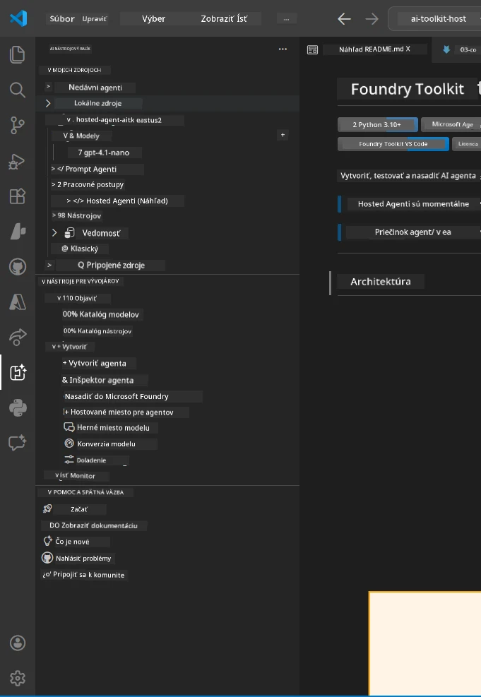
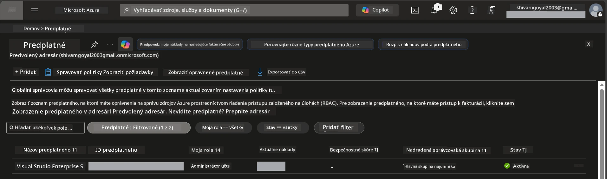
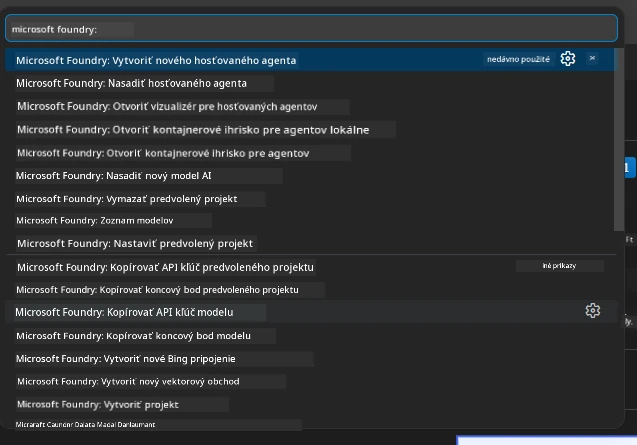
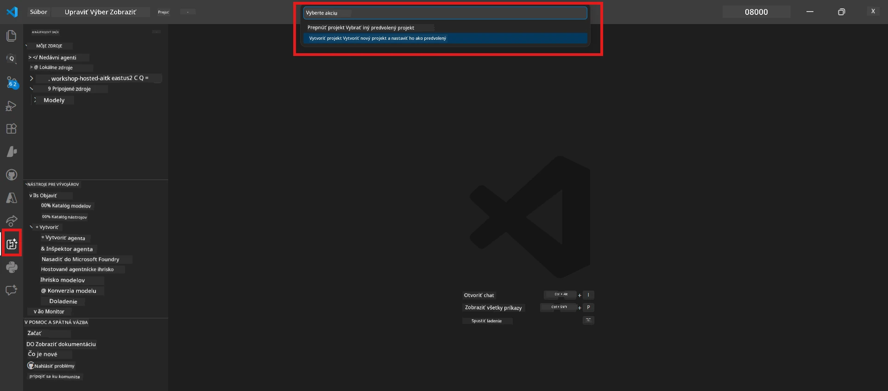
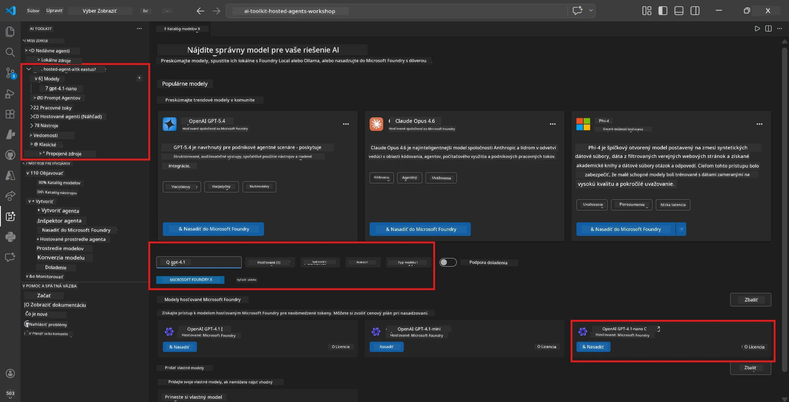
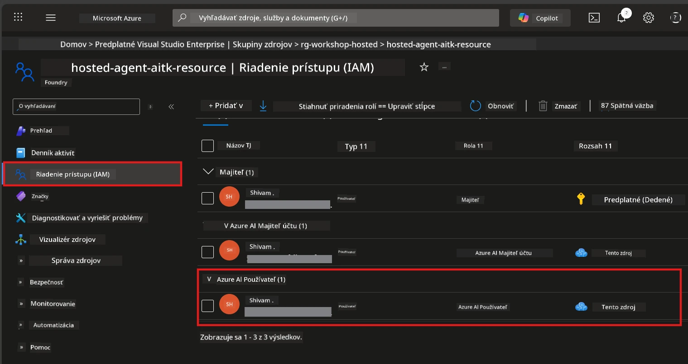

# Nastavenie: Rozšírenie, projekt a model

⏱️ ~15 min

V tomto module nainštalujete a overíte rozšírenie Foundry Toolkit, vytvoríte (alebo sa pripojíte k) Foundry projektu a nasadíte model, ktorý bude váš agent používať.

## Krok 1: Inštalácia Foundry Toolkit

**Foundry Toolkit pre VS Code** je primárne rozšírenie pre tento workshop. Poskytuje vytváranie projektov, nasadzovanie modelov, vytváranie agentov, lokálne testovanie (Agent Inspector) a nasadenie do cloudu – všetko zo VS Code.

1. Otvorte VS Code a stlačte `Ctrl+Shift+X` pre otvorenie panelu **Rozšírenia**.
2. Vyhľadajte **Foundry Toolkit**.
3. Nainštalujte **Foundry Toolkit pre VS Code** (vydavateľ: Microsoft, ID: `ms-windows-ai-studio.windows-ai-studio`).
4. Po inštalácii sa ikona **Foundry Toolkit** zobrazí v Aktívnom paneli (ľavý bočný panel).

> *Poznámka: V starších verziách rozšírenia môže Aktívny panel zobrazovať "AI TOOLKIT". Funkčnosť je však rovnaká.*



## Krok 2: Nastavenie podľa vášho prístupu

> **Vyberte si cestu:** Rozbaľte časť nižšie, ktorá zodpovedá vášmu nastaveniu. Stačí, ak dokončíte **jednu** cestu.

<details>
<summary><strong>🅰️ Cesta A - Azure cloud (vyžaduje predplatné Azure)</strong></summary>

### Azure CLI

1. Nainštalujte z [learn.microsoft.com/cli/azure/install-azure-cli](https://learn.microsoft.com/cli/azure/install-azure-cli).
2. Overte: `az --version` (očakáva sa 2.80.0+).
3. Prihláste sa: `az login`

### Možnosti overenia

[Microsoft Agent Framework](https://learn.microsoft.com/agent-framework/overview/) používa [`DefaultAzureCredential`](https://learn.microsoft.com/azure/developer/python/sdk/authentication/credential-chains#defaultazurecredential-overview), ktorý skúša viaceré metódy overenia v poradí. Vyberte tú, ktorá najlepšie vyhovuje vášmu prostrediu:

#### Možnosť 1: Účty vo VS Code (odporúčané pre workshopy)
1. Kliknite na ikonu **Účty** (silueta osoby) v ľavom dolnom rohu VS Code.
2. Vyberte **Prihlásiť sa na používanie Microsoft Foundry** (alebo **Prihlásiť sa cez Azure**).
3. Otvorí sa prehliadač – prihláste sa s Azure účtom, ktorý má prístup k vášmu predplatnému.
4. Vráťte sa späť do VS Code. Mali by ste vidieť meno svojho účtu v ľavom dolnom rohu.

#### Možnosť 2: Azure CLI
```bash
az login
az account set --subscription "<your-subscription-id>"
```

#### Možnosť 3: Service Principal (Enterprise/CI)
Pre uzavreté prostredia alebo CI/CD pipeline nastavte tieto environmentálne premenné vo vašom `.env` súbore:
```env
AZURE_TENANT_ID=<your-tenant-id>
AZURE_CLIENT_ID=<your-client-id>
AZURE_CLIENT_SECRET=<your-client-secret>
```

> **Ako funguje `DefaultAzureCredential`:** Najprv skúša environmentálne premenné, potom managed identity, potom prihlásenie z VS Code, potom Azure CLI – a použije prvú úspešnú metódu. Pozrite si [dokumentáciu o reťazci poverení](https://learn.microsoft.com/azure/developer/python/sdk/authentication/credential-chains#defaultazurecredential-overview).

### Azure Developer CLI (azd)

1. Nainštalujte: `winget install microsoft.azd` (Windows) alebo pozrite [inštalačnú dokumentáciu](https://learn.microsoft.com/azure/developer/azure-developer-cli/install-azd).
2. Overte: `azd version`
3. Prihláste sa: `azd auth login`

### Docker Desktop (voliteľné)

Docker je potrebný len, ak chcete budovať kontajnery lokálne. Rozšírenie Foundry automaticky spraví build pri nasadzovaní.

1. Nainštalujte z [docs.docker.com/get-docker](https://docs.docker.com/get-docker/).
2. Overte: `docker info`

### Predplatné Azure a RBAC

1. Prihláste sa na [portal.azure.com](https://portal.azure.com).
2. Prejdite na **Predplatné** a overte, že aspoň jedno je **Aktívne**.
3. Zapamätajte si svoj **ID predplatného** - budete ho potrebovať v Module 01.



#### Tabuľka scenárov RBAC

Nasadenie [hostovaného agenta](https://learn.microsoft.com/azure/foundry/agents/concepts/hosted-agents) vyžaduje povolenia pre **data action**, ktoré štandardné Azure role `Owner` a `Contributor` nezahŕňajú. Použite tabuľku nižšie na určenie, ktoré role potrebujete:

| Scenár | Požadované role | Kde ich priradiť |
|----------|---------------|----------------------|
| Vytvorenie nového Foundry projektu | **Azure AI Owner** na Foundry prostriedku | Foundry prostriedok v Azure portáli |
| Nasadenie do existujúceho projektu (nové prostriedky) | **Azure AI Owner** + **Contributor** na predplatné | Predplatné + Foundry prostriedok |
| Nasadenie do plne nakonfigurovaného projektu | **Reader** na účet + **Azure AI User** na projekt | Účet + Projekt v Azure portáli |
| Iba lokálne testovanie (bez nasadenia) | **Azure AI User** na projekt | Projekt v Azure portáli |

> **Dôležité:** Azure role `Owner` a `Contributor` pokrývajú iba *správu* (ARM operácie). Pre *data actions* ako `agents/write`, ktoré sú potrebné na vytvorenie a nasadenie agentov, potrebujete [**Azure AI User**](https://learn.microsoft.com/azure/foundry/concepts/rbac-foundry#built-in-roles) (alebo vyšší).

## Pripojte sa k Foundry projektu alebo ho vytvorte



1. Stlačte `Ctrl+Shift+P` → zadajte **Foundry Toolkit: Create Project** → vyberte tento príkaz.
2. Vyberte svoje **Azure predplatné** z rozbaľovacieho zoznamu.
3. Vyberte alebo vytvorte **resource group** (napr. `rg-hosted-agents-workshop`).
4. Vyberte **región** podporujúci hostovaných agentov: `East US`, `West US 2` alebo `Sweden Central`. Viď [dostupnosť regiónov](https://learn.microsoft.com/azure/foundry/agents/concepts/hosted-agents#region-availability).
5. Zadajte meno projektu (napr. `workshop-agents`).
6. Počkajte 2–5 minút na provisionovanie. V VS Code sa zobrazí notifikácia o priebehu.
7. Po dokončení sa váš projekt zobrazí v bočnom paneli **Foundry Toolkit** pod **MY RESOURCES**.



## Nasadenie modelu a priradenie RBAC

Váš hostovaný agent potrebuje AI model na generovanie odpovedí.

#### Matica výberu modelu
Podľa vašich potrieb si môžete vybrať z rôznych úrovní modelov:

| Model | Najvhodnejšie pre | Cena | Poznámky |
|-------|-----------------|-------|----------|
| `gpt-4.1` | Kvalitné, nuansované odpovede | Vyššia | Najlepšie výsledky, odporúčané na finálne testovanie |
| `gpt-4.1-mini/gpt-5-mini` | Rýchla iterácia, nižšie náklady | Nižšia | Vhodné pre vývoj na workshope a rýchle testovanie |
| `gpt-4.1-nano` | Jednoduché úlohy | Najnižšia | Najlacnejšie, ale jednoduchšie odpovede |

1. Stlačte `Ctrl+Shift+P` → **Foundry Toolkit: Open Model Catalog** (alebo kliknite na **Model Catalog** v bočnom paneli pod DEVELOPER TOOLS → Discover).
2. Vyhľadajte v katalógu **gpt-4.1**.
3. Nájdite **OpenAI GPT-4.1-mini** (alebo `gpt-5-mini` pre lepšiu kvalitu) a kliknite na **Deploy**.



4. V konfigurácii nasadenia:
   - **Názov nasadenia:** ponechajte predvolený alebo zadajte vlastný názov. **Zapamätajte si tento názov.**
   - **Cieľ:** vyberte **Deploy to Foundry Toolkit** → vyberte svoj projekt.
5. Kliknite na **Deploy** a počkajte 1–3 minúty.

> **Odporúčanie:** Na workshop použite `gpt-4.1-mini/gpt-5-mini` – rýchle, cenovo výhodné a produkuje dobré výsledky.

### Zapíšte si svoje hodnoty

Po nasadení si zapamätajte tieto dve hodnoty (budete ich potrebovať v Module 03):

| Hodnota | Kde ju nájsť |
|-------|-------------|
| **Project endpoint** | Kliknite na projekt v bočnom paneli → detailné zobrazenie ukazuje URL (napr. `https://<account>.services.ai.azure.com/api/projects/<project>`) |
| **Názov nasadeného modelu** | Rozbaľte projekt → **Models** → názov vedľa vášho nasadeného modelu (napr. `gpt-4.1-mini/gpt-5-mini`) |

### Priraďte RBAC rolu

> ⚠️ **Toto je krok, ktorý sa najčastejšie vynecháva.** Bez správnej roly nasadenie v Module 05 zlyhá.

#### Ktorú rolu potrebujem?
Podľa vášho scenára potrebujete tieto kombinácie rolí:

| Scenár | Požadované role | Kde ich priradiť |
|----------|---------------|----------------------|
| Vytvorenie nového Foundry projektu | **Azure AI Owner** na Foundry prostriedku | Foundry prostriedok v Azure portáli |
| Nasadenie do existujúceho projektu (nové prostriedky) | **Azure AI Owner** + **Contributor** na predplatné | Predplatné + Foundry prostriedok |
| Nasadenie do plne nakonfigurovaného projektu | **Reader** na účet + **Azure AI User** na projekt | Účet + Projekt v Azure portáli |

**Dôležité:** Azure role `Owner` a `Contributor` pokrývajú len *správu*. Pre *data actions* ako `agents/write` potrebujete **Azure AI User** (alebo vyšší).

1. Otvorte [portal.azure.com](https://portal.azure.com).
2. Vyhľadajte názov svojho **Foundry projektu** → kliknite na výsledok typu **"Foundry Toolkit project"** (NIE na nadradený účet).
3. Kliknite na **Správa prístupov (IAM)** v ľavom navigačnom paneli.
4. Kliknite na **+ Pridať** → **Pridať priradenie roly**.
5. **Karta Rola:** Vyhľadajte **Azure AI User**, vyberte ho a kliknite na **Ďalej**.
6. **Karta Členovia:** Vyberte **Používateľ, skupina alebo servisný principal** → kliknite na **+ Vybrať členov** → nájdite a vyberte seba → kliknite na **Vybrať**.
7. Kliknite na **Skontrolovať a priradiť** → opäť na **Skontrolovať a priradiť**.
8. **Počkajte 1–2 minúty** na aplikáciu zmien.

> **Prečo táto rola?** Azure `Owner`/`Contributor` poskytujú len správcovské oprávnenia. Rola **Azure AI User** povoľuje `agents/write` data action potrebný na vytvorenie a nasadenie agentov. Viď [Foundry RBAC dokumentáciu](https://learn.microsoft.com/azure/foundry/concepts/rbac-foundry#built-in-roles).



</details>

<details>
<summary><strong>🅱️ Cesta B - Lokálne / voľná vrstva (nie je potrebné predplatné Azure)</strong></summary>

### Foundry Local

Foundry Local vám umožňuje spúšťať AI modely na vašom počítači bez potreby cloudového účtu. K Foundry Local modelom sa môžete dostať cez Foundry Toolkit pomocou katalógu modelov nasledovne:

1. Prejdite do rozšírenia Foundry Toolkit.
2. V navigácii Foundry Toolkit choďte do **Developer Tools** > a vyberte **Model Catalog**
3. V novom okne vyberte v navigačnom paneli možnosť **local**.
4. Posuňte sa nadol na **Phi 4 Mini** a kliknite na tlačidlo **pridať**, zobrazí sa vyskakovacie okno s informáciou o sťahovaní modelu.
5. Po stiahnutí modelu môžete pokračovať na ďalší krok.

</details>

### ✅ Kontrolný bod


- [ ] `Ctrl+Shift+P` → "Foundry Toolkit" zobrazuje dostupné príkazy
- [ ] Rozšírenie Foundry Toolkit nainštalované a bočný panel sa načítava bez chýb
- [ ] VS Code sa otvorí a funguje správne
- [ ] `python --version` ukazuje 3.10+
- [ ] Ikona Foundry Toolkit viditeľná v Aktívnom paneli VS Code
- [ ] **Cesta A:** `az login` úspešné, predplatné je Aktívne
- [ ] **Cesta B:** Foundry Local je spustený (`foundry local status`)
- [ ] **Cesta A:** Foundry projekt viditeľný v bočnom paneli, model nasadený, rola Azure AI User priradená
- [ ] **Cesta B:** Foundry Local beží s modelom
- [ ] Zapísali ste si svoj **endpoint** a **názov nasadeného modelu**


**Predchádzajúce:** [00 - Predpoklady](00-prerequisites.md) · **Ďalšie:** [02 - Vytvoriť hostovaného agenta →](02-create-hosted-agent.md)

---

<!-- CO-OP TRANSLATOR DISCLAIMER START -->
**Vyhlásenie o zodpovednosti**:
Tento dokument bol preložený pomocou AI prekladateľskej služby [Co-op Translator](https://github.com/Azure/co-op-translator). Hoci sa snažíme o presnosť, vezmite prosím na vedomie, že automatické preklady môžu obsahovať chyby alebo nepresnosti. Pôvodný dokument v jeho natívnom jazyku by mal byť považovaný za autoritatívny zdroj. Pre kritické informácie sa odporúča profesionálny ľudský preklad. Nie sme zodpovední za žiadne nedorozumenia alebo nesprávne interpretácie vyplývajúce z použitia tohto prekladu.
<!-- CO-OP TRANSLATOR DISCLAIMER END -->