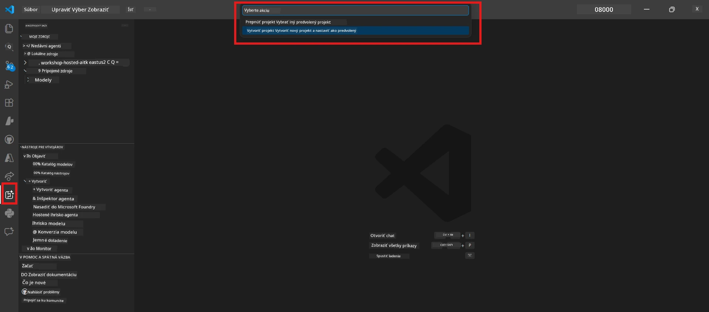
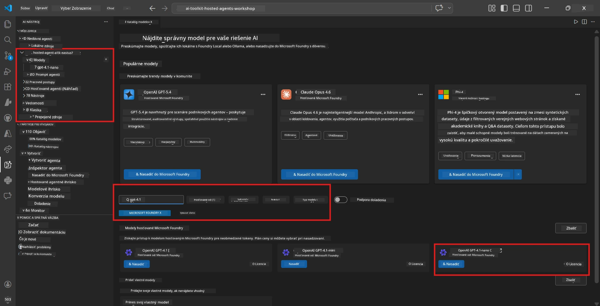
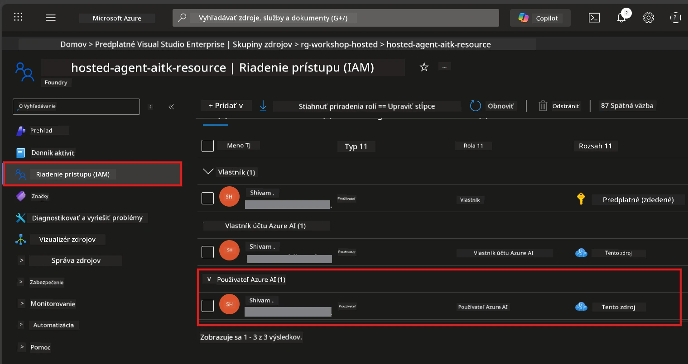

# Modul 2 - Vytvorte projekt Foundry a nasadte model

V tomto module vytvoríte (alebo vyberiete) Microsoft Foundry projekt a nasadíte model, ktorý váš agent použije. Každý krok je podrobne vypísaný – postupujte podľa nich v poradí.

> Ak už máte projekt Foundry s nasadeným modelom, preskočte na [Modul 3](03-create-hosted-agent.md).

---

## Krok 1: Vytvorenie projektu Foundry z VS Code

Použijete rozšírenie Microsoft Foundry na vytvorenie projektu bez opustenia VS Code.

1. Stlačte `Ctrl+Shift+P` pre otvorenie **Command Palette**.
2. Napíšte: **Microsoft Foundry: Create Project** a vyberte ju.
3. Zobrazí sa rozbaľovací zoznam – vyberte svoju **Azure subscription** zo zoznamu.
4. Budete vyzvaní na výber alebo vytvorenie **resource group**:
   - Pre vytvorenie novej: zadajte názov (napr. `rg-hosted-agents-workshop`) a stlačte Enter.
   - Pre použitie existujúcej: vyberte ju z rozbaľovacieho zoznamu.
5. Vyberte **región**. **Dôležité:** Vyberte región, ktorý podporuje hosted agenty. Skontrolujte [dostupnosť regiónov](https://learn.microsoft.com/azure/foundry/agents/concepts/hosted-agents#region-availability) – bežné voľby sú `East US`, `West US 2` alebo `Sweden Central`.
6. Zadajte **názov** projektu Foundry (napríklad `workshop-agents`).
7. Stlačte Enter a počkajte na dokončenie poskytovania.

> **Poskytovanie trvá 2-5 minút.** V pravom dolnom rohu VS Code uvidíte notifikáciu o priebehu. Počas poskytovania nezatvárajte VS Code.

8. Po dokončení sa v bočnom paneli **Microsoft Foundry** zobrazí váš nový projekt pod **Resources**.
9. Kliknite na názov projektu pre jeho rozbalenie a overte, či zobrazuje sekcie ako **Models + endpoints** a **Agents**.



### Alternatíva: Vytvorenie cez Foundry portál

Ak uprednostňujete použitie prehliadača:

1. Otvorte [https://ai.azure.com](https://ai.azure.com) a prihláste sa.
2. Na domovskej stránke kliknite na **Create project**.
3. Zadajte názov projektu, vyberte svoju subscription, resource group a región.
4. Kliknite na **Create** a počkajte na dokončenie poskytovania.
5. Po vytvorení sa vráťte do VS Code – projekt by sa mal po obnovení (kliknutím na ikonku obnoviť) zobraziť v bočnom paneli Foundry.

---

## Krok 2: Nasadenie modelu

Váš [hosted agent](https://learn.microsoft.com/azure/foundry/agents/concepts/hosted-agents) potrebuje Azure OpenAI model na generovanie odpovedí. Teraz [nasadíte jeden](https://learn.microsoft.com/azure/ai-foundry/openai/how-to/create-resource#deploy-a-model).

1. Stlačte `Ctrl+Shift+P` pre otvorenie **Command Palette**.
2. Napíšte: **Microsoft Foundry: Open [Model Catalog](https://learn.microsoft.com/azure/ai-foundry/openai/concepts/models)** a vyberte ju.
3. Zobrazí sa pohľad Model Catalog vo VS Code. Prezrite si alebo použite vyhľadávací panel na nájdenie **gpt-4.1**.
4. Kliknite na kartu modelu **gpt-4.1** (alebo `gpt-4.1-mini`, ak preferujete nižšie náklady).
5. Kliknite na **Deploy**.


6. V konfigurácii nasadenia:
   - **Deployment name**: Nechajte predvolený názov (napr. `gpt-4.1`) alebo zadajte vlastný. **Zapamätajte si tento názov** – budete ho potrebovať v Module 4.
   - **Target**: Vyberte **Deploy to Microsoft Foundry** a zvoľte projekt, ktorý ste práve vytvorili.
7. Kliknite na **Deploy** a počkajte na dokončenie nasadenia (1-3 minúty).

### Výber modelu

| Model | Najvhodnejší pre | Cena | Poznámky |
|-------|------------------|-------|----------|
| `gpt-4.1` | Vysokokvalitné, jemné odpovede | Vyššia | Najlepšie výsledky, odporúčané pre finálne testovanie |
| `gpt-4.1-mini` | Rýchle iterácie, nižšie náklady | Nižšia | Vhodné pre vývoj a rýchle testovanie workshopu |
| `gpt-4.1-nano` | Ľahké úlohy | Najnižšia | Najlacnejšie, ale s jednoduchšími odpoveďami |

> **Odporúčanie pre tento workshop:** Používajte `gpt-4.1-mini` pre vývoj a testovanie. Je rýchly, lacný a poskytuje dobré výsledky pre cvičenia.

### Overenie nasadenia modelu

1. V bočnom paneli **Microsoft Foundry** rozbaľte svoj projekt.
2. Pozrite pod **Models + endpoints** (alebo podobnú sekciu).
3. Mali by ste vidieť nasadený model (napr. `gpt-4.1-mini`) so stavom **Succeeded** alebo **Active**.
4. Kliknite na nasadenie modelu pre zobrazenie jeho detailov.
5. **Poznačte si** tieto dve hodnoty – budete ich potrebovať v Module 4:

   | Nastavenie | Kde ho nájsť | Príklad hodnoty |
   |------------|--------------|-----------------|
   | **Project endpoint** | Kliknite na názov projektu v bočnom paneli Foundry. URL endpointu je zobrazená v detaile. | `https://<account>.services.ai.azure.com/api/projects/<project>` |
   | **Model deployment name** | Názov pri nasadenom modeli. | `gpt-4.1-mini` |

---

## Krok 3: Priradenie potrebných RBAC rolí

Toto je **najčastejšie vynechaný krok**. Bez správnych rolí nasadenie v Module 6 zlyhá s chybou povolenia.

### 3.1 Priradenie role Azure AI User sebe

1. Otvorte prehliadač a choďte na [https://portal.azure.com](https://portal.azure.com).
2. V hornej vyhľadávacej lište zadajte názov svojho **Foundry projektu** a kliknite naň vo výsledkoch.
   - **Dôležité:** Navigujte k zdroju **projektu** (typ: "Microsoft Foundry project"), nie k nadradenému účtu/hubu.
3. V ľavej navigácii projektu kliknite na **Access control (IAM)**.
4. Kliknite na tlačidlo **+ Add** v hornej časti → vyberte **Add role assignment**.
5. Na karte **Role** vyhľadajte [**Azure AI User**](https://learn.microsoft.com/azure/foundry/concepts/rbac-foundry#built-in-roles) a vyberte ju. Kliknite na **Next**.
6. Na karte **Members**:
   - Vyberte **User, group, or service principal**.
   - Kliknite na **+ Select members**.
   - Vyhľadajte svoje meno alebo e-mail, vyberte sa a kliknite na **Select**.
7. Kliknite na **Review + assign** → potom znova na **Review + assign** pre potvrdenie.



### 3.2 (Voliteľné) Priradenie role Azure AI Developer

Ak potrebujete vytvárať ďalšie zdroje v projekte alebo spravovať nasadenia programovo:

1. Opakujte vyššie uvedené kroky, ale v kroku 5 vyberte **Azure AI Developer** namiesto toho.
2. Túto rolu priraďte na úrovni **Foundry resource (účtu)**, nie iba na úrovni projektu.

### 3.3 Overenie priradených rolí

1. Na stránke **Access control (IAM)** projektu kliknite na kartu **Role assignments**.
2. Vyhľadajte svoje meno.
3. Mali by ste vidieť aspoň rolu **Azure AI User** pre rozsah projektu.

> **Prečo je to dôležité:** Rola [`Azure AI User`](https://learn.microsoft.com/azure/foundry/concepts/rbac-foundry#built-in-roles) udeľuje akciu dát `Microsoft.CognitiveServices/accounts/AIServices/agents/write`. Bez nej sa pri nasadzovaní zobrazí táto chyba:
>
> ```
> Error: lacks the required data action 
> Microsoft.CognitiveServices/accounts/AIServices/agents/write 
> to perform POST /api/projects/{projectName}/assistants operation.
> ```
>
> Viac informácií nájdete v [Module 8 - Riešenie problémov](08-troubleshooting.md).

---

### Kontrolný zoznam

- [ ] Projekt Foundry existuje a je viditeľný v bočnom paneli Microsoft Foundry vo VS Code
- [ ] Je nasadený aspoň jeden model (napr. `gpt-4.1-mini`) so stavom **Succeeded**
- [ ] Poznačili ste si URL **project endpoint** a názov **model deployment**
- [ ] Máte priradenú rolu **Azure AI User** na úrovni **projektu** (overte v Azure Portal → IAM → Role assignments)
- [ ] Projekt je v [podporovanom regióne](https://learn.microsoft.com/azure/foundry/agents/concepts/hosted-agents#region-availability) pre hosted agentov

---

**Predchádzajúci:** [01 - Inštalácia Foundry Toolkit](01-install-foundry-toolkit.md) · **Ďalší:** [03 - Vytvorenie hosted agenta →](03-create-hosted-agent.md)

---

<!-- CO-OP TRANSLATOR DISCLAIMER START -->
**Zrieknutie sa zodpovednosti**:  
Tento dokument bol preložený pomocou AI prekladateľskej služby [Co-op Translator](https://github.com/Azure/co-op-translator). Hoci sa snažíme o presnosť, uvedomte si, že automatizované preklady môžu obsahovať chyby alebo nepresnosti. Pôvodný dokument v jeho rodnom jazyku by mal byť považovaný za autoritatívny zdroj. Pre kritické informácie sa odporúča profesionálny ľudský preklad. Nie sme zodpovední za akékoľvek nedorozumenia alebo nesprávne interpretácie vyplývajúce z použitia tohto prekladu.
<!-- CO-OP TRANSLATOR DISCLAIMER END -->