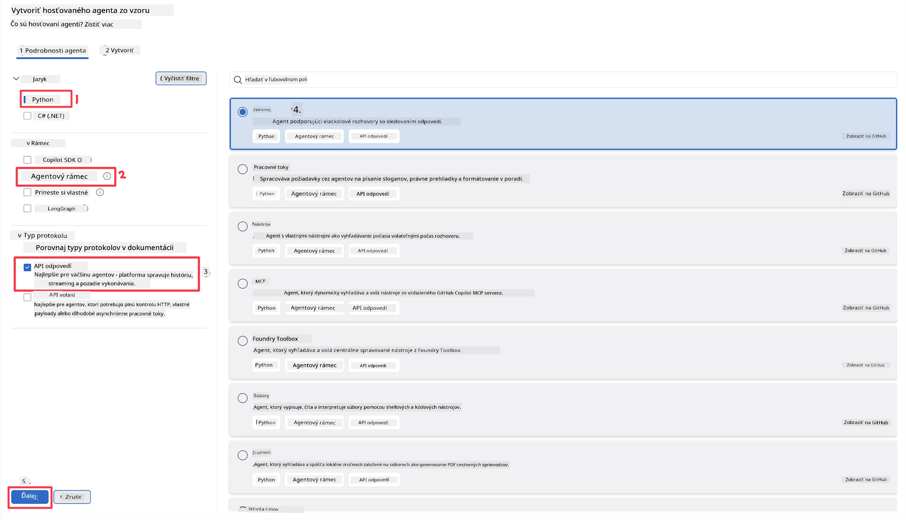
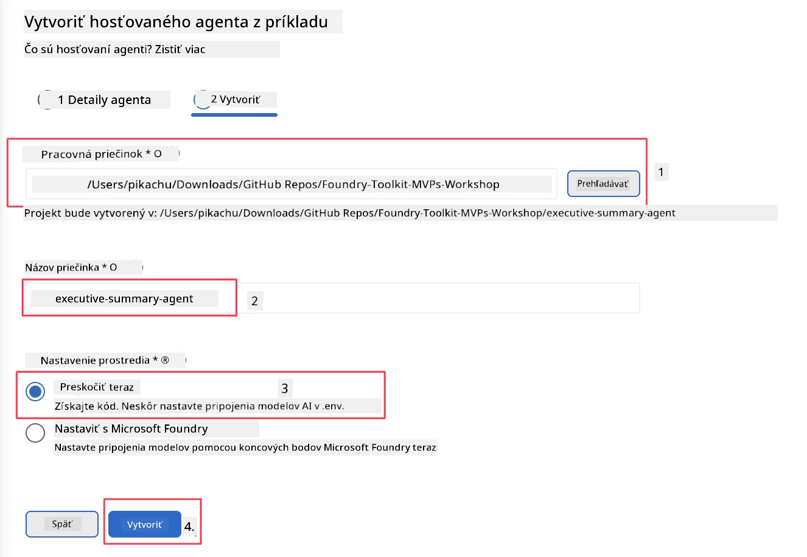

# Modul 2 - Vytvorenie nového hostovaného agenta

⏱️ ~5 min

V tomto module použijete Foundry Toolkit na **vytvorenie projektu hostovaného agenta**. Scaffold vygeneruje celú štruktúru projektu - `agent.yaml`, `main.py`, `Dockerfile`, `requirements.txt` a konfiguráciu ladia v VS Code - takže sa môžete sústrediť na prispôsobenie správania agenta.

> **Kľúčový koncept:** Priečinok `agent/` v tomto cvičení je príkladom toho, čo Foundry Toolkit generuje. Tieto súbory sami od začiatku nepíšete.

### Priebeh sprievodcu scaffoldu

```mermaid
flowchart LR
    A["Command Palette:
    Create new Hosted Agent"] --> B["Language:
    Python"]
    B --> C["API type:
    Response API"]
    C --> D["Template:
    Basic - Agent Framework"]
    D --> E["Vyberte model"]
    E --> F["Workspace folder
    & agent name"]
    F --> G["Vygenerovaný projekt"]

    style A fill:#4A90D9,color:#fff
    style B fill:#7B68EE,color:#fff
    style C fill:#7B68EE,color:#fff
    style D fill:#7B68EE,color:#fff
    style E fill:#7B68EE,color:#fff
    style F fill:#7B68EE,color:#fff
    style G fill:#27AE60,color:#fff
```



---

## Krok 1: Otvorte sprievodcu Create Hosted Agent

1. Stlačte `Ctrl+Shift+P` na otvorenie **Príkazovej palety**.
2. Napíšte: **Foundry Toolkit: Create new Hosted Agent** a vyberte ho.

> **Alternatíva: Vytvorenie cez Foundry Portal**
> Ak uprednostňujete prehliadač, môžete svoj projekt vytvoriť na [https://ai.azure.com](https://ai.azure.com). Po vytvorení projektu sa vráťte do VS Code a použite bočný panel **Foundry Toolkit** na jeho pripojenie.

> **Alternatíva:** Kliknite na ikonu **+** vedľa **Hosted Agents (Preview)** v bočnom paneli Foundry Toolkit.

## Krok 2: Vyberte nastavenia



1. V ľavej časti navigácie/možností vyberte nasledujúce:

| Menu | Výber | Poznámky |
|--------|-----------|-------|
| **Jazyk** | Python | Podporuje sa tiež C# |
| **Framework** | Agent Framework | Jednoduchý východiskový bod používajúci Agent Framework SDK |
| **Typ API** | Response API | `POST /responses` - konverzačné, so správou histórie platformou |
| **Šablóna** | Basic | Jednoduchý východiskový bod používajúci Agent Framework SDK |

2. Po výbere kliknite na **Next**



3. V ďalšom okne vyberte nasledujúce:

| Menu | Výber | Poznámky |
|--------|-----------|-------|
| **Pracovný priečinok** | Vyberte cieľový priečinok | napr. `/workspace/Foundry_Toolkit_for_VSCode_Lab/` alebo podpriečinok v tomto repozitári |
| **Názov agenta** | Zadajte názov | napr.: `executive-summary-agent` |
| **Nastavenie prostredia** | teraz vynechajte |  |

Kliknite na **create** pre vytvorenie agenta. Bude vytvorený nový priečinok s názvom hostovaného agenta.

## Krok 3: Skontrolujte vygenerovaný projekt

Po dokončení scaffoldu skontrolujte, či v Prieskumníkovi (`Ctrl+Shift+E`) vidíte tieto súbory:

```
📂 my-agent/
├── .env                ← Environment variables (placeholders)
├── .vscode/
│   ├── launch.json     ← Debug config (F5 → run + Agent Inspector)
│   └── tasks.json      ← VS Code task definitions
├── agent.yaml          ← Agent definition (kind: hosted)
├── Dockerfile          ← Container config for deployment
├── main.py             ← Agent entry point (your main code)
└── requirements.txt    ← Python dependencies
```

### Popis hlavných súborov

| Súbor | Účel |
|------|---------|
| `agent.yaml` | Deklaruje agenta ako `kind: hosted`, mapuje premenné prostredia, definuje protokol `/responses` |
| `main.py` | Vytvára `FoundryChatClient` → obalí ho do `Agent` s inštrukciami → poskytuje cez `ResponsesHostServer` na porte 8088 |
| `Dockerfile` | Používa `python:3.12-slim`, inštaluje závislosti, vystavuje port 8088, spúšťa `main.py` |
| `requirements.txt` | `agent-framework-foundry`, `agent-framework-foundry-hosting`, `mcp`, `debugpy` |

> **Dôležité:** Otvorte priamo priečinok scaffoldovaného agenta vo VS Code (priečinok `agent/`), aby `.vscode/launch.json` a `tasks.json` správne fungovali pre ladanie cez F5.

---

### ✅ Kontrolný bod

- [ ] Vytvorený scaffoldovaný projekt so všetkými očakávanými súbormi
- [ ] V `agent.yaml` je `kind: hosted` a `protocol: responses`
- [ ] V `main.py` sa importujú `Agent`, `FoundryChatClient`, `ResponsesHostServer`
- [ ] Priečinok agenta je otvorený vo VS Code ako koreň pracovného priestoru

---

**Predchádzajúci:** [01 - Nastavenie](01-setup.md) · **Ďalší:** [03 - Konfigurácia & kódovanie →](03-configure-and-code.md)

---

<!-- CO-OP TRANSLATOR DISCLAIMER START -->
**Vyhlásenie o zodpovednosti**:
Tento dokument bol preložený pomocou AI prekladateľskej služby [Co-op Translator](https://github.com/Azure/co-op-translator). Hoci sa snažíme o presnosť, vezmite prosím na vedomie, že automatické preklady môžu obsahovať chyby alebo nepresnosti. Pôvodný dokument v jeho natívnom jazyku by mal byť považovaný za autoritatívny zdroj. Pre kritické informácie sa odporúča profesionálny ľudský preklad. Nie sme zodpovední za žiadne nedorozumenia alebo nesprávne interpretácie vyplývajúce z použitia tohto prekladu.
<!-- CO-OP TRANSLATOR DISCLAIMER END -->