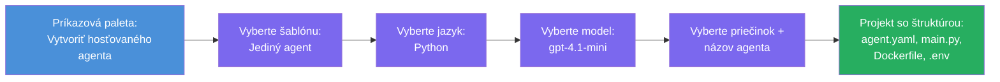

# Modul 3 - Vytvorenie nového hosťovaného agenta (automaticky vytvorené rozšírením Foundry)

V tomto module použijete rozšírenie Microsoft Foundry na **vytvorenie nového projektu [hosťovaného agenta](https://learn.microsoft.com/azure/foundry/agents/concepts/hosted-agents)**. Rozšírenie vám vygeneruje celú štruktúru projektu vrátane súborov `agent.yaml`, `main.py`, `Dockerfile`, `requirements.txt`, `.env` a konfigurácie ladenia pre VS Code. Po vytvorení automatickej štruktúry súborov ich prispôsobíte podľa inštrukcií, nástrojov a konfigurácie vášho agenta.

> **Kľúčový koncept:** Priečinok `agent/` v tomto module je príkladom toho, čo rozšírenie Foundry vygeneruje, keď spustíte tento príkaz na vytvorenie štruktúry. Tieto súbory nevytvárate ručne - rozšírenie ich vytvorí a potom ich upravíte.

### Priebeh sprievodcu vytvorením


---

## Krok 1: Otvorte sprievodcu Vytvorenie hosťovaného agenta

1. Stlačte `Ctrl+Shift+P` pre otvorenie **príkazovej palety**.
2. Napíšte: **Microsoft Foundry: Create a New Hosted Agent** a vyberte túto možnosť.
3. Otvorí sa sprievodca vytvorením hosťovaného agenta.

> **Alternatívna cesta:** Tento sprievodca môžete spustiť aj z bočného panela Microsoft Foundry → kliknutím na ikonu **+** vedľa **Agents** alebo pravým klikom a výberom **Create New Hosted Agent**.

---

## Krok 2: Vyberte šablónu

Sprievodca vás vyzve na výber šablóny. Uvidíte možnosti ako:

| Šablóna | Popis | Kedy použiť |
|----------|-------------|-------------|
| **Jednotlivý agent** | Jeden agent s vlastným modelom, inštrukciami a voliteľnými nástrojmi | Tento workshop (Lab 01) |
| **Viacagentový pracovný postup** | Viac agentov, ktoré spolupracujú po sebe | Lab 02 |

1. Vyberte **Jednotlivý agent**.
2. Kliknite na **Next** (alebo výber pokračuje automaticky).

---

## Krok 3: Vyberte programovací jazyk

1. Vyberte **Python** (odporúčané pre tento workshop).
2. Kliknite na **Next**.

> **Podporovaný je aj C#**, ak preferujete .NET. Štruktúra šablóny je podobná (používa `Program.cs` namiesto `main.py`).

---

## Krok 4: Vyberte model

1. Sprievodca zobrazí modely nasadené vo vašom projekte Foundry (z Modulu 2).
2. Vyberte model, ktorý ste nasadili - napr. **gpt-4.1-mini**.
3. Kliknite na **Next**.

> Ak nevidíte žiadne modely, vráťte sa do [Modulu 2](02-create-foundry-project.md) a najskôr nasadte model.

---

## Krok 5: Vyberte umiestnenie priečinka a názov agenta

1. Otvorí sa dialog pre výber súboru - vyberte **cieľový priečinok**, kde bude projekt vytvorený. Pre tento workshop:
   - Ak začínate novú prácu: vyberte ľubovoľný priečinok (napr. `C:\Projects\my-agent`)
   - Ak pracujete v rámci workshopového repozitára: vytvorte nový podpriečinok v `workshop/lab01-single-agent/agent/`
2. Zadajte **názov** hosťovaného agenta (napr. `executive-summary-agent` alebo `my-first-agent`).
3. Kliknite na **Create** (alebo stlačte Enter).

---

## Krok 6: Počkajte na dokončenie vytvorenia štruktúry

1. VS Code otvorí **nové okno** so štruktúrou vytvoreného projektu.
2. Počkajte niekoľko sekúnd, kým sa projekt plne načíta.
3. V paneli Prieskumníka (`Ctrl+Shift+E`) by ste mali vidieť nasledujúce súbory:

```
📂 my-first-agent/
├── .env                ← Environment variables (auto-generated with placeholders)
├── .vscode/
│   └── launch.json     ← Debug configuration (F5 to run + Agent Inspector)
├── agent.yaml          ← Agent definition (kind: hosted)
├── Dockerfile          ← Container configuration for deployment
├── main.py             ← Agent entry point (your main code file)
└── requirements.txt    ← Python dependencies
```

> **Toto je rovnaká štruktúra ako priečinok `agent/`** v tomto module. Rozšírenie Foundry tieto súbory vytvára automaticky - nemusíte ich vytvárať ručne.

> **Poznámka z workshopu:** V tomto repozitári workshopu je priečinok `.vscode/` v **koreňovom adresári pracovného priestoru** (nie vo vnútri každého projektu). Obsahuje zdieľaný `launch.json` a `tasks.json` s dvoma konfiguráciami ladenia - **"Lab01 - Single Agent"** a **"Lab02 - Multi-Agent"** - každá ukazuje na správny pracovný priečinok konkrétneho laboratória. Pri stlačení F5 vyberte konfiguráciu podľa aktuálneho laboratória z rozbaľovacieho zoznamu.

---

## Krok 7: Pochopte každý vygenerovaný súbor

Venujte chvíľu preskúmaniu každého súboru, ktorý sprievodca vytvoril. Ich pochopenie je dôležité pre Modul 4 (prispôsobenie).

### 7.1 `agent.yaml` - Definícia agenta

Otvorte `agent.yaml`. Vyzerá takto:

```yaml
# yaml-language-server: $schema=https://raw.githubusercontent.com/microsoft/AgentSchema/refs/heads/main/schemas/v1.0/ContainerAgent.yaml

kind: hosted
name: my-first-agent
description: >
  A hosted agent deployed to Microsoft Foundry Agent Service.
metadata:
  authors:
    - Microsoft
  tags:
    - Azure AI AgentServer
    - Microsoft Agent Framework
    - Hosted Agent
protocols:
  - protocol: responses
    version: v1
environment_variables:
  - name: AZURE_AI_PROJECT_ENDPOINT
    value: ${PROJECT_ENDPOINT}
  - name: AZURE_AI_MODEL_DEPLOYMENT_NAME
    value: ${MODEL_DEPLOYMENT_NAME}
dockerfile_path: Dockerfile
resources:
  cpu: '0.25'
  memory: 0.5Gi
```

**Kľúčové polia:**

| Pole | Účel |
|-------|---------|
| `kind: hosted` | Označuje hosťovaného agenta (beží v kontajneri, nasadený do [Foundry Agent Service](https://learn.microsoft.com/azure/foundry/agents/overview)) |
| `protocols: responses v1` | Agent vystavuje OpenAI-kompatibilný HTTP endpoint `/responses` |
| `environment_variables` | Mapuje hodnoty z `.env` na premenné prostredia v kontajneri počas nasadenia |
| `dockerfile_path` | Ukazuje na Dockerfile použité na zostavenie obrázka kontajnera |
| `resources` | Pridelenie CPU a pamäte pre kontajner (0,25 CPU, 0,5Gi pamäte) |

### 7.2 `main.py` - Vstupný bod agenta

Otvorte `main.py`. Toto je hlavný Python súbor, kde žije logika agenta. Štruktúra obsahuje:

```python
from agent_framework.azure import AzureAIAgentClient
from azure.ai.agentserver.agentframework import from_agent_framework
from azure.identity.aio import DefaultAzureCredential
```

**Kľúčové importy:**

| Import | Účel |
|--------|--------|
| `AzureAIAgentClient` | Pripojenie k vášmu Foundry projektu a vytváranie agentov cez `.as_agent()` |
| [`DefaultAzureCredential`](https://learn.microsoft.com/azure/developer/python/sdk/authentication/credential-chains#defaultazurecredential-overview) | Spravuje autentifikáciu (Azure CLI, VS Code prihlásenie, spravovaná identita alebo servisný princíp) |
| `from_agent_framework` | Zabalí agenta ako HTTP server vystavujúci endpoint `/responses` |

Hlavný tok je:
1. Vytvoriť poverenie → vytvoriť klienta → zavolať `.as_agent()` pre získanie agenta (asynchrónny kontextový manažér) → zabaliť ako server → spustiť

### 7.3 `Dockerfile` - Obrázok kontajnera

```dockerfile
FROM python:3.14-slim

WORKDIR /app

COPY ./ .

RUN pip install --upgrade pip && \
    if [ -f requirements.txt ]; then \
        pip install -r requirements.txt; \
    else \
        echo "No requirements.txt found" >&2; exit 1; \
    fi

EXPOSE 8088

CMD ["python", "main.py"]
```

**Kľúčové detaily:**
- Používa základný obrázok `python:3.14-slim`.
- Kopíruje všetky súbory projektu do `/app`.
- Aktualizuje `pip`, inštaluje závislosti zo `requirements.txt` a v prípade ich chýbania zlyhá.
- **Otvorí port 8088** - je to požadovaný port pre hosťovaných agentov. Neměňte ho.
- Štartuje agenta príkazom `python main.py`.

### 7.4 `requirements.txt` - Závislosti

```
agent-framework-azure-ai==1.0.0rc3
agent-framework-core==1.0.0rc3
azure-ai-agentserver-agentframework==1.0.0b16
azure-ai-agentserver-core==1.0.0b16
debugpy
agent-dev-cli
```

| Balík | Účel |
|---------|---------|
| `agent-framework-azure-ai` | Integrácia Azure AI pre Microsoft Agent Framework |
| `agent-framework-core` | Jadro runtime pre tvorbu agentov (obsahuje `python-dotenv`) |
| `azure-ai-agentserver-agentframework` | Runtime server hosťovaného agenta pre Foundry Agent Service |
| `azure-ai-agentserver-core` | Abstrakcie základného servera agenta |
| `debugpy` | Podpora Python ladania (umožňuje ladanie cez F5 vo VS Code) |
| `agent-dev-cli` | Lokálny vývojársky CLI pre testovanie agentov (používa konfigurácia ladenia/spustenia) |

---

## Pochopenie protokolu agenta

Hosťovaní agenti komunikujú prostredníctvom protokolu **OpenAI Responses API**. Po spustení (lokálne alebo v cloude) agent vystavuje jediné HTTP rozhranie:

```
POST http://localhost:8088/responses
Content-Type: application/json

{
  "input": "Your prompt here",
  "stream": false
}
```

Služba Foundry Agent Service volá tento endpoint na odosielanie výziev používateľa a prijímanie odpovedí agenta. Ide o ten istý protokol, ktorý používa OpenAI API, takže váš agent je kompatibilný s akýmkoľvek klientom, ktorý rozumie formátu OpenAI Responses.

---

### Kontrolný zoznam

- [ ] Sprievodca vytvorením štruktúry úspešne dokončil a otvorilo sa **nové okno VS Code**
- [ ] Vidíte všetkých 5 súborov: `agent.yaml`, `main.py`, `Dockerfile`, `requirements.txt`, `.env`
- [ ] Súbor `.vscode/launch.json` existuje (umožňuje ladenie F5 - v tomto workshope je v koreňovom adresári pracovného priestoru s konfiguráciami pre jednotlivé laby)
- [ ] Prečítali ste si každý súbor a rozumiete jeho účelu
- [ ] Rozumiete, že port `8088` je povinný a endpoint `/responses` je protokol

---

**Predchádzajúce:** [02 - Vytvorenie projektu Foundry](02-create-foundry-project.md) · **Nasledujúce:** [04 - Konfigurácia a kódovanie →](04-configure-and-code.md)

---

<!-- CO-OP TRANSLATOR DISCLAIMER START -->
**Zrieknutie sa zodpovednosti**:  
Tento dokument bol preložený pomocou AI prekladateľskej služby [Co-op Translator](https://github.com/Azure/co-op-translator). Hoci sa snažíme o presnosť, berte prosím na vedomie, že automatické preklady môžu obsahovať chyby alebo nepresnosti. Originálny dokument v jeho pôvodnom jazyku by mal byť považovaný za autoritatívny zdroj. Pre kritické informácie sa odporúča profesionálny ľudský preklad. Nie sme zodpovední za akékoľvek nedorozumenia alebo nesprávne interpretácie vyplývajúce z použitia tohto prekladu.
<!-- CO-OP TRANSLATOR DISCLAIMER END -->