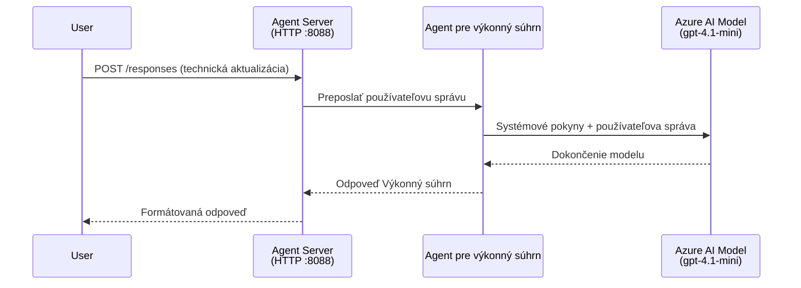
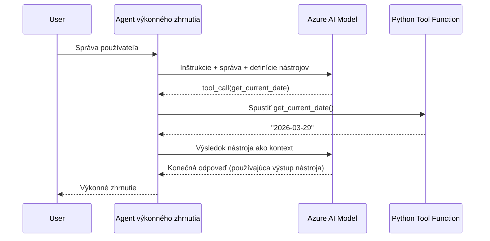

# Modul 4 - Konfigurácia inštrukcií, prostredia a inštalácia závislostí

V tomto module si prispôsobíte automaticky vygenerované súbory agenta z Modulu 3. Tu transformujete generický rámec na **vášho** agenta – napísaním inštrukcií, nastavením premenných prostredia, prípadným pridaním nástrojov a inštaláciou závislostí.

> **Pripomienka:** Rozšírenie Foundry automaticky vygenerovalo vaše projektové súbory. Teraz ich upravujete. Kompletný pracovný príklad prispôsobeného agenta nájdete v priečinku [`agent/`](../../../../../workshop/lab01-single-agent/agent).

---

## Ako komponenty spolu súvisia

### Životný cyklus požiadavky (jeden agent)


> **S nástrojmi:** Ak má agent registrované nástroje, model môže namiesto priameho dokončenia vrátiť volanie nástroja. Rámec nástroj lokálne vykoná, výsledok vráti späť modelu a model potom vygeneruje finálnu odpoveď.


---

## Krok 1: Konfigurácia premenných prostredia

Rámec vytvoril súbor `.env` s náhradnými hodnotami. Musíte vyplniť skutočné hodnoty z Modulu 2.

1. Vo vašom vygenerovanom projekte otvorte súbor **`.env`** (je v koreňovom priečinku projektu).
2. Nahraďte náhradné hodnoty skutočnými údajmi vášho Foundry projektu:

   ```env
   PROJECT_ENDPOINT=https://<your-account>.services.ai.azure.com/api/projects/<your-project>
   MODEL_DEPLOYMENT_NAME=gpt-4.1-mini
   ```

3. Uložte súbor.

### Kde tieto hodnoty nájsť

| Hodnota | Ako ju nájsť |
|---------|--------------|
| **Ukončenie projektu** | Otvorte panel **Microsoft Foundry** v VS Code → kliknite na váš projekt → URL koncového bodu je zobrazená v detaile. Vyzerá napr. ako `https://<meno-účtu>.services.ai.azure.com/api/projects/<meno-projektu>` |
| **Meno nasadenia modelu** | V paneli Foundry rozbaľte váš projekt → pozrite pod **Models + endpoints** → meno je uvedené vedľa nasadeného modelu (napr. `gpt-4.1-mini`) |

> **Bezpečnosť:** Nikdy necommitujte `.env` do verzovacieho systému. Tento súbor je už prednastavene uvedený v `.gitignore`. Ak tam nie je, pridajte ho:
> ```
> .env
> ```

### Ako prúdia premenné prostredia

Reťaz mapovania je: `.env` → `main.py` (číta cez `os.getenv`) → `agent.yaml` (mapuje na premenné prostredia kontajnera počas nasadenia).

V `main.py` rámec číta tieto hodnoty takto:

```python
PROJECT_ENDPOINT = os.getenv("AZURE_AI_PROJECT_ENDPOINT") or os.getenv("PROJECT_ENDPOINT")
MODEL_DEPLOYMENT_NAME = os.getenv("AZURE_AI_MODEL_DEPLOYMENT_NAME", os.getenv("MODEL_DEPLOYMENT_NAME", "gpt-4.1-mini"))
```

Prijímajú sa obe varianty `AZURE_AI_PROJECT_ENDPOINT` aj `PROJECT_ENDPOINT` (v `agent.yaml` sa používa prefix `AZURE_AI_*`).

---

## Krok 2: Napíšte inštrukcie agenta

Toto je najdôležitejší krok prispôsobenia. Inštrukcie určujú osobnosť vášho agenta, jeho správanie, formát výstupu a bezpečnostné obmedzenia.

1. Otvorte `main.py` vo vašom projekte.
2. Nájdite reťazec inštrukcií (rámec obsahuje predvolené/generické inštrukcie).
3. Nahraďte ho podrobnými, štruktúrovanými inštrukciami.

### Čo by mali dobré inštrukcie obsahovať

| Komponent | Účel | Príklad |
|-----------|-------|---------|
| **Rola** | Čo agent je a čo robí | "Ste agent pre výkonný súhrn" |
| **Cieľová skupina** | Pre koho sú odpovede určené | "Vedúci pracovníci s obmedzeným technickým zázemím" |
| **Definícia vstupu** | Aké druhy podnetov spracováva | "Technické správy o incidente, prevádzkové aktualizácie" |
| **Formát výstupu** | Presná štruktúra odpovedí | "Výkonný súhrn: - Čo sa stalo: ... - Dopad na biznis: ... - Ďalší krok: ..." |
| **Pravidlá** | Obmedzenia a podmienky odmietnutia | "NEpridávajte informácie nad rámec poskytnutých údajov" |
| **Bezpečnosť** | Prevencia zneužitia a halucinácií | "Ak je vstup nejasný, žiadajte o upresnenie" |
| **Príklady** | Vstupno/výstupné páry na usmernenie správania | Pridajte 2-3 príklady so rôznymi vstupmi |

### Príklad: Inštrukcie agenta pre výkonný súhrn

Tu sú inštrukcie použité v workshope v [`agent/main.py`](../../../../../workshop/lab01-single-agent/agent/main.py):

```python
AGENT_INSTRUCTIONS = """You are an "Explain Like I'm an Executive" agent.

Purpose:
Your job is to translate complex technical or operational information into
clear, concise, and outcome-focused summaries that can be easily understood
by non-technical executives.

Audience:
Senior leaders with limited technical background who care about impact,
risk, and what happens next.

What you must do:
- Rephrase the input so it is understandable to a non-technical audience
- Prioritize clarity, brevity, and outcomes over technical accuracy
- Remove technical jargon, logs, metrics, stack traces, and deep root-cause details
- Translate technical causes into simple cause-and-effect statements
- Explicitly call out business impact
- Always include a clear next step or action
- Maintain a neutral, factual, and calm executive tone
- Do NOT add new facts or speculate beyond the input

Standard Output Structure (always use this wording):

Executive Summary:
- What happened: <plain-language description>
- Business impact: <clear, non-technical impact>
- Next step: <clear action or mitigation>

Rules:
- Keep responses under 100 words
- Do NOT add facts beyond the input
- If input is unclear, ask for clarification
"""
```

4. Nahraďte existujúci reťazec inštrukcií v `main.py` vlastnými prispôsobenými inštrukciami.
5. Uložte súbor.

---

## Krok 3: (Voliteľné) Pridajte vlastné nástroje

Hostované agenti môžu vykonávať **lokálne Python funkcie** ako [nástroje](https://learn.microsoft.com/azure/foundry/agents/concepts/tool-catalog). Toto je kľúčová výhoda kódových hostovaných agentov oproti agentom len s promptami – váš agent môže spúšťať ľubovoľnú serverovú logiku.

### 3.1 Definujte funkciu nástroja

Pridajte funkciu nástroja do `main.py`:

```python
from agent_framework import tool

@tool
def get_current_date() -> str:
    """Returns the current date in YYYY-MM-DD format."""
    from datetime import date
    return str(date.today())
```

Dekorátor `@tool` zmení štandardnú Python funkciu na nástroj agenta. Dokumentačný reťazec sa stáva popisom nástroja, ktorý model vidí.

### 3.2 Zaregistrujte nástroj u agenta

Pri vytváraní agenta pomocou `.as_agent()` kontextového manažéra, odovzdajte nástroj ako parameter `tools`:

```python
async with AzureAIAgentClient(
    project_endpoint=PROJECT_ENDPOINT,
    model_deployment_name=MODEL_DEPLOYMENT_NAME,
    credential=credential,
).as_agent(
    name="my-agent",
    instructions=AGENT_INSTRUCTIONS,
    tools=[get_current_date],
) as agent:
    server = from_agent_framework(agent)
    await server.run_async()
```

### 3.3 Ako fungujú volania nástrojov

1. Používateľ odošle prompt.
2. Model rozhodne, či je potrebný nástroj (na základe promptu, inštrukcií a popisov nástrojov).
3. Ak je potrebný, rámec zavolá vašu Python funkciu lokálne (v kontajneri).
4. Návratová hodnota nástroja sa pošle späť modelu ako kontext.
5. Model vygeneruje finálnu odpoveď.

> **Nástroje sa spúšťajú na strane servera** – bežia vo vašom kontajneri, nie v prehliadači používateľa ani modeli. To znamená, že môžete pristupovať k databázam, API, súborovým systémom či akýmkoľvek Python knižniciam.

---

## Krok 4: Vytvorte a aktivujte virtuálne prostredie

Pred inštaláciou závislostí vytvorte izolované Python prostredie.

### 4.1 Vytvorenie virtuálneho prostredia

Otvorte terminál vo VS Code (`` Ctrl+` ``) a spustite:

```powershell
python -m venv .venv
```

Týmto sa vytvorí priečinok `.venv` vo vašom projektovom adresári.

### 4.2 Aktivácia virtuálneho prostredia

**PowerShell (Windows):**

```powershell
.\.venv\Scripts\Activate.ps1
```

**Príkazový riadok (Windows):**

```cmd
.venv\Scripts\activate.bat
```

**macOS/Linux (Bash):**

```bash
source .venv/bin/activate
```

Na začiatku výzvy terminálu by sa mal zobraziť prefix `(.venv)`, čo znamená, že virtuálne prostredie je aktívne.

### 4.3 Inštalácia závislostí

S aktívnym virtuálnym prostredím nainštalujte požadované balíky:

```powershell
pip install -r requirements.txt
```

Inštaluje sa:

| Balík | Účel |
|-------|------|
| `agent-framework-azure-ai==1.0.0rc3` | Integrácia Azure AI pre [Microsoft Agent Framework](https://learn.microsoft.com/agent-framework/overview/) |
| `agent-framework-core==1.0.0rc3` | Základný runtime pre tvorbu agentov (obsahuje `python-dotenv`) |
| `azure-ai-agentserver-agentframework==1.0.0b16` | Runtime hostovaného agenta pre [Foundry Agent Service](https://learn.microsoft.com/azure/foundry/agents/overview) |
| `azure-ai-agentserver-core==1.0.0b16` | Základné abstrakcie servera agenta |
| `debugpy` | Python ladenie (umožňuje ladenie pomocou F5 vo VS Code) |
| `agent-dev-cli` | Lokálny vývojový CLI nástroj na testovanie agentov |

### 4.4 Overenie inštalácie

```powershell
pip list | Select-String "agent-framework|agentserver"
```

Očakávaný výstup:
```
agent-framework-azure-ai   1.0.0rc3
agent-framework-core       1.0.0rc3
azure-ai-agentserver-agentframework 1.0.0b16
azure-ai-agentserver-core  1.0.0b16
```

---

## Krok 5: Overte autentifikáciu

Agent používa [`DefaultAzureCredential`](https://learn.microsoft.com/azure/developer/python/sdk/authentication/credential-chains#defaultazurecredential-overview), ktorý skúša viacero autentifikačných metód v tomto poradí:

1. **Premenné prostredia** – `AZURE_CLIENT_ID`, `AZURE_TENANT_ID`, `AZURE_CLIENT_SECRET` (service principal)
2. **Azure CLI** – využíva vašu `az login` reláciu
3. **VS Code** – používa účet, ktorým ste sa prihlásili do VS Code
4. **Managed Identity** – používa sa pri behu v Azure (počas nasadenia)

### 5.1 Overenie pre lokálny vývoj

Aspoň jedna z týchto možností by mala fungovať:

**Možnosť A: Azure CLI (odporúčané)**

```powershell
az account show --query "{name:name, id:id}" --output table
```

Očakávané: Zobrazí názov a ID vašej predplatnej služby.

**Možnosť B: Prihlásenie vo VS Code**

1. Pozrite sa do ľavého spodného rohu VS Code na ikonu **Účty**.
2. Ak vidíte svoje meno účtu, ste autentifikovaný.
3. Ak nie, kliknite na ikonu → **Prihlásiť sa pre používanie Microsoft Foundry**.

**Možnosť C: Service principal (pre CI/CD)**

```powershell
$env:AZURE_TENANT_ID = "<your-tenant-id>"
$env:AZURE_CLIENT_ID = "<your-client-id>"
$env:AZURE_CLIENT_SECRET = "<your-client-secret>"
```

### 5.2 Bežný problém s autentifikáciou

Ak ste prihlásení do viacerých Azure účtov, uistite sa, že je vybraná správna predplatná služba:

```powershell
az account set --subscription "<your-subscription-id>"
```

---

### Kontrolný zoznam

- [ ] Súbor `.env` obsahuje platné `PROJECT_ENDPOINT` a `MODEL_DEPLOYMENT_NAME` (nie náhradné hodnoty)
- [ ] Inštrukcie agenta sú prispôsobené v `main.py` - určujú rolu, cieľovú skupinu, formát výstupu, pravidlá a bezpečnostné obmedzenia
- [ ] (Voliteľné) Definované a zaregistrované vlastné nástroje
- [ ] Virtuálne prostredie je vytvorené a aktivované (`(.venv)` viditeľné v termináli)
- [ ] `pip install -r requirements.txt` prebehlo úspešne bez chýb
- [ ] `pip list | Select-String "azure-ai-agentserver"` zobrazuje nainštalovaný balík
- [ ] Autentifikácia je platná - `az account show` vráti vašu predplatnú službu ALEBO ste prihlásení vo VS Code

---

**Predchádzajúci:** [03 - Vytvoriť hostovaného agenta](03-create-hosted-agent.md) · **Ďalší:** [05 - Testovanie lokálne →](05-test-locally.md)

---

<!-- CO-OP TRANSLATOR DISCLAIMER START -->
**Zrieknutie sa zodpovednosti**:  
Tento dokument bol preložený pomocou AI prekladateľskej služby [Co-op Translator](https://github.com/Azure/co-op-translator). Hoci sa snažíme o presnosť, uvedomte si, že automatizované preklady môžu obsahovať chyby alebo nepresnosti. Pôvodný dokument v jeho rodnom jazyku by mal byť považovaný za autoritatívny zdroj. Pre kritické informácie sa odporúča profesionálny ľudský preklad. Nie sme zodpovední za akékoľvek nedorozumenia alebo nesprávne výklady vyplývajúce z použitia tohto prekladu.
<!-- CO-OP TRANSLATOR DISCLAIMER END -->