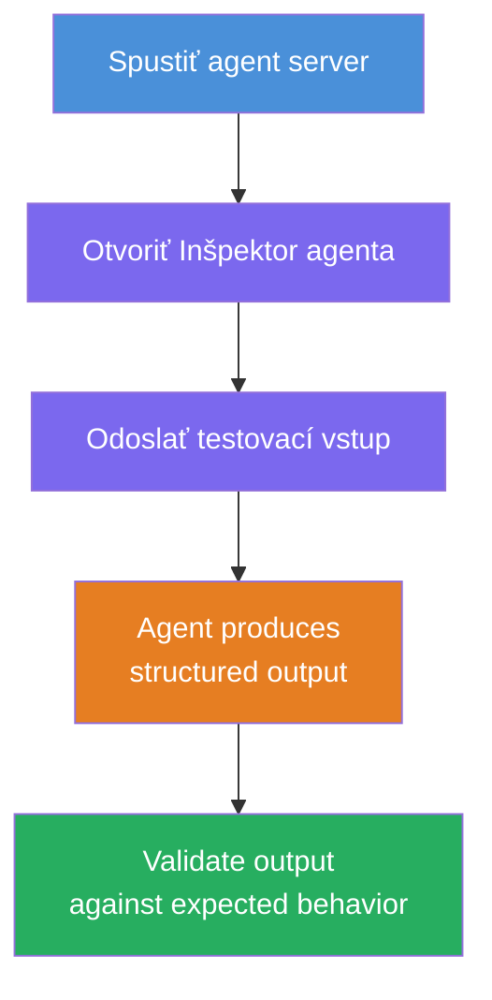
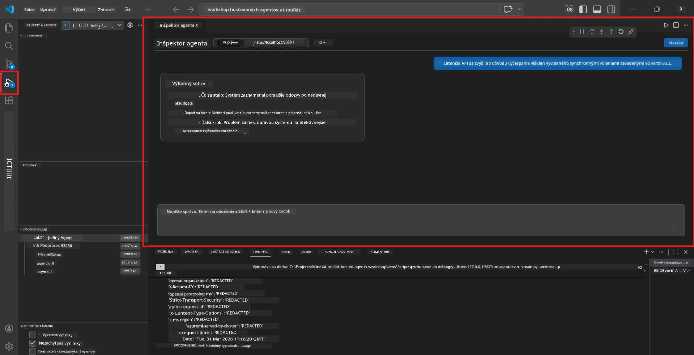
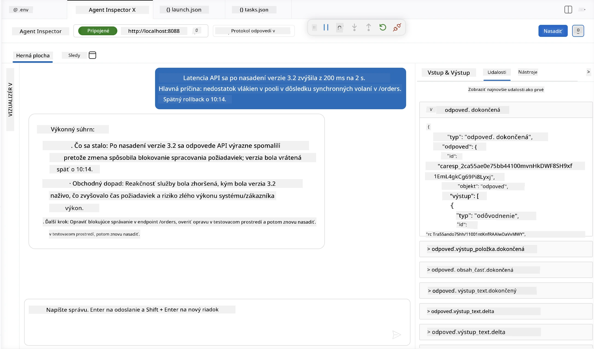

# Modul 4 - Testovanie lokálne

⏱️ ~10 min

V tomto module spustíte svojho agenta lokálne a overíte jeho správnu funkčnosť pomocou **funčných testov s ideálnym priebehom**. Použijete Agent Inspector (vizuálne UI) alebo priame HTTP volania na potvrdenie, že agent generuje štruktúrované, presné odpovede.

### Proces lokálneho testovania



---

## Možnosť 1: Stlačte F5 - Ladenie s Agent Inspector (odporúčané)

### Spustite debugger

1. Otvorte priamo priečinok **executive-summary-agent/** vo VS Code (`Súbor → Otvoriť priečinok`).
2. Otvorte panel **Spustiť a ladiť** (`Ctrl+Shift+D`).
3. Z rozbaľovacieho zoznamu vyberte **Debug Local Agent Server**.
4. Stlačte **F5** (alebo kliknite na ▶ Spustiť ladenie).

> ⚠️ **Dôležité: Vyberte svoj Python Interpreter**
> Ak dostanete chybu "ModuleNotFoundError" alebo sa debugger nespustí, musíte VS Code nastaviť, aby používal vaše virtuálne prostredie:
  > 1. Stlačte `Ctrl+Shift+P` $\rightarrow$ zadajte **Python: Select Interpreter**.
  > 2. Vyberte interpreter umiestnený v `.venv` priečinku vášho projektu (napr. `.\.venv\Scripts\python.exe` vo Windows).
  > 3. Reštartujte ladenie.
> Ak stále dostávate chyby, manuálne upravte súbor `tasks.json` nasledovne:
  > 1. Prejdite do súboru `.vscode/tasks.json`
  > 2. Nájdite príkaz s názvom: `Run Agent/Workflow HTTP Server`
  > 3. Aktualizujte hodnotu príkazu takto: `"value": "${workspaceFolder}/.venv/bin/python",`

### Čo sa stane

1. Spustí sa HTTP server na `http://localhost:8088/responses`.
2. Automaticky sa otvorí panel **Agent Inspector** - vizuálne rozhranie pre testovanie chat-u.
3. Zastavovacie body sú povolené v súbore `main.py`.

Sledujte terminál pre:
```
Starting executive summary hosted agent
Executive agent server running on http://localhost:8088
```

> **Ak sa Agent Inspector neotvorí:** Stlačte `Ctrl+Shift+P` → **Foundry Toolkit: Open Agent Inspector**.



> *Screenshot môže zobrazovať staršiu značku 'AI TOOLKIT' z predchádzajúcej verzie rozšírenia.*

---

## Možnosť 2: Testovanie cez terminál (alternatíva)

Spustite agenta v jednom termináli, požiadavky posielajte z iného:

```bash
# Terminál 1: Spustiť agenta
cd executive-summary-agent/
source .venv/bin/activate
python main.py
```

```bash
# Terminál 2: Odoslať test (curl)
curl -sS -X POST http://localhost:8088/responses \
  -H "Content-Type: application/json" \
  -d '{"input": "The API latency increased due to thread pool exhaustion caused by sync calls in v3.2.", "stream": false}'
```

---

## Test scenárov: Validácia na ideálnom priebehu

Spustite **všetky tri** nižšie uvedené scenáre. Tieto overia, že váš agent produkuje správne, štruktúrované výstupy pre realistické vstupy.



### Scenár 1: IT incident - náhly nárast latencie API

**Vstup:**
```
The API latency increased from 200ms to 2s after deploying v3.2.
Root cause: thread pool starvation from synchronous calls in /orders.
Rolled back at 10:14.
```

**Očakávané správanie:**
- ✅ Dodržanie štruktúry "Executive Summary" (Čo sa stalo / Dopad na biznis / Ďalší krok)
- ✅ Žiadny technický žargón (žiadne "thread pool", žiadne "/orders", žiadne "v3.2")
- ✅ Jasné vyjadrenie dopadu na biznis (napr. používatelia zažívali oneskorenia)
- ✅ Obsahuje ďalší krok (napr. nasadená oprava, monitoring je aktivovaný)

---

### Scenár 2: Dátový pipeline - zlyhanie ETL

**Vstup:**
```
The nightly ETL job failed because the upstream schema changed. APAC dashboards show missing data.
```

**Očakávané správanie:**
- ✅ Zhrnutie zlyhania obnovy dát zrozumiteľným jazykom
- ✅ Spomenutie dopadu na APAC dashboard
- ✅ Obsahuje ďalší krok nápravy
- ✅ Neobsahuje termíny ako "ETL", "schéma" alebo iné technické výrazy

---

### Scenár 3: Bezpečnosť - odhalené poverenia

**Vstup:**
```
Static analysis flagged a hardcoded secret in the repository.
The secret may have been exposed in commit history.
```

**Očakávané správanie:**
- ✅ Popis problému s povereniami/bezpečnosťou jazykom zrozumiteľným pre manažérov
- ✅ Upozornenie na potenciálne riziko (neautorizovaný prístup)
- ✅ Stanovenie nápravných opatrení (rotácia poverení, audit)
- ✅ Neobsahuje pojmy ako "statická analýza", "história commitov" alebo "hardcoded"

---

## Kritériá validácie

Pre každý scenár skontrolujte:

| # | Kritérium | Podmienka splnenia |
|---|-----------|-------------------|
| 1 | **Štruktúra** | Odpoveď používa formát "Executive Summary" so všetkými tromi odrážkami |
| 2 | **Jasný jazyk** | Žiadny technický žargón, ktorému by manažér nerozumel |
| 3 | **Presnosť** | Zhrnutie zodpovedá vstupu - žiadne vymyslené detaily |
| 4 | **Stručnosť** | Odpoveď má menej ako 100 slov |
| 5 | **Ďalší krok** | Jasné stanovenie akcie alebo opatrenia |

---

## Tipy na ladenie

| Problém | Riešenie |
|--------|----------|
| Agent sa nespustí | Skontrolujte hodnoty v `.env`, overte aktiváciu venv, spustite `pip install -r requirements.txt` |
| Prázdna alebo všeobecná odpoveď | Skontrolujte inštrukcie v `main.py` - uistite sa, že je špecifikovaný výstupný formát |
| Odpoveď obsahuje žargón | Posilnite pravidlá "odstrániť technické výrazy" v inštrukciách |
| Agent Inspector sa neotvorí | `Ctrl+Shift+P` → **Foundry Toolkit: Open Agent Inspector** |
| Chyby modelu v termináli | Skontrolujte či `AZURE_AI_MODEL_DEPLOYMENT_NAME` presne sedí (rozlišuje veľké/malé písmená) |

---

### ✅ Kontrolný bod

- [ ] Agent sa spustí lokálne bez chýb
- [ ] Otvorí sa Agent Inspector a zobrazuje chat rozhranie (ak použijete F5)
- [ ] **Scenár 1** (IT incident) - štruktúrované Executive Summary, žiadny žargón
- [ ] **Scenár 2** (dátový pipeline) - relevantné zhrnutie s dopadom na biznis
- [ ] **Scenár 3** (bezpečnostné varovanie) - vhodná komunikácia rizika
- [ ] Všetky odpovede dodržiavajú definovanú štruktúru výstupu

> **Uložte si svoje odpovede** (skopírujte alebo zachyťte obrazovku) - porovnáte ich s výsledkami v cloude v Module 06.

---

**Predchádzajúce:** [03 - Konfigurácia a kódovanie](03-configure-and-code.md) · **Ďalšie:** [05 - Deployment do Foundry →](05-deploy-to-foundry.md)

---

<!-- CO-OP TRANSLATOR DISCLAIMER START -->
**Vyhlásenie o zodpovednosti**:
Tento dokument bol preložený pomocou AI prekladateľskej služby [Co-op Translator](https://github.com/Azure/co-op-translator). Hoci sa snažíme o presnosť, vezmite prosím na vedomie, že automatické preklady môžu obsahovať chyby alebo nepresnosti. Pôvodný dokument v jeho natívnom jazyku by mal byť považovaný za autoritatívny zdroj. Pre kritické informácie sa odporúča profesionálny ľudský preklad. Nie sme zodpovední za žiadne nedorozumenia alebo nesprávne interpretácie vyplývajúce z použitia tohto prekladu.
<!-- CO-OP TRANSLATOR DISCLAIMER END -->