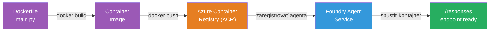
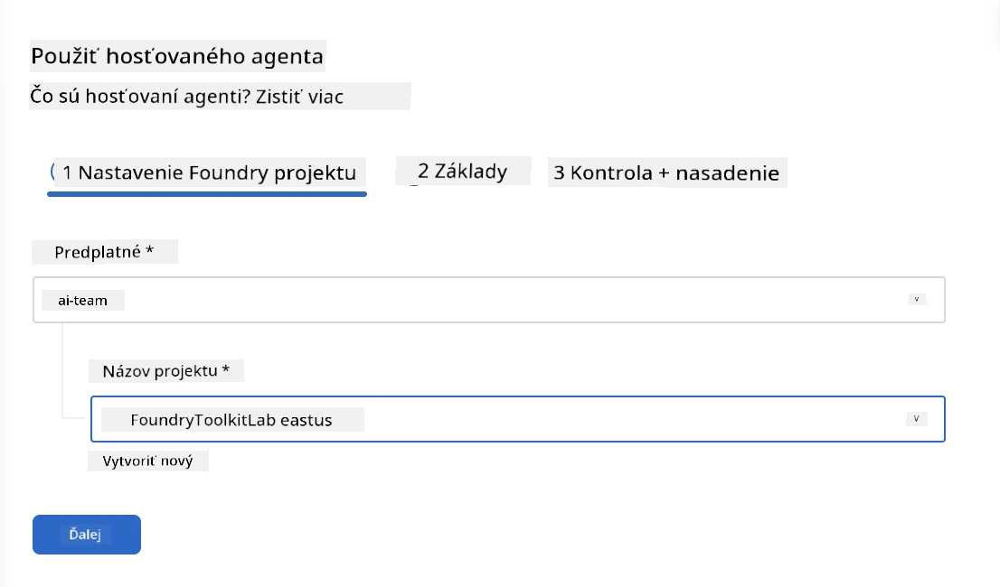
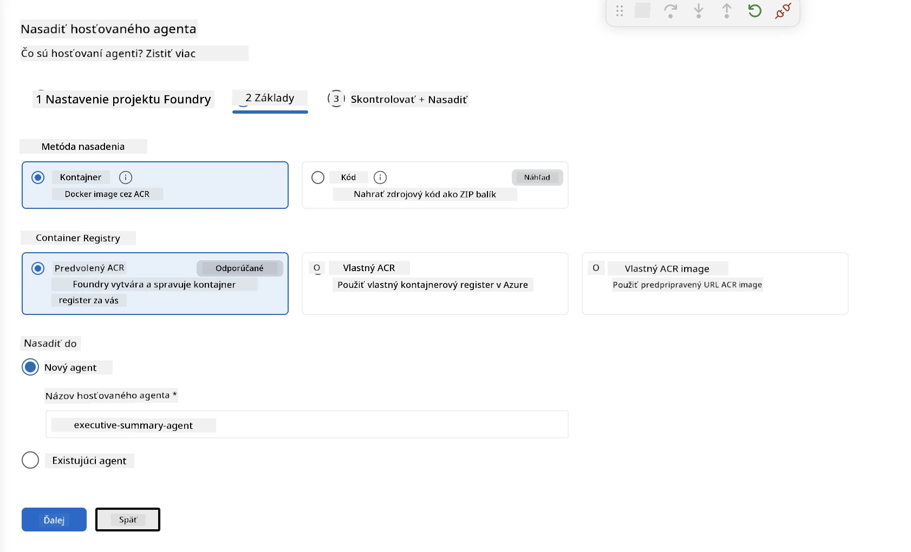
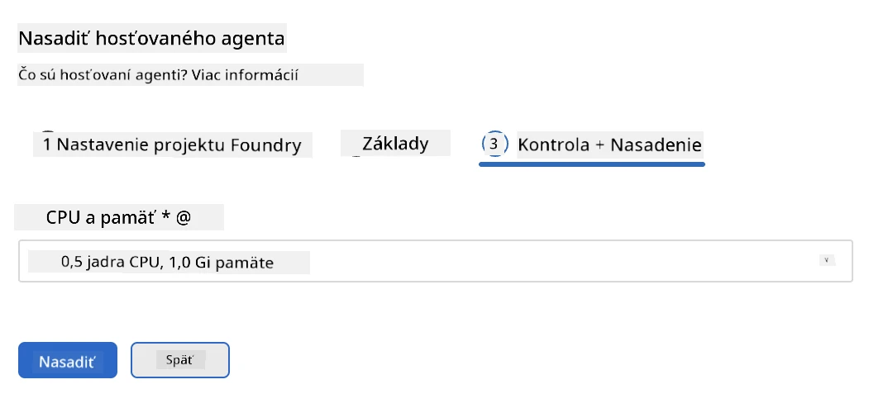
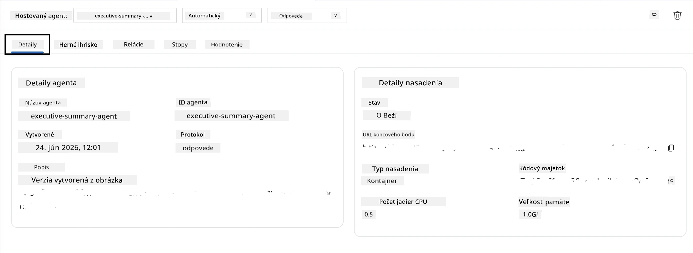

# Modul 5 - Nasadenie do služby Foundry Agent

⏱️ ~10 min

> ⚠️ **Používatelia cesty B:** Tento modul vyžaduje predplatné Foundry. Ak používate Foundry Local, prejdite na [Modul 07 - Zhrnutie](07-summary.md). Úspešne ste dokončili lokálny vývojársky workflow!

V tomto module nasadíte svoj lokálne otestovaný agent do Microsoft Foundry ako **Hosťovaný agent**. Nasadenie vytvorí obraz kontajnera, odošle ho do Azure Container Registry a spustí agenta v spravovanej infraštruktúre Foundry.

### Pipeline nasadenia

---

## Kontrola predpokladov

Pred nasadením si overte:

- [ ] Agent úspešne prešiel všetkými 3 lokálnymi scenármi z [Modulu 04](04-test-locally.md)
- [ ] Máte pridelenú rolu **Azure AI User** na úrovni projektu ([Modul 01, Priradenie RBAC](01-setup.md#deploy-a-model--assign-rbac))
- [ ] Ste prihlásený do Azure vo VS Code (v ikone Účty je vaše meno)

---

## Krok 1: Začnite nasadenie

### Možnosť A: Nasadenie z Agent Inspector (odporúčané)

Ak je Agent Inspector otvorený (z testovania):
1. Kliknite na tlačidlo **Deploy** v pravom hornom rohu (ikona oblaku ↑).

### Možnosť B: Nasadenie z Command Palette

1. Stlačte `Ctrl+Shift+P` → **Foundry Toolkit: Deploy Hosted Agent**.

---

## Krok 2: Konfigurácia nasadenia

Sprievodca vás vyzve na:

| Výzva | Výber |
|--------|-----------|
| **Predplatné** | Vaše Azure predplatné |
| **Cieľový projekt** | Váš Foundry projekt (napr. `workshop-agents`) |

Kliknite na **ďalej** pre konfiguráciu agenta.

| Výzva | Výber |
|--------|-----------|
| **Metóda nasadenia** | Kontajner |
| **Registre kontajnerov** | **Predvolený ACR** (Microsoft Foundry vám vytvorí a spravuje jeden) |
| **Nasadiť do** | Nový agent (meno, `executive-summary-agent`) |

Kliknite na **ďalej** pre kontrolu a nasadenie agenta.

| Výzva | Výber |
|--------|-----------|
| **CPU a pamäť** | **0.25 CPU jadra, 0.5 Gi pamäte** (postačujúce pre workshop) |

---

## Krok 3: Nasadenie a sledovanie

1. Kliknite na **Deploy**.
2. Sledujte panel **Output** (vyberte **Microsoft Foundry** z rozbaľovacieho menu).
3. Nasadenie prechádza týmito fázami:
   - **Docker build** - zostaví kontajner z vášho Dockerfile
   - **Docker push** - odošle obraz do ACR (1–3 min pri prvom nasadení)
   - **Registrácia agenta** - vytvorí hosťovaného agenta vo Foundry
   - **Štart kontajnera** - spustí sa so systémovou spravovanou identitou

4. Po dokončení sa zobrazí oznámenie:
   > **my-agent bol úspešne nasadený.** `Zobraziť logy` `Spustiť agenta`

5. Kliknite na **Spustiť agenta** pre otvorenie Agent Playground.

### Hodnoty stavu nasadenia

| Stav | Význam |
|--------|---------|
| **Running** | Kontajner pripravený, agent reaguje |
| **Pending** | Kontajner sa spúšťa - počkajte 30–60 sekúnd |
| **Failed** | Skontrolujte logy (pozri riešenie problémov nižšie) |

---

## Bežné chyby pri nasadení

| Chyba | Hlavná príčina | Riešenie |
|-------|-----------|-----|
| zamietnuté oprávnenie `agents/write` | Chýba rola **Azure AI User** na úrovni projektu | [Modul 01, Priradenie RBAC](01-setup.md#deploy-a-model--assign-rbac) |
| Docker neběží | Docker Desktop nie je spustený | Spustite Docker Desktop → overte `docker info` |
| Autorizácia ACR | Spravovaná identita nemôže stiahnuť obraz | Pozrite [Modul 08 - Riešenie problémov](08-troubleshooting.md) |

---

### ✅ Kontrolný bod

- [ ] Nasadenie dokončené bez chýb
- [ ] Agent sa zobrazuje pod **Hosted Agents (Preview)** v Foundry bočnom paneli
- [ ] Stav kontajnera ukazuje **Running**
- [ ] Otvorená karta Agent Playground zobrazuje podrobnosti agenta a URL koncového bodu

---

**Predchádzajúce:** [04 - Test lokálne](04-test-locally.md) · **Nasledujúce:** [06 - Overenie v Playground →](06-verify-in-playground.md)

---

<!-- CO-OP TRANSLATOR DISCLAIMER START -->
**Vyhlásenie o zodpovednosti**:
Tento dokument bol preložený pomocou AI prekladateľskej služby [Co-op Translator](https://github.com/Azure/co-op-translator). Hoci sa snažíme o presnosť, vezmite prosím na vedomie, že automatické preklady môžu obsahovať chyby alebo nepresnosti. Pôvodný dokument v jeho natívnom jazyku by mal byť považovaný za autoritatívny zdroj. Pre kritické informácie sa odporúča profesionálny ľudský preklad. Nie sme zodpovední za žiadne nedorozumenia alebo nesprávne interpretácie vyplývajúce z použitia tohto prekladu.
<!-- CO-OP TRANSLATOR DISCLAIMER END -->