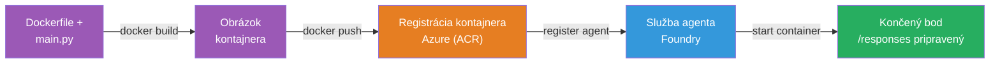
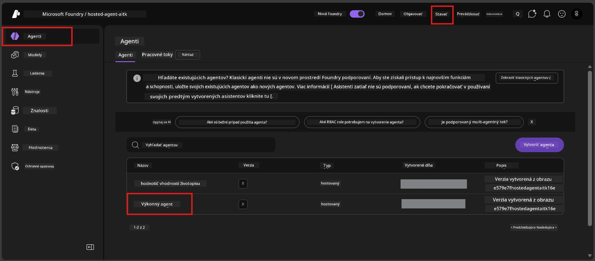

# Modul 6 - Nasadenie do služby Foundry Agent

V tomto module nasadíte svoj lokálne testovaný agent do Microsoft Foundry ako [**hostovaného agenta**](https://learn.microsoft.com/azure/foundry/agents/concepts/hosted-agents). Proces nasadenia zostaví Docker kontajnerový obraz z vášho projektu, odošle ho do [Azure Container Registry (ACR)](https://learn.microsoft.com/azure/container-registry/container-registry-intro) a vytvorí verzáciu hostovaného agenta v [Foundry Agent Service](https://learn.microsoft.com/azure/foundry/agents/overview).

### Nasadzovací pipeline


---

## Kontrola predpokladov

Pred nasadením skontrolujte každú položku nižšie. Preskočenie týchto je najčastejšou príčinou neúspešných nasadení.

1. **Agent úspešne prešiel lokálne testy:**
   - Dokončili ste všetky 4 testy v [Module 5](05-test-locally.md) a agent správne reagoval.

2. **Máte pridelenú rolu [Azure AI User](https://learn.microsoft.com/azure/foundry/concepts/rbac-foundry#built-in-roles):**
   - Tá bola pridelená v [Modul 2, krok 3](02-create-foundry-project.md). Ak si nie ste istí, overte si to teraz:
   - Azure Portal → váš Foundry **projekt** → **Správa prístupu (IAM)** → záložka **Priraďovanie rolí** → vyhľadajte svoje meno → overte, že je uvedená rola **Azure AI User**.

3. **Ste prihlásený do Azure vo VS Code:**
   - Skontrolujte ikonu Účtov v ľavom dolnom rohu VS Code. Malo by byť vidieť meno vášho účtu.

4. **(Voliteľné) Docker Desktop je spustený:**
   - Docker je potrebný iba pokiaľ vás Foundry rozšírenie vyzve na lokálne zostavenie. Vo väčšine prípadov rozšírenie automaticky spracuje zostavenie kontajnera počas nasadenia.
   - Ak máte Docker nainštalovaný, overte, že beží príkazom: `docker info`

---

## Krok 1: Štart nasadenia

Nasadenie môžete spustiť dvoma spôsobmi – oba vedú k rovnakému výsledku.

### Možnosť A: Nasadzujte cez Agent Inspector (odporúčané)

Ak máte agenta spusteného s debuggerom (F5) a je otvorený Agent Inspector:

1. Pozrite sa do **pravého horného rohu** panela Agent Inspector.
2. Kliknite na tlačidlo **Deploy** (ikona obláčika so šípkou nahor ↑).
3. Otvorí sa sprievodca nasadením.

### Možnosť B: Nasadzujte cez Command Palette

1. Stlačte `Ctrl+Shift+P` pre otvorenie **Command Palette**.
2. Napíšte: **Microsoft Foundry: Deploy Hosted Agent** a vyberte túto možnosť.
3. Otvorí sa sprievodca nasadením.

---

## Krok 2: Konfigurácia nasadenia

Sprievodca nasadením vás prevedie konfiguráciou. Vyplňte každú požiadavku:

### 2.1 Výber cieľového projektu

1. Z rozbaľovacej ponuky vyberte svoj projekt v Foundry.
2. Vyberte projekt, ktorý ste vytvorili v Module 2 (napr. `workshop-agents`).

### 2.2 Výber vstupného súboru agenta

1. Budete vyzvaní vybrať vstupný bod agenta.
2. Vyberte **`main.py`** (Python) – tento súbor používa sprievodca na identifikáciu vášho projektu agenta.

### 2.3 Konfigurácia zdrojov

| Nastavenie | Odporúčaná hodnota | Poznámky |
|------------|--------------------|----------|
| **CPU**    | `0.25`             | Prednastavené, postačujúce pre workshop. Zvýšte pre produkčné záťaže |
| **Pamäť**  | `0.5Gi`            | Prednastavené, postačujúce pre workshop |

Tieto hodnoty zodpovedajú nastaveniam v `agent.yaml`. Môžete použiť predvolené hodnoty.

---

## Krok 3: Potvrdenie a nasadenie

1. Sprievodca zobrazí súhrn nasadenia vrátane:
   - Názvu cieľového projektu
   - Mena agenta (podľa `agent.yaml`)
   - Súboru kontajnera a zdrojov
2. Skontrolujte súhrn a kliknite na **Confirm and Deploy** (alebo **Deploy**).
3. Sledujte priebeh v VS Code.

### Čo sa deje počas nasadenia (krok za krokom)

Nasadenie prebieha vo viacerých krokoch. Sledujte panel **Output** vo VS Code (vyberte „Microsoft Foundry“ z rozbaľovacej ponuky):

1. **Docker build** – VS Code zostavuje Docker kontajnerový obraz z vášho `Dockerfile`. Uvidíte správy vrstiev Dockera:
   ```
   Step 1/6 : FROM python:<version>-slim
   Step 2/6 : WORKDIR /app
   ...
   Successfully built abc123def456
   ```

2. **Docker push** – Obraz sa odošle do **Azure Container Registry (ACR)** priradeného k vášmu Foundry projektu. Pri prvom nasadení to môže trvať 1-3 minúty (základný obraz má viac ako 100 MB).

3. **Registrácia agenta** – Foundry Agent Service vytvorí nového hostovaného agenta (alebo novú verziu, ak agent už existuje). Použijú sa metadáta z `agent.yaml`.

4. **Štart kontajnera** – Kontajner sa spustí v spravovanej infraštruktúre Foundry. Platforma priradí [systémom spravovanú identitu](https://learn.microsoft.com/azure/foundry/agents/concepts/agent-identity) a vystaví endpoint `/responses`.

> **Prvé nasadenie je pomalšie** (Docker musí odoslať všetky vrstvy). Nasledujúce nasadenia sú rýchlejšie, pretože Docker využíva cache nezmenených vrstiev.

---

## Krok 4: Overenie stavu nasadenia

Po dokončení príkazu na nasadenie:

1. Otvorte bočný panel **Microsoft Foundry** kliknutím na ikonu Foundry v Activity Bar.
2. Rozbaľte sekciu **Hosted Agents (Preview)** pod vašim projektom.
3. Mali by ste vidieť názov svojho agenta (napr. `ExecutiveAgent` alebo názov z `agent.yaml`).
4. **Kliknite na názov agenta** pre jeho rozbalenie.
5. Uvidíte jednu alebo viac **verzií** (napr. `v1`).
6. Kliknite na verziu a zobrazíte **Detaily kontajnera**.
7. Skontrolujte pole **Status**:

   | Status          | Význam                                           |
   |-----------------|-------------------------------------------------|
   | **Started** alebo **Running** | Kontajner beží a agent je pripravený       |
   | **Pending**     | Kontajner sa spúšťa (počkajte 30-60 sekúnd)     |
   | **Failed**      | Kontajner sa nepodarilo spustiť (skontrolujte logy – návod nižšie) |



> **Ak vidíte "Pending" dlhšie než 2 minúty:** Kontajner môže sťahovať základný obraz. Počkajte ešte chvíľu. Ak zostane v stave Pending, skontrolujte logy kontajnera.

---

## Bežné chyby pri nasadzovaní a ich opravy

### Chyba 1: Permission denied - `agents/write`

```
Error: lacks the required data action 
Microsoft.CognitiveServices/accounts/AIServices/agents/write 
to perform POST /api/projects/{projectName}/assistants operation.
```

**Hlavná príčina:** Nemáte rolu `Azure AI User` na úrovni **projektu**.

**Postup opravy krok za krokom:**

1. Otvorte [https://portal.azure.com](https://portal.azure.com).
2. Do vyhľadávacieho panela zadajte názov svojho Foundry **projektu** a kliknite naň.
   - **Dôležité:** Uistite sa, že idete do zdroja **projektu** (typ: "Microsoft Foundry project"), NIE do nadradeného účtu/huba.
3. V ľavej navigácii kliknite na **Správa prístupu (IAM)**.
4. Kliknite na **+ Pridať** → **Pridať priradenie roly**.
5. Na karte **Rola** vyhľadajte a vyberte [**Azure AI User**](https://learn.microsoft.com/azure/foundry/concepts/rbac-foundry#built-in-roles). Kliknite na **Ďalej**.
6. Na karte **Členovia** vyberte **Používateľ, skupina alebo služobný princíp**.
7. Kliknite na **+ Vybrať členov**, vyhľadajte svoje meno/email, vyberte sa, kliknite na **Vybrať**.
8. Kliknite na **Kontrola + priradenie** → znovu **Kontrola + priradenie**.
9. Počkajte 1-2 minúty kým sa priradenie roly prejaví.
10. **Znova skúste nasadenie** podľa Kroku 1.

> Rola musí byť pridelená na úrovni **projektu**, nie len účtu. Toto je najčastejšia príčina zlyhaní nasadenia.

### Chyba 2: Docker nie je spustený

```
Error: Docker build failed / Cannot connect to Docker daemon
```

**Oprava:**
1. Spustite Docker Desktop (nájdite ho v Štart menu alebo system tray).
2. Počkajte, kým nezobrazí „Docker Desktop is running“ (30-60 sekúnd).
3. Overte: `docker info` v termináli.
4. **Specifické pre Windows:** Skontrolujte, že je v nastaveniach Docker Desktop → **General** → zaškrtnuté **Use the WSL 2 based engine**.
5. Znova skúste nasadenie.

### Chyba 3: Autorizácia ACR – `AcrPullUnauthorized`

```
Error: AcrPullUnauthorized
```

**Hlavná príčina:** Spravovaná identita Foundry projektu nemá právo sťahovať z registry kontajnerov.

**Oprava:**
1. V Azure Portáli prejdite na svoj **[Container Registry](https://learn.microsoft.com/azure/container-registry/container-registry-intro)** (je vo rovnakom resource group ako Foundry projekt).
2. Zvoľte **Správa prístupu (IAM)** → **Pridať** → **Pridať priradenie roly**.
3. Vyberte rolu **[AcrPull](https://learn.microsoft.com/azure/container-registry/container-registry-roles)**.
4. V časti Členovia vyberte **Spravovaná identita** → nájdite spravovanú identitu Foundry projektu.
5. **Kontrola + priradenie**.

> Toto je väčšinou nastavené automaticky Foundry rozšírením. Ak vidíte túto chybu, znamená to, že automatické nastavenie zlyhalo.

### Chyba 4: Nezhoda platformy kontajnera (Apple Silicon)

Ak nasadzujete z Macu s Apple Silicon (M1/M2/M3), kontajner musí byť zostavený pre `linux/amd64`:

```bash
docker build --platform linux/amd64 -t myagent:v1 .
```

> Foundry rozšírenie to pre väčšinu používateľov rieši automaticky.

---

### Kontrolný zoznam

- [ ] Príkaz nasadenia sa dokončil bez chýb vo VS Code
- [ ] Agent sa zobrazuje pod **Hosted Agents (Preview)** v Foundry bočnom paneli
- [ ] Klikli ste na agenta → vybrali verziu → videli **Detaily kontajnera**
- [ ] Stav kontajnera je **Started** alebo **Running**
- [ ] (Ak došlo k chybám) Identifikovali ste chybu, použili opravu a úspešne znovu nasadili

---

**Predchádzajúce:** [05 - Test lokálne](05-test-locally.md) · **Ďalšie:** [07 - Overenie na Playground →](07-verify-in-playground.md)

---

<!-- CO-OP TRANSLATOR DISCLAIMER START -->
**Zrieknutie sa zodpovednosti**:  
Tento dokument bol preložený pomocou AI prekladateľskej služby [Co-op Translator](https://github.com/Azure/co-op-translator). Aj keď sa snažíme o presnosť, majte prosím na pamäti, že automatizované preklady môžu obsahovať chyby alebo nepresnosti. Originálny dokument v jeho pôvodnom jazyku by sa mal považovať za autoritatívny zdroj. Pre kritické informácie sa odporúča profesionálny ľudský preklad. Nie sme zodpovední za žiadne nedorozumenia alebo nesprávne výklady vyplývajúce z použitia tohto prekladu.
<!-- CO-OP TRANSLATOR DISCLAIMER END -->