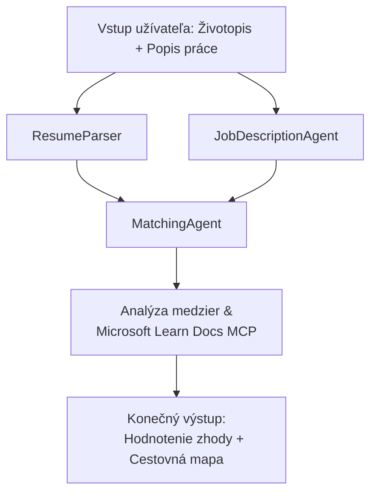

# PersonalCareerCopilot - Vyhodnocovač zhody životopisu s pracovnou ponukou

Viacagentový pracovný tok, ktorý vyhodnocuje, ako dobre životopis zodpovedá popisu práce, a potom generuje personalizovanú učebnú cestu na odstránenie nedostatkov.

---

## Agenti

| Agent | Úloha | Nástroje |
|-------|-------|----------|
| **ResumeParser** | Extrahuje štruktúrované zručnosti, skúsenosti, certifikácie z textu životopisu | - |
| **JobDescriptionAgent** | Extrahuje požadované/preferované zručnosti, skúsenosti, certifikácie z JD | - |
| **MatchingAgent** | Porovná profil s požiadavkami → skóre zhody (0-100) + zhodné/chýbajúce zručnosti | - |
| **GapAnalyzer** | Vytvára personalizovanú učebnú cestu s Microsoft Learn zdrojmi | `search_microsoft_learn_for_plan` (MCP) |

## Pracovný tok


---

## Rýchly štart

### 1. Nastavte prostredie

```powershell
cd workshop\lab02-multi-agent\PersonalCareerCopilot
python -m venv .venv
.\.venv\Scripts\Activate.ps1          # Windows PowerShell
# source .venv/bin/activate            # macOS / Linux
pip install -r requirements.txt
```

### 2. Nakonfigurujte prihlasovacie údaje

Skopírujte príklad súboru env a vyplňte údaje o svojom Foundry projekte:

```powershell
cp .env.example .env
```

Upravte `.env`:

```env
PROJECT_ENDPOINT=https://<your-account>.services.ai.azure.com/api/projects/<your-project>
MODEL_DEPLOYMENT_NAME=gpt-4.1-mini
```

| Hodnota | Kde ju nájsť |
|---------|--------------|
| `PROJECT_ENDPOINT` | Bočný panel Microsoft Foundry vo VS Code → kliknite pravým tlačidlom na projekt → **Kopírovať koncový bod projektu** |
| `MODEL_DEPLOYMENT_NAME` | Bočný panel Foundry → rozbaľte projekt → **Modely + koncové body** → meno nasadenia |

### 3. Spustite lokálne

```powershell
python -m debugpy --listen 127.0.0.1:5679 -m agentdev run main.py --verbose --port 8088
```

Alebo použite úlohu vo VS Code: `Ctrl+Shift+P` → **Úlohy: Spustiť úlohu** → **Spustiť Lab02 HTTP server**.

### 4. Otestujte pomocou Agent Inspector

Otvorte Agent Inspector: `Ctrl+Shift+P` → **Foundry Toolkit: Otvoriť Agent Inspector**.

Prilepte tento testovací prompt:

```
Resume:
Jane Doe
Senior Software Engineer with 5 years of experience in Python, Django, and AWS.
Built microservices handling 10K+ requests/second. Led a team of 4 developers.
Certifications: AWS Solutions Architect Associate.
Education: B.S. Computer Science, State University.

Job Description:
Senior Cloud Engineer at Contoso Ltd.
Required: Python, Azure, Kubernetes, Terraform, CI/CD pipelines.
Preferred: Go, monitoring (Prometheus/Grafana), cost optimization.
Experience: 5+ years in cloud infrastructure.
Certifications: Azure Solutions Architect Expert preferred.
```

**Očakávané:** Skóre zhody (0-100), zhodné/chýbajúce zručnosti a personalizovaná učebná cesta s URL od Microsoft Learn.

### 5. Nasadenie do Foundry

`Ctrl+Shift+P` → **Microsoft Foundry: Nasadiť hosťovaného agenta** → vyberte svoj projekt → potvrďte.

---

## Štruktúra projektu

```
PersonalCareerCopilot/
├── .env.example        ← Template for environment variables
├── .env                ← Your credentials (git-ignored)
├── agent.yaml          ← Hosted agent definition (name, resources, env vars)
├── Dockerfile          ← Container image for Foundry deployment
├── main.py             ← 4-agent workflow (instructions, MCP tool, WorkflowBuilder)
└── requirements.txt    ← Python dependencies
```

## Kľúčové súbory

### `agent.yaml`

Definuje hosťovaného agenta pre Foundry Agent Service:
- `kind: hosted` - beží ako spravovaný kontajner
- `protocols: [responses v1]` - sprístupňuje HTTP endpoint `/responses`
- `environment_variables` - `PROJECT_ENDPOINT` a `MODEL_DEPLOYMENT_NAME` sa injektujú pri nasadení

### `main.py`

Obsahuje:
- **Inštrukcie pre agentov** - štyri konštanty `*_INSTRUCTIONS`, po jednej pre každého agenta
- **MCP nástroj** - `search_microsoft_learn_for_plan()` volá `https://learn.microsoft.com/api/mcp` cez Streamable HTTP
- **Vytvorenie agentov** - `create_agents()` kontextový manažér používajúci `AzureAIAgentClient.as_agent()`
- **Graf pracovného toku** - `create_workflow()` používa `WorkflowBuilder` na prepojenie agentov s fan-out/fan-in/sekvenčnými vzormi
- **Štart servera** - `from_agent_framework(agent).run_async()` na porte 8088

### `requirements.txt`

| Balík | Verzia | Účel |
|-------|--------|------|
| `agent-framework-azure-ai` | `1.0.0rc3` | Integrácia Azure AI pre Microsoft Agent Framework |
| `agent-framework-core` | `1.0.0rc3` | Jadro runtime (zahŕňa WorkflowBuilder) |
| `azure-ai-agentserver-agentframework` | `1.0.0b16` | Runtime hosťovaného agenta servera |
| `azure-ai-agentserver-core` | `1.0.0b16` | Jadro agent server abstrakcií |
| `debugpy` | najnovší | Python debugovanie (F5 vo VS Code) |
| `agent-dev-cli` | `--pre` | Lokálny vývojový CLI + backend Agent Inspector |

---

## Riešenie problémov

| Problém | Riešenie |
|---------|----------|
| `RuntimeError: Missing required environment variable(s)` | Vytvorte `.env` so `PROJECT_ENDPOINT` a `MODEL_DEPLOYMENT_NAME` |
| `ModuleNotFoundError: No module named 'agent_framework'` | Aktivujte venv a spustite `pip install -r requirements.txt` |
| Žiadne URL od Microsoft Learn vo výstupe | Skontrolujte internetové pripojenie na `https://learn.microsoft.com/api/mcp` |
| Len 1 karta medzery (skrátená) | Overte, či `GAP_ANALYZER_INSTRUCTIONS` obsahuje blok `CRITICAL:` |
| Port 8088 je obsadený | Zastavte iné servery: `netstat -ano \| findstr :8088` |

Pre podrobnejšie riešenie problémov pozrite [Modul 8 - Riešenie problémov](../docs/08-troubleshooting.md).

---

**Úplný prehľad:** [Lab 02 Docs](../docs/README.md) · **Späť na:** [Lab 02 README](../README.md) · [Domovská stránka workshopu](../../../README.md)

---

<!-- CO-OP TRANSLATOR DISCLAIMER START -->
**Zrieknutie sa zodpovednosti**:  
Tento dokument bol preložený pomocou AI prekladateľskej služby [Co-op Translator](https://github.com/Azure/co-op-translator). Hoci sa snažíme o presnosť, uvedomte si, že automatizované preklady môžu obsahovať chyby alebo nepresnosti. Originálny dokument v jeho pôvodnom jazyku by mal byť považovaný za autoritatívny zdroj. Pre kritické informácie sa odporúča profesionálny ľudský preklad. Nezodpovedáme za žiadne nedorozumenia alebo nesprávne interpretácie vyplývajúce z použitia tohto prekladu.
<!-- CO-OP TRANSLATOR DISCLAIMER END -->