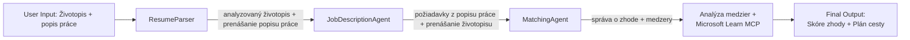

# PersonalCareerCopilot - Vyhodnotenie zhody životopisu s prácou

Viacagentová aplikácia postavená na pracovných tokoch, ktorá hodnotí, ako dobre sa životopis zhoduje s popisom práce, a následne generuje personalizovanú cestu učenia na odstránenie medzier.

---

## Agenti

| Agent | Úloha | Nástroje |
|-------|-------|----------|
| **ResumeParser** | Extrahuje štruktúrované zručnosti, skúsenosti, certifikácie z textu životopisu | - |
| **JobDescriptionAgent** | Extrahuje požadované/preferované zručnosti, skúsenosti, certifikácie z popisu práce | - |
| **MatchingAgent** | Porovná profil so požiadavkami → skóre zhody (0-100) + zhodné/chýbajúce zručnosti | - |
| **GapAnalyzer** | Vytvára personalizovanú cestu učenia s použitím zdrojov Microsoft Learn | `search_microsoft_learn_for_plan` (MCP) |

## Pracovný tok


```mermaid
flowchart LR
    UserInput["User Input: Životopis + popis práce"] --> ResumeParser
    ResumeParser -- "analyzovaný životopis + prenášanie popisu práce" --> JobDescriptionAgent
    JobDescriptionAgent -- "požiadavky z popisu práce + prenášanie životopisu" --> MatchingAgent
    MatchingAgent -- "správa o zhode + medzery" --> GapAnalyzerMCP["Analýza medzier +\nMicrosoft Learn MCP"]
    GapAnalyzerMCP --> FinalOutput["Final Output:\nSkóre zhody + Plán cesty"]
```

---

## Rýchly štart

### 1. Nastavte prostredie

Tento priečinok je referenčná implementácia pre pracovný tok Lab 02. Jeho `main.py` používa existujúce bloky promptov plus `WorkflowBuilder` na prepojenie štyroch agentov.

```powershell
cd workshop\lab02-multi-agent\PersonalCareerCopilot
python -m venv .venv
.\.venv\Scripts\Activate.ps1          # Windows PowerShell
# source .venv/bin/activate            # macOS / Linux
pip install -r requirements.txt
```

### 2. Nastavte prihlasovacie údaje

Vytvorte v tomto priečinku súbor `.env`:

```powershell
copy .env .env.bak 2>$null; echo $null > .env
```

Upravte `.env`:

```env
FOUNDRY_PROJECT_ENDPOINT=https://<your-account>.services.ai.azure.com/api/projects/<your-project>
AZURE_AI_MODEL_DEPLOYMENT_NAME=gpt-4.1-mini
```

| Hodnota | Kde ju nájsť |
|--------|-------------|
| `FOUNDRY_PROJECT_ENDPOINT` | Foundry Toolkit bočný panel → kliknite pravým tlačidlom na projekt → **Copy Project Endpoint** |
| `AZURE_AI_MODEL_DEPLOYMENT_NAME` | Bočný panel Foundry → rozbaliť projekt → **Models + endpoints** → názov deploymentu |

### 3. Spustite lokálne

```powershell
python -m debugpy --listen 127.0.0.1:5679 main.py --port 8088
```

Alebo použite VS Code úlohu: `Ctrl+Shift+P` → **Tasks: Run Task** → **Run Agent HTTP Server**.

Pre ladenie klávesou F5 použite **Debug Local Agent HTTP Server**.

### 4. Testovanie s Agent Inspector

Otvorte Agent Inspector: `Ctrl+Shift+P` → **Foundry Toolkit: Open Agent Inspector**.

Vložte tento testovací prompt:

```
Resume:
Jane Doe
Senior Software Engineer with 5 years of experience in Python, Django, and AWS.
Built microservices handling 10K+ requests/second. Led a team of 4 developers.
Certifications: AWS Solutions Architect Associate.
Education: B.S. Computer Science, State University.

Job Description:
Senior Cloud Engineer at Contoso Ltd.
Required: Python, Azure, Kubernetes, Terraform, CI/CD pipelines.
Preferred: Go, monitoring (Prometheus/Grafana), cost optimization.
Experience: 5+ years in cloud infrastructure.
Certifications: Azure Solutions Architect Expert preferred.
```

**Očakávané:** skóre zhody (0-100), zhodné/chýbajúce zručnosti a personalizovaná cesta učenia s URL adresami Microsoft Learn.

### 5. Nasadenie do Foundry

`Ctrl+Shift+P` → **Foundry Toolkit: Deploy Hosted Agent** → vyberte projekt → potvrďte.

---

## Štruktúra projektu

```
PersonalCareerCopilot/
├── .env                ← Your credentials (git-ignored)
├── agent.yaml          ← Hosted agent definition (name, resources, env vars)
├── Dockerfile          ← Container image for Foundry deployment
├── main.py             ← 4-agent workflow (instructions, MCP tool, WorkflowBuilder)
└── requirements.txt    ← Python dependencies
```

## Kľúčové súbory

### `agent.yaml`

Definuje hosťovaného agenta pre Foundry Agent Service:
- `kind: hosted` - beží ako manažovaný kontajner
- `protocols` - protokol `responses` vo verzii `1.0.0`, vystavujúci HTTP endpoint `/responses`
- `environment_variables` - `AZURE_AI_MODEL_DEPLOYMENT_NAME` deklarovaný tu; `FOUNDRY_PROJECT_ENDPOINT` sa automaticky injektuje pri nasadení

### `main.py`

Obsahuje:
- **Inštrukcie pre agentov** - štyri konštanty `*_INSTRUCTIONS`, jedna pre každého agenta
- **Nástroj MCP** - `search_microsoft_learn_for_plan()` volá `https://learn.microsoft.com/api/mcp` cez Streamable HTTP
- **Vytváranie agentov** - štyri inštancie `Agent()` + `AgentExecutor()`, ktoré zdieľajú jedno `FoundryChatClient`
- **Graf pracovného toku** - `WorkflowBuilder` prepája agentov do sekvenčného reťazca: ResumeParser → JD Agent → MatchingAgent → GapAnalyzer
- **Spustenie servera** - `ResponsesHostServer` beží na porte 8088

### `requirements.txt`

| Balík | Účel |
|-------|-------|
| `agent-framework-foundry` | Hlavný runtime: `Agent`, `AgentExecutor`, `WorkflowBuilder`, `@tool`, `FoundryChatClient` |
| `agent-framework-foundry-hosting` | `ResponsesHostServer` + integrácia s Foundry hostingom |
| `mcp<2,>=1.24.0` | MCP klient pre GapAnalyzer (`streamable_http_client`) |
| `debugpy` | Python ladenie (F5 vo VS Code) |

---

## Riešenie problémov

| Problém | Riešenie |
|---------|----------|
| `KeyError: 'FOUNDRY_PROJECT_ENDPOINT'` alebo `KeyError: 'AZURE_AI_MODEL_DEPLOYMENT_NAME'` | Vytvorte `.env` so zadanými oboma `FOUNDRY_PROJECT_ENDPOINT` a `AZURE_AI_MODEL_DEPLOYMENT_NAME` |
| `ModuleNotFoundError: No module named 'agent_framework'` | Aktivujte venv a spustite `pip install -r requirements.txt` |
| V výstupe nie sú URL adresy Microsoft Learn | Skontrolujte pripojenie na internet na `https://learn.microsoft.com/api/mcp` |
| Len jedna karta medzery (skrátená) | Overte, že `GAP_ANALYZER_INSTRUCTIONS` obsahujú blok `CRITICAL:` |
| Port 8088 je obsadený | Ukončite iné servery: `netstat -ano \| findstr :8088` |

Pre detailnejšie riešenie problémov pozrite [Modul 8 - Riešenie problémov](../docs/08-troubleshooting.md).

---

**Úplný návod:** [Lab 02 Docs](../docs/README.md) · **Späť na:** [Lab 02 README](../README.md) · [Domov workshopu](../../../README.md)

---

<!-- CO-OP TRANSLATOR DISCLAIMER START -->
**Vyhlásenie o zodpovednosti**:
Tento dokument bol preložený pomocou AI prekladateľskej služby [Co-op Translator](https://github.com/Azure/co-op-translator). Hoci sa snažíme o presnosť, vezmite prosím na vedomie, že automatické preklady môžu obsahovať chyby alebo nepresnosti. Pôvodný dokument v jeho natívnom jazyku by mal byť považovaný za autoritatívny zdroj. Pre kritické informácie sa odporúča profesionálny ľudský preklad. Nie sme zodpovední za žiadne nedorozumenia alebo nesprávne interpretácie vyplývajúce z použitia tohto prekladu.
<!-- CO-OP TRANSLATOR DISCLAIMER END -->