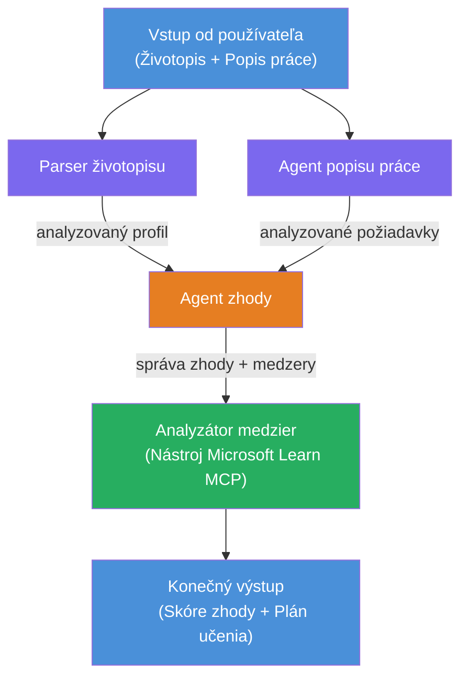

# Lab 02 - Viacagentný workflow: Hodnotiteľ zhody životopisu a pracovnej ponuky

---

## Čo vybudujete

**Hodnotiteľ zhody životopisu a pracovnej ponuky** – viacagentný workflow, kde štyria špecializovaní agenti spolupracujú na vyhodnotení, ako dobre kandidátov životopis zodpovedá pracovnej ponuke, a následne vytvoria personalizovanú vzdelávaciu cestu na doplnenie medzier.

### Agentí

| Agent | Úloha |
|-------|-------|
| **Parser životopisu** | Extrahuje štruktúrované zručnosti, skúsenosti a certifikáty z textu životopisu |
| **Agent pracovnej ponuky** | Extrahuje požadované/preferované zručnosti, skúsenosti a certifikáty z pracovnej ponuky |
| **Agent porovnávania** | Porovná profil s požiadavkami → skóre zhody (0-100) + zhodné/chýbajúce zručnosti |
| **Analytik medzier** | Vytvára personalizovanú vzdelávaciu cestu s prostriedkami, termínmi a projektmi na rýchly úspech |

### Ukážkový postup

Nahrajte **životopis + pracovnú ponuku** → získajte **skóre zhody + chýbajúce zručnosti** → obdržíte **personalizovanú vzdelávaciu cestu**.

### Architektúra workflow

> Fialová = paralelné agenti | Oranžová = bod agregácie | Zelená = finálny agent s nástrojmi. Pozrite si [Modul 1 - Pochopenie architektúry](docs/01-understand-multi-agent.md) a [Modul 4 - Orchestration Patterns](docs/04-orchestration-patterns.md) pre podrobné diagramy a tok dát.

### Pokryté témy

- Vytvorenie viacagentného workflow pomocou **WorkflowBuilder**
- Definovanie rolí agentov a toku orchestrácie (paralelne + sekvenčne)
- Vzory komunikácie medzi agentmi
- Lokálne testovanie pomocou Agent Inspector
- Nasadenie viacagentných workflow na Foundry Agent Service

---

## Predpoklady

Najprv dokončite Lab 01:

- [Lab 01 - Single Agent](../lab01-single-agent/README.md)

---

## Začnite

Úplné inštrukcie na nastavenie, prehľad kódu a príkazy na testovanie nájdete v:

- [Lab 2 Docs - Predpoklady](docs/00-prerequisites.md)
- [Lab 2 Docs - Kompletná vzdelávacia cesta](docs/README.md)
- [Sprievodca používaním PersonalCareerCopilot](PersonalCareerCopilot/README.md)

## Vzory orchestrácie (agentné alternatívy)

Lab 2 obsahuje predvolený tok **paralelne → agregátor → plánovač**, a dokumentácia
tiež popisuje alternatívne vzory na demonštráciu silnejšieho agentného správania:

- **Fan-out/Fan-in s váženým konsenzom**
- **Kontrola/revízia pred finálnou vzdelávacou cestou**
- **Podmienené usmernenie** (výber cesty na základe skóre zhody a chýbajúcich zručností)

Pozrite si [docs/04-orchestration-patterns.md](docs/04-orchestration-patterns.md).

---

**Predchádzajúce:** [Lab 01 - Single Agent](../lab01-single-agent/README.md) · **Späť na:** [Domovská stránka workshopu](../../README.md)

---

<!-- CO-OP TRANSLATOR DISCLAIMER START -->
**Zrieknutie sa zodpovednosti**:  
Tento dokument bol preložený pomocou AI prekladateľskej služby [Co-op Translator](https://github.com/Azure/co-op-translator). Aj keď sa snažíme o presnosť, prosím, majte na pamäti, že automatické preklady môžu obsahovať chyby alebo nepresnosti. Originálny dokument v jeho pôvodnom jazyku by mal byť považovaný za autoritatívny zdroj. Pre kritické informácie sa odporúča profesionálny ľudský preklad. Nie sme zodpovední za akékoľvek nedorozumenia alebo nesprávne interpretácie, ktoré môžu vzniknúť použitím tohto prekladu.
<!-- CO-OP TRANSLATOR DISCLAIMER END -->