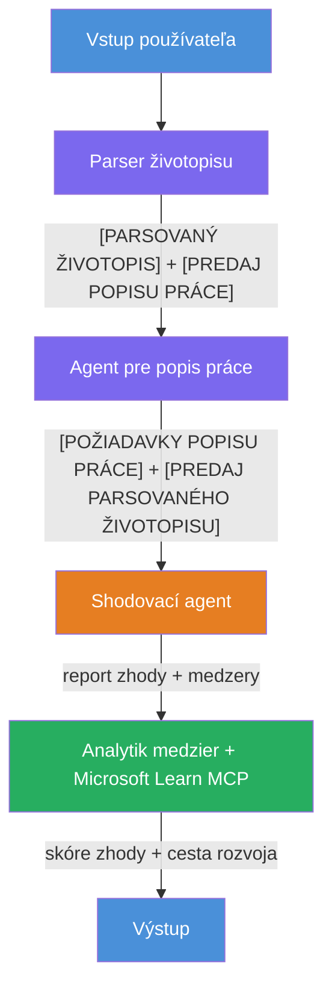

# Laboratórium 02 - Viacagentný pracovný tok: Zhodnotenie životopisu → vhodnosť na pracovnú pozíciu

## Prehľad

V tomto praktickom laboratóriu vytvoríte **multi-agentnú aplikáciu orientovanú na pracovný tok** pomocou Foundry Toolkit vo VS Code a nasadíte ju do služby Microsoft Foundry Agent.

**Čo vybudujete:** Zhodnotenie životopisu → vhodnosť na pracovnú pozíciu, ktoré analyzuje životopis a popis pracovnej pozície, vyhodnotí zhody a vytvorí personalizovaný plán učenia pomocou zdrojov Microsoft Learn.

---

## Architektúra

```mermaid
flowchart TD
    A["Vstup používateľa"] --> B["Parser životopisu"]
    B -->|"[PARSOVANÝ ŽIVOTOPIS] + [PREDAJ POPISU PRÁCE]"| C["Agent pre popis práce"]
    C -->|"[POŽIADAVKY POPISU PRÁCE] + [PREDAJ PARSOVANÉHO ŽIVOTOPISU]"| D["Shodovací agent"]
    D -->|report zhody + medzery| E["Analytik medzier + Microsoft Learn MCP"]
    E -->|skóre zhody + cesta rozvoja| F["Výstup"]

    style A fill:#4A90D9,color:#fff
    style B fill:#7B68EE,color:#fff
    style C fill:#7B68EE,color:#fff
    style D fill:#E67E22,color:#fff
    style E fill:#27AE60,color:#fff
    style F fill:#4A90D9,color:#fff
```

**Ako to funguje:**
1. Používateľ vloží životopis a popis pracovnej pozície.
2. **ResumeParser** spracuje životopis a skopíruje popis pracovnej pozície doslovne do sekcie `[JOB DESCRIPTION PASS-THROUGH]`.
3. **JD Agent** extrahuje štruktúrované požiadavky z tejto sekcie, potom posiela `[PARSED RESUME]` dopredu ako `[PARSED RESUME PASS-THROUGH]`.
4. **MatchingAgent** porovnáva `[PARSED RESUME PASS-THROUGH]` s `[JD REQUIREMENTS]` a vytvorí skóre zhody.
5. **GapAnalyzer** premieňa medzery na praktický plán a získava reálne odkazy Microsoft Learn cez MCP.

---

## Predpoklady

Najprv dokončite Laboratórium 01:

- [Laboratórium 01 - Jediný agent](../lab01-single-agent/README.md)

---

## Časť 1: Prečítajte si moduly v poradí

Kompletnú vzdelávaciu cestu nájdete v:

- [Dokumentácia Laboratória 2 - Predpoklady](docs/00-prerequisites.md)
- [Dokumentácia Laboratória 2 - Kompletná vzdelávacia cesta](docs/README.md)
- [Príručka na spustenie PersonalCareerCopilot](PersonalCareerCopilot/README.md)

---

## Časť 2: Vybudujte a otestujte pracovný tok

1. Použite sprievodcu Foundry Toolkit na vytvorenie projektu založeného na pracovnom toku.
2. Skopírujte bloky výziev a graf pracovného toku zo súboru `PersonalCareerCopilot/main.py` do svojho pracovného priestoru.
3. Spustite lokálne pomocou Agent Inspector a overte všetkých štyroch agentov plus nástroj MCP.
4. Po úspešnom lokálnom teste nasadte hostovaného agenta do Foundry.

---

## Vzory orchesterácie

Laboratórium 02 obsahuje predvolený **fan-out → fan-in → sekvenčný** tok a dokumentácia popisuje aj alternatívne vzory orchesterácie na experimentovanie.

- **Fan-out/Fan-in s váženým konsenzom**
- **Prechod cez recenzenta/kritika pred finálnym plánom**
- **Podmienený router** založený na skóre zhody a chýbajúcich zručnostiach

Pozrite si [docs/04-orchestration-patterns.md](docs/04-orchestration-patterns.md).

---

**Predchádzajúce:** [Laboratórium 01 - Jediný agent](../lab01-single-agent/README.md) · **Späť na:** [Domovská stránka workshopu](../../README.md)

---

<!-- CO-OP TRANSLATOR DISCLAIMER START -->
**Vyhlásenie o zodpovednosti**:
Tento dokument bol preložený pomocou AI prekladateľskej služby [Co-op Translator](https://github.com/Azure/co-op-translator). Hoci sa snažíme o presnosť, vezmite prosím na vedomie, že automatické preklady môžu obsahovať chyby alebo nepresnosti. Pôvodný dokument v jeho natívnom jazyku by mal byť považovaný za autoritatívny zdroj. Pre kritické informácie sa odporúča profesionálny ľudský preklad. Nie sme zodpovední za žiadne nedorozumenia alebo nesprávne interpretácie vyplývajúce z použitia tohto prekladu.
<!-- CO-OP TRANSLATOR DISCLAIMER END -->