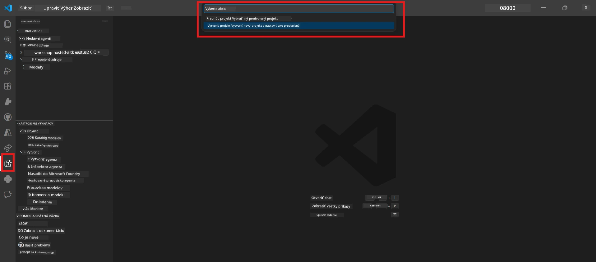

# Modul 0 - Predpoklady

Pred začatím Lab 02 si potvrďte, že máte splnené nasledujúce požiadavky. Tento laboratórny úloh nadväzuje priamo na Lab 01 - nevynechávajte ho.

---

## 1. Dokončiť Lab 01

Lab 02 predpokladá, že ste už:

- [x] Dokončili všetkých 8 modulov [Lab 01 - Single Agent](../../lab01-single-agent/README.md)
- [x] Úspešne nasadili jedného agenta do Foundry Agent Service
- [x] Overili, že agent funguje v lokálnom Agent Inspector aj Foundry Playground

Ak ste Lab 01 nedokončili, vráťte sa a dokončite ho teraz: [Lab 01 Dokumentácia](../../lab01-single-agent/docs/00-prerequisites.md)

---

## 2. Overenie existujúcej konfigurácie

Všetky nástroje z Lab 01 by mali byť stále nainštalované a fungovať. Spustite tieto rýchle kontroly:

### 2.1 Azure CLI

```powershell
az account show --query "{name:name, id:id}" --output table
```

Očakávané: Zobrazí názov a ID vašej predplatenej služby. Ak to zlyhá, spustite [`az login`](https://learn.microsoft.com/cli/azure/authenticate-azure-cli-interactively).

### 2.2 Rozšírenia VS Code

1. Stlačte `Ctrl+Shift+P` → napíšte **"Microsoft Foundry"** → potvrďte, že vidíte príkazy (napr. `Microsoft Foundry: Create a New Hosted Agent`).
2. Stlačte `Ctrl+Shift+P` → napíšte **"Foundry Toolkit"** → potvrďte, že vidíte príkazy (napr. `Foundry Toolkit: Open Agent Inspector`).

### 2.3 Projekt a model Foundry

1. Kliknite na ikonu **Microsoft Foundry** v lište aktivít VS Code.
2. Potvrďte, že je váš projekt uvedený (napr. `workshop-agents`).
3. Rozbaľte projekt → overte, že existuje nasadený model (napr. `gpt-4.1-mini`) so stavom **Succeeded**.

> **Ak platnosť vášho modelu vypršala:** Niektoré nasadenia vo free tier automaticky expirovali. Nasadte ho znovu z [katalógu modelov](https://learn.microsoft.com/azure/foundry/foundry-models/concepts/models-sold-directly-by-azure) (`Ctrl+Shift+P` → **Microsoft Foundry: Open Model Catalog**).



### 2.4 RBAC role

Overte, že máte na svojom projekte Foundry priradenú **Azure AI User** rolu:

1. [Azure Portal](https://portal.azure.com) → vaša Foundry **projektová** entita → **Access control (IAM)** → záložka **[Role assignments](https://learn.microsoft.com/azure/foundry/concepts/rbac-foundry)**.
2. Vyhľadajte svoje meno → potvrďte, že je uvedená **[Azure AI User](https://aka.ms/foundry-ext-project-role)**.

---

## 3. Pochopenie konceptov multi-agentov (nové pre Lab 02)

Lab 02 zavádza koncepty, ktoré v Lab 01 neboli pokryté. Prečítajte si ich predtým, než budete pokračovať:

### 3.1 Čo je multi-agentný pracovný postup?

Namiesto toho, aby jeden agent riešil všetko, **multi-agentný pracovný postup** rozdeľuje prácu medzi viacerých špecializovaných agentov. Každý agent má:

- svoje vlastné **inštrukcie** (systémový prompt)
- svoju vlastnú **úlohu** (za čo je zodpovedný)
- voliteľné **nástroje** (funkcie, ktoré môže volať)

Agenti komunikujú cez **orchestráciu grafu**, ktorý definuje, ako medzi nimi prúdia dáta.

### 3.2 WorkflowBuilder

Trieda [`WorkflowBuilder`](https://learn.microsoft.com/agent-framework/workflows/agents-in-workflows) z `agent_framework` je SDK komponent, ktorý prepája agentov:

```python
from agent_framework import WorkflowBuilder

workflow = (
    WorkflowBuilder(
        name="MyWorkflow",
        start_executor=agent_a,
        output_executors=[agent_d],
    )
    .add_edge(agent_a, agent_b)
    .add_edge(agent_a, agent_c)
    .add_edge(agent_b, agent_d)
    .add_edge(agent_c, agent_d)
    .build()
)
```

- **`start_executor`** - Prvý agent, ktorý prijíma vstup od používateľa
- **`output_executors`** - Agent(i), ktorého výstup sa stáva finálnou odpoveďou
- **`add_edge(source, target)`** - Definuje, že `target` prijíma výstup z `source`

### 3.3 MCP (Model Context Protocol) nástroje

Lab 02 používa **MCP nástroj**, ktorý volá Microsoft Learn API na získanie vzdelávacích zdrojov. [MCP (Model Context Protocol)](https://modelcontextprotocol.io/introduction) je štandardizovaný protokol na prepojenie modelov AI s externými zdrojmi dát a nástrojmi.

| Termín | Definícia |
|------|----------|
| **MCP server** | Služba, ktorá vystavuje nástroje/zdroje cez [MCP protokol](https://learn.microsoft.com/azure/foundry/agents/how-to/tools/model-context-protocol) |
| **MCP klient** | Váš kód agenta, ktorý sa pripája k MCP serveru a volá jeho nástroje |
| **[Streamable HTTP](https://learn.microsoft.com/agent-framework/agents/tools/hosted-mcp-tools)** | Prenosový spôsob komunikácie s MCP serverom |

### 3.4 Ako sa Lab 02 líši od Lab 01

| Aspekt | Lab 01 (Single Agent) | Lab 02 (Multi-Agent) |
|--------|----------------------|---------------------|
| Agenti | 1 | 4 (špecializované úlohy) |
| Orchestration (orchestrácia) | Žiadna | WorkflowBuilder (paralelná a sekvenčná) |
| Nástroje | Voliteľná funkcia `@tool` | MCP nástroj (volanie externého API) |
| Komplexnosť | Jednoduchý prompt → odpoveď | Životopis + pracovná pozícia → skóre zhody → plán |
| Tok kontextu | Priamy | Postupné odovzdanie agent- k-agentovi |

---

## 4. Štruktúra repozitára workshopu pre Lab 02

Uistite sa, že viete, kde sú súbory pre Lab 02:

```
workshop/
└── lab02-multi-agent/
    ├── README.md                       ← Lab overview
    ├── docs/                           ← You are here
    │   ├── README.md                   ← Learning path index
    │   ├── 00-prerequisites.md         ← This file
    │   ├── 01-understand-multi-agent.md
    │   ├── ...
    │   └── 08-troubleshooting.md
    └── PersonalCareerCopilot/          ← The agent project
        ├── agent.yaml                  ← Agent definition
        ├── main.py                     ← 4-agent workflow code
        ├── Dockerfile                  ← Container configuration
        └── requirements.txt            ← Python dependencies
```

---

### Kontrolný zoznam

- [ ] Lab 01 je úplne dokončený (všetkých 8 modulov, agent nasadený a overený)
- [ ] `az account show` zobrazuje vaše predplatné
- [ ] Rozšírenia Microsoft Foundry a Foundry Toolkit sú nainštalované a reagujú
- [ ] Projekt Foundry má nasadený model (napr. `gpt-4.1-mini`)
- [ ] Máte rolu **Azure AI User** na projekte
- [ ] Prečítali ste si sekciu o multi-agentných konceptoch vyššie a rozumiete WorkflowBuilder, MCP a orchestrácii agentov

---

**Ďalšie:** [01 - Pochopiť Multi-Agent Architektúru →](01-understand-multi-agent.md)

---

<!-- CO-OP TRANSLATOR DISCLAIMER START -->
**Zrieknutie sa zodpovednosti**:  
Tento dokument bol preložený pomocou AI prekladateľskej služby [Co-op Translator](https://github.com/Azure/co-op-translator). Aj keď sa snažíme o presnosť, prosím, vezmite na vedomie, že automatizované preklady môžu obsahovať chyby alebo nepresnosti. Pôvodný dokument v jeho pôvodnom jazyku by mal byť považovaný za autoritatívny zdroj. Pri kritických informáciách sa odporúča profesionálny ľudský preklad. Neručíme za akékoľvek nepochopenia alebo nesprávne výklady vyplývajúce z použitia tohto prekladu.
<!-- CO-OP TRANSLATOR DISCLAIMER END -->