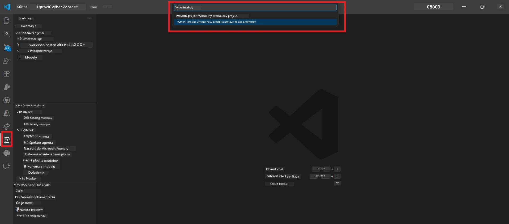

# Modul 0 - Úvod

⏱️ ~10 min

> [!WARNING]
> **Náhľad a obmedzenia:** [Hosted Agents](https://learn.microsoft.com/azure/foundry/agents/concepts/hosted-agents) sú momentálne v **verejnom náhľade** - neodporúča sa používať na produkčné záťaže. Niektoré funkcie zobrazené v tomto workshope sa môžu zmeniť, keď služba prejde do GA.

## Čo si postavíte

V tomto kurze rozšírite schopnosti jedného agenta z Lab 01 a postavíte **workflow s viacerými agentmi** - Vyhodnocovač životopisu a vhodnosti na pracovnú pozíciu.

Vložíte sem **životopis** a **popis pracovnej pozície**. Štyria špecializovaní agenti spracujú vstup po sebe a potom vrátia:
- Skóre vhodnosti (0–100 so rozpisom bodov)
- Zoznam nedostatkov zručností a certifikátov
- Personalizovanú učebnú cestu s reálnymi odkazmi na Microsoft Learn pre každý nedostatok

**Workflow používa:**
- **Microsoft Agent Framework** - `WorkflowBuilder` na orchestráciu sekvenčného pipeline
- **Foundry Toolkit pre VS Code** - scaffoldovanie, lokálne testovanie, nasadenie
- **AI model** (napr. `gpt-4.1-mini`) - používaný všetkými štyrmi agentmi
- **Microsoft Learn MCP server** - poskytuje reálne odkazy na vzdelávacie zdroje pre každý nedostatok zručnosti

---

## Vyberte si svoju cestu

> ⚠️ **Pokračujte tou istou cestou, ktorú ste použili v Lab 01.**

<details open>
<summary><strong>🅰️ Cesta A - Azure cloud (vyžaduje predplatné Azure)</strong></summary>

| | Podrobnosti |
|---|---|
| **Pre koho je toto určené?** | Dokončili ste Lab 01 s Azure predplatným |
| **Model** | Azure OpenAI cez Foundry (napr. `gpt-4.1-mini`) |
| **Pokryté moduly** | Všetky moduly (00–09) |
| **Nasadiť do cloudu?** | ✅ Áno - plné end-to-end nasadenie |

</details>

<details open>
<summary><strong>🅱️ Cesta B - Foundry Local (nevyžaduje Azure predplatné)</strong></summary>

| | Podrobnosti |
|---|---|
| **Pre koho je toto určené?** | Dokončili ste Lab 01 pomocou Foundry Local |
| **Model** | Foundry Local (zadarmo, beží na vašom zariadení) |
| **Pokryté moduly** | Moduly 00–05 (vynechať 06–07 - nasadenie & cloud overenie) |
| **Nasadiť do cloudu?** | ❌ Nie - iba lokálne testovanie pomocou Agent Inspector |

</details>

---

## Kontrola Lab 01

Lab 02 priamo nadväzuje na Lab 01. Dokončite Lab 01 skôr, než začnete tu.

Ešte ste nespravili Lab 01? Začnite tu: [Lab 01 - Úvod](../../lab01-single-agent/docs/00-prerequisites.md)

<details open>
<summary><strong>🅰️ Cesta A - Azure cloud</strong></summary>

```powershell
az account show --query "{name:name, id:id}" --output table
```

Ak to zlyhá, spustite `az login`. Potom overte vo VS Code:

1. `Ctrl+Shift+P` → zadajte **Foundry Toolkit** → potvrďte, že sa zobrazia príkazy.
2. Kliknite na ikonu **Foundry Toolkit** → váš projekt a nasadený model ukážu **Succeeded**.



> **RBAC:** Priradili ste rolu **Foundry User** v Lab 01. Ak ju potrebujete znova priradiť, pozrite si [Lab 01, Modul 1](../../lab01-single-agent/docs/01-setup.md#deploy-a-model--assign-rbac). Rola bola predtým nazvaná **Azure AI User** - rovnako oprávnenia.

</details>

<details open>
<summary><strong>🅱️ Cesta B - Foundry Local</strong></summary>

```powershell
Invoke-WebRequest -Uri "http://localhost:5273/v1/health" -UseBasicParsing | Select-Object StatusCode
```

Očakávané: `StatusCode: 200`. Ak nie, reštartujte Foundry Local z Foundry Toolkit postranného panela.

> Všetky inferencie bežia na vašom zariadení. Jediný odchádzajúci hovor je nástroj MCP na `https://learn.microsoft.com/api/mcp`.

</details>

---

## Čo je nové v Lab 02

| | Lab 01 | Lab 02 |
|--|--------|--------|
| Agenti | 1 | 4 (reťazené pomocou WorkflowBuilder) |
| Šablóna scaffoldu | Základná - Agent Framework | Workflow - Agent Framework |
| Nový balík | - | `mcp` |
| Orchestrácia | Jeden konverzačný agent | Sekvenčný pipeline (WorkflowBuilder) |
| Nový nástroj | - | `search_microsoft_learn_for_plan` (MCP) |

---

**Ďalej:** [01 - Pochopiť architektúru →](01-understand-multi-agent.md)

---

<!-- CO-OP TRANSLATOR DISCLAIMER START -->
**Vyhlásenie o zodpovednosti**:
Tento dokument bol preložený pomocou AI prekladateľskej služby [Co-op Translator](https://github.com/Azure/co-op-translator). Hoci sa snažíme o presnosť, vezmite prosím na vedomie, že automatické preklady môžu obsahovať chyby alebo nepresnosti. Pôvodný dokument v jeho natívnom jazyku by mal byť považovaný za autoritatívny zdroj. Pre kritické informácie sa odporúča profesionálny ľudský preklad. Nie sme zodpovední za žiadne nedorozumenia alebo nesprávne interpretácie vyplývajúce z použitia tohto prekladu.
<!-- CO-OP TRANSLATOR DISCLAIMER END -->