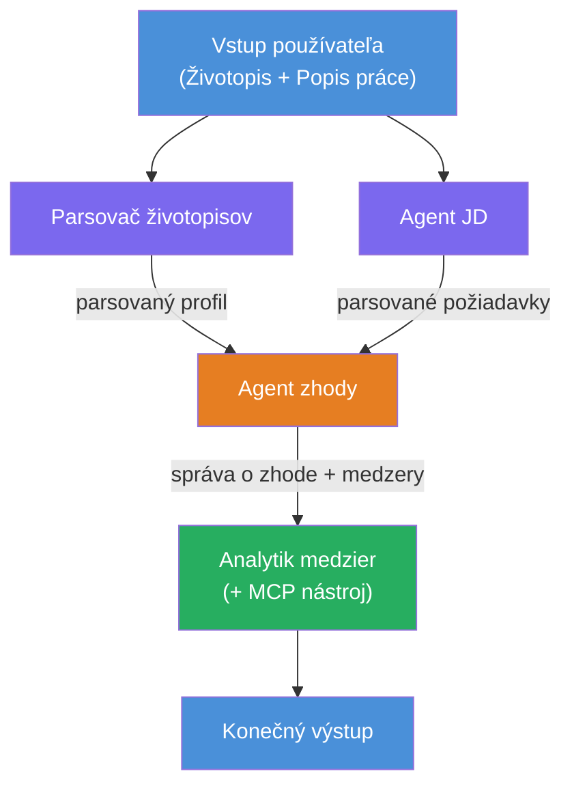
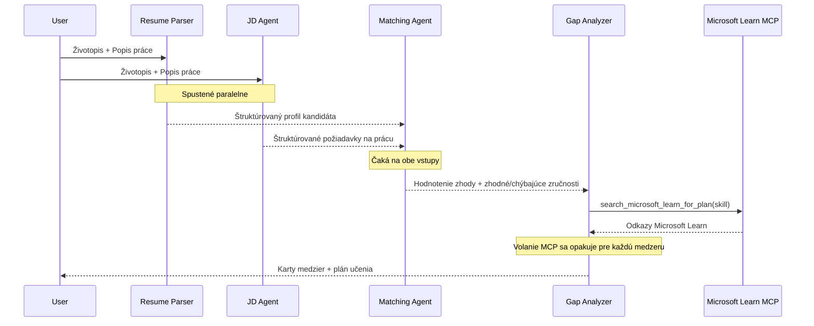
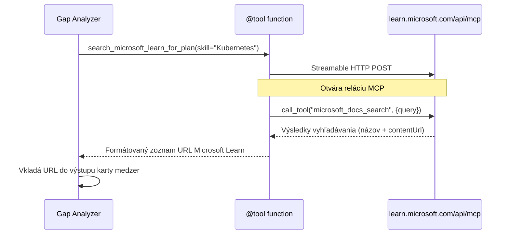

# Modul 1 - Pochopenie architektúry viacagentového systému

V tomto module sa naučíte architektúru vyhodnocovača zhody životopisu a pracovnej ponuky predtým, než začnete písať kód. Pochopenie orchestrácie grafu, rolí agentov a toku dát je kľúčové pre ladenie a rozširovanie [multiagentových pracovných tokov](https://learn.microsoft.com/azure/architecture/ai-ml/idea/multiple-agent-workflow-automation).

---

## Problém, ktorý tento modul rieši

Prepojenie životopisu s popisom práce vyžaduje viacero odlišných schopností:

1. **Parsovanie** - extrahovanie štruktúrovaných údajov z neštruktúrovaného textu (životopisu)
2. **Analýza** - extrahovanie požiadaviek z popisu práce
3. **Porovnanie** - hodnotenie zhody medzi týmito dvoma
4. **Plánovanie** - vytvorenie učebnej cesty pre vyplnenie medzier

Jeden agent, ktorý robí všetky štyri úlohy v jednom promptu, často produkuje:
- Neúplné extrahovanie (ponáhľa sa cez parsovanie na rýchle získanie skóre)
- Povrchné hodnotenie (bez podrobných dôkazov)
- Všeobecné plány (neprispôsobené konkrétnym medzerám)

Rozdelením do **štyroch špecializovaných agentov**, každý sa zameriava na svoju úlohu s dedikovanými inštrukciami, čo vedie ku kvalitnejšiemu výstupu na každom kroku.

---

## Štyria agenti

Každý agent je plnohodnotný [Microsoft Foundry](https://learn.microsoft.com/azure/foundry/agents/concepts/hosted-agents) agent vytvorený pomocou `AzureAIAgentClient.as_agent()`. Zdieľajú rovnaké nasadenie modelu, ale majú rozdielne inštrukcie a (voliteľne) rôzne nástroje.

| # | Názov agenta | Úloha | Vstup | Výstup |
|---|--------------|-------|-------|--------|
| 1 | **ResumeParser** | Extrahuje štruktúrovaný profil z textu životopisu | Hrubý text životopisu (od používateľa) | Profil kandidáta, Technické zručnosti, Mäkké zručnosti, Certifikáty, Skúsenosti v oblasti, Úspechy |
| 2 | **JobDescriptionAgent** | Extrahuje štruktúrované požiadavky z popisu práce | Hrubý text pracovnej ponuky (od používateľa, poslaný cez ResumeParser) | Prehľad role, Požadované zručnosti, Preferované zručnosti, Skúsenosti, Certifikáty, Vzdelanie, Zodpovednosti |
| 3 | **MatchingAgent** | Vypočíta hodnotenie zhody na základe dôkazov | Výstupy z ResumeParser + JobDescriptionAgent | Hodnotenie zhody (0-100 s rozpisom), Zladené zručnosti, Chýbajúce zručnosti, Medzery |
| 4 | **GapAnalyzer** | Vytvára personalizovaný učebný plán | Výstup z MatchingAgent | Karty medzier (pre každú zručnosť), Poradie učenia, Časový plán, Zdroje z Microsoft Learn |

---

## Orchestration graf

Workflow používa **paralelný rozvetvovací fan-out** následovaný **sekvenčnou agregáciou**:


> **Legenda:** Fialová = paralelní agenti, Oranžová = agregačný bod, Zelená = finálny agent s nástrojmi

### Ako prebieha tok dát


1. **Používateľ pošle** správu obsahujúcu životopis a popis práce.
2. **ResumeParser** prijme celý vstup od používateľa a extrahuje štruktúrovaný profil kandidáta.
3. **JobDescriptionAgent** zároveň prijme vstup od používateľa a extrahuje štruktúrované požiadavky.
4. **MatchingAgent** prijme výstupy z **oboch** - ResumeParser aj JobDescriptionAgent (framework čaká na dokončenie oboch pred spustením MatchingAgent).
5. **GapAnalyzer** prijme výstup MatchingAgenta a volá **Microsoft Learn MCP nástroj** na získanie skutočných učebných zdrojov pre každú medzeru.
6. **Konečný výstup** je odpoveď GapAnalyzera, ktorá obsahuje skóre zhody, karty medzier a kompletný učebný plán.

### Prečo je paralelný fan-out dôležitý

ResumeParser a JobDescriptionAgent bežia **paralelne**, pretože jeden na druhom nezávisia. To:
- Znižuje celkovú latenciu (bežia zároveň namiesto sekvenčne)
- Je prirodzené rozdelenie (parsovanie životopisu verzus parsovanie pracovnej ponuky sú nezávislé úlohy)
- Ukazuje bežný multiagentový vzor: **fan-out → agregácia → akcia**

---

## WorkflowBuilder v kóde

Tu je, ako graf vyššie zodpovedá volaniam [`WorkflowBuilder`](https://learn.microsoft.com/agent-framework/workflows/agents-in-workflows) v `main.py`:

```python
from agent_framework import WorkflowBuilder

workflow = (
    WorkflowBuilder(
        name="ResumeJobFitEvaluator",
        start_executor=resume_parser,       # Prvý agent, ktorý prijíma vstup od používateľa
        output_executors=[gap_analyzer],     # Konečný agent, ktorého výstup sa vracia
    )
    .add_edge(resume_parser, jd_agent)      # ResumeParser → JobDescriptionAgent
    .add_edge(resume_parser, matching_agent) # ResumeParser → MatchingAgent
    .add_edge(jd_agent, matching_agent)      # JobDescriptionAgent → MatchingAgent
    .add_edge(matching_agent, gap_analyzer)  # MatchingAgent → GapAnalyzer
    .build()
)
```

**Pochopenie hrán (edges):**

| Hrana | Čo znamená |
|-------|------------|
| `resume_parser → jd_agent` | JD Agent prijíma výstup z ResumeParser |
| `resume_parser → matching_agent` | MatchingAgent prijíma výstup z ResumeParser |
| `jd_agent → matching_agent` | MatchingAgent tiež prijíma výstup z JD Agent (čaká na oba) |
| `matching_agent → gap_analyzer` | GapAnalyzer prijíma výstup z MatchingAgent |

Pretože `matching_agent` má **dve vstupné hrany** (`resume_parser` a `jd_agent`), framework automaticky čaká na dokončenie oboch pred spustením MatchingAgenta.

---

## MCP nástroj

Agent GapAnalyzer má jeden nástroj: `search_microsoft_learn_for_plan`. Toto je **[MCP nástroj](https://learn.microsoft.com/agent-framework/agents/tools/hosted-mcp-tools)**, ktorý volá API Microsoft Learn na získanie vybraných učebných zdrojov.

### Ako to funguje

```python
@tool
async def search_microsoft_learn_for_plan(
    skill: str, role: str = "", max_results: int = 5
) -> str:
    """Search Microsoft Learn MCP and return curated official links."""
    # Pripája sa na https://learn.microsoft.com/api/mcp cez Streamable HTTP
    # Volá nástroj 'microsoft_docs_search' na serveri MCP
    # Vracia formátovaný zoznam URL adries Microsoft Learn
```

### Priebeh volania MCP


1. GapAnalyzer rozhodne, že potrebuje učebné zdroje pre určitú zručnosť (napr. "Kubernetes")
2. Framework volá `search_microsoft_learn_for_plan(skill="Kubernetes")`
3. Funkcia otvorí [Streamable HTTP](https://learn.microsoft.com/agent-framework/agents/tools/hosted-mcp-tools) spojenie na `https://learn.microsoft.com/api/mcp`
4. Volá nástroj `microsoft_docs_search` na [MCP serveri](https://learn.microsoft.com/azure/foundry/agents/how-to/tools/model-context-protocol)
5. MCP server vráti výsledky vyhľadávania (titulok + URL)
6. Funkcia formátuje výsledky a vráti ich ako reťazec
7. GapAnalyzer použije získané URL adresy vo výstupe kariet medzier

### Očakávané MCP logy

Keď nástroj beží, uvidíte záznamy v logu ako:

```
GET https://learn.microsoft.com/api/mcp → 405 (Method Not Allowed)
POST https://learn.microsoft.com/api/mcp → 200
DELETE https://learn.microsoft.com/api/mcp → 405 (Method Not Allowed)
```

**Tieto sú normálne.** MCP klient počas inicializácie skúša GET a DELETE - očakáva sa stav 405. Skutočné volanie nástroja používa POST a vracia 200. Obávajte sa len, ak POST volania zlyhajú.

---

## Vzorec tvorby agentov

Každý agent sa vytvára pomocou **[asynchrónneho kontextového manažéra `AzureAIAgentClient.as_agent()`](https://learn.microsoft.com/python/api/overview/azure/ai-agents-readme)**. Toto je vzorec SDK Foundry pre vytváranie agentov, ktorí sú automaticky vyčistení:

```python
async with (
    get_credential() as credential,
    AzureAIAgentClient(
        project_endpoint=PROJECT_ENDPOINT,
        model_deployment_name=MODEL_DEPLOYMENT_NAME,
        credential=credential,
    ).as_agent(
        name="ResumeParser",
        instructions=RESUME_PARSER_INSTRUCTIONS,
    ) as resume_parser,
    # ... opakovať pre každého agenta ...
):
    # Tu existujú všetci 4 agenti
    workflow = create_workflow(resume_parser, jd_agent, matching_agent, gap_analyzer)
```

**Kľúčové body:**
- Každý agent má svoju vlastnú inštanciu `AzureAIAgentClient` (SDK vyžaduje, aby názov agenta bol viazaný na klienta)
- Všetci agenti zdieľajú rovnaký `credential`, `PROJECT_ENDPOINT` a `MODEL_DEPLOYMENT_NAME`
- Blok `async with` zabezpečuje, že všetci agenti sú vyčistení pri vypnutí servera
- GapAnalyzer navyše dostáva `tools=[search_microsoft_learn_for_plan]`

---

## Štart servera

Po vytvorení agentov a postavení workflow server štartuje:

```python
from azure.ai.agentserver.agentframework import from_agent_framework

agent = create_workflow(resume_parser, jd_agent, matching_agent, gap_analyzer)
await from_agent_framework(agent).run_async()
```

`from_agent_framework()` zabalí workflow ako HTTP server exponujúci endpoint `/responses` na porte 8088. Toto je rovnaký vzor ako v Labe 01, ale „agent“ je teraz celý [workflow graf](https://learn.microsoft.com/agent-framework/workflows/as-agents).

---

### Kontrolný zoznam

- [ ] Rozumiete architektúre so 4 agentmi a úlohám každého agenta
- [ ] Dokážete sledovať tok dát: Používateľ → ResumeParser → (paralelne) JD Agent + MatchingAgent → GapAnalyzer → Výstup
- [ ] Rozumiete, prečo MatchingAgent čaká na ResumeParser aj JD Agent (dve vstupné hrany)
- [ ] Rozumiete MCP nástroju: čo robí, ako sa volá a že GET 405 logy sú normálne
- [ ] Rozumiete vzorcu `AzureAIAgentClient.as_agent()` a prečo má každý agent svoju vlastnú klientsku inštanciu
- [ ] Dokážete čítať kód `WorkflowBuilder` a mapovať ho na vizuálny graf

---

**Predchádzajúce:** [00 - Požiadavky](00-prerequisites.md) · **Ďalšie:** [02 - Scaffold the Multi-Agent Project →](02-scaffold-multi-agent.md)

---

<!-- CO-OP TRANSLATOR DISCLAIMER START -->
**Zrieknutie sa zodpovednosti**:  
Tento dokument bol preložený pomocou AI prekladateľskej služby [Co-op Translator](https://github.com/Azure/co-op-translator). Aj keď sa snažíme o presnosť, majte prosím na pamäti, že automatizované preklady môžu obsahovať chyby alebo nepresnosti. Pôvodný dokument v jeho rodnom jazyku by mal byť považovaný za autoritatívny zdroj. Pre kritické informácie sa odporúča profesionálny ľudský preklad. Nie sme zodpovední za akékoľvek nedorozumenia alebo nesprávne interpretácie vzniknuté používaním tohto prekladu.
<!-- CO-OP TRANSLATOR DISCLAIMER END -->