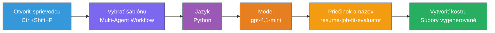
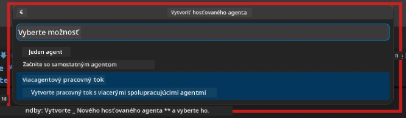

# Modul 2 - Vytvorenie projektu pre viacagentový systém

V tomto module použijete [rozšírenie Microsoft Foundry](https://marketplace.visualstudio.com/items?itemName=TeamsDevApp.vscode-ai-foundry) na **vytvorenie projektu viacagentového workflow**. Rozšírenie vygeneruje celú štruktúru projektu - `agent.yaml`, `main.py`, `Dockerfile`, `requirements.txt`, `.env` a konfiguračný súbor pre ladenie. Tieto súbory potom upravíte v moduloch 3 a 4.

> **Poznámka:** Priečinok `PersonalCareerCopilot/` v tomto návode je kompletným, funkčným príkladom prispôsobeného viacagentového projektu. Môžete si buď vytvoriť nový projekt (odporúčané pre učenie sa), alebo študovať existujúci kód priamo.

---

## Krok 1: Otvorte sprievodcu Create Hosted Agent


1. Stlačte `Ctrl+Shift+P` pre otvorenie **Command Palette**.
2. Zadajte: **Microsoft Foundry: Create a New Hosted Agent** a vyberte túto možnosť.
3. Otvorí sa sprievodca vytvorením hostovaného agenta.

> **Alternatíva:** Kliknite na ikonu **Microsoft Foundry** v Activity Bar → kliknite na ikonu **+** vedľa **Agents** → **Create New Hosted Agent**.

---

## Krok 2: Vyberte šablónu Multi-Agent Workflow

Sprievodca vás vyzve na výber šablóny:

| Šablóna | Popis | Kedy použiť |
|----------|-------------|-------------|
| Single Agent | Jeden agent s inštrukciami a voliteľnými nástrojmi | Lab 01 |
| **Multi-Agent Workflow** | Viac agentov spolupracujúcich cez WorkflowBuilder | **Tento návod (Lab 02)** |

1. Vyberte **Multi-Agent Workflow**.
2. Kliknite na **Next**.



---

## Krok 3: Vyberte programovací jazyk

1. Vyberte **Python**.
2. Kliknite na **Next**.

---

## Krok 4: Vyberte model

1. Sprievodca zobrazí modely nasadené vo vašom projekte Foundry.
2. Vyberte rovnaký model, aký ste použili v Labe 01 (napr. **gpt-4.1-mini**).
3. Kliknite na **Next**.

> **Tip:** [`gpt-4.1-mini`](https://learn.microsoft.com/azure/foundry/foundry-models/concepts/models-sold-directly-by-azure#gpt-41-series) je odporúčaný na vývoj - je rýchly, lacný a dobre zvláda viacagentové workflow. Pre finálne produkčné nasadenie prepnite na `gpt-4.1`, ak chcete vyššiu kvalitu výstupu.

---

## Krok 5: Vyberte umiestnenie priečinka a meno agenta

1. Otvorí sa dialóg na výber súboru. Vyberte cieľový priečinok:
   - Ak pracujete s repozitárom workshopu: prejdite do `workshop/lab02-multi-agent/` a vytvorte nový podpriečinok
   - Ak začínate od začiatku: vyberte ľubovoľný priečinok
2. Zadajte **názov** hostovaného agenta (napr. `resume-job-fit-evaluator`).
3. Kliknite na **Create**.

---

## Krok 6: Počkajte na dokončenie scaffoldingu

1. VS Code otvorí nové okno (alebo aktualizuje aktuálne) so scaffoldovaným projektom.
2. Mali by ste vidieť túto štruktúru súborov:

```
resume-job-fit-evaluator/
├── .env                ← Environment variables (placeholders)
├── .vscode/
│   └── launch.json     ← Debug configuration
├── agent.yaml          ← Agent definition (kind: hosted)
├── Dockerfile          ← Container configuration
├── main.py             ← Multi-agent workflow code (scaffold)
└── requirements.txt    ← Python dependencies
```

> **Poznámka k workshopu:** V repozitári workshopu je priečinok `.vscode/` v koreňovej zložke workspace so zdieľanými súbormi `launch.json` a `tasks.json`. Konfigurácie pre ladenie pre Lab 01 a Lab 02 sú obe zahrnuté. Pri stlačení F5 vyberte z rozbaľovacieho zoznamu **"Lab02 - Multi-Agent"**.

---

## Krok 7: Porozumieť scaffoldovaným súborom (špecifiká viacagentového riešenia)

Viacagentový scaffold sa líši od jednoagentového scaffoldu v niekoľkých kľúčových bodoch:

### 7.1 `agent.yaml` - Definícia agenta

```yaml
kind: hosted
name: resume-job-fit-evaluator
description: >
  A multi-agent workflow that evaluates resume-to-job fit.
metadata:
  authors:
    - Microsoft
  tags:
    - Multi-Agent Workflow
    - Resume Evaluator
protocols:
  - protocol: responses
    version: v1
environment_variables:
  - name: PROJECT_ENDPOINT
    value: ${PROJECT_ENDPOINT}
  - name: MODEL_DEPLOYMENT_NAME
    value: ${MODEL_DEPLOYMENT_NAME}
```

**Hlavný rozdiel oproti Lab 01:** Sekcia `environment_variables` môže obsahovať dodatočné premenné pre MCP endpointy alebo inú konfiguráciu nástrojov. `name` a `description` odrážajú viacagentový prípad použitia.

### 7.2 `main.py` - Kód viacagentového workflow

Scaffold obsahuje:
- **Viacero textov inštrukcií pre agentov** (konštanty, každá pre jedného agenta)
- **Viacero kontextových manažérov [`AzureAIAgentClient.as_agent()`](https://learn.microsoft.com/python/api/overview/azure/ai-agents-readme)** (jeden pre každého agenta)
- **[`WorkflowBuilder`](https://learn.microsoft.com/agent-framework/workflows/agents-in-workflows)** na prepojenie agentov
- **`from_agent_framework()`** na sprístupnenie workflow ako HTTP endpointu

```python
from agent_framework import WorkflowBuilder, tool
from agent_framework.azure import AzureAIAgentClient
from azure.ai.agentserver.agentframework import from_agent_framework
```

Dodatočný import [`WorkflowBuilder`](https://learn.microsoft.com/agent-framework/workflows/agents-in-workflows) je novinkou oproti Labe 01.

### 7.3 `requirements.txt` - Dodatočné závislosti

Viacagentový projekt používa rovnaké základné balíky ako Lab 01, plus MCP-súvisiace balíky:

```
agent-framework-azure-ai==1.0.0rc3
agent-framework-core==1.0.0rc3
azure-ai-agentserver-agentframework==1.0.0b16
azure-ai-agentserver-core==1.0.0b16
debugpy
agent-dev-cli --pre
```

> **Dôležitá poznámka ku verziám:** Balík `agent-dev-cli` vyžaduje v `requirements.txt` príznak `--pre` pre inštaláciu najnovšej preview verzie. Je to potrebné pre kompatibilitu Agent Inspector s `agent-framework-core==1.0.0rc3`. Podrobnosti o verziách nájdete v [Module 8 - Troubleshooting](08-troubleshooting.md).

| Balík | Verzia | Účel |
|---------|---------|---------|
| [`agent-framework-azure-ai`](https://learn.microsoft.com/agent-framework/overview/) | `1.0.0rc3` | Integrácia Azure AI pre [Microsoft Agent Framework](https://github.com/microsoft/agent-framework) |
| [`agent-framework-core`](https://learn.microsoft.com/agent-framework/overview/) | `1.0.0rc3` | Jadrový runtime (zahrnuje WorkflowBuilder) |
| `azure-ai-agentserver-agentframework` | `1.0.0b16` | Runtime servera hostovaného agenta |
| `azure-ai-agentserver-core` | `1.0.0b16` | Jadrové abstrakcie servera agenta |
| `debugpy` | najnovšia | Ladenie Pythonu (F5 vo VS Code) |
| `agent-dev-cli` | `--pre` | Lokálny vývojový CLI + backend Agent Inspectora |

### 7.4 `Dockerfile` - Rovnaký ako v Labe 01

Dockerfile je totožný s tým z Laba 01 - kopíruje súbory, inštaluje závislosti z `requirements.txt`, vystavuje port 8088 a spúšťa `python main.py`.

```dockerfile
FROM python:3.14-slim
WORKDIR /app
COPY ./ .
RUN pip install --upgrade pip && \
    if [ -f requirements.txt ]; then \
        pip install -r requirements.txt; \
    else \
      echo "No requirements.txt found" >&2; exit 1; \
    fi
EXPOSE 8088
CMD ["python", "main.py"]
```

---

### Kontrolný zoznam

- [ ] Sprievodca scaffoldingu dokončený → nová štruktúra projektu je viditeľná
- [ ] Vidíte všetky súbory: `agent.yaml`, `main.py`, `Dockerfile`, `requirements.txt`, `.env`
- [ ] Súbor `main.py` obsahuje import `WorkflowBuilder` (potvrdzuje výber viacagentovej šablóny)
- [ ] Súbor `requirements.txt` obsahuje balíky `agent-framework-core` aj `agent-framework-azure-ai`
- [ ] Rozumiete, ako sa viacagentový scaffold líši od jednoagentového (viac agentov, WorkflowBuilder, MCP nástroje)

---

**Predchádzajúce:** [01 - Porozumieť architektúre viacagentového riešenia](01-understand-multi-agent.md) · **Ďalšie:** [03 - Konfigurácia agentov a prostredia →](03-configure-agents.md)

---

<!-- CO-OP TRANSLATOR DISCLAIMER START -->
**Výhrada zodpovednosti**:  
Tento dokument bol preložený pomocou AI prekladateľskej služby [Co-op Translator](https://github.com/Azure/co-op-translator). Aj keď sa snažíme o presnosť, prosím, majte na pamäti, že automatizované preklady môžu obsahovať chyby alebo nepresnosti. Originálny dokument v jeho pôvodnom jazyku by mal byť považovaný za autoritatívny zdroj. Pre kritické informácie sa odporúča profesionálny preklad vykonaný človekom. Nie sme zodpovední za akékoľvek nedorozumenia alebo nesprávne interpretácie vyplývajúce z použitia tohto prekladu.
<!-- CO-OP TRANSLATOR DISCLAIMER END -->