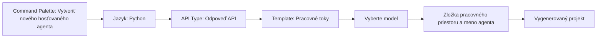
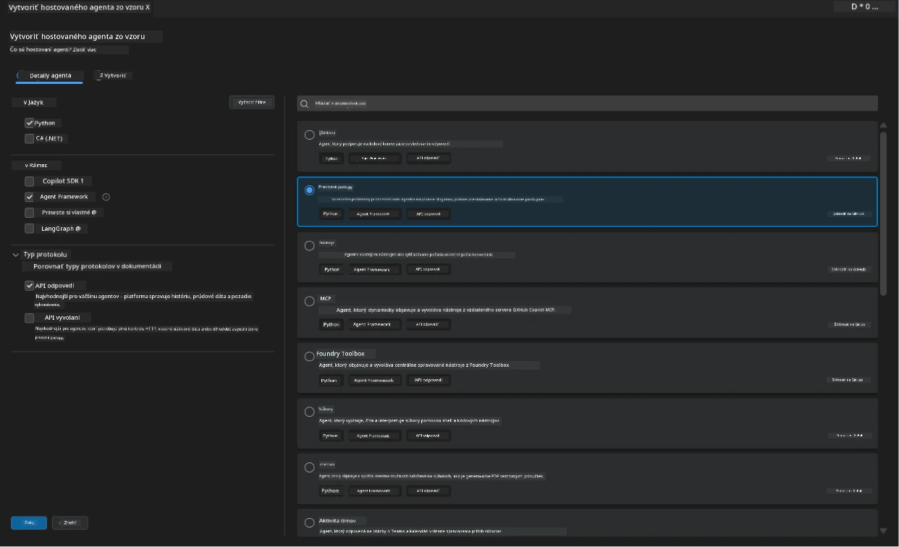
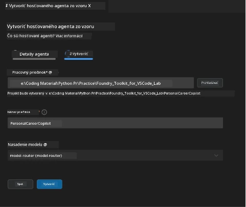

# Modul 2 - Vytvorenie základnej štruktúry projektu Multi-Agent

⏱️ ~5 min

V tomto module použijete [Foundry Toolkit pre VS Code](https://aka.ms/foundrytk) na **vytvorenie základnej štruktúry multi-agentného projektu**. Sprievodca vytvorí súbory `agent.yaml`, `main.py`, `Dockerfile`, `requirements.txt`, `.env` a konfiguráciu ladenia vo VS Code – aby ste sa mohli sústrediť na prepojenie pracovného postupu so 4 agentmi v Module 3.

> **Kľúčový koncept:** Základná štruktúra je funkčný náčrt s jedným agentom. Nahradíte vzorovú logiku grafom `WorkflowBuilder` v Module 3. Nie je potrebné písať boilerplate od začiatku.

> **Referenčná implementácia:** [`PersonalCareerCopilot/`](../../../../../workshop/lab02-multi-agent/PersonalCareerCopilot) je kompletný funkčný príklad. Použite ho na porovnanie svojej práce počas postupu.

### Priebeh sprievodcu tvorbou základnej štruktúry


```mermaid
flowchart LR
    A[Command Palette: Vytvoriť nového hosťovaného agenta] --> B[Jazyk: Python]
    B --> C[API Type: Odpoveď API]
    C --> D[Template: Pracovné toky]
    D --> E[Vyberte model]
    E --> F[Zložka pracovného priestoru a meno agenta]
    F --> G[Vygenerovaný projekt]
```

---

## Krok 1: Otvorte sprievodcu vytvorením hostovaného agenta

1. Stlačte `Ctrl+Shift+P` pre otvorenie **Command Palette**.
2. Zadajte: **Foundry Toolkit: Create a New Hosted Agent** a vyberte túto možnosť.
3. Sprievodca sa otvorí na karte **Agent Details**.

> **Alternatíva:** Kliknite na ikonu **Foundry Toolkit** v paneli aktivít → kliknite na ikonu **+** vedľa **Hosted Agents** → **Create New Hosted Agent**.

---

## Krok 2: Vyberte nastavenia



1. V ľavom navigačnom/voľbovom paneli vyberte nasledovné:

| Menu | Výber | Poznámky |
|--------|-----------|-------|
| **Language** | Python | Podporované je aj C# (.NET) |
| **Framework** | Agent Framework | Poskytuje `Agent`, `AgentExecutor`, `WorkflowBuilder` |
| **API type** | Response API | `POST /responses` - spravovaná história platformou, podpora streamovania |
| **Template** | **Workflows** | Spracováva požiadavky cez viacerých agentov za sebou |

2. Po výbere kliknite na **Next**



3. V nasledujúcom okne vyberte nasledovné:

| Menu | Výber | Poznámky |
|--------|-----------|-------|
| **Workspace folder** | Prejdite do cieľového priečinka | napr. `workshop/lab02-multi-agent/` v tomto repozitári |
| **Agent name** | `PersonalCareerCopilot` | Stane sa názvom priečinka projektu |
| **Model Deployment** | Vyberte váš nasadený model | napr. `gpt-4.1-mini` z Lab 01 |

4. Kliknite na **Create** pre vytvorenie základnej štruktúry projektu. VS Code vygeneruje súbory a otvorí priečinok.

> **Tip:** [`gpt-4.1-mini`](https://learn.microsoft.com/azure/foundry/foundry-models/concepts/models-sold-directly-by-azure#gpt-41-series) dobre vyvažuje rýchlosť a kvalitu pre vývoj multi-agentov.

---

## Krok 3: Prezrite si vygenerovaný projekt

Po dokončení tvorby základnej štruktúry skontrolujte, či vidíte tieto súbory v Prieskumníkovi (`Ctrl+Shift+E`):

```
📂 <your-agent-name>/
├── .azdignore          ← Files excluded from Azure Developer CLI deployments
├── .dockerignore       ← Files excluded from Docker builds
├── .env                ← Environment variables (placeholders - fill in Module 3)
├── .vscode/
│   ├── launch.json     ← Debug config (F5 → run + Agent Inspector)
│   └── tasks.json      ← VS Code task definitions
├── agent.yaml          ← Agent definition (kind: hosted, protocol: responses)
├── Dockerfile          ← Container config for deployment
├── main.py             ← Stub agent entry point (replace with WorkflowBuilder in Module 3)
└── requirements.txt    ← Python dependencies
```

> **Dôležité:** Otvorte tento vytvorený priečinok priamo vo VS Code, aby sa správne aplikovali `.vscode/launch.json` a `tasks.json` pre ladenie klávesou F5.

### Vysvetlenie kľúčových súborov

| Súbor | Účel |
|------|---------|
| `agent.yaml` | Deklaruje `kind: hosted`, mapuje env premenné, definuje protokol `/responses` |
| `main.py` | Náčrt: jeden `FoundryChatClient` → `Agent` → `ResponsesHostServer`. Nahradíte ho 4 agentmi + `WorkflowBuilder` v Module 3 |
| `Dockerfile` | `python:3.12-slim`, inštaluje `requirements.txt`, sprístupňuje port 8088, spúšťa `python main.py` |
| `requirements.txt` | `agent-framework-foundry`, `agent-framework-foundry-hosting`, `mcp<2,>=1.24.0`, `debugpy` |

> **Referencie:** Pozrite si [`PersonalCareerCopilot/agent.yaml`](../../../../../workshop/lab02-multi-agent/PersonalCareerCopilot/agent.yaml) a [`PersonalCareerCopilot/requirements.txt`](../../../../../workshop/lab02-multi-agent/PersonalCareerCopilot/requirements.txt) pre kompletný obsah vygenerovaných súborov.

---

### ✅ Kontrolný bod

- [ ] Dokončený sprievodca tvorbou základnej štruktúry - nový priečinok projektu je viditeľný v Prieskumníkovi
- [ ] Prítomné všetky očakávané súbory: `agent.yaml`, `main.py`, `Dockerfile`, `requirements.txt`, `.env`
- [ ] `agent.yaml` obsahuje `kind: hosted` a `protocol: responses`
- [ ] `main.py` importuje `Agent`, `FoundryChatClient`, `ResponsesHostServer`
- [ ] Vytvorený priečinok je otvorený ako koreň pracovného priestoru vo VS Code
- [ ] Rozumiete, že `main.py` je náčrt - `WorkflowBuilder` pridáte v Module 3

---

**Predchádzajúce:** [01 - Porozumieť Multi-Agent architektúre](01-understand-multi-agent.md) · **Nasledujúce:** [03 - Konfigurácia agentov a prostredia →](03-configure-agents.md)

---

<!-- CO-OP TRANSLATOR DISCLAIMER START -->
**Vyhlásenie o zodpovednosti**:
Tento dokument bol preložený pomocou AI prekladateľskej služby [Co-op Translator](https://github.com/Azure/co-op-translator). Hoci sa snažíme o presnosť, vezmite prosím na vedomie, že automatické preklady môžu obsahovať chyby alebo nepresnosti. Pôvodný dokument v jeho natívnom jazyku by mal byť považovaný za autoritatívny zdroj. Pre kritické informácie sa odporúča profesionálny ľudský preklad. Nie sme zodpovední za žiadne nedorozumenia alebo nesprávne interpretácie vyplývajúce z použitia tohto prekladu.
<!-- CO-OP TRANSLATOR DISCLAIMER END -->