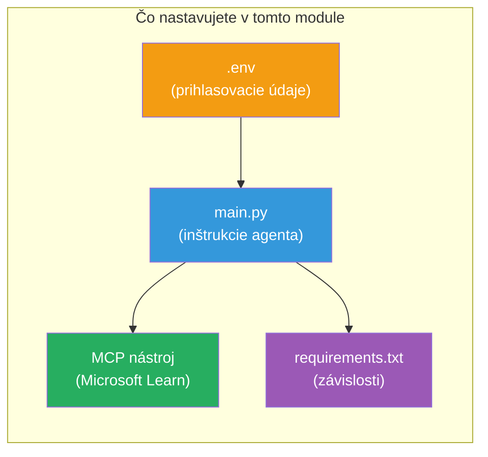

# Modul 3 - Konfigurácia agentov, nástroja MCP a prostredia

V tomto module si prispôsobíte vopred vytvorený multi-agentný projekt. Napíšete inštrukcie pre všetkých štyroch agentov, nastavíte nástroj MCP pre Microsoft Learn, nakonfigurujete premenné prostredia a nainštalujete závislosti.


> **Referencia:** Kompletný funkčný kód nájdete v [`PersonalCareerCopilot/main.py`](../../../../../workshop/lab02-multi-agent/PersonalCareerCopilot/main.py). Použite ho ako referenciu počas tvorby vlastného riešenia.

---

## Krok 1: Konfigurácia premenných prostredia

1. Otvorte súbor **`.env`** v koreňovom adresári vášho projektu.
2. Vyplňte údaje vášho projektu Foundry:

   ```env
   PROJECT_ENDPOINT=https://<your-account>.services.ai.azure.com/api/projects/<your-project>
   MODEL_DEPLOYMENT_NAME=gpt-4.1-mini
   ```

3. Súbor uložte.

### Kde nájsť tieto hodnoty

| Hodnota | Ako ju nájsť |
|---------|--------------|
| **Project endpoint** | Bočný panel Microsoft Foundry → kliknite na váš projekt → URL endpointu v detaile |
| **Model deployment name** | Bočný panel Foundry → rozbaľte projekt → **Models + endpoints** → názov vedľa nasadeného modelu |

> **Bezpečnosť:** Nikdy neukladajte súbor `.env` do verziovacieho systému. Pridajte ho do `.gitignore`, ak tam ešte nie je.

### Mapa premenných prostredia

Multi-agentný `main.py` číta štandardné aj špecifické názvy premenných prostredia pre workshop:

```python
PROJECT_ENDPOINT = os.getenv("AZURE_AI_PROJECT_ENDPOINT") or os.getenv("PROJECT_ENDPOINT")
MODEL_DEPLOYMENT_NAME = os.getenv(
    "AZURE_AI_MODEL_DEPLOYMENT_NAME",
    os.getenv("MODEL_DEPLOYMENT_NAME", "gpt-4.1-mini"),
)
MICROSOFT_LEARN_MCP_ENDPOINT = os.getenv(
    "MICROSOFT_LEARN_MCP_ENDPOINT", "https://learn.microsoft.com/api/mcp"
)
```

Endpoint MCP má rozumnú predvolenú hodnotu – nemusíte ho nastavovať v `.env`, pokiaľ ju nechcete prepísať.

---

## Krok 2: Napíšte inštrukcie pre agentov

Toto je najdôležitejší krok. Každý agent potrebuje starostlivo vytvorené inštrukcie, ktoré definujú jeho rolu, formát výstupu a pravidlá. Otvorte `main.py` a vytvorte (alebo upravte) konštanty inštrukcií.

### 2.1 Agent na spracovanie životopisov

```python
RESUME_PARSER_INSTRUCTIONS = """\
You are the Resume Parser.
Extract resume text into a compact, structured profile for downstream matching.

Output exactly these sections:
1) Candidate Profile
2) Technical Skills (grouped categories)
3) Soft Skills
4) Certifications & Awards
5) Domain Experience
6) Notable Achievements

Rules:
- Use only explicit or strongly implied evidence.
- Do not invent skills, titles, or experience.
- Keep concise bullets; no long paragraphs.
- If input is not a resume, return a short warning and request resume text.
"""
```

**Prečo tieto sekcie?** Agent MatchingAgent potrebuje štruktúrované dáta na porovnávanie. Konzistentné sekcie zabezpečujú spoľahlivé odovzdanie medzi agentmi.

### 2.2 Agent na popisy pracovných ponúk

```python
JOB_DESCRIPTION_INSTRUCTIONS = """\
You are the Job Description Analyst.
Extract a structured requirement profile from a JD.

Output exactly these sections:
1) Role Overview
2) Required Skills
3) Preferred Skills
4) Experience Required
5) Certifications Required
6) Education
7) Domain / Industry
8) Key Responsibilities

Rules:
- Keep required vs preferred clearly separated.
- Only use what the JD states; do not invent hidden requirements.
- Flag vague requirements briefly.
- If input is not a JD, return a short warning and request JD text.
"""
```

**Prečo rozdeľovať požadované a preferované?** MatchingAgent používa rôzne váhy pre každý typ (Požadované zručnosti = 40 bodov, Preferované zručnosti = 10 bodov).

### 2.3 Agent Matching

```python
MATCHING_AGENT_INSTRUCTIONS = """\
You are the Matching Agent.
Compare parsed resume output vs JD output and produce an evidence-based fit report.

Scoring (100 total):
- Required Skills 40
- Experience 25
- Certifications 15
- Preferred Skills 10
- Domain Alignment 10

Output exactly these sections:
1) Fit Score (with breakdown math)
2) Matched Skills
3) Missing Skills
4) Partially Matched
5) Experience Alignment
6) Certification Gaps
7) Overall Assessment

Rules:
- Be objective and evidence-only.
- Keep partial vs missing separate.
- Keep Missing Skills precise; it feeds roadmap planning.
"""
```

**Prečo explicitné bodovanie?** Reprodukovateľné bodovanie umožňuje porovnávať a laditeľne diagnostikovať výsledky. Stupnica do 100 bodov je pre koncového používateľa ľahko pochopiteľná.

### 2.4 Agent na analýzu medzier

```python
GAP_ANALYZER_INSTRUCTIONS = """\
You are the Gap Analyzer and Roadmap Planner.
Create a practical upskilling plan from the matching report.

Microsoft Learn MCP usage (required):
- For EVERY High and Medium priority gap, call tool `search_microsoft_learn_for_plan`.
- Use returned Learn links in Suggested Resources.
- Prefer Microsoft Learn for free resources.

CRITICAL: You MUST produce a SEPARATE detailed gap card for EVERY skill listed in
the Missing Skills and Certification Gaps sections of the matching report. Do NOT
skip or combine gaps. Do NOT summarize multiple gaps into one card.

Output format:
1) Personalized Learning Roadmap for [Role Title]
2) One DETAILED card per gap (produce ALL cards, not just the first):
   - Skill
   - Priority (High/Medium/Low)
   - Current Level
   - Target Level
   - Suggested Resources (include Learn URL from tool results)
   - Estimated Time
   - Quick Win Project
3) Recommended Learning Order (numbered list)
4) Timeline Summary (week-by-week)
5) Motivational Note

Rules:
- Produce every gap card before writing the summary sections.
- Keep it specific, realistic, and actionable.
- Tailor to candidate's existing stack.
- If fit >= 80, focus on polish/interview readiness.
- If fit < 40, be honest and provide a staged path.
"""
```

**Prečo dôraz na "CRITICAL"?** Bez explicitných inštrukcií na vytvorenie VŠETKÝCH kariet medzier model väčšinou vygeneruje iba 1-2 karty a ostatné zhrnie. Blok "CRITICAL" tomu zabraňuje.

---

## Krok 3: Definujte nástroj MCP

GapAnalyzer používa nástroj, ktorý volá [Microsoft Learn MCP server](https://learn.microsoft.com/azure/foundry/agents/how-to/tools/model-context-protocol). Pridajte to do `main.py`:

```python
import json
from agent_framework import tool
from mcp.client.session import ClientSession
from mcp.client.streamable_http import streamable_http_client

@tool
async def search_microsoft_learn_for_plan(
    skill: str, role: str = "", max_results: int = 5
) -> str:
    """Search Microsoft Learn MCP and return curated official links for roadmap planning."""
    query = " ".join(part for part in [skill, role, "learning path module"] if part).strip()
    query = query or "job skills learning path"

    try:
        async with streamable_http_client(MICROSOFT_LEARN_MCP_ENDPOINT) as (
            read_stream, write_stream, _,
        ):
            async with ClientSession(read_stream, write_stream) as session:
                await session.initialize()
                result = await session.call_tool(
                    "microsoft_docs_search", {"query": query}
                )

        if not result.content:
            return (
                "No results returned from Microsoft Learn MCP. "
                "Fallback: https://learn.microsoft.com/training/support/catalog-api"
            )

        payload_text = getattr(result.content[0], "text", "")
        data = json.loads(payload_text) if payload_text else {}
        items = data.get("results", [])[:max(1, min(max_results, 10))]

        if not items:
            return f"No direct Microsoft Learn results found for '{skill}'."

        lines = [f"Microsoft Learn resources for '{skill}':"]
        for i, item in enumerate(items, start=1):
            title = item.get("title") or item.get("url") or "Microsoft Learn Resource"
            url = item.get("url") or item.get("link") or ""
            lines.append(f"{i}. {title} - {url}".rstrip(" -"))
        return "\n".join(lines)
    except Exception as ex:
        return (
            f"Microsoft Learn MCP lookup unavailable. Reason: {ex}. "
            "Fallbacks: https://learn.microsoft.com/api/mcp"
        )
```

### Ako nástroj funguje

| Krok | Čo sa deje |
|------|------------|
| 1 | GapAnalyzer rozhodne, že potrebuje materiály pre zručnosť (napr. „Kubernetes“) |
| 2 | Framework volá `search_microsoft_learn_for_plan(skill="Kubernetes")` |
| 3 | Funkcia otvorí [Streamable HTTP](https://learn.microsoft.com/agent-framework/agents/tools/hosted-mcp-tools) spojenie na `https://learn.microsoft.com/api/mcp` |
| 4 | Volá `microsoft_docs_search` na [MCP serveri](https://learn.microsoft.com/azure/foundry/agents/how-to/tools/model-context-protocol) |
| 5 | MCP server vráti výsledky vyhľadávania (názov + URL) |
| 6 | Funkcia formátuje výsledky ako číslovaný zoznam |
| 7 | GapAnalyzer zahrnie URL do karty medzery |

### Závislosti MCP

Klientské knižnice MCP sú zahrnuté nepriamo cez [`agent-framework-core`](https://learn.microsoft.com/agent-framework/overview/). Nie je potrebné ich pridávať zvlášť do `requirements.txt`. Ak dostanete chyby pri importe, overte:

```powershell
pip list | Select-String "mcp"
```

Očakávané: balík `mcp` je nainštalovaný (verzia 1.x alebo novšia).

---

## Krok 4: Prepojte agentov a workflow

### 4.1 Vytvorte agentov pomocou správcu kontextu

```python
from contextlib import asynccontextmanager

@asynccontextmanager
async def create_agents():
    async with (
        get_credential() as credential,
        AzureAIAgentClient(
            project_endpoint=PROJECT_ENDPOINT,
            model_deployment_name=MODEL_DEPLOYMENT_NAME,
            credential=credential,
        ).as_agent(
            name="ResumeParser",
            instructions=RESUME_PARSER_INSTRUCTIONS,
        ) as resume_parser,
        AzureAIAgentClient(
            project_endpoint=PROJECT_ENDPOINT,
            model_deployment_name=MODEL_DEPLOYMENT_NAME,
            credential=credential,
        ).as_agent(
            name="JobDescriptionAgent",
            instructions=JOB_DESCRIPTION_INSTRUCTIONS,
        ) as jd_agent,
        AzureAIAgentClient(
            project_endpoint=PROJECT_ENDPOINT,
            model_deployment_name=MODEL_DEPLOYMENT_NAME,
            credential=credential,
        ).as_agent(
            name="MatchingAgent",
            instructions=MATCHING_AGENT_INSTRUCTIONS,
        ) as matching_agent,
        AzureAIAgentClient(
            project_endpoint=PROJECT_ENDPOINT,
            model_deployment_name=MODEL_DEPLOYMENT_NAME,
            credential=credential,
        ).as_agent(
            name="GapAnalyzer",
            instructions=GAP_ANALYZER_INSTRUCTIONS,
            tools=[search_microsoft_learn_for_plan],
        ) as gap_analyzer,
    ):
        yield resume_parser, jd_agent, matching_agent, gap_analyzer
```

**Kľúčové body:**
- Každý agent má vlastnú inštanciu `AzureAIAgentClient`
- Iba GapAnalyzer dostáva `tools=[search_microsoft_learn_for_plan]`
- `get_credential()` vracia [`ManagedIdentityCredential`](https://learn.microsoft.com/python/api/overview/azure/identity-readme#managed-identity-support) v Azure, [`DefaultAzureCredential`](https://learn.microsoft.com/azure/developer/python/sdk/authentication/credential-chains#defaultazurecredential-overview) lokálne

### 4.2 Vytvorte graf workflow

```python
def create_workflow(resume_parser, jd_agent, matching_agent, gap_analyzer):
    workflow = (
        WorkflowBuilder(
            name="ResumeJobFitEvaluator",
            start_executor=resume_parser,
            output_executors=[gap_analyzer],
        )
        .add_edge(resume_parser, jd_agent)
        .add_edge(resume_parser, matching_agent)
        .add_edge(jd_agent, matching_agent)
        .add_edge(matching_agent, gap_analyzer)
        .build()
    )
    return workflow.as_agent()
```

> Pozrite si [Workflows as Agents](https://learn.microsoft.com/agent-framework/workflows/as-agents) pre pochopenie vzoru `.as_agent()`.

### 4.3 Spustite server

```python
async def main() -> None:
    validate_configuration()
    async with create_agents() as (resume_parser, jd_agent, matching_agent, gap_analyzer):
        agent = create_workflow(resume_parser, jd_agent, matching_agent, gap_analyzer)
        from azure.ai.agentserver.agentframework import from_agent_framework
        await from_agent_framework(agent).run_async()

if __name__ == "__main__":
    asyncio.run(main())
```

---

## Krok 5: Vytvorte a aktivujte virtuálne prostredie

### 5.1 Vytvorte prostredie

```powershell
cd workshop\lab02-multi-agent\PersonalCareerCopilot
python -m venv .venv
```

### 5.2 Aktivujte ho

**PowerShell (Windows):**
```powershell
.\.venv\Scripts\Activate.ps1
```

**macOS/Linux:**
```bash
source .venv/bin/activate
```

### 5.3 Nainštalujte závislosti

```powershell
pip install -r requirements.txt
```

> **Poznámka:** Riadok `agent-dev-cli --pre` v `requirements.txt` zabezpečuje inštaláciu najnovšej preview verzie. Je to nutné pre kompatibilitu s `agent-framework-core==1.0.0rc3`.

### 5.4 Overte inštaláciu

```powershell
pip list | Select-String "agent-framework|agentserver|agent-dev"
```

Očakávaný výstup:
```
agent-dev-cli                  0.0.1b260316
agent-framework-azure-ai       1.0.0rc3
agent-framework-core            1.0.0rc3
azure-ai-agentserver-agentframework 1.0.0b16
azure-ai-agentserver-core      1.0.0b16
```

> **Ak `agent-dev-cli` ukazuje staršiu verziu** (napr. `0.0.1b260119`), Agent Inspector zlyhá s chybami 403/404. Aktualizujte: `pip install agent-dev-cli --pre --upgrade`

---

## Krok 6: Overte autentifikáciu

Spustite tú istú kontrolu autentifikácie ako v Labs 01:

```powershell
az account show --query "{name:name, id:id}" --output table
```

Ak zlyhá, spustite [`az login`](https://learn.microsoft.com/cli/azure/authenticate-azure-cli-interactively).

Pre multi-agentné workflow všetci štyria agenti zdieľajú rovnaké prihlasovacie údaje. Ak autentifikácia funguje pre jedného, funguje pre všetkých.

---

### Kontrolný zoznam

- [ ] `.env` obsahuje platné hodnoty `PROJECT_ENDPOINT` a `MODEL_DEPLOYMENT_NAME`
- [ ] V `main.py` sú definované všetky 4 konštanty inštrukcií agentov (ResumeParser, JD Agent, MatchingAgent, GapAnalyzer)
- [ ] Nástroj MCP `search_microsoft_learn_for_plan` je definovaný a registrovaný s GapAnalyzerom
- [ ] Funkcia `create_agents()` vytvára všetkých 4 agentov s individuálnymi inštanciami `AzureAIAgentClient`
- [ ] Funkcia `create_workflow()` vytvára správny graf pomocou `WorkflowBuilder`
- [ ] Virtuálne prostredie je vytvorené a aktivované (viditeľné `(.venv)`)
- [ ] `pip install -r requirements.txt` prešiel bez chýb
- [ ] `pip list` zobrazuje všetky očakávané balíky v správnych verziách (rc3 / b16)
- [ ] `az account show` vráti vaše predplatné

---

**Predchádzajúce:** [02 - Scaffold Multi-Agent Project](02-scaffold-multi-agent.md) · **Ďalšie:** [04 - Orchestration Patterns →](04-orchestration-patterns.md)

---

<!-- CO-OP TRANSLATOR DISCLAIMER START -->
**Zrieknutie sa zodpovednosti**:  
Tento dokument bol preložený pomocou AI prekladateľskej služby [Co-op Translator](https://github.com/Azure/co-op-translator). Hoci sa snažíme o presnosť, prosím, uvedomte si, že automatizované preklady môžu obsahovať chyby alebo nepresnosti. Originálny dokument v jeho pôvodnom jazyku by mal byť považovaný za autoritatívny zdroj. Pre kritické informácie sa odporúča profesionálny ľudský preklad. Neručíme za akékoľvek nedorozumenia alebo nesprávne interpretácie vyplývajúce z použitia tohto prekladu.
<!-- CO-OP TRANSLATOR DISCLAIMER END -->