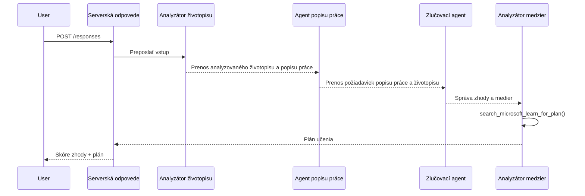

# Modul 3 - Konfigurácia inštrukcií, prostredia a inštalácia závislostí

⏱️ ~15 min

V tomto module premeníte vygenerovaný základ na **váš** multi-agentný pracovný tok - nastavením premenných prostredia, písaním inštrukcií pre agentov, pridaním nástroja MCP, prepojením grafu pracovného toku a inštaláciou závislostí.

> **Referencia:** Kompletný funkčný kód je v [`PersonalCareerCopilot/main.py`](../../../../../workshop/lab02-multi-agent/PersonalCareerCopilot/main.py). Použite ho ako referenciu pri budovaní vlastného grafu pracovného toku a blokov promptov.

---

## Ako štyria agenti spolupracujú


```mermaid
sequenceDiagram
    participant User
    participant Server as Serverská odpovede
    participant RP as Analyzátor životopisu
    participant JD as Agent popisu práce
    participant MA as Zlučovací agent
    participant GA as Analyzátor medzier

    User->>Server: POST /responses
    Server->>RP: Preposlať vstup
    RP-->>JD: Prenos analyzovaného životopisu a popisu práce
    JD-->>MA: Prenos požiadaviek popisu práce a životopisu
    MA-->>GA: Správa zhody a medier
    GA->>GA: search_microsoft_learn_for_plan()
    GA-->>Server: Plán učenia
    Server-->>User: Skóre zhody + plán
```

---

## Krok 1: Konfigurácia premenných prostredia

1. Otvorte súbor **`.env`** v koreňovom adresári vášho projektu (vytvorený sprievodcom scaffoldingu).
2. Nahraďte zástupné hodnoty svojimi skutočnými hodnotami z Lab 01.

<details open>
<summary><strong>🅰️ Cesta A - Foundry predplatné</strong></summary>

```env
FOUNDRY_PROJECT_ENDPOINT=https://<your-account>.services.ai.azure.com/api/projects/<your-project>
AZURE_AI_MODEL_DEPLOYMENT_NAME=gpt-4.1-mini
```

> **Kde nájsť hodnoty:** Pozrite [Lab 01, Modul 1](../../lab01-single-agent/docs/01-setup.md#deploy-a-model--assign-rbac).

</details>

<details open>
<summary><strong>🅱️ Cesta B - Foundry Local</strong></summary>

```env
FOUNDRY_PROJECT_ENDPOINT=http://localhost:5273/v1
AZURE_AI_MODEL_DEPLOYMENT_NAME=phi-4-mini
```

> Celé inferovanie prebieha na vašom stroji - žiadne údaje neopúšťajú vaše zariadenie. Spustite `foundry model list` na potvrdenie presného aliasu modelu. Jediným odchádzajúcim požiadavkom je volanie nástroja MCP na `https://learn.microsoft.com/api/mcp`.

> **Kde nájsť hodnoty:** Pozrite [Lab 01, Modul 1 - lokálna cesta](../../lab01-single-agent/docs/01-setup.md#step-2-set-up-based-on-your-access).

</details>

> **Bezpečnosť:** Nikdy nezadávajte `.env` do verziovacieho systému. Mal by už byť v `.gitignore`.

---

## Krok 2: Napíšte inštrukcie pre agentov

Inštrukcie definujú úlohu každého agenta, formát výstupu a pravidlá. Otvorte `main.py` a definujte (alebo nahraďte) štyri konštanty inštrukcií - kompletné reťazce sú v [`PersonalCareerCopilot/main.py`](../../../../../workshop/lab02-multi-agent/PersonalCareerCopilot/main.py).

### 2.1 `RESUME_PARSER_INSTRUCTIONS`
Parsuje životopis do štruktúrovaného profilu kandidáta **a** skopíruje popis práce doslovne do `[JOB DESCRIPTION PASS-THROUGH]`. Obidve označené sekcie musia byť vo výstupe.

> **Prečo pass-through?** Pri `context_mode="last_agent"` je ResumeParser **jediným** agentom, ktorý vidí pôvodnú používateľskú správu. Ak neprekopíruje JD ďalej, nasledovní agenti ju nikdy neuvidia.

### 2.2 `JOB_DESCRIPTION_INSTRUCTIONS`
Číta `[PARSED RESUME]` a `[JOB DESCRIPTION PASS-THROUGH]` z výstupu ResumeParser. Vytvára `[JD REQUIREMENTS]` (štruktúrované požiadavky) a `[PARSED RESUME PASS-THROUGH]` (doslovnú kópiu životopisu pre MatchingAgent).

### 2.3 `MATCHING_AGENT_INSTRUCTIONS`
Číta `[JD REQUIREMENTS]` a `[PARSED RESUME PASS-THROUGH]`. Vytvára hodnotenú správu zhody (0–100) s rozpisom výpočtu, zhodnými zručnosťami, chýbajúcimi zručnosťami a zosúladením skúseností.

### 2.4 `GAP_ANALYZER_INSTRUCTIONS`
Číta správu zhody. Pre **každú** chýbajúcu zručnosť volá `search_microsoft_learn_for_plan` na získanie zdrojov Microsoft Learn. Vytvára jednu podrobnú kartu medzery na každú zručnosť plus učenie rozdelené po týždňoch.

---

## Krok 3: Pridajte nástroj MCP

GapAnalyzer volá [Microsoft Learn MCP server](https://learn.microsoft.com/azure/foundry/agents/how-to/tools/model-context-protocol) na získanie skutočných vzdelávacích zdrojov pre každú medzeru v zručnostiach. Celá funkcia `search_microsoft_learn_for_plan` je v [`PersonalCareerCopilot/main.py`](../../../../../workshop/lab02-multi-agent/PersonalCareerCopilot/main.py).

Zaregistrujte nástroj na GapAnalyzer pri vytváraní agenta:

```python
gap_analyzer = Agent(
    client=client,
    instructions=GAP_ANALYZER_INSTRUCTIONS,
    name="GapAnalyzer",
    tools=[search_microsoft_learn_for_plan],
)
```

> Pozrite [`PersonalCareerCopilot/main.py`](../../../../../workshop/lab02-multi-agent/PersonalCareerCopilot/main.py) pre kompletný graf `WorkflowBuilder` s `FoundryChatClient`, `AgentExecutor` a všetkými volaniami `add_edge()`.

---

## Krok 4: Vytvorte virtuálne prostredie a nainštalujte závislosti

> ⚠️ **Nevynechávajte tento krok.** Bez nainštalovaných závislostí nebude možné ladovať stlačením F5.

### 4.1 Vytvorte virtuálne prostredie

```powershell
python -m venv .venv
```

### 4.2 Aktivujte ho

| OS | Príkaz |
|----|---------|
| **Windows (PowerShell)** | `.\.venv\Scripts\Activate.ps1` |
| **Windows (CMD)** | `.venv\Scripts\activate.bat` |
| **macOS / Linux** | `source .venv/bin/activate` |

Mali by ste vidieť `(.venv)` vo vašom terminálovom príkazovom riadku.

### 4.3 Nainštalujte závislosti

```powershell
pip install -r requirements.txt
```

### 4.4 Overenie

```powershell
pip list | Select-String "agent-framework|mcp|debugpy"
```

Očakávane: `agent-framework-foundry`, `agent-framework-foundry-hosting`, `mcp` a `debugpy` sú zoznamom.

---

## Krok 5: Overte autentifikáciu

<details open>
<summary><strong>🅰️ Cesta A - Azure prihlasovacie údaje</strong></summary>

```powershell
az account show --query "{name:name, id:id}" --output table
```

Ak to zlyhá, spustite [`az login`](https://learn.microsoft.com/cli/azure/authenticate-azure-cli-interactively).

Všetci štyria agenti používajú jeden `FoundryChatClient` a jeden `DefaultAzureCredential`. Ak autentifikácia funguje pre jedného, funguje pre všetkých.

</details>

<details open>
<summary><strong>🅱️ Cesta B - Foundry Local</strong></summary>

Na lokálne testovanie nie je potrebná autentifikácia.

</details>

---

### ✅ Kontrolný bod

> Nepokračujte do Modulu 04, kým: **(1)** v promptu nevidíte `(.venv)` A **(2)** príkaz `pip install -r requirements.txt` úspešne neprebehne.

- [ ] `.env` obsahuje platný endpoint a názov nasadenia modelu (nie zástupné znaky)
- [ ] V `main.py` sú definované všetky 4 konštanty inštrukcií pre agentov (ResumeParser, JD Agent, MatchingAgent, GapAnalyzer)
- [ ] MCP nástroj `search_microsoft_learn_for_plan` je definovaný a zaregistrovaný na GapAnalyzer
- [ ] `FoundryChatClient` + 4 `Agent` + 4 `AgentExecutor` objekty vytvorené v `main()`
- [ ] `WorkflowBuilder` postaví správny postupný graf so všetkými 3 volaniami `add_edge()`
- [ ] Virtuálne prostredie vytvorené a aktivované (`(.venv)` viditeľné v promptu)
- [ ] `pip install -r requirements.txt` dokončený bez chýb
- [ ] **Cesta A:** `az account show` úspešný ALEBO ikona účtov VS Code zobrazuje prihlásený účet

---

**Predchádzajúci:** [02 - Scaffold Multi-Agent Project](02-scaffold-multi-agent.md) · **Nasledujúci:** [04 - Orchestration Patterns →](04-orchestration-patterns.md)

---

<!-- CO-OP TRANSLATOR DISCLAIMER START -->
**Vyhlásenie o zodpovednosti**:
Tento dokument bol preložený pomocou AI prekladateľskej služby [Co-op Translator](https://github.com/Azure/co-op-translator). Hoci sa snažíme o presnosť, vezmite prosím na vedomie, že automatické preklady môžu obsahovať chyby alebo nepresnosti. Pôvodný dokument v jeho natívnom jazyku by mal byť považovaný za autoritatívny zdroj. Pre kritické informácie sa odporúča profesionálny ľudský preklad. Nie sme zodpovední za žiadne nedorozumenia alebo nesprávne interpretácie vyplývajúce z použitia tohto prekladu.
<!-- CO-OP TRANSLATOR DISCLAIMER END -->