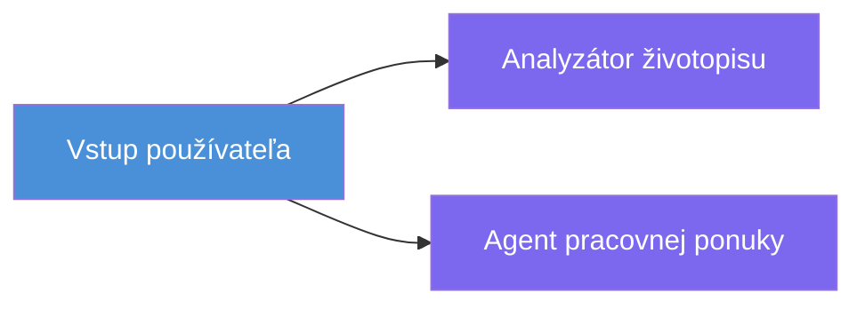
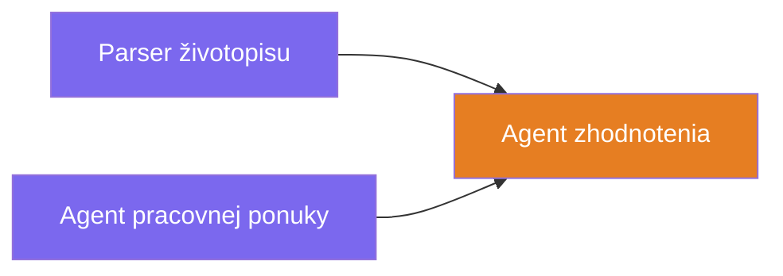
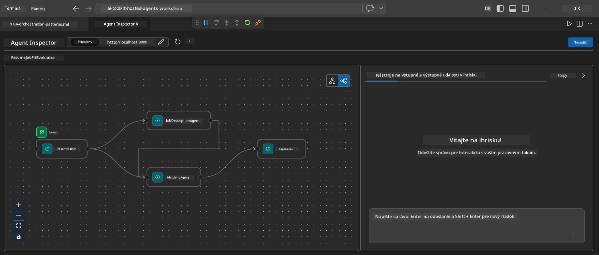
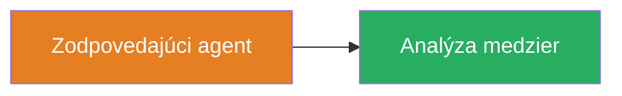
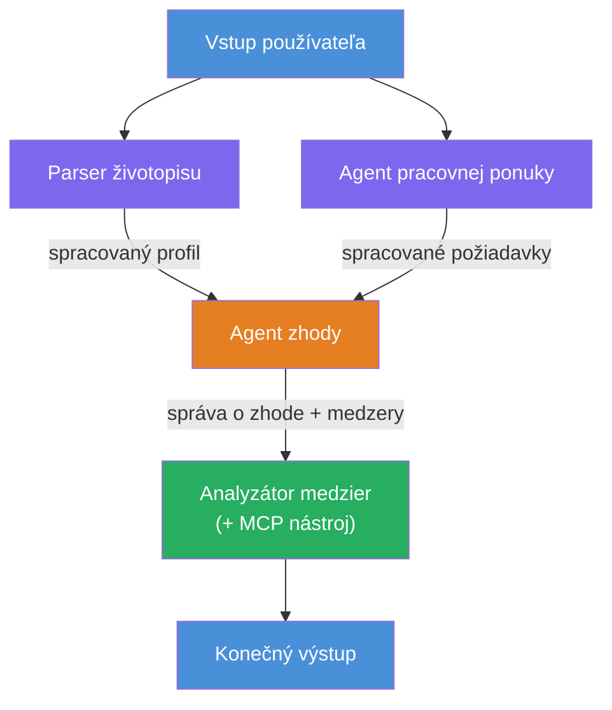
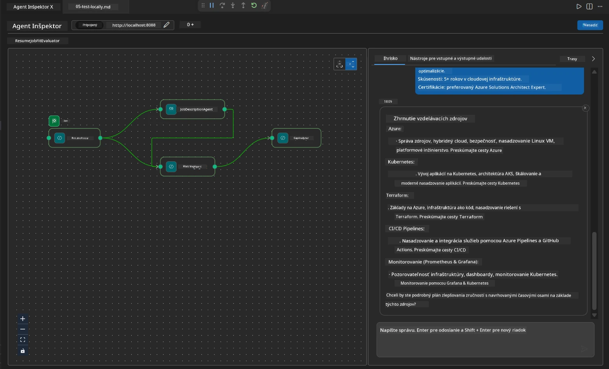

# Modul 4 - Vzory orchestrácie

V tomto module preskúmate vzory orchestrácie použité v hodnotiči zhody životopisu a naučíte sa, ako čítať, upravovať a rozširovať graf pracovného toku. Pochopenie týchto vzorov je nevyhnutné pre ladenie problémov s tokom dát a tvorbu vlastných [workflow s viacerými agentmi](https://learn.microsoft.com/agent-framework/workflows/).

---

## Vzor 1: Fan-out (paralelné rozdelenie)

Prvým vzorom v pracovnom toku je **fan-out** – jeden vstup je súčasne odoslaný viacerým agentom.


V kóde sa to deje preto, že `resume_parser` je `start_executor` – ako prvý prijíma správu od používateľa. Potom, keďže aj `jd_agent` a `matching_agent` majú hrany z `resume_parser`, rámec smeruje výstup `resume_parser` k obom agentom:

```python
.add_edge(resume_parser, jd_agent)         # Výstup ResumeParser → JD Agent
.add_edge(resume_parser, matching_agent)   # Výstup ResumeParser → MatchingAgent
```

**Prečo to funguje:** ResumeParser a JD Agent spracúvajú rôzne aspekty toho istého vstupu. Ich paralelné spustenie skracuje celkovú latenciu v porovnaní so sekvenčným spustením.

### Kedy použiť fan-out

| Prípad použitia | Príklad |
|-----------------|---------|
| Nezávislé podúlohy | Parsovanie životopisu vs. parsovanie pracovnej ponuky |
| Redundancia / hlasovanie | Dvaja agenti analyzujú dáta, tretí vyberá najlepšiu odpoveď |
| Výstup v rôznych formátoch | Jeden agent generuje text, druhý štruktúrovaný JSON |

---

## Vzor 2: Fan-in (agregácia)

Druhým vzorom je **fan-in** – výstupy viacerých agentov sa zhromažďujú a odosielajú jednému nasledujúcemu agentovi.


V kóde:

```python
.add_edge(resume_parser, matching_agent)   # Výstup ResumeParser → MatchingAgent
.add_edge(jd_agent, matching_agent)        # Výstup JD Agenta → MatchingAgent
```

**Kľúčové správanie:** Ak má agent **dve alebo viac vstupných hrán**, rámec automaticky čaká na dokončenie **všetkých** predchádzajúcich agentov pred spustením nasledujúceho agenta. MatchingAgent nezačne, kým neskončia ResumeParser aj JD Agent.

### Čo MatchingAgent prijíma

Rámec spojí výstupy všetkých predchádzajúcich agentov. Vstup pre MatchingAgent vyzerá takto:

```
[ResumeParser output]
---
Candidate Profile:
  Name: Jane Doe
  Technical Skills: Python, Azure, Kubernetes, ...
  ...

[JobDescriptionAgent output]
---
Role Overview: Senior Cloud Engineer
Required Skills: Python, Azure, Terraform, ...
...
```

> **Poznámka:** Presný formát spájania závisí od verzie rámca. Inštrukcie agenta by mali byť napísané tak, aby vedeli spracovať aj štruktúrovaný, aj neštruktúrovaný výstup.



---

## Vzor 3: Sekvenčný reťazec

Tretím vzorom je **sekvenčné prepojenie** – výstup jedného agenta priamo vstupuje do ďalšieho.


V kóde:

```python
.add_edge(matching_agent, gap_analyzer)    # Výstup MatchingAgenta → GapAnalyzer
```

Toto je najjednoduchší vzor. GapAnalyzer prijíma hodnotenie zhody od MatchingAgent, zoznam zodpovedajúcich/chýbajúcich zručností a medzier. Potom pre každú medzeru volá [MCP nástroj](https://learn.microsoft.com/azure/foundry/agents/how-to/tools/model-context-protocol), aby načítal zdroje Microsoft Learn.

---

## Kompletný graf

Skombinovaním všetkých troch vzorov vznikne celý pracovný tok:


### Časová os vykonávania

```mermaid
gantt
    title Časová os vykonávania agenta
    dateFormat X
    axisFormat %s

    section Paralelné
    Resume Parser       :rp, 0, 3
    JD Agent            :jd, 0, 2

    section Sekvenčné
    Matching Agent      :ma, 3, 5
    Gap Analyzer        :ga, 5, 9
```


> Celkový čas na hodinkách je približne `max(ResumeParser, JD Agent) + MatchingAgent + GapAnalyzer`. GapAnalyzer je zvyčajne najpomalší, pretože vykonáva viacero volaní MCP nástroja (jedno na každú medzeru).

---

## Čítanie kódu WorkflowBuilder

Tu je kompletná funkcia `create_workflow()` z `main.py`, s anotáciami:

```python
def create_workflow(resume_parser, jd_agent, matching_agent, gap_analyzer):
    workflow = (
        WorkflowBuilder(
            name="ResumeJobFitEvaluator",

            # Prvý agent, ktorý prijme vstup od používateľa
            start_executor=resume_parser,

            # Agent(i), ktorých výstup sa stáva konečnou odpoveďou
            output_executors=[gap_analyzer],
        )
        # Rozvetvenie: Výstup ResumeParser ide zároveň do JD Agenta a MatchingAgenta
        .add_edge(resume_parser, jd_agent)
        .add_edge(resume_parser, matching_agent)

        # Zlúčenie: MatchingAgent čaká na výstupy od ResumeParser a JD Agenta
        .add_edge(jd_agent, matching_agent)

        # Sekvenčné: Výstup MatchingAgenta sa posiela do GapAnalyzeru
        .add_edge(matching_agent, gap_analyzer)

        .build()
    )
    return workflow.as_agent()
```

### Súhrnná tabuľka hrán

| # | Hrana | Vzor | Efekt |
|---|-------|-------|---------|
| 1 | `resume_parser → jd_agent` | Fan-out | JD Agent prijíma výstup od ResumeParser (plus pôvodný vstup používateľa) |
| 2 | `resume_parser → matching_agent` | Fan-out | MatchingAgent prijíma výstup od ResumeParser |
| 3 | `jd_agent → matching_agent` | Fan-in | MatchingAgent tiež prijíma výstup od JD Agent (čaká na oboch) |
| 4 | `matching_agent → gap_analyzer` | Sekvenčný | GapAnalyzer dostáva správu o zhode + zoznam medzier |

---

## Úprava grafu

### Pridanie nového agenta

Ak chcete pridať piateho agenta (napr. **InterviewPrepAgent**, ktorý generuje otázky na pohovor na základe analýzy medzier):

```python
# 1. Definujte pokyny
INTERVIEW_PREP_INSTRUCTIONS = """\
You are the Interview Prep Agent.
Given a gap analysis and fit report, generate 10 targeted interview questions
the candidate should prepare for.
"""

# 2. Vytvorte agenta (v rámci bloku async with)
AzureAIAgentClient(
    project_endpoint=PROJECT_ENDPOINT,
    model_deployment_name=MODEL_DEPLOYMENT_NAME,
    credential=credential,
).as_agent(
    name="InterviewPrepAgent",
    instructions=INTERVIEW_PREP_INSTRUCTIONS,
) as interview_prep,

# 3. Pridajte hrany v create_workflow()
.add_edge(matching_agent, interview_prep)   # prijíma fit report
.add_edge(gap_analyzer, interview_prep)     # tiež prijíma gap karty

# 4. Aktualizujte output_executors
output_executors=[interview_prep],  # teraz finálny agent
```

### Zmena poradia vykonávania

Ak chcete, aby JD Agent bežal **po** ResumeParser (sekvenčne namiesto paralelne):

```python
# Odstrániť: .add_edge(resume_parser, jd_agent)  ← už existuje, nechajte to
# Odstrániť implicitnú paralelu tým, že jd_agent nebude priamo prijímať vstup od používateľa
# start_executor najprv odošle do resume_parser a jd_agent dostane
# výstup resume_parser cez hranu. Tým sa stávajú sekvenčné.
```

> **Dôležité:** `start_executor` je jediný agent, ktorý dostáva surový vstup od používateľa. Všetci ostatní agenti dostávajú výstup z ich predchádzajúcich hrán. Ak chcete, aby agent dostal aj surový vstup, musí mať hranu z `start_executor`.

---

## Bežné chyby v grafe

| Chyba | Symptom | Riešenie |
|-------|---------|----------|
| Chýbajúca hrana k `output_executors` | Agent beží, ale výstup je prázdny | Uistite sa, že existuje cesta z `start_executor` ku každému agentovi v `output_executors` |
| Cyklová závislosť | Nekonečná slučka alebo timeout | Skontrolujte, či žiadny agent neodosiela spätnú hranu do upstream agenta |
| Agent v `output_executors` bez prichádzajúcej hrany | Prázdny výstup | Pridajte aspoň jednu hranu `add_edge(source, that_agent)` |
| Viacero `output_executors` bez fan-in | Výstup obsahuje len odpoveď jedného agenta | Použite jedného výstupného agenta, ktorý agreguje, alebo prijmite viac výstupov |
| Chýbajúci `start_executor` | `ValueError` počas zostavovania | Vždy špecifikujte `start_executor` v `WorkflowBuilder()` |

---

## Ladenie grafu

### Použitie Agent Inspector

1. Spustite agenta lokálne (F5 alebo terminál - pozrite [Modul 5](05-test-locally.md)).
2. Otvorte Agent Inspector (`Ctrl+Shift+P` → **Foundry Toolkit: Open Agent Inspector**).
3. Pošlite testovaciu správu.
4. V paneli odpovedí Inspektora hľadajte **streamovaný výstup** – zobrazuje príspevok každého agenta v poradí.



### Použitie logovania

Pridajte do `main.py` logovanie na sledovanie toku dát:

```python
import logging
logger = logging.getLogger("resume-job-fit")

# V create_workflow(), po zostavení:
logger.info("Workflow graph built with edges: RP→JD, RP→MA, JD→MA, MA→GA")
```

Serverové logy ukazujú poradie vykonávania agentov a volania MCP nástroja:

```
INFO:resume-job-fit:Starting Resume -> Job Fit Evaluator HTTP server...
INFO:resume-job-fit:Server running on http://localhost:8088
INFO:agent_framework:Executing agent: ResumeParser
INFO:agent_framework:Executing agent: JobDescriptionAgent
INFO:agent_framework:Waiting for upstream agents: ResumeParser, JobDescriptionAgent
INFO:agent_framework:Executing agent: MatchingAgent
INFO:agent_framework:Executing agent: GapAnalyzer
INFO:agent_framework:Tool call: search_microsoft_learn_for_plan(skill="Kubernetes")
POST https://learn.microsoft.com/api/mcp → 200
INFO:agent_framework:Tool call: search_microsoft_learn_for_plan(skill="Terraform")
POST https://learn.microsoft.com/api/mcp → 200
```

---

### Kontrolný zoznam

- [ ] Viete identifikovať tri vzory orchestrácie v pracovnom toku: fan-out, fan-in, a sekvenčný reťazec
- [ ] Chápete, že agenti s viacerými prichádzajúcimi hranami čakajú, kým všetci upstream agenti dokončia prácu
- [ ] Viete čítať kód `WorkflowBuilder` a mapovať každé volanie `add_edge()` na vizuálny graf
- [ ] Rozumiete časovej osi vykonávania: najprv paralelné agenti, potom agregácia, potom sekvenčné
- [ ] Viete pridať nového agenta do grafu (definovať inštrukcie, vytvoriť agenta, pridať hrany, aktualizovať výstup)
- [ ] Viete identifikovať bežné chyby v grafe a ich symptómy

---

**Predchádzajúce:** [03 - Konfigurácia agentov a prostredia](03-configure-agents.md) · **Nasledujúce:** [05 - Testovanie lokálne →](05-test-locally.md)

---

<!-- CO-OP TRANSLATOR DISCLAIMER START -->
**Zrieknutie sa zodpovednosti**:  
Tento dokument bol preložený pomocou AI prekladateľskej služby [Co-op Translator](https://github.com/Azure/co-op-translator). Hoci usilovne pracujeme na presnosti, berte prosím na vedomie, že automatické preklady môžu obsahovať chyby alebo nepresnosti. Pôvodný dokument v jeho rodnom jazyku by mal byť považovaný za autoritatívny zdroj. Pre kritické informácie sa odporúča profesionálny ľudský preklad. Nie sme zodpovední za akékoľvek nedorozumenia alebo nesprávne interpretácie vyplývajúce z použitia tohto prekladu.
<!-- CO-OP TRANSLATOR DISCLAIMER END -->