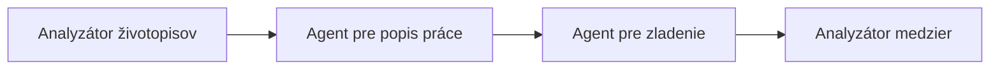
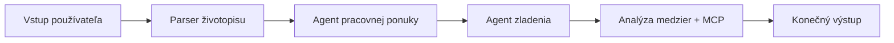

# Modul 4 - Orchestration Patterns

⏱️ ~10 min

V tomto module preskúmate orchestration patterns používané v Resume Job Fit Evaluator a naučíte sa, ako čítať, upravovať a rozširovať graf pracovného postupu. Pochopenie týchto vzorov je nevyhnutné pre ladenie problémov s tokom údajov a budovanie vlastných [multi-agent workflows](https://learn.microsoft.com/agent-framework/workflows/).

---

## Vzor 1: Sekvenčný reťazec

Základným vzorom v pracovnom postupe je **sekvenčný reťazec** - výstup každého agenta priamo vstupuje do nasledujúceho.


```mermaid
flowchart LR
    RP[Analyzátor životopisov] --> JD[Agent pre popis práce]
    JD --> MA[Agent pre zladenie]
    MA --> GA[Analyzátor medzier]
```

V kóde každý volanie `add_edge()` vytvára jeden krok v reťazci:

```python
.add_edge(resume_executor, jd_executor)       # Výstup ResumeParser → JD Agent
.add_edge(jd_executor, matching_executor)     # Výstup JD Agent → MatchingAgent
.add_edge(matching_executor, gap_executor)    # Výstup MatchingAgent → GapAnalyzer
```

> **Prečo sekvenčný, a nie fan-out/fan-in?** `WorkflowBuilder` používa **OR sémantiku** pre prichádzajúce hrany: exekútor nad prúdom spustí akciu hneď, ako dokončí **akýkoľvek** predchodca. Ak by `matching_executor` mal dve prichádzajúce hrany (z obidvoch `resume_executor` a `jd_executor`), spustil by sa dvakrát - raz keď končí ResumeParser a opäť keď končí JD Agent - čo by spôsobilo, že GapAnalyzer by tiež bežal dvakrát a výstup by sa zobrazil dvakrát. Sekvenčný pipeline to úplne eliminuje.

## Vzor 2: Prenos obsahu

Pretože `context_mode="last_agent"` znamená, že každý exekútor vidí iba výstup svojho **priamého predchodcu**, agenti v sekvenčnom reťazci musia explicitne prenášať ďalej všetky dáta, ktoré potrebujú agenti nad prúdom.

V tomto pracovnom postupe:
- **ResumeParser** skopíruje JD doslovne do `[JOB DESCRIPTION PASS-THROUGH]` (aby ho JD Agent mohol nájsť).
- **JD Agent** skopíruje `[PARSED RESUME]` doslovne do `[PARSED RESUME PASS-THROUGH]` (aby MatchingAgent mohol porovnať oba profily).

```
ResumeParser output
└─ [PARSED RESUME]               ← extracted by JD Agent
└─ [JOB DESCRIPTION PASS-THROUGH] ← extracted by JD Agent

JD Agent output
└─ [JD REQUIREMENTS]             ← extracted by MatchingAgent
└─ [PARSED RESUME PASS-THROUGH]  ← extracted by MatchingAgent
```

Každá časť prenosu musí byť skopírovaná **doslovne** - zhrnutie alebo parafrázovanie by prerušilo downstream agenta, ktorý na tom závisí.

---

## Kompletný graf

Kombinácia sekvenčného reťazca a prenosu obsahu vytvára celý pracovný postup:


```mermaid
flowchart LR
    U[Vstup používateľa] --> RP[Parser životopisu]
    RP --> JD[Agent pracovnej ponuky]
    JD --> MA[Agent zladenia]
    MA --> GA[Analýza medzier + MCP]
    GA --> O[Konečný výstup]
```

Agent Inspector zobrazuje túto rovnakú štruktúru grafu, keď agent beží lokálne. Pre snímky obrazovky si pozrite [Modul 5 - Testovanie lokálne](05-test-locally.md).

---

## Čítanie kódu WorkflowBuilder

Celá funkcia `create_workflow()` je v [`PersonalCareerCopilot/main.py`](../../../../../workshop/lab02-multi-agent/PersonalCareerCopilot/main.py). Tri volania `add_edge()` vytvárajú sekvenčný pipeline:

| # | Hrana | Efekt |
|---|------|--------|
| 1 | `resume_executor → jd_executor` | JD Agent dostane `[PARSED RESUME]` + `[JOB DESCRIPTION PASS-THROUGH]` |
| 2 | `jd_executor → matching_executor` | MatchingAgent dostane `[JD REQUIREMENTS]` + `[PARSED RESUME PASS-THROUGH]` |
| 3 | `matching_executor → gap_executor` | GapAnalyzer dostane report zhody + zoznam medzier |

---

## Úprava grafu

### Pridanie nového agenta

Ak chcete pridať piateho agenta (napr. **InterviewPrepAgent** po GapAnalyzer):

1. Definujte konštantu `INTERVIEW_PREP_INSTRUCTIONS`.
2. Vytvorte objekty `Agent` + `AgentExecutor` (rovnaký vzor ako pri existujúcich štyroch).
3. Pridajte `.add_edge(gap_executor, interview_exec)` v `WorkflowBuilder`.
4. Aktualizujte `output_executors=[interview_exec]`.

> **Dôležité:** `start_executor` je jediný agent, ktorý prijíma surový vstup používateľa. Všetci ostatní agenti dostávajú výstup zo svojej nadprúdom hrany.

---

## Bežné chyby v grafe

| Chyba | Príznak | Riešenie |
|---------|---------|-----|
| Chýbajúca hrana k `output_executors` | Agent beží, ale výstup je prázdny | Uistite sa, že existuje cesta zo `start_executor` ku každému agentovi v `output_executors` |
| Cirkulárna závislosť | Nekonečná slučka alebo timeout | Skontrolujte, že žiadny agent sa nevracia späť na upstream agenta |
| Agent v `output_executors` bez prichádzajúcej hrany | Prázdny výstup | Pridajte aspoň jednu hranu pomocou `add_edge(source, that_agent)` |
| Viac `output_executors` bez fan-in | Výstup obsahuje iba odpoveď jedného agenta | Použite jedného výstupného agenta, ktorý agreguje, alebo akceptujte viacero výstupov |
| Chýbajúci `start_executor` | `ValueError` pri zostavovaní | Vždy špecifikujte `start_executor` v `WorkflowBuilder()` |

---

## Ladenie grafu

### Použitie Agent Inspector

1. Spustite agenta lokálne pomocou F5.
2. Otvorte Agent Inspector (`Ctrl+Shift+P` → **Foundry Toolkit: Open Agent Inspector**).
3. Pošlite testovaciu správu.
4. V paneli s odpoveďou Inspectora vyhľadajte **uvoľňovaný výstup (streaming output)** - zobrazuje príspevok každého agenta po poradí.


### Použitie logovania

Pridajte logovanie do `main.py` na sledovanie toku dát:

```python
import logging
logger = logging.getLogger("resume-job-fit")

# V main(), po zostavení pracovného postupu:
logger.info("Workflow graph built with edges: RP→JD, JD→MA, MA→GA")
```

Serverové logy zobrazujú poradie vykonávania agentov a volania MCP nástrojov:

```
INFO:agent_framework:Executing agent: ResumeParser
INFO:agent_framework:Executing agent: JobDescriptionAgent
INFO:agent_framework:Executing agent: MatchingAgent
INFO:agent_framework:Executing agent: GapAnalyzer
INFO:agent_framework:Tool call: search_microsoft_learn_for_plan(skill="Kubernetes")
POST https://learn.microsoft.com/api/mcp → 200
INFO:agent_framework:Tool call: search_microsoft_learn_for_plan(skill="Terraform")
POST https://learn.microsoft.com/api/mcp → 200
```

---

### Kontrolný bod

- [ ] Dokážete identifikovať dva orchestration patterns v pracovnom postupe: sekvenčný reťazec a prenos obsahu
- [ ] Rozumiete, prečo `context_mode="last_agent"` vyžaduje explicitný prenos dát medzi agentmi
- [ ] Dokážete čítať kód `WorkflowBuilder` a spojiť každé volanie `add_edge()` s vizuálnym grafom
- [ ] Viete, ako pridať nového agenta na koniec pipeline
- [ ] Dokážete identifikovať bežné chyby v grafe a ich príznaky

---

**Predchádzajúci:** [03 - Konfigurácia agentov a prostredia](03-configure-agents.md) · **Nasledujúci:** [05 - Testovanie lokálne →](05-test-locally.md)

---

<!-- CO-OP TRANSLATOR DISCLAIMER START -->
**Vyhlásenie o zodpovednosti**:
Tento dokument bol preložený pomocou AI prekladateľskej služby [Co-op Translator](https://github.com/Azure/co-op-translator). Hoci sa snažíme o presnosť, vezmite prosím na vedomie, že automatické preklady môžu obsahovať chyby alebo nepresnosti. Pôvodný dokument v jeho natívnom jazyku by mal byť považovaný za autoritatívny zdroj. Pre kritické informácie sa odporúča profesionálny ľudský preklad. Nie sme zodpovední za žiadne nedorozumenia alebo nesprávne interpretácie vyplývajúce z použitia tohto prekladu.
<!-- CO-OP TRANSLATOR DISCLAIMER END -->