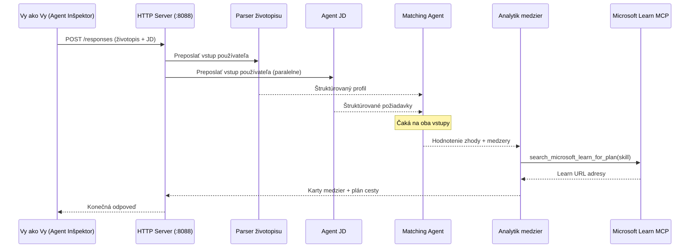
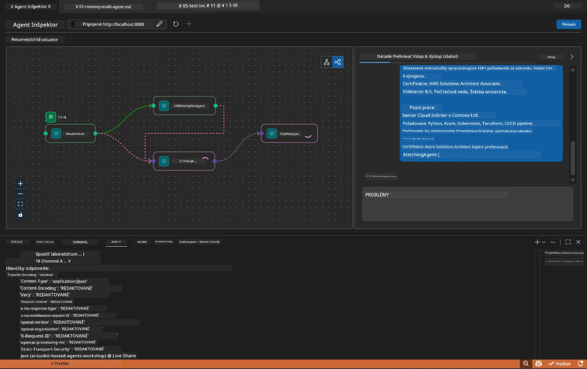

# Modul 5 - Testovanie lokálne (Viac agentov)

V tomto module spustíte workflow s viacerými agentmi lokálne, otestujete ho pomocou Agent Inspector a overíte, že všetky štyri agenti a nástroj MCP správne fungujú pred nasadením do Foundry.

### Čo sa deje počas lokálneho testovania


---

## Krok 1: Spustenie servera agenta

### Možnosť A: Použitie úlohy vo VS Code (odporúčané)

1. Stlačte `Ctrl+Shift+P` → zadajte **Tasks: Run Task** → vyberte **Run Lab02 HTTP Server**.
2. Úloha spustí server s debugpy na porte `5679` a agenta na porte `8088`.
3. Počkajte, kým sa v výstupe neobjaví:

```
INFO:resume-job-fit:Starting Resume -> Job Fit Evaluator HTTP server...
INFO:resume-job-fit:Server running on http://localhost:8088
```

### Možnosť B: Manuálne pomocou terminálu

```powershell
cd workshop\lab02-multi-agent\PersonalCareerCopilot
```

Aktivujte virtuálne prostredie:

**PowerShell (Windows):**
```powershell
.\.venv\Scripts\Activate.ps1
```

**macOS/Linux:**
```bash
source .venv/bin/activate
```

Spustite server:

```powershell
python -m debugpy --listen 127.0.0.1:5679 -m agentdev run main.py --verbose --port 8088
```

### Možnosť C: Použitie F5 (debug režim)

1. Stlačte `F5` alebo choďte do **Run and Debug** (`Ctrl+Shift+D`).
2. Z rozbaľovacieho zoznamu vyberte spúšťaciu konfiguráciu **Lab02 - Multi-Agent**.
3. Server sa spustí s plnou podporou breakpointov.

> **Tip:** Debug režim vám umožňuje nastaviť breakpointy vo funkcii `search_microsoft_learn_for_plan()` na kontrolu odpovedí MCP, alebo v inštrukciách agenta, aby ste videli, čo každý agent dostáva.

---

## Krok 2: Otvorte Agent Inspector

1. Stlačte `Ctrl+Shift+P` → zadajte **Foundry Toolkit: Open Agent Inspector**.
2. Agent Inspector sa otvorí v záložke prehliadača na adrese `http://localhost:5679`.
3. Mali by ste vidieť rozhranie agenta pripravené na prijímanie správ.

> **Ak sa Agent Inspector neotvorí:** Skontrolujte, či je server úplne spustený (vidíte v logu "Server running"). Ak je port 5679 obsadený, pozrite si [Modul 8 - Riešenie problémov](08-troubleshooting.md).

---

## Krok 3: Spustite testy funkčnosti

Spustite postupne tieto tri testy. Každý z nich testuje workflow podrobnejšie.

### Test 1: Základný životopis + popis práce

Vložte nasledujúci text do Agent Inspector:

```
Resume:
Jane Doe
Senior Software Engineer with 5 years of experience in Python, Django, and AWS.
Built microservices handling 10K+ requests/second. Led a team of 4 developers.
Certifications: AWS Solutions Architect Associate.
Education: B.S. Computer Science, State University.

Job Description:
Senior Cloud Engineer at Contoso Ltd.
Required: Python, Azure, Kubernetes, Terraform, CI/CD pipelines.
Preferred: Go, monitoring (Prometheus/Grafana), cost optimization.
Experience: 5+ years in cloud infrastructure.
Certifications: Azure Solutions Architect Expert preferred.
```

**Očakávaná štruktúra výstupu:**

Odpoveď by mala obsahovať výstupy od všetkých štyroch agentov za sebou:

1. **Výstup Resume Parsera** – Štruktúrovaný profil kandidáta so zručnosťami rozdelenými podľa kategórií
2. **Výstup JD Agenta** – Štruktúrované požiadavky s oddelenými požadovanými a preferovanými zručnosťami
3. **Výstup Matching Agenta** – Hodnotenie vhodnosti (0-100) s rozpisom, zhodné zručnosti, chýbajúce zručnosti, medzery
4. **Výstup Gap Analyzeru** – Jednotlivé karty medzier pre každú chýbajúcu zručnosť, každá s URL na Microsoft Learn



### Čo overiť v Teste 1

| Kontrola | Očakávané | Splnené? |
|----------|-----------|----------|
| Odpoveď obsahuje hodnotenie vhodnosti | Číslo medzi 0-100 s rozpisom | |
| Zoznam zhody zručností | Python, CI/CD (čiastočné), atď. | |
| Zoznam chýbajúcich zručností | Azure, Kubernetes, Terraform, atď. | |
| Existujú karty medzier pre každú chýbajúcu zručnosť | Jedna karta na zručnosť | |
| Prítomné URL na Microsoft Learn | Skutočné odkazy `learn.microsoft.com` | |
| Žiadne chybové hlásenia vo výstupe | Čistý štruktúrovaný výstup | |

### Test 2: Overenie spustenia MCP nástroja

Počas behu Testu 1 skontrolujte **terminál servera** pre záznamy MCP:

```
GET https://learn.microsoft.com/api/mcp → 405 (Method Not Allowed)
POST https://learn.microsoft.com/api/mcp → 200
DELETE https://learn.microsoft.com/api/mcp → 405 (Method Not Allowed)
```

| Záznam v logu | Význam | Očakávané? |
|---------------|--------|------------|
| `GET ... → 405` | MCP klient testuje GET počas inicializácie | Áno - normálne |
| `POST ... → 200` | Skutočné volanie nástroja na MCP server Microsoft Learn | Áno - ide o skutočné volanie |
| `DELETE ... → 405` | MCP klient testuje DELETE počas ukončenia | Áno - normálne |
| `POST ... → 4xx/5xx` | Volanie nástroja zlyhalo | Nie - pozri [Riešenie problémov](08-troubleshooting.md) |

> **Kľúčové:** `GET 405` a `DELETE 405` sú očakávané správanie. Starajte sa iba o neúspešné `POST` volania s ne-200 kódmi.

### Test 3: Hraničný prípad – kandidát s vysokou vhodnosťou

Vložte životopis, ktorý veľmi dobre zodpovedá popisu práce, aby ste overili, že GapAnalyzer zvláda scenáre s vysokou vhodnosťou:

```
Resume:
Alex Chen
Senior Cloud Engineer with 7 years of experience.
Skills: Python, Azure (AKS, Functions, DevOps), Kubernetes, Terraform, CI/CD (GitHub Actions, Azure Pipelines), Go, Prometheus, Grafana, cost optimization.
Certifications: Azure Solutions Architect Expert, Azure DevOps Engineer Expert.
Led infrastructure migration to Azure for 3 enterprise clients.
Education: M.S. Computer Science, Tech University.

Job Description:
Senior Cloud Engineer at Contoso Ltd.
Required: Python, Azure, Kubernetes, Terraform, CI/CD pipelines.
Preferred: Go, monitoring (Prometheus/Grafana), cost optimization.
Experience: 5+ years in cloud infrastructure.
Certifications: Azure Solutions Architect Expert preferred.
```

**Očakávané správanie:**
- Hodnotenie vhodnosti by malo byť **80+** (väčšina zručností súhlasí)
- Karty medzier by sa mali zamerať na doladenie/prípravu na pohovor, nie na základné učenie
- Inštrukcie GapAnalyzeru hovoria: "Ak je vhodnosť >= 80, zamerať sa na doladenie/prípravu na pohovor"

---

## Krok 4: Overenie úplnosti výstupu

Po spustení testov overte, že výstup spĺňa tieto kritériá:

### Kontrolný zoznam štruktúry výstupu

| Sekcia | Agent | Prítomné? |
|--------|-------|-----------|
| Profil kandidáta | Resume Parser | |
| Technické zručnosti (skupiny) | Resume Parser | |
| Prehľad roly | JD Agent | |
| Požadované vs. preferované zručnosti | JD Agent | |
| Hodnotenie vhodnosti s rozpisom | Matching Agent | |
| Zhoda / chýbajúce / čiastočné zručnosti | Matching Agent | |
| Karta medzery za každú chýbajúcu zručnosť | Gap Analyzer | |
| URL Microsoft Learn v kartách medzier | Gap Analyzer (MCP) | |
| Poradie učenia (číslované) | Gap Analyzer | |
| Zhrnutie časovej osi | Gap Analyzer | |

### Bežné problémy v tejto fáze

| Problém | Príčina | Riešenie |
|---------|---------|----------|
| Len 1 karta medzery (ostatné orezané) | V inštrukciách GapAnalyzer chýba CRITICKÁ časť | Pridajte odstavec `CRITICAL:` do `GAP_ANALYZER_INSTRUCTIONS` - pozri [Modul 3](03-configure-agents.md) |
| Žiadne URL na Microsoft Learn | MCP koncový bod nedostupný | Skontrolujte internetové pripojenie. Overte `MICROSOFT_LEARN_MCP_ENDPOINT` v `.env` ako `https://learn.microsoft.com/api/mcp` |
| Prázdna odpoveď | `PROJECT_ENDPOINT` alebo `MODEL_DEPLOYMENT_NAME` nie sú nastavené | Skontrolujte hodnoty v `.env` súbore. Spustite `echo $env:PROJECT_ENDPOINT` v termináli |
| Hodnotenie vhodnosti je 0 alebo chýba | MatchingAgent nedostal žiadne dáta z predchádzajúcich agentov | Skontrolujte, že je v `create_workflow()` definované `add_edge(resume_parser, matching_agent)` a `add_edge(jd_agent, matching_agent)` |
| Agent sa spustí, ale okamžite skončí | Chyba importu alebo chýbajúca závislosť | Spustite znova `pip install -r requirements.txt`. Skontrolujte terminál pre stopy chýb |
| Chyba `validate_configuration` | Chýbajúce premenné prostredia | Vytvorte `.env` s `PROJECT_ENDPOINT=<váš-endpoint>` a `MODEL_DEPLOYMENT_NAME=<váš-model>` |

---

## Krok 5: Testujte s vlastnými dátami (voliteľné)

Skúste vložiť vlastný životopis a reálny popis práce. Pomôže to overiť:

- Agentti správne spracujú rôzne formáty životopisov (chronologický, funkčný, hybridný)
- JD Agent zvláda rôzne štýly popisu práce (odrážky, odstavce, štruktúrované)
- MCP nástroj vráti relevantné zdroje pre skutočné zručnosti
- Karty medzier sú personalizované podľa vašej konkrétnej histórie

> **Poznámka k ochrane súkromia:** Pri lokálnom testovaní zostávajú vaše dáta na vašom zariadení a sú odosielané iba na vašu Azure OpenAI nasadenie. Nie sú zaznamenávané ani uchovávané infraštruktúrou workshopu. Pre slobodu použite náhradné mená (napr. "Jana Nováková" namiesto skutočného mena).

---

### Kontrolný zoznam

- [ ] Server úspešne spustený na porte `8088` (log zobrazuje "Server running")
- [ ] Agent Inspector otvorený a pripojený k agentovi
- [ ] Test 1: Kompletná odpoveď s hodnotením vhodnosti, zhody/chýbajúcimi zručnosťami, kartami medzier a URL Microsoft Learn
- [ ] Test 2: MCP logy ukazujú `POST ... → 200` (volania nástroja úspešné)
- [ ] Test 3: Kandidát s vysokou vhodnosťou dostane hodnotenie 80+ s odporúčaniami zameranými na doladenie
- [ ] Všetky karty medzier prítomné (jedna na každú chýbajúcu zručnosť, bez orezania)
- [ ] Žiadne chyby alebo stopy chýb v termináli servera

---

**Predchádzajúce:** [04 - Orchestration Patterns](04-orchestration-patterns.md) · **Ďalšie:** [06 - Deploy to Foundry →](06-deploy-to-foundry.md)

---

<!-- CO-OP TRANSLATOR DISCLAIMER START -->
**Upozornenie**:  
Tento dokument bol preložený pomocou AI prekladateľskej služby [Co-op Translator](https://github.com/Azure/co-op-translator). Aj keď sa snažíme o presnosť, prosím majte na pamäti, že automatizované preklady môžu obsahovať chyby alebo nepresnosti. Originálny dokument v jeho pôvodnom jazyku by mal byť považovaný za autoritatívny zdroj. Pre kritické informácie sa odporúča profesionálny ľudský preklad. Nie sme zodpovední za akékoľvek nedorozumenia alebo nesprávne výklady vyplývajúce z použitia tohto prekladu.
<!-- CO-OP TRANSLATOR DISCLAIMER END -->