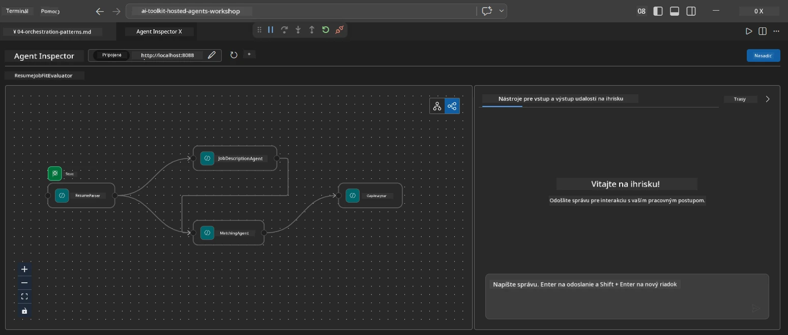
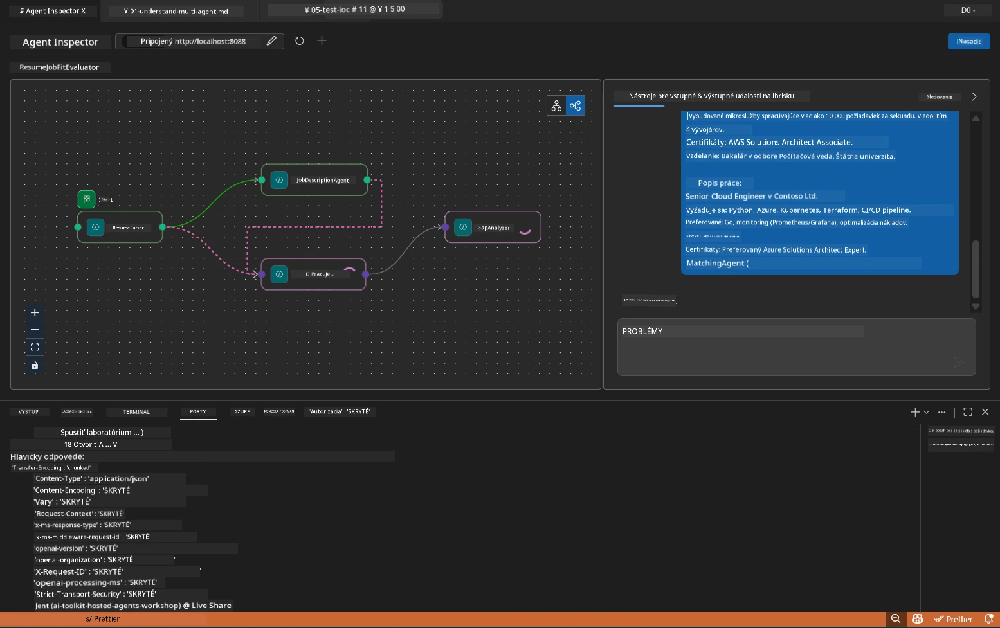
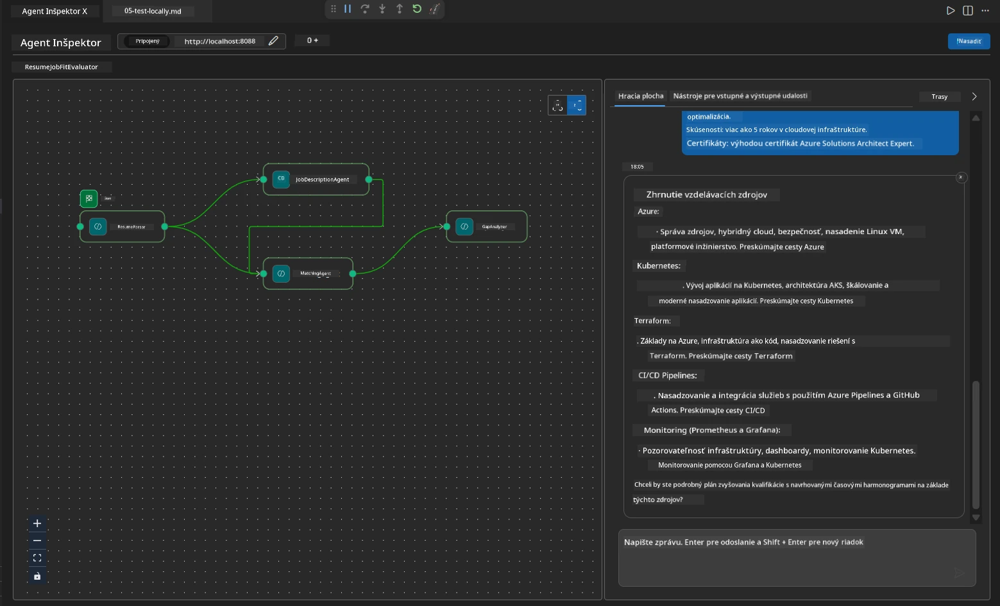

# Modul 5 - Testovanie lokálne

⏱️ ~15 min

V tomto module spustíte pracovný postup viacerých agentov lokálne, otestujete ho pomocou Agent Inspector a overíte, že všetci štyria agenti a nástroj MCP fungujú správne pred nasadením.

---

## Krok 1: Spustite server agenta

### Možnosť A: Použitie úlohy vo VS Code (odporúčané)

1. Otvorte `workshop/lab02-multi-agent/PersonalCareerCopilot/` ako svoju VS Code zložku.
2. Stlačte `Ctrl+Shift+P` → napíšte **Tasks: Run Task** → vyberte **Run Agent HTTP Server**.
3. Úloha spustí server s pripojeným debugpy na porte `5679` a agenta na porte `8088`.
4. Počkajte, kým sa v konzole nezobrazí:

```
INFO:resume-job-fit:Starting Resume -> Job Fit Evaluator HTTP server...
INFO:resume-job-fit:Server running on http://localhost:8088
```

### Možnosť B: Použitie F5 (režim ladenia)

1. Stlačte `F5` → vyberte **Debug Local Agent HTTP Server**.
2. Server sa spustí s plnou podporou breakpointov - užitočné pre kontrolu odpovedí MCP alebo výstupov agenta.

---

## Krok 2: Otvorte Agent Inspector

1. Stlačte `Ctrl+Shift+P` → napíšte **Foundry Toolkit: Open Agent Inspector**.
2. Agent Inspector sa otvorí ako panel vo VS Code pripojený na `http://localhost:8088`.
3. Mali by ste vidieť rozhranie agenta pripravené prijímať správy.



> **Ak sa Agent Inspector neotvorí:** Uistite sa, že server je úplne spustený (vidíte log "Server running"). Ak je port 5679 obsadený, pozrite [Modul 8 - Riešenie problémov](08-troubleshooting.md).

---

## Krok 2b: (Voliteľné) Otvorte Workflow Visualizer

Foundry Toolkit obsahuje real-time **Workflow Visualizer**, ktorý zobrazuje, ako agenti vzájomne komunikujú počas behu grafu. Toto je obzvlášť užitočné pri ladení viacerých agentov.

1. Stlačte `Ctrl+Shift+P` → napíšte **Foundry Toolkit: Open Visualizer for Hosted Agents**.
2. Otvorí sa nová karta VS Code so zobrazením živého vykonávacieho grafu.
3. Pri odosielaní správ v Agent Inspector sa visualizer automaticky aktualizuje - zelené uzly označujú dokončených agentov a animované hrany zobrazujú tok dát medzi nimi.

> **Konflikt portov:** Ak je port visualizéra už obsadený, zmente ho v nastaveniach VS Code → **Extensions** → **Microsoft Foundry Configuration** → **Hosted Agents: Visualizer Port**.

---

## Krok 3: Spustite základné testy

Spustite tieto tri testy v poradí. Každý test kontroluje postupne viac pracovného toku.

### Test 1: Základný životopis + popis práce

Vložte nasledujúci text do Agent Inspector:

```
Resume:
Jane Doe
Senior Software Engineer with 5 years of experience in Python, Django, and AWS.
Built microservices handling 10K+ requests/second. Led a team of 4 developers.
Certifications: AWS Solutions Architect Associate.
Education: B.S. Computer Science, State University.

Job Description:
Senior Cloud Engineer at Contoso Ltd.
Required: Python, Azure, Kubernetes, Terraform, CI/CD pipelines.
Preferred: Go, monitoring (Prometheus/Grafana), cost optimization.
Experience: 5+ years in cloud infrastructure.
Certifications: Azure Solutions Architect Expert preferred.
```

**Očakávaná štruktúra výstupu:**

Odpoveď by mala obsahovať výstup všetkých štyroch agentov v poradí:

1. **Výstup Resume Parséra** - Dve označené časti: `[PARSED RESUME]` (profil kandidáta so zoskupenými zručnosťami) a `[JOB DESCRIPTION PASS-THROUGH]` (doslovný text JD, ktorý je vstupom pre JD agenta)
2. **Výstup JD Agenta** - Štruktúrované požiadavky s oddelenými povinnými a preferovanými zručnosťami
3. **Výstup Matching Agenta** - Skóre zhody (0-100) s rozpisom, zladené zručnosti, chýbajúce zručnosti, medzery
4. **Výstup Gap Analyzéra** - Jednotlivé karty medzier pre každú chýbajúcu zručnosť, každá s URL na Microsoft Learn





### Čo overiť v teste 1

| Skontrolovať | Očakávané | Prešlo? |
|-------|----------|-------|
| Odpoveď obsahuje skóre zhody | Číslo medzi 0-100 s rozpisom | |
| Zladené zručnosti sú uvedené | Python, CI/CD (čiastočne), atď. | |
| Chýbajúce zručnosti sú uvedené | Azure, Kubernetes, Terraform, atď. | |
| Karty medzier existujú pre každú chýbajúcu zručnosť | Jedna karta na zručnosť | |
| URL na Microsoft Learn sú prítomné | Skutočné odkazy z `learn.microsoft.com` | |
| Žiadne chybové správy v odpovedi | Čistý štruktúrovaný výstup | |

### Test 2: Krajné prípady - kandidát s vysokou zhode

Vložte životopis, ktorý úzko zodpovedá JD, aby ste overili, že GapAnalyzer zvláda scenáre vysokej zhody:

```
Resume:
Alex Chen
Senior Cloud Engineer with 7 years of experience.
Skills: Python, Azure (AKS, Functions, DevOps), Kubernetes, Terraform, CI/CD (GitHub Actions, Azure Pipelines), Go, Prometheus, Grafana, cost optimization.
Certifications: Azure Solutions Architect Expert, Azure DevOps Engineer Expert.
Led infrastructure migration to Azure for 3 enterprise clients.
Education: M.S. Computer Science, Tech University.

Job Description:
Senior Cloud Engineer at Contoso Ltd.
Required: Python, Azure, Kubernetes, Terraform, CI/CD pipelines.
Preferred: Go, monitoring (Prometheus/Grafana), cost optimization.
Experience: 5+ years in cloud infrastructure.
Certifications: Azure Solutions Architect Expert preferred.
```

**Očakávané správanie:**
- Skóre zhody by malo byť **80+** (väčšina zručností sa zhoduje)
- Karty medzier by mali byť zamerané na dolaďovanie/prípravu na pohovor namiesto základného učenia
- Pokyny GapAnalyzéra hovoria: "Ak je zhoda >= 80, zamerajte sa na dolaďovanie/prípravu na pohovor"

---

## Krok 4: Otestujte s vlastnými údajmi (voliteľné)

Skúste vložiť svoj vlastný životopis a skutočný popis práce. Pomáha to overiť:

- Agentky zvládajú rôzne formáty životopisov (chronologický, funkčný, hybridný)
- JD Agent zvláda rôzne štýly JD (odrážky, odseky, štruktúrované)
- Nástroj MCP vracia relevantné zdroje pre skutočné zručnosti
- Karty medzier sú personalizované podľa vašej špecifickej histórie

> **Súkromie - cesta A (Foundry cloud):** Text životopisu a JD sa odosiela do vášho Azure OpenAI nasadenia na inferenciu. Nie je zaznamenávaný ani ukladaný infraštruktúrou workshopu. Použite náhradné mená (napr. "Jane Doe"), ak chcete.
>
> **Súkromie - cesta B (Foundry Local):** Všetky štyri inferencie agentov bežia úplne na vašom zariadení. Váš životopis a popis práce **nikdy neopúšťajú váš počítač**. Jediný odchádzajúci hovor je nástroj MCP, ktorý získava zdroje z `https://learn.microsoft.com/api/mcp`; táto otázka obsahuje iba názov zručnosti, nie vaše osobné údaje.

---

### Kontrolný bod

- [ ] Server bol úspešne spustený na porte `8088` (log ukazuje "Server running")
- [ ] Agent Inspector bol otvorený a pripojený k agentovi
- [ ] Test 1: Kompletná odpoveď so skóre zhody, zladenými/chýbajúcimi zručnosťami, kartami medzier a URL na Microsoft Learn
- [ ] Test 2: Kandidát s vysokou zhodou dostane skóre 80+ s odporúčaniami zameranými na dolaďovanie
- [ ] Všetky karty medzier sú prítomné (jedna na každú chýbajúcu zručnosť, bez skrátenia)
- [ ] Žiadne chyby alebo stack trace v termináli servera

---

**Predchádzajúce:** [04 - Orchestration Patterns](04-orchestration-patterns.md) · **Nasledujúce:** [06 - Deploy to Foundry →](06-deploy-to-foundry.md)

---

<!-- CO-OP TRANSLATOR DISCLAIMER START -->
**Vyhlásenie o zodpovednosti**:
Tento dokument bol preložený pomocou AI prekladateľskej služby [Co-op Translator](https://github.com/Azure/co-op-translator). Hoci sa snažíme o presnosť, vezmite prosím na vedomie, že automatické preklady môžu obsahovať chyby alebo nepresnosti. Pôvodný dokument v jeho natívnom jazyku by mal byť považovaný za autoritatívny zdroj. Pre kritické informácie sa odporúča profesionálny ľudský preklad. Nie sme zodpovední za žiadne nedorozumenia alebo nesprávne interpretácie vyplývajúce z použitia tohto prekladu.
<!-- CO-OP TRANSLATOR DISCLAIMER END -->