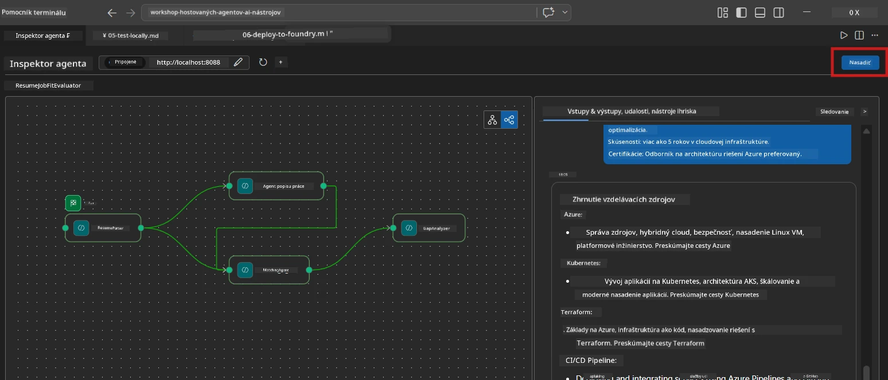
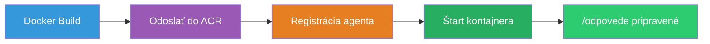
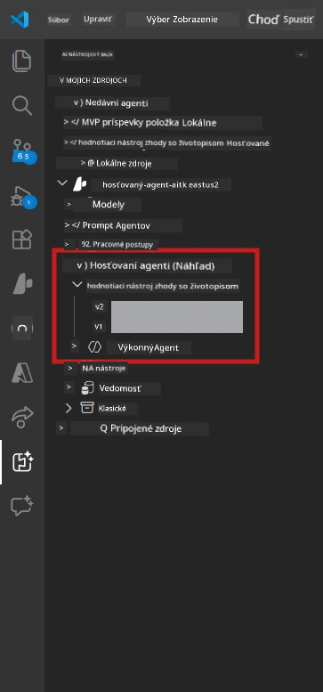

# Modul 6 - Nasadenie do služby Foundry Agent

V tomto module nasadíte lokálne otestovaný multi-agentný pracovný tok do [Microsoft Foundry](https://learn.microsoft.com/azure/foundry/agents/concepts/hosted-agents) ako **Hosted Agent**. Proces nasadenia vytvorí obraz Docker kontajnera, odošle ho do [Azure Container Registry (ACR)](https://learn.microsoft.com/azure/container-registry/container-registry-intro) a vytvorí verziu hostovaného agenta v [Foundry Agent Service](https://learn.microsoft.com/azure/foundry/agents/how-to/publish-agent).

> **Kľúčový rozdiel oproti Lab 01:** Proces nasadenia je identický. Foundry spracováva váš multi-agentný pracovný tok ako jedného hostovaného agenta - zložitosť je vo vnútri kontajnera, ale rozhranie nasadenia je rovnaké `/responses` endpoint.

---

## Kontrola predpokladov

Pred nasadením si overte každý z nasledujúcich bodov:

1. **Agent úspešne prešiel lokálnymi testami:**
   - Dokončili ste všetky 3 testy v [Module 5](05-test-locally.md) a pracovný tok vyprodukoval kompletný výstup s gap kartami a URL adresami Microsoft Learn.

2. **Máte rolu [Azure AI User](https://learn.microsoft.com/azure/foundry/concepts/rbac-foundry):**
   - Bola vám pridelená v [Lab 01, Module 2](../../lab01-single-agent/docs/02-create-foundry-project.md). Overte:
   - [Azure Portal](https://portal.azure.com) → váš Foundry **projekt** → **Access control (IAM)** → **Role assignments** → potvrďte, že **[Azure AI User](https://aka.ms/foundry-ext-project-role)** je uvedená pri vašom účte.

3. **Ste prihlásený do Azure vo VS Code:**
   - Skontrolujte ikonu Účtov v ľavom dolnom rohu VS Code, mala by byť viditeľná vaša prihlasovacia identita.

4. **`agent.yaml` má správne hodnoty:**
   - Otvorte `PersonalCareerCopilot/agent.yaml` a overte:
     ```yaml
     environment_variables:
       - name: PROJECT_ENDPOINT
         value: ${PROJECT_ENDPOINT}
       - name: MODEL_DEPLOYMENT_NAME
         value: ${MODEL_DEPLOYMENT_NAME}
     ```
   - Musia zodpovedať premenným prostredia, ktoré číta váš `main.py`.

5. **`requirements.txt` má správne verzie:**
   ```
   agent-framework-azure-ai==1.0.0rc3
   agent-framework-core==1.0.0rc3
   azure-ai-agentserver-agentframework==1.0.0b16
   azure-ai-agentserver-core==1.0.0b16
   debugpy
   agent-dev-cli --pre
   ```

---

## Krok 1: Spustite nasadenie

### Možnosť A: Nasadiť z Agent Inspector (odporúčané)

Ak je agent spustený cez F5 a Agent Inspector je otvorený:

1. Pozrite na **pravý horný roh** panela Agent Inspector.
2. Kliknite na tlačidlo **Deploy** (ikona mraku so šípkou hore ↑).
3. Otvorí sa sprievodca nasadením.



### Možnosť B: Nasadiť z Command Palette

1. Stlačte `Ctrl+Shift+P` pre otvorenie **Command Palette**.
2. Napíšte: **Microsoft Foundry: Deploy Hosted Agent** a vyberte túto položku.
3. Otvorí sa sprievodca nasadením.

---

## Krok 2: Konfigurujte nasadenie

### 2.1 Vyberte cieľový projekt

1. Zobrazí sa rozbaľovací zoznam vašich Foundry projektov.
2. Vyberte projekt, ktorý ste používali počas workshopu (napr. `workshop-agents`).

### 2.2 Vyberte súbor s kontajnerovým agentom

1. Bude potrebné vybrať vstupný bod agenta.
2. Prejdite do `workshop/lab02-multi-agent/PersonalCareerCopilot/` a vyberte **`main.py`**.

### 2.3 Konfigurácia zdrojov

| Nastavenie | Odporúčaná hodnota | Poznámky |
|------------|--------------------|----------|
| **CPU** | `0.25` | Predvolené. Multi-agentné pracovné toky nepotrebujú viac CPU, lebo volania modelov sú viazané na I/O |
| **Pamäť** | `0.5Gi` | Predvolené. Zvýšte na `1Gi` ak pridáte veľké nástroje na spracovanie dát |

---

## Krok 3: Potvrďte a nasadte

1. Sprievodca zobrazí rekapituláciu nasadenia.
2. Prezrite si ju a kliknite na **Confirm and Deploy**.
3. Sledujte priebeh vo VS Code.

### Čo sa deje počas nasadenia

Sledujte VS Code **Output** panel (vyberte "Microsoft Foundry" v rozbaľovacom zozname):


1. **Docker build** - zostavuje kontajner z vášho `Dockerfile`:
   ```
   Step 1/6 : FROM python:3.14-slim
   Step 2/6 : WORKDIR /app
   ...
   Successfully built abc123def456
   ```

2. **Docker push** - odosiela obraz do ACR (1-3 minúty pri prvom nasadení).

3. **Registrácia agenta** - Foundry vytvorí hostovaného agenta pomocou metadát z `agent.yaml`. Agent má názov `resume-job-fit-evaluator`.

4. **Štart kontajnera** - Kontajner sa spustí v spravovanej infraštruktúre Foundry s riadenou identitou systému.

> **Prvé nasadenie je pomalšie** (Docker odosiela všetky vrstvy). Následné nasadenia využívajú cache vrstiev a sú rýchlejšie.

### Špecifické poznámky k multi-agent

- **Všetci štyria agenti sú vo vnútri jedného kontajnera.** Foundry vidí jedného hostovaného agenta. WorkflowBuilder graf beží interne.
- **Volania MCP sú smerované von z kontajnera.** Kontajner potrebuje prístup na internet k `https://learn.microsoft.com/api/mcp`. Spravovaná infraštruktúra Foundry to štandardne umožňuje.
- **[Managed Identity](https://learn.microsoft.com/python/api/overview/azure/identity-readme#managed-identity-support).** V hostovanom prostredí `get_credential()` v `main.py` vracia `ManagedIdentityCredential()` (pretože je nastavená `MSI_ENDPOINT`). Toto sa deje automaticky.

---

## Krok 4: Overte stav nasadenia

1. Otvorte **Microsoft Foundry** postranný panel (kliknite na ikonu Foundry v Activity Bar).
2. Rozbaľte **Hosted Agents (Preview)** v rámci vášho projektu.
3. Nájdite **resume-job-fit-evaluator** (alebo názov vášho agenta).
4. Kliknite na názov agenta → rozbaľte verzie (napr. `v1`).
5. Kliknite na verziu → skontrolujte **Container Details** → **Status**:



| Stav | Význam |
|------|--------|
| **Started** / **Running** | Kontajner beží, agent je pripravený |
| **Pending** | Kontajner sa štartuje (počítajte 30-60 sekúnd) |
| **Failed** | Kontajner sa nepodarilo spustiť (skontrolujte logy - nižšie) |

> **Štart multi-agenta trvá dlhšie** ako u single-agenta, pretože kontajner vytvára 4 inštancie agenta pri štarte. "Pending" až do 2 minút je normálne.

---

## Bežné chyby pri nasadení a riešenia

### Chyba 1: Povolenie zamietnuté - `agents/write`

```
Error: lacks the required data action 
Microsoft.CognitiveServices/accounts/AIServices/agents/write
```

**Riešenie:** Priraďte rolu **[Azure AI User](https://learn.microsoft.com/azure/foundry/concepts/rbac-foundry)** na úrovni **projektu**. Pozrite [Module 8 - Troubleshooting](08-troubleshooting.md) pre podrobné inštrukcie.

### Chyba 2: Docker nie je spustený

```
Error: Docker build failed / Cannot connect to Docker daemon
```

**Riešenie:**
1. Spustite Docker Desktop.
2. Počkajte, kým sa zobrazí "Docker Desktop is running".
3. Overte: `docker info`
4. **Windows:** Skontrolujte, či je v nastaveniach Docker Desktop zapnutý WSL 2 backend.
5. Skúste znova.

### Chyba 3: Pip install zlyháva počas Docker build

```
Error: Could not find a version that satisfies the requirement agent-dev-cli
```

**Riešenie:** Prepínač `--pre` v `requirements.txt` sa spracováva inak v Docker prostredí. Uistite sa, že váš `requirements.txt` obsahuje:
```
agent-dev-cli --pre
```

Ak Docker stále zlyháva, vytvorte `pip.conf` alebo odovzdajte `--pre` ako argument buildu. Pozrite [Module 8](08-troubleshooting.md).

### Chyba 4: Nástroj MCP zlyháva v hostovanom agentovi

Ak Gap Analyzer po nasadení prestane produkovať URL adresy Microsoft Learn:

**Príčina:** Sieťová politika môže blokovať odchádzajúce HTTPS volania z kontajnera.

**Riešenie:**
1. Toto zvyčajne nie je problém so štandardnou konfiguráciou Foundry.
2. Ak sa vyskytne, skontrolujte, či virtuálna sieť projektu Foundry nemá NSG blokujúci odchádzajúce HTTPS.
3. MCP nástroj má záložné URL adresy, takže agent aj tak vyprodukuje výstup (bez živých URL).

---

### Kontrolný bod

- [ ] Príkaz na nasadenie bol dokončený bez chýb vo VS Code
- [ ] Agent sa zobrazuje pod **Hosted Agents (Preview)** v postrannom paneli Foundry
- [ ] Názov agenta je `resume-job-fit-evaluator` (alebo váš zvolený názov)
- [ ] Stav kontajnera ukazuje **Started** alebo **Running**
- [ ] (Ak boli chyby) Identifikovali ste chybu, aplikovali nápravu a úspešne ste znovu nasadili

---

**Predchádzajúce:** [05 - Test lokálne](05-test-locally.md) · **Ďalšie:** [07 - Overenie v Playground →](07-verify-in-playground.md)

---

<!-- CO-OP TRANSLATOR DISCLAIMER START -->
**Zrieknutie sa zodpovednosti**:
Tento dokument bol preložený pomocou AI prekladateľskej služby [Co-op Translator](https://github.com/Azure/co-op-translator). Hoci sa snažíme o presnosť, vezmite, prosím, na vedomie, že automatické preklady môžu obsahovať chyby alebo nepresnosti. Pôvodný dokument v jeho pôvodnom jazyku by mal byť považovaný za autoritatívny zdroj. Pre kľúčové informácie sa odporúča profesionálny ľudský preklad. Nie sme zodpovední za akékoľvek nedorozumenia alebo nesprávne výklady vyplývajúce z použitia tohto prekladu.
<!-- CO-OP TRANSLATOR DISCLAIMER END -->