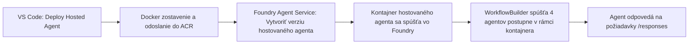
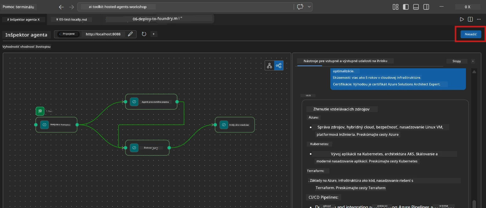
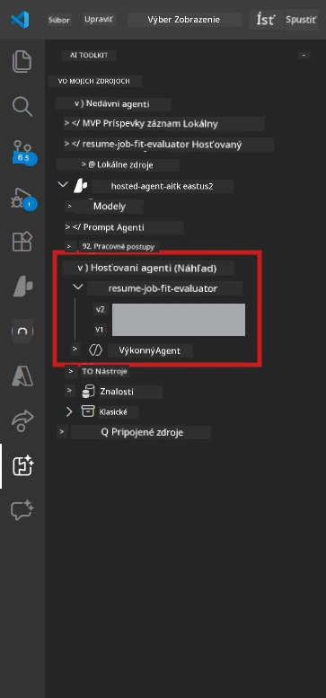

# Modul 6 - Nasadenie do Foundry Agent Service

⏱️ ~10 minút

V tomto module nasadíte svoj lokálne testovaný multi-agentný pracovný tok na [Microsoft Foundry](https://learn.microsoft.com/azure/foundry/agents/concepts/hosted-agents) ako **Hosted Agent** (hosťovaný agent). Proces nasadenia vytvorí obraz Docker kontajnera, odosiela ho do [Azure Container Registry (ACR)](https://learn.microsoft.com/azure/container-registry/container-registry-intro) a vytvára verziu hosťovaného agenta v [Foundry Agent Service](https://learn.microsoft.com/azure/foundry/agents/how-to/publish-agent).

> **Hlavný rozdiel oproti Lab 01:** Proces nasadenia je identický. Foundry považuje váš multi-agentný pracovný tok za jedného hosťovaného agenta - zložitosť je v kontajneri, ale rozhranie nasadenia je rovnaké, endpoint `/responses`.

### Nasadzovací pipeline


```mermaid
flowchart LR
    A[VS Code: Deploy Hosted Agent] --> B[Docker zostavenie a odoslanie do ACR]
    B --> C[Foundry Agent Service: Vytvoriť verziu hostovaného agenta]
    C --> D[Kontajner hostovaného agenta sa spúšťa vo Foundry]
    D --> E[WorkflowBuilder spúšťa 4 agentov postupne v rámci kontajnera]
    E --> F[Agent odpovedá na požiadavky /responses]
```

---

## Kontrola predpokladov

Pred nasadením overte každý bod nižšie:

1. **Agent prešiel lokálnymi základnými testami:**
   - Dokončili ste všetky 3 testy v [Module 5](05-test-locally.md) a pracovný tok vygeneroval kompletný výstup s kartičkami s medzerami a URL adresami Microsoft Learn.

2. **Máte pridelenú rolu [Foundry User](https://learn.microsoft.com/azure/foundry/concepts/rbac-foundry)** (na nasadenie potrebujete minimálne rolu **Foundry Project Manager** na úrovni projektu):

   > **Poznámka:** RBAC roly vo Foundry boli nedávno premenované - **Foundry User**, **Foundry Owner** a **Foundry Project Manager** sa predtým volali Azure AI User, Azure AI Owner a Azure AI Project Manager. ID rolí a povolenia sú nezmenené.

   - Overte v [Azure Portáli](https://portal.azure.com) → váš Foundry **projekt** zdroj → **Prístupová kontrola (IAM)** → **Priraďovanie rolí** → potvrďte, že **Foundry User** (alebo vyššie) je uvedený pre váš účet.

3. **Ste prihlásený do Azure vo VS Code:**
   - Skontrolujte ikonu Účty v ľavom dolnom rohu VS Code. Malo by byť vidieť meno vášho účtu.

4. **`agent.yaml` má správne hodnoty:**
   - Otvorte `PersonalCareerCopilot/agent.yaml` a overte:
     ```yaml
     environment_variables:
       - name: AZURE_AI_MODEL_DEPLOYMENT_NAME
         value: ${AZURE_AI_MODEL_DEPLOYMENT_NAME}
     ```
   - `FOUNDRY_PROJECT_ENDPOINT` sa tu **neuvádza** - Foundry ho vkladá za behu. Je potrebné deklarovať iba `AZURE_AI_MODEL_DEPLOYMENT_NAME`.

5. **`requirements.txt` má správne verzie:**
   ```
   agent-framework-foundry
   agent-framework-foundry-hosting
   mcp<2,>=1.24.0
   debugpy
   ```

---

## Krok 1: Spustenie nasadenia

### Možnosť A: Nasadiť z Agent Inspector (odporúčané)

Ak agent beží cez F5 s otvoreným Agent Inspector:

1. Pozrite sa do **pravého horného rohu** panela Agent Inspector.
2. Kliknite na tlačidlo **Deploy** (ikona cloudu so šípkou nahor ↑).
3. Otvorí sa sprievodca nasadením.



### Možnosť B: Nasadiť cez Command Palette

1. Stlačte `Ctrl+Shift+P` pre otvorenie **Command Palette**.
2. Napíšte: **Foundry Toolkit: Deploy Hosted Agent** a vyberte túto možnosť.
3. Otvorí sa sprievodca nasadením.

---

## Krok 2: Konfigurácia nasadenia

### 2.1 Vyberte cieľový projekt

1. Zobrazí sa rozbaľovací zoznam vašich Foundry projektov.
2. Vyberte projekt, ktorý ste používali počas celého workshopu (napr. `workshop-agents`).

### 2.2 Vyberte súbor kontajnerového agenta

1. Budete vyzvaní vybrať vstupný bod agenta.
2. Prejdite do `workshop/lab02-multi-agent/PersonalCareerCopilot/` a vyberte **`main.py`**.

### 2.3 Konfigurácia zdrojov

| Nastavenie | Odporúčaná hodnota | Poznámky |
|---------|------------------|-------|
| **Metóda nasadenia** | **Kontajner** (odporúčané) alebo **Kód** | Kontajner vytvára obraz Docker; kód nahráva zdroj ako ZIP (preview) |
| **Container Registry** | **Predvolený ACR** | Foundry vytvára a spravuje jeden za vás |
| **CPU** | `0.25` | Predvolené. Multi-agentné pracovné toky nepotrebujú viac CPU, pretože volania modelu sú viazané na I/O |
| **Pamäť** | `0.5Gi` | Predvolené. Zvýšte na `1Gi`, ak pridávate nástroje na spracovanie veľkých dát |

---

## Krok 3: Potvrďte a nasadzujte

1. Sprievodca zobrazí súhrn nasadenia.
2. Skontrolujte a kliknite na **Confirm and Deploy**.
3. Sledujte priebeh vo VS Code.

### Čo sa deje počas nasadenia

Sledujte panel **Output** vo VS Code (vyberte zoznam "Microsoft Foundry"):

1. **Docker build** - Vytvára kontajner z vášho `Dockerfile`
   ```
   Step 1/6 : FROM python:3.12-slim
   Step 2/6 : WORKDIR /app
   ...
   Successfully built abc123def456
   ```

2. **Docker push** - Odosiela obraz do ACR (1-3 minúty pri prvom nasadení).

3. **Registrácia agenta** - Foundry vytvorí hosťovaného agenta pomocou metadát z `agent.yaml`. Názov agenta je `resume-job-fit-evaluator`.

4. **Štart kontajnera** - Kontajner sa spustí v spravovanej infraštruktúre Foundry so systémom spravovanou identitou.

> **Prvé nasadenie je pomalšie** (Docker odosiela všetky vrstvy). Následné nasadenia znovu použijú uložené vrstvy a sú rýchlejšie.

### Poznámky špecifické pre multi-agent

- **Všetci štyria agenti sú vo vnútri jedného kontajnera.** Foundry vidí jedného hosťovaného agenta. Graf WorkflowBuilder beží interne.
- **Volania MCP idú von.** Kontajner potrebuje prístup na internet, aby sa mohol spojiť s `https://learn.microsoft.com/api/mcp`. Spravovaná infraštruktúra Foundry to poskytuje predvolene.
- **[Spravovaná identita](https://learn.microsoft.com/azure/foundry/agents/concepts/agent-identity).** Foundry automaticky vytvára **vyhradenú Entra identitu na každého agenta** pre každého hosťovaného agenta pri nasadení. V hosťovanom prostredí sa `DefaultAzureCredential` automaticky mapuje na túto identitu agenta - nie je potrebná žiadna ručná konfigurácia spravovanej identity.

---

## Krok 4: Overte stav nasadenia

1. Otvorte bočný panel **Microsoft Foundry** (kliknite na ikonu Foundry v paneli aktivít).
2. Rozbaľte **Hosted Agents (Preview)** v rámci vášho projektu.
3. Nájdite **resume-job-fit-evaluator** (alebo názov vášho agenta).
4. Kliknite na názov agenta → rozbaľte verzie (napr. `v1`).
5. Kliknite na verziu → skontrolujte **Container Details** → **Status**:



| Stav | Význam |
|--------|---------|
| **active** | Agent beží a je pripravený prijímať požiadavky |
| **creating** | Kontajner sa spúšťa (počkaj 30–60 sekúnd) |
| **failed** | Kontajner sa nepodarilo spustiť (skontrolujte logy - viď nižšie) |

> **Poznámka:** Bočný panel VS Code môže zobrazovať štítky ako "Running" alebo "Started", zatiaľ čo API podklad používa `active`/`creating`. Obe zobrazenia označujú ten istý stav.

> **Štart multi-agenta trvá dlhšie** ako pri jednom agentovi, pretože kontajner pri štarte vytvára 4 inštancie agentov. Stav `creating` až do 2 minút je normálny.

---

## Bežné chyby pri nasadení a ich opravy

### Chyba 1: Permission denied - `agents/write`

```
Error: lacks the required data action 
Microsoft.CognitiveServices/accounts/AIServices/agents/write
```

**Oprava:** Priraďte rolu **[Foundry User](https://learn.microsoft.com/azure/foundry/concepts/rbac-foundry)** (predtým **Azure AI User**) na úrovni **projektu**. Pre krok-za-krokom návod pozrite [Module 8 - Riešenie problémov](08-troubleshooting.md).

### Chyba 2: Docker neběží

```
Error: Docker build failed / Cannot connect to Docker daemon
```

**Oprava:**
1. Spustite Docker Desktop.
2. Počkajte na hlásenie „Docker Desktop is running“.
3. Overte: `docker info`
4. **Windows:** Uistite sa, že backend WSL 2 je zapnutý v nastaveniach Docker Desktop.
5. Skúste znova.

### Chyba 3: pip install zlyhá počas Docker build

```
Error: Could not find a version that satisfies the requirement agent-framework-foundry
```

**Oprava:** Overte, že `requirements.txt` zodpovedá:
```
agent-framework-foundry
agent-framework-foundry-hosting
mcp<2,>=1.24.0
debugpy
```

Ak zostane build stále neúspešný, vaša Docker sieť môže blokovať PyPI. Skontrolujte `docker info` nastavenia proxy.

### Chyba 4: MCP nástroj nefunguje v hosťovanom agentovi

Ak Gap Analyzer po nasadení prestane produkovať Microsoft Learn URL:

**Príčina:** Sieťová politika môže blokovať odchádzajúce HTTPS z kontajnera.

**Oprava:**
1. Zvyčajne to nie je problém s predvolenou konfiguráciou Foundry.
2. Ak problém pretrváva, skontrolujte, či virtuálna sieť projektu Foundry nemá NSG, ktorý blokuje odchádzajúce HTTPS.
3. MCP nástroj má zabudované náhradné URL, takže agent stále vygeneruje výstup (bez aktívnych URL).

---

### Kontrolný zoznam

- [ ] Príkaz nasadenia bol dokončený bez chýb vo VS Code
- [ ] Agent sa zobrazuje pod **Hosted Agents (Preview)** v Foundry bočnom paneli
- [ ] Názov agenta je `resume-job-fit-evaluator` (alebo váš zvolený názov)
- [ ] Stav kontajnera ukazuje **Started** alebo **Running**
- [ ] (Ak boli chyby) Identifikovali ste chybu, aplikovali opravu a úspešne znovu nasadili

---

**Predchádzajúci:** [05 - Testovanie lokálne](05-test-locally.md) · **Ďalší:** [07 - Overenie na hracej ploche →](07-verify-in-playground.md)

---

<!-- CO-OP TRANSLATOR DISCLAIMER START -->
**Vyhlásenie o zodpovednosti**:
Tento dokument bol preložený pomocou AI prekladateľskej služby [Co-op Translator](https://github.com/Azure/co-op-translator). Hoci sa snažíme o presnosť, vezmite prosím na vedomie, že automatické preklady môžu obsahovať chyby alebo nepresnosti. Pôvodný dokument v jeho natívnom jazyku by mal byť považovaný za autoritatívny zdroj. Pre kritické informácie sa odporúča profesionálny ľudský preklad. Nie sme zodpovední za žiadne nedorozumenia alebo nesprávne interpretácie vyplývajúce z použitia tohto prekladu.
<!-- CO-OP TRANSLATOR DISCLAIMER END -->