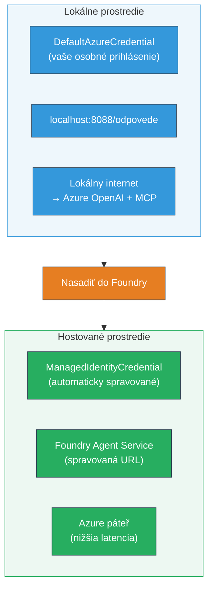

# Modul 7 - Overenie v Playground

V tomto module otestujete svoj nasadený multi-agentný workflow ako vo **VS Code**, tak aj v **[Foundry Portáli](https://ai.azure.com)** a potvrdíte, že agent správa sa rovnako ako pri lokálnom testovaní.

---

## Prečo overovať po nasadení?

Váš multi-agentný workflow bežal lokálne perfektne, prečo teda testovať znova? Hostované prostredie sa líši v niekoľkých ohľadoch:


| Rozdiel | Lokálne | Hostované |
|-----------|-------|--------|
| **Identita** | [`DefaultAzureCredential`](https://learn.microsoft.com/azure/developer/python/sdk/authentication/credential-chains#defaultazurecredential-overview) (váš osobný prihlásenie) | [`ManagedIdentityCredential`](https://learn.microsoft.com/python/api/overview/azure/identity-readme#managed-identity-support) (automaticky pridelené) |
| **Konfigurácia endpointu** | `http://localhost:8088/responses` | [Foundry Agent Service](https://learn.microsoft.com/azure/foundry/agents/concepts/hosted-agents) endpoint (spravovaná URL) |
| **Sieť** | Lokálny počítač → Azure OpenAI + MCP outbound | Azure backbone (nižšia latencia medzi službami) |
| **Pripojenie MCP** | Lokálny internet → `learn.microsoft.com/api/mcp` | Kontajner outbound → `learn.microsoft.com/api/mcp` |

Ak niektorá premenná prostredia je nesprávne nastavená, RBAC sa líši alebo je zablokovaný MCP outbound, zistíte to práve tu.

---

## Možnosť A: Testujte v VS Code Playground (odporúčané ako prvé)

Rozšírenie [Foundry](https://marketplace.visualstudio.com/items?itemName=TeamsDevApp.vscode-ai-foundry) obsahuje integrovaný Playground, ktorý vám umožní chatovať s vašim nasadeným agentom priamo vo VS Code.

### Krok 1: Prejdite k vášmu hostovanému agentovi

1. Kliknite na ikonu **Microsoft Foundry** v **Activity Bar** (ľavý bočný panel) vo VS Code pre otvorenie panelu Foundry.
2. Rozbaľte váš pripojený projekt (napr. `workshop-agents`).
3. Rozbaľte **Hosted Agents (Preview)**.
4. Mali by ste vidieť názov svojho agenta (napr. `resume-job-fit-evaluator`).

### Krok 2: Vyberte verziu

1. Kliknite na názov agenta pre rozbalenie jeho verzií.
2. Kliknite na verziu, ktorú ste nasadili (napr. `v1`).
3. Otvorí sa **detailný panel** zobrazujúci Detaily kontajnera.
4. Overte, či je stav **Started** alebo **Running**.

### Krok 3: Otvorte Playground

1. V detailnom paneli kliknite na tlačidlo **Playground** (alebo kliknite pravým tlačidlom na verziu → **Open in Playground**).
2. Otvorí sa chatovacie rozhranie v karte VS Code.

### Krok 4: Spustite smoke testy

Použite tie isté 3 testy z [Modulu 5](05-test-locally.md). Každú správu zadajte do vstupného poľa Playground a stlačte **Send** (alebo **Enter**).

#### Test 1 - Kompletný životopis + JD (štandardný tok)

Vložte prompt s kompletným životopisom + JD z Modulu 5, Test 1 (Jane Doe + Senior Cloud Engineer v Contoso Ltd).

**Očakávané:**
- Fit skóre s rozpisom výpočtu (škála 100 bodov)
- Sekcia s zhodenými zručnosťami
- Sekcia so chýbajúcimi zručnosťami
- **Jeden gap card na každú chýbajúcu zručnosť** s URL Microsoft Learn
- Plán učenia s časovou osou

#### Test 2 - Rýchly krátky test (minimálny vstup)

```
RESUME: 3 years Python developer, knows Django and PostgreSQL, no cloud experience.

JOB: Cloud DevOps Engineer requiring AWS, Kubernetes, Terraform, CI/CD. 5 years needed.
```

**Očakávané:**
- Nižšie fit skóre (< 40)
- Úprimné hodnotenie so stagingom učenia
- Viaceré gap karty (AWS, Kubernetes, Terraform, CI/CD, skúsenostný gap)

#### Test 3 - Kandidát s vysokou kompatibilitou

```
RESUME:
10 years Azure Cloud Architect. AZ-305 certified. Expert in AKS, Terraform, Azure DevOps, 
Azure Functions, Helm, Prometheus, Grafana, Python, Go. Led platform team of 8.

JOB:
Senior Cloud Engineer. Required: AKS, Terraform, Azure DevOps, Python. Preferred: Helm, Go.
5+ years experience. AZ-305 preferred.
```

**Očakávané:**
- Vysoké fit skóre (≥ 80)
- Zameranie na pripravenosť na pohovor a dolaďovanie
- Máloktoré alebo žiadne gap karty
- Krátka časová os s dôrazom na prípravu

### Krok 5: Porovnajte s lokálnymi výsledkami

Otvorte si poznámky alebo kartu prehliadača z Modulu 5, kde ste uložili lokálne odpovede. Pre každý test:

- Má odpoveď **rovnakú štruktúru** (fit skóre, gap karty, plán)?
- Dodržiava **rovnakú škálu bodovania** (100 bodový rozpis)?
- Sú v gap kartách stále prítomné **Microsoft Learn URL**?
- Je **jeden gap card na každú chýbajúcu zručnosť** (nie skrátený)?

> **Mierne rozdiely v slovách sú bežné** - model je nedeterministický. Zamerajte sa na štruktúru, konzistentnosť bodovania a využívanie MCP nástroja.

---

## Možnosť B: Testujte v Foundry Portáli

[Foundry Portál](https://ai.azure.com) poskytuje webové rozhranie playgroundu vhodné na zdieľanie s kolegami alebo zainteresovanými stranami.

### Krok 1: Otvorte Foundry Portál

1. Otvorte prehliadač a prejdite na [https://ai.azure.com](https://ai.azure.com).
2. Prihláste sa rovnakým Azure účtom, ktorý ste používali počas celého workshopu.

### Krok 2: Prejdite do svojho projektu

1. Na domovskej stránke, v ľavom bočnom paneli vyhľadajte **Recent projects**.
2. Kliknite na názov projektu (napr. `workshop-agents`).
3. Ak ho nevidíte, kliknite na **All projects** a vyhľadajte ho.

### Krok 3: Nájdite svoj nasadený agent

1. V ľavom navigačnom paneli projektu kliknite na **Build** → **Agents** (alebo nájdite sekciu **Agents**).
2. Mali by ste vidieť zoznam agentov. Nájdite svoj nasadený agent (napr. `resume-job-fit-evaluator`).
3. Kliknite na názov agenta pre otvorenie detailnej stránky.

### Krok 4: Otvorte Playground

1. Na detailnej stránke agenta pozrite horný panel nástrojov.
2. Kliknite na **Open in playground** (alebo **Try in playground**).
3. Otvorí sa chatovacie rozhranie.

### Krok 5: Spustite tie isté smoke testy

Opakujte všetky 3 testy z vyššie uvedenej sekcie VS Code Playground. Porovnajte každú odpoveď s lokálnymi výsledkami (Modul 5) a výsledkami VS Code Playground (Možnosť A).

---

## Overenie špecifické pre multi-agenta

Okrem základnej správnosti overte tieto správanie špecifické pre multi-agentov:

### Spustenie MCP nástrojov

| Kontrola | Ako overiť | Podmienka úspechu |
|-------|---------------|----------------|
| MCP volania úspešné | Gap karty obsahujú URL `learn.microsoft.com` | Skutočné URL, nie náhradné správy |
| Viacnásobné MCP volania | Každý gap s vysokou/strednou prioritou má zdroje | Nielen prvá gap karta |
| MCP fallback funguje | Ak chýbajú URL, kontrolujte fallback text | Agent stále produkuje gap karty (s alebo bez URL) |

### Koordinácia agentov

| Kontrola | Ako overiť | Podmienka úspechu |
|-------|---------------|----------------|
| Všetci 4 agenti bežali | Výstup obsahuje fit skóre aj gap karty | Score prichádza od MatchingAgent, karty od GapAnalyzer |
| Paralelné vykonanie | Čas odozvy je prijateľný (< 2 min) | Ak > 3 min, paralelné vykonanie pravdepodobne nefunguje |
| Integrita dátových tokov | Gap karty referencujú zručnosti z hodnotiacej správy | Žiadne vymyslené zručnosti, ktoré nie sú v JD |

---

## Hodnotiaca tabuľka

Použite túto tabuľku na vyhodnotenie správania vášho multi-agentného workflow v hostovanom prostredí:

| # | Kritérium | Podmienka úspechu | Splnené? |
|---|----------|---------------|-------|
| 1 | **Funkčná správnosť** | Agent odpovedá na životopis + JD fit skóre a analýzou gapov | |
| 2 | **Konzistencia bodovania** | Fit skóre používa 100 bodovú škálu s rozpisom | |
| 3 | **Kompletnosť gap kariet** | Jeden kartón na každú chýbajúcu zručnosť (nie zlúčený alebo skrátený) | |
| 4 | **Integrácia MCP nástrojov** | Gap karty obsahujú reálne Microsoft Learn URL | |
| 5 | **Štrukturálna konzistencia** | Výstupná štruktúra súhlasí medzi lokálnym a hostovaným behom | |
| 6 | **Čas odozvy** | Hostovaný agent odpovie do 2 minút pre kompletné hodnotenie | |
| 7 | **Žiadne chyby** | Žiadne chyby HTTP 500, timeouty ani prázdne odpovede | |

> „Splnené“ znamená, že všetkých 7 kritérií je splnených pre všetky 3 smoke testy aspoň v jednom playgrounde (VS Code alebo Portál).

---

## Riešenie problémov s playgroundom

| Príznak | Pravdepodobná príčina | Riešenie |
|---------|-------------|-----|
| Playground sa nenačíta | Stav kontajnera nie je „Started“ | Vráťte sa k [Modulu 6](06-deploy-to-foundry.md), overte stav nasadenia. Počkajte, ak je „Pending“ |
| Agent vracia prázdnu odpoveď | Nesúlad názvu nasadenia modelu | Skontrolujte v `agent.yaml` → `environment_variables` → `MODEL_DEPLOYMENT_NAME`, či zodpovedá nasadenému modelu |
| Agent vracia chybovú správu | Chýba povolenie [RBAC](https://learn.microsoft.com/azure/foundry/concepts/rbac-foundry) | Priraďte **[Azure AI User](https://aka.ms/foundry-ext-project-role)** na úrovni projektu |
| Žiadne Microsoft Learn URL v gap kartách | MCP outbound je blokovaný alebo MCP server nedostupný | Skontrolujte, či kontajner môže pristupovať na `learn.microsoft.com`. Pozri [Modul 8](08-troubleshooting.md) |
| V Playground je iba 1 gap karta (skrátená) | Chýbajúce inštrukcie „CRITICAL“ v GapAnalyzer | Prezrite si [Modul 3, krok 2.4](03-configure-agents.md) |
| Fit skóre je výrazne odlišné od lokálneho | Nasadený iný model alebo iné inštrukcie | Porovnajte `agent.yaml` hodnoty env. premenných s lokálnym `.env`. Ak treba, nasadte znova |
| „Agent not found“ v Portáli | Nasadenie sa stále propaguje alebo zlyhalo | Počkajte 2 minúty, obnovte stránku. Ak stále chýba, nasadte znova z [Modulu 6](06-deploy-to-foundry.md) |

---

### Kontrolný zoznam

- [ ] Otestovaný agent vo VS Code Playground - všetky 3 smoke testy úspešne
- [ ] Otestovaný agent v [Foundry Portáli](https://ai.azure.com) Playground - všetky 3 smoke testy úspešne
- [ ] Odpovede sú štrukturálne konzistentné s lokálnym testovaním (fit skóre, gap karty, plán)
- [ ] Microsoft Learn URL sú prítomné v gap kartách (MCP nástroj funguje v hostovanom prostredí)
- [ ] Jeden gap card na každú chýbajúcu zručnosť (bez skracovania)
- [ ] Počas testovania nebolo zaznamenané žiadne chyby ani timeouty
- [ ] Dokončená hodnotiaca tabuľka (všetkých 7 kritérií splnených)

---

**Predchádzajúce:** [06 - Deploy to Foundry](06-deploy-to-foundry.md) · **Ďalšie:** [08 - Troubleshooting →](08-troubleshooting.md)

---

<!-- CO-OP TRANSLATOR DISCLAIMER START -->
**Vyhlásenie o zodpovednosti**:  
Tento dokument bol preložený pomocou AI prekladateľskej služby [Co-op Translator](https://github.com/Azure/co-op-translator). Aj keď sa snažíme o presnosť, berte prosím na vedomie, že automatické preklady môžu obsahovať chyby alebo nepresnosti. Pôvodný dokument v jeho pôvodnom jazyku by mal byť považovaný za autoritatívny zdroj. Pre kritické informácie sa odporúča profesionálny ľudský preklad. Nezodpovedáme za akékoľvek nedorozumenia alebo nesprávne výklady vyplývajúce z použitia tohto prekladu.
<!-- CO-OP TRANSLATOR DISCLAIMER END -->