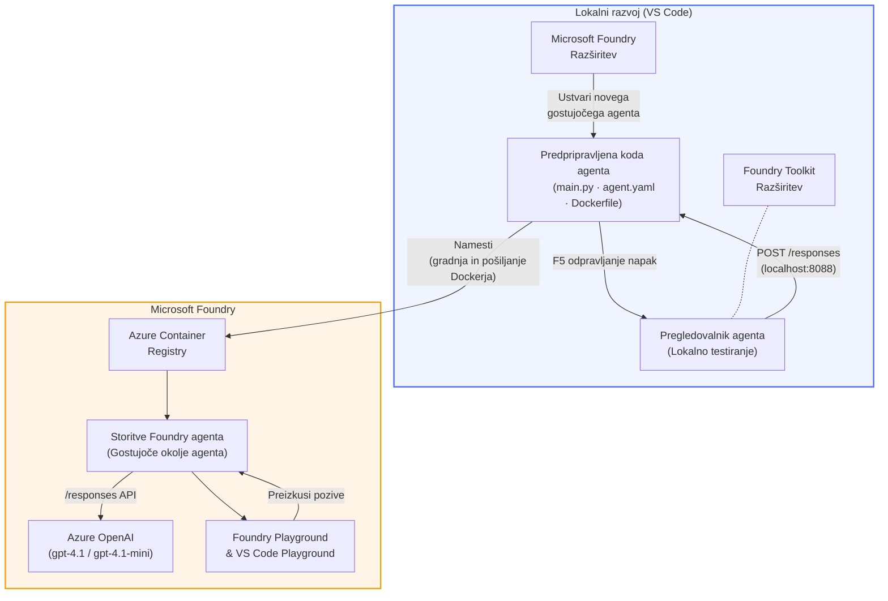

# Foundry Toolkit + delavnica Za gostujoče agente Foundry

[](https://www.python.org/)
[](https://github.com/microsoft/agents)
[](https://learn.microsoft.com/azure/ai-foundry/agents/concepts/hosted-agents/)
[](https://ai.azure.com/)
[](https://learn.microsoft.com/azure/ai-services/openai/)
[](https://learn.microsoft.com/cli/azure/install-azure-cli)
[](https://learn.microsoft.com/azure/developer/azure-developer-cli/install-azd)
[](https://www.docker.com/)
[](https://marketplace.visualstudio.com/items?itemName=ms-windows-ai-studio.windows-ai-studio)
[](LICENSE)

Ustvarjajte, testirajte in nameščajte AI agente v **Microsoft Foundry Agent Service** kot **gostujoče agente** – popolnoma znotraj VS Code z uporabo **Microsoft Foundry razširitve** in **Foundry Toolkit**.

> **Gostujoči agenti so trenutno v predogledu.** Podprte regije so omejene – oglejte si [dostopnost regij](https://learn.microsoft.com/azure/foundry/agents/concepts/hosted-agents#region-availability).

> Mapa `agent/` znotraj vsake delavnice je **samodejno ustvarjena** s Foundry razširitvijo – nato prilagodite kodo, preizkusite lokalno in namestite.

<!-- CO-OP TRANSLATOR LANGUAGES TABLE START -->
[Arabic](../ar/README.md) | [Bengali](../bn/README.md) | [Bulgarian](../bg/README.md) | [Burmese (Myanmar)](../my/README.md) | [Chinese (Simplified)](../zh-CN/README.md) | [Chinese (Traditional, Hong Kong)](../zh-HK/README.md) | [Chinese (Traditional, Macau)](../zh-MO/README.md) | [Chinese (Traditional, Taiwan)](../zh-TW/README.md) | [Croatian](../hr/README.md) | [Czech](../cs/README.md) | [Danish](../da/README.md) | [Dutch](../nl/README.md) | [Estonian](../et/README.md) | [Finnish](../fi/README.md) | [French](../fr/README.md) | [German](../de/README.md) | [Greek](../el/README.md) | [Hebrew](../he/README.md) | [Hindi](../hi/README.md) | [Hungarian](../hu/README.md) | [Indonesian](../id/README.md) | [Italian](../it/README.md) | [Japanese](../ja/README.md) | [Kannada](../kn/README.md) | [Khmer](../km/README.md) | [Korean](../ko/README.md) | [Lithuanian](../lt/README.md) | [Malay](../ms/README.md) | [Malayalam](../ml/README.md) | [Marathi](../mr/README.md) | [Nepali](../ne/README.md) | [Nigerian Pidgin](../pcm/README.md) | [Norwegian](../no/README.md) | [Persian (Farsi)](../fa/README.md) | [Polish](../pl/README.md) | [Portuguese (Brazil)](../pt-BR/README.md) | [Portuguese (Portugal)](../pt-PT/README.md) | [Punjabi (Gurmukhi)](../pa/README.md) | [Romanian](../ro/README.md) | [Russian](../ru/README.md) | [Serbian (Cyrillic)](../sr/README.md) | [Slovak](../sk/README.md) | [Slovenian](./README.md) | [Spanish](../es/README.md) | [Swahili](../sw/README.md) | [Swedish](../sv/README.md) | [Tagalog (Filipino)](../tl/README.md) | [Tamil](../ta/README.md) | [Telugu](../te/README.md) | [Thai](../th/README.md) | [Turkish](../tr/README.md) | [Ukrainian](../uk/README.md) | [Urdu](../ur/README.md) | [Vietnamese](../vi/README.md)

> **Raje klonirate lokalno?**
>
> Ta repozitorij vključuje prevode v več kot 50 jezikih, kar občutno poveča velikost prenosa. Če želite klonirati brez prevodov, uporabite sparse checkout:
>
> **Bash / macOS / Linux:**
> ```bash
> git clone --filter=blob:none --sparse https://github.com/microsoft-foundry/Foundry_Toolkit_for_VSCode_Lab.git
> cd Foundry_Toolkit_for_VSCode_Lab
> git sparse-checkout set --no-cone '/*' '!translations' '!translated_images'
> ```
>
> **CMD (Windows):**
> ```cmd
> git clone --filter=blob:none --sparse https://github.com/microsoft-foundry/Foundry_Toolkit_for_VSCode_Lab.git
> cd Foundry_Toolkit_for_VSCode_Lab
> git sparse-checkout set --no-cone "/*" "!translations" "!translated_images"
> ```
>
> Tako dobite vse, kar potrebujete za zaključek tečaja z veliko hitrejšim prenosom.
<!-- CO-OP TRANSLATOR LANGUAGES TABLE END -->

---

## Arhitektura


**Potek:** Foundry razširitev ustvarja začetno kodo agenta → vi prilagodite kodo in navodila → testirate lokalno z Agent Inspectorjem → namestite v Foundry (Docker slika potisnjena v ACR) → preverite v Playground.

---

## Kaj boste ustvarili

| Delavnica | Opis | Status |
|-----|-------------|--------|
| **Delavnica 01 - En sam agent** | Ustvarite **"Pojasni kot da sem direktor" agent**, ga testirajte lokalno in namestite v Foundry | ✅ Na voljo |
| **Delavnica 02 - Večagentni potek dela** | Ustvarite **"Ocena življenjepisa → ustreznost delovnega mesta"** - 4 agenti sodelujejo za oceno ustreznosti življenjepisa in izdelavo učnega načrta | ✅ Na voljo |

---

## Spoznajte izvršnega agenta

V tej delavnici boste ustvarili agenta **"Pojasni kot da sem direktor"** – AI agenta, ki sprejme zapleten tehnični žargon in ga prevede v umirjene, primerne za upravni odbor povzetke. Ker bodimo iskreni, nihče v C-sklopu noče poslušati o "izčrpanosti niti zaradi sinhronih klicev uvedenih v v3.2."

Ta agent je nastal po preveč primerih, ko je moj popolno izdelan povzetek po nesreči povzročil odziv: *"Torej... ali spletna stran deluje ali ne?"*

### Kako deluje

Vnesete tehnično posodobitev. Agent vrne izvršni povzetek – tri točke, brez žargona, brez sledov skladov, brez eksistencialnega strahu. Samo **kaj se je zgodilo**, **poslovni vpliv** in **naslednji korak**.

### Ogled v akciji

**Vi pravite:**
> "Zakasnitev API-ja se je povečala zaradi izčrpanosti niti, ki jo je povzročil sinhroni klic uveden v v3.2."

**Agent odgovori:**

> **Izvršni povzetek:**
> - **Kaj se je zgodilo:** Po zadnji izdaji se je sistem upočasnil.
> - **Poslovni vpliv:** Nekateri uporabniki so doživeli zamude pri uporabi storitve.
> - **Naslednji korak:** Sprememba je bila razveljavljena in pripravljamo popravek pred ponovnim nameščanjem.

### Zakaj ta agent?

Je enostaven agent za eno nalogo – popoln za učenje poteka dela za gostujoče agente od začetka do konca, brez zapletenosti orodnih verig. In iskreno? Vsaka inženirska ekipa bi lahko uporabila takšnega.

---

## Struktura delavnice

```
📂 Foundry_Toolkit_for_VSCode_Lab/
├── 📄 README.md                      ← You are here
├── 📂 ExecutiveAgent/                ← Standalone hosted agent project
│   ├── agent.yaml
│   ├── Dockerfile
│   ├── main.py
│   └── requirements.txt
└── 📂 workshop/
    ├── 📂 lab01-single-agent/        ← Full lab: docs + agent code
    │   ├── README.md                 ← Hands-on lab instructions
    │   ├── 📂 docs/                  ← Step-by-step tutorial modules
    │   │   ├── 00-prerequisites.md
    │   │   ├── 01-install-foundry-toolkit.md
    │   │   ├── 02-create-foundry-project.md
    │   │   ├── 03-create-hosted-agent.md
    │   │   ├── 04-configure-and-code.md
    │   │   ├── 05-test-locally.md
    │   │   ├── 06-deploy-to-foundry.md
    │   │   ├── 07-verify-in-playground.md
    │   │   └── 08-troubleshooting.md
    │   └── 📂 agent/                 ← Reference solution (auto-scaffolded by Foundry extension)
    │       ├── agent.yaml
    │       ├── Dockerfile
    │       ├── main.py
    │       └── requirements.txt
    └── 📂 lab02-multi-agent/         ← Resume → Job Fit Evaluator
        ├── README.md                 ← Hands-on lab instructions (end-to-end)
        ├── 📂 docs/                  ← Step-by-step tutorial modules
        │   ├── 00-prerequisites.md
        │   ├── 01-understand-multi-agent.md
        │   ├── 02-scaffold-multi-agent.md
        │   ├── 03-configure-agents.md
        │   ├── 04-orchestration-patterns.md
        │   ├── 05-test-locally.md
        │   ├── 06-deploy-to-foundry.md
        │   ├── 07-verify-in-playground.md
        │   └── 08-troubleshooting.md
        └── 📂 PersonalCareerCopilot/ ← Reference solution (multi-agent workflow)
            ├── agent.yaml
            ├── Dockerfile
            ├── main.py
            └── requirements.txt
```

> **Opomba:** Mapa `agent/` znotraj vsake delavnice je tisto, kar **Microsoft Foundry razširitev** ustvari, ko zaženete ukaz `Microsoft Foundry: Create a New Hosted Agent` iz ukazne palete. Datoteke nato prilagodite z navodili, orodji in nastavitvami vašega agenta. Delavnica 01 vas vodi skozi postopek ustvarjanja tega od začetka.

---

## Začetek

### 1. Klonirajte repozitorij

```bash
git clone https://github.com/microsoft-foundry/Foundry_Toolkit_for_VSCode_Lab.git
cd Foundry_Toolkit_for_VSCode_Lab
```

### 2. Nastavite Python virtualno okolje

```bash
python -m venv venv
```

Aktivirajte ga:

- **Windows (PowerShell):**
  ```powershell
  .\venv\Scripts\Activate.ps1
  ```
- **macOS / Linux:**
  ```bash
  source venv/bin/activate
  ```

### 3. Namestite odvisnosti

```bash
pip install -r workshop/lab01-single-agent/agent/requirements.txt
```

### 4. Konfigurirajte okoljske spremenljivke

Kopirajte primer `.env` datoteke znotraj mape agenta in izpolnite svoje vrednosti:

```bash
cp workshop/lab01-single-agent/agent/.env.example workshop/lab01-single-agent/agent/.env
```

Uredite `workshop/lab01-single-agent/agent/.env`:

```env
AZURE_AI_PROJECT_ENDPOINT=https://<your-account>.services.ai.azure.com/api/projects/<your-project>
MODEL_DEPLOYMENT_NAME=<your-model-deployment-name>
```

### 5. Sledite delavnicam

Vsaka delavnica je samostojna z lastnimi moduli. Začnite z **delavnico 01** za učenje osnov, nato nadaljujte z **delavnico 02** za poteke dela z več agenti.

#### Delavnica 01 - En sam agent ([popolna navodila](workshop/lab01-single-agent/README.md))

| # | Modul | Povezava |
|---|--------|------|
| 1 | Preberite predpogoje | [00-prerequisites.md](workshop/lab01-single-agent/docs/00-prerequisites.md) |
| 2 | Namestite Foundry Toolkit in Foundry razširitev | [01-install-foundry-toolkit.md](workshop/lab01-single-agent/docs/01-install-foundry-toolkit.md) |
| 3 | Ustvarite Foundry projekt | [02-create-foundry-project.md](workshop/lab01-single-agent/docs/02-create-foundry-project.md) |
| 4 | Ustvarite gostujočega agenta | [03-create-hosted-agent.md](workshop/lab01-single-agent/docs/03-create-hosted-agent.md) |
| 5 | Konfigurirajte navodila in okolje | [04-configure-and-code.md](workshop/lab01-single-agent/docs/04-configure-and-code.md) |
| 6 | Testirajte lokalno | [05-test-locally.md](workshop/lab01-single-agent/docs/05-test-locally.md) |
| 7 | Namestite v Foundry | [06-deploy-to-foundry.md](workshop/lab01-single-agent/docs/06-deploy-to-foundry.md) |
| 8 | Preverite v playgroundu | [07-verify-in-playground.md](workshop/lab01-single-agent/docs/07-verify-in-playground.md) |
| 9 | Odpravljanje težav | [08-troubleshooting.md](workshop/lab01-single-agent/docs/08-troubleshooting.md) |

#### Delavnica 02 - Večagentni potek dela ([popolna navodila](workshop/lab02-multi-agent/README.md))

| # | Modul | Povezava |
|---|--------|------|
| 1 | Predpogoji (Delavnica 02) | [00-prerequisites.md](workshop/lab02-multi-agent/docs/00-prerequisites.md) |
| 2 | Razumevanje večagentne arhitekture | [01-understand-multi-agent.md](workshop/lab02-multi-agent/docs/01-understand-multi-agent.md) |
| 3 | Ustvarite večagentni projekt | [02-scaffold-multi-agent.md](workshop/lab02-multi-agent/docs/02-scaffold-multi-agent.md) |
| 4 | Konfigurirajte agente in okolje | [03-configure-agents.md](workshop/lab02-multi-agent/docs/03-configure-agents.md) |
| 5 | Vzorce orkestracije | [04-orchestration-patterns.md](workshop/lab02-multi-agent/docs/04-orchestration-patterns.md) |
| 6 | Testirajte lokalno (večagentno) | [05-test-locally.md](workshop/lab02-multi-agent/docs/05-test-locally.md) |
| 7 | Namestitev na Foundry | [06-deploy-to-foundry.md](workshop/lab02-multi-agent/docs/06-deploy-to-foundry.md) |
| 8 | Preverjanje v playground | [07-verify-in-playground.md](workshop/lab02-multi-agent/docs/07-verify-in-playground.md) |
| 9 | Odpravljanje težav (več-agentno) | [08-troubleshooting.md](workshop/lab02-multi-agent/docs/08-troubleshooting.md) |

---

## Vzdrževalec

<table>
<tr>
    <td align="center"><a href="https://github.com/ShivamGoyal03">
        <br />
        <sub><b>Shivam Goyal</b></sub>
    </a><br />
    </td>
</tr>
</table>

---

## Zahtevane pravice (hiter pregled)

| Scenarij | Potrebne vloge |
|----------|---------------|
| Ustvari nov projekt Foundry | **Azure AI Owner** na Foundry viru |
| Namestitev v obstoječ projekt (novi viri) | **Azure AI Owner** + **Contributor** na naročnini |
| Namestitev v popolnoma konfiguriran projekt | **Reader** na računu + **Azure AI User** na projektu |

> **Pomembno:** Vloge Azure `Owner` in `Contributor` vključujejo le dovoljenja za *upravljanje*, ne pa dovoljenj za *razvoj* (akcije nad podatki). Potrebujete **Azure AI User** ali **Azure AI Owner** za izdelavo in namestitev agentov.

---

## Viri

- [Hitri začetek: Namestite prvega gostujočega agenta (VS Code)](https://learn.microsoft.com/azure/foundry/agents/quickstarts/quickstart-hosted-agent)
- [Kaj so gostujoči agenti?](https://learn.microsoft.com/azure/foundry/agents/concepts/hosted-agents)
- [Ustvarite delovne procese gostujočih agentov v VS Code](https://learn.microsoft.com/azure/foundry/agents/how-to/vs-code-agents-workflow-pro-code)
- [Namestite gostujočega agenta](https://learn.microsoft.com/azure/foundry/agents/how-to/deploy-hosted-agent)
- [RBAC za Microsoft Foundry](https://learn.microsoft.com/azure/foundry/concepts/rbac-foundry)
- [Vzorec arhitekturnega recenzijskega agenta](https://github.com/Azure-Samples/agent-architecture-review-sample) - Resnični gostujoči agent z MCP orodji, diagrami Excalidraw in dvojno namestitvijo

---

## Licenca

[MIT](../../LICENSE)

---

<!-- CO-OP TRANSLATOR DISCLAIMER START -->
**Omejitev odgovornosti**:
Ta dokument je bil preveden z uporabo storitve za prevajanje z umetno inteligenco [Co-op Translator](https://github.com/Azure/co-op-translator). Čeprav si prizadevamo za natančnost, upoštevajte, da avtomatizirani prevodi lahko vsebujejo napake ali netočnosti. Izvirni dokument v njegovem maternem jeziku velja za avtoritativni vir. Za kritične informacije priporočamo strokoven prevod, opravljen s strani človeka. Ne odgovarjamo za morebitna nesporazume ali napačne interpretacije, ki izhajajo iz uporabe tega prevoda.
<!-- CO-OP TRANSLATOR DISCLAIMER END -->