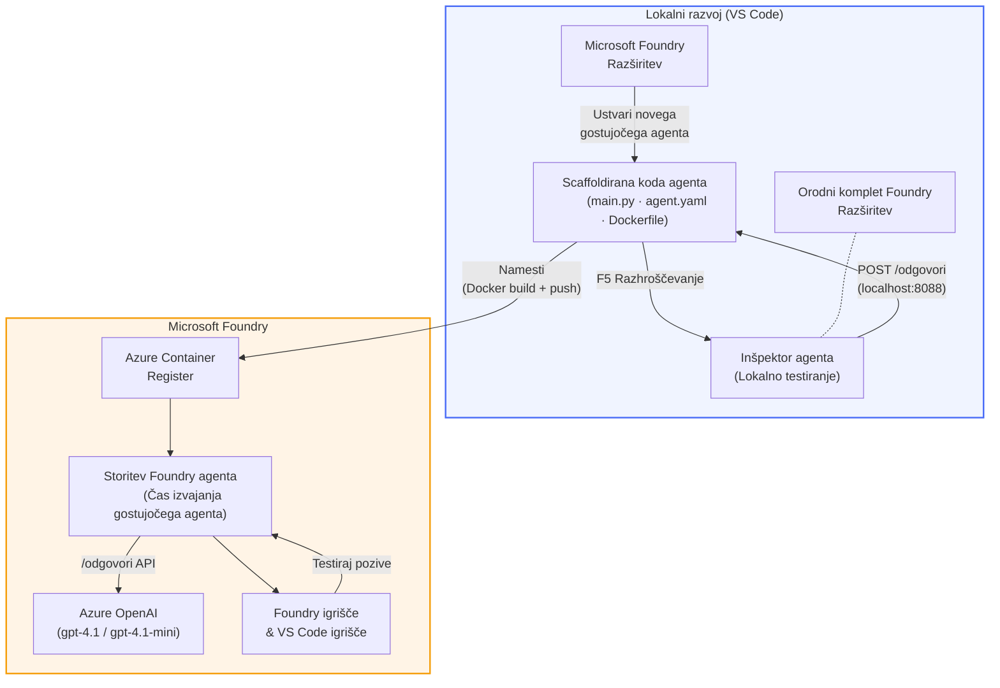

# Foundry Toolkit + delavnica Foundry Hosted Agents

[](https://www.python.org/)
[](https://github.com/microsoft/agents)
[](https://learn.microsoft.com/azure/ai-foundry/agents/concepts/hosted-agents/)
[](https://ai.azure.com/)
[](https://learn.microsoft.com/azure/ai-services/openai/)
[](https://learn.microsoft.com/cli/azure/install-azure-cli)
[](https://learn.microsoft.com/azure/developer/azure-developer-cli/install-azd)
[](https://www.docker.com/)
[](https://marketplace.visualstudio.com/items?itemName=ms-windows-ai-studio.windows-ai-studio)
[](LICENSE)

Zgradite, preizkusite in namestite AI agente v **Microsoft Foundry Agent Service** kot **Hosted Agents** – vse neposredno iz VS Code z uporabo razširitve **Microsoft Foundry** in **Foundry Toolkit**.

> **Hosted Agents so trenutno v predogledu.** Podprte regije so omejene – glej [dostopnost regij](https://learn.microsoft.com/azure/foundry/agents/concepts/hosted-agents#region-availability).

> Mapa `agent/` znotraj vsake delavnice je **samodejno ustvarjena** z razširitvijo Foundry – nato prilagodite kodo, preizkusite lokalno in namestite.

### 🌐 Podpora za več jezikov

#### Podprto preko GitHub akcije (samodejno in vedno posodobljeno)

<!-- CO-OP TRANSLATOR LANGUAGES TABLE START -->
[Arabščina](../ar/README.md) | [Bengalščina](../bn/README.md) | [Bolgarščina](../bg/README.md) | [Burmanščina (Mjanmar)](../my/README.md) | [Kitajščina (poenostavljena)](../zh-CN/README.md) | [Kitajščina (tradicionalna, Hong Kong)](../zh-HK/README.md) | [Kitajščina (tradicionalna, Macau)](../zh-MO/README.md) | [Kitajščina (tradicionalna, Taiwan)](../zh-TW/README.md) | [Hrvaščina](../hr/README.md) | [Češčina](../cs/README.md) | [Danska](../da/README.md) | [Nizozemščina](../nl/README.md) | [Estonščina](../et/README.md) | [Finščina](../fi/README.md) | [Francoščina](../fr/README.md) | [Nemščina](../de/README.md) | [Grščina](../el/README.md) | [Hebrejščina](../he/README.md) | [Hindijščina](../hi/README.md) | [Madžarščina](../hu/README.md) | [Indonezijščina](../id/README.md) | [Italijanščina](../it/README.md) | [Japonščina](../ja/README.md) | [Kannada](../kn/README.md) | [Khmerščina](../km/README.md) | [Korejščina](../ko/README.md) | [Litovščina](../lt/README.md) | [Malajščina](../ms/README.md) | [Malajalščina](../ml/README.md) | [Maratščina](../mr/README.md) | [Nepalščina](../ne/README.md) | [Nigerijski pidžin](../pcm/README.md) | [Norveščina](../no/README.md) | [Perzijščina (Farzi)](../fa/README.md) | [Poljščina](../pl/README.md) | [Portugalščina (Brazilija)](../pt-BR/README.md) | [Portugalščina (Portugalska)](../pt-PT/README.md) | [Pandžabščina (Gurmukhi)](../pa/README.md) | [Romunščina](../ro/README.md) | [Ruščina](../ru/README.md) | [Srbščina (cirilica)](../sr/README.md) | [Slovaščina](../sk/README.md) | [Slovenščina](./README.md) | [Španščina](../es/README.md) | [Svahili](../sw/README.md) | [Švedščina](../sv/README.md) | [Tagalog (Filipini)](../tl/README.md) | [Tamilščina](../ta/README.md) | [Telugu](../te/README.md) | [Tajščina](../th/README.md) | [Turščina](../tr/README.md) | [Ukrajinščina](../uk/README.md) | [Urdu](../ur/README.md) | [Vietnamščina](../vi/README.md)

> **Raje klonirate lokalno?**
>
> Ta repozitorij vključuje prevode v več kot 50 jezikov, kar znatno povečuje velikost prenosa. Če želite klonirati brez prevodov, uporabite sparse checkout:
>
> **Bash / macOS / Linux:**
> ```bash
> git clone --filter=blob:none --sparse https://github.com/microsoft-foundry/Foundry_Toolkit_for_VSCode_Lab.git
> cd Foundry_Toolkit_for_VSCode_Lab
> git sparse-checkout set --no-cone '/*' '!translations' '!translated_images'
> ```
>
> **CMD (Windows):**
> ```cmd
> git clone --filter=blob:none --sparse https://github.com/microsoft-foundry/Foundry_Toolkit_for_VSCode_Lab.git
> cd Foundry_Toolkit_for_VSCode_Lab
> git sparse-checkout set --no-cone "/*" "!translations" "!translated_images"
> ```
>
> Tako dobite vse, kar potrebujete za dokončanje tečaja z veliko hitrejšim prenosom.
<!-- CO-OP TRANSLATOR LANGUAGES TABLE END -->

---

## Arhitektura


**Potek:** Razširitev Foundry pripravi ogrodje agenta → prilagodite kodo in navodila → preizkusite lokalno z Agent Inspector → namestite v Foundry (Docker slika potisnjena v ACR) → preverite v Playground.

---

## Kaj boste ustvarili

| Delavnica | Opis | Status |
|-----------|-------|--------|
| **Delavnica 01 - En sam agent** | Zgradite **"Razloži, kot da sem izvršni direktor" agent**, ga preizkusite lokalno in namestite v Foundry | ✅ Na voljo |
| **Delavnica 02 - Delovni tok več agentov** | Zgradite **"Ocenjevalec ustreznosti življenjepisa za delovno mesto"** - sodeluje 4 agente, ki ocenijo ustreznost življenjepisa in generirajo učni načrt | ✅ Na voljo |

---

## Spoznajte izvršnega agenta

V tej delavnici boste zgradili **"Razloži, kot da sem izvršni direktor" agent** – AI agenta, ki vzame zahtevno tehnično žargonijo in jo prevede v mirne, za upravni odbor primerne povzetke. Ker bodimo iskreni, nihče v vrhu ne želi slišati o "izčrpanju skupine niti zaradi sinhronih klicev uvedenih v v3.2."

Ta agent sem ustvaril po še eni preveč primerih, ko je moj popolnoma sestavljen post-mortem sprožil odziv: *"Torej... ali spletna stran deluje ali ne?"*

### Kako deluje

Vnesete tehnično posodobitev. Agent vrne izvršni povzetek – tri jedrnate točke, brez žargona, brez sledov skladov, brez eksistencialnega strahu. Samo **kaj se je zgodilo**, **poslovni vpliv** in **naslednji koraki**.

### Poglejte ga v akciji

**Vi rečete:**
> "Zakasnitev API-ja se je povečala zaradi izčrpanosti skupine niti povzročene s sinhronimi klici, uvedenimi v v3.2."

**Agent odgovori:**

> **Izvršni povzetek:**
> - **Kaj se je zgodilo:** Po zadnji izdaji se je sistem upočasnil.
> - **Poslovni vpliv:** Nekateri uporabniki so med uporabo storitve imeli zamude.
> - **Naslednji korak:** Sprememba je bila razveljavljena in pripravljamo popravek pred ponovnim zagonom.

### Zakaj ta agent?

Je enostaven agent z eno samo nalogo – popoln za učenje delovnega toka hosted agentov od začetka do konca brez zapletov z zapletenimi orodji. In iskreno? Vsaka inženirska ekipa bi lahko imela takega.

---

## Struktura delavnice

```
📂 Foundry_Toolkit_for_VSCode_Lab/
├── 📄 README.md                      ← You are here
├── 📂 ExecutiveAgent/                ← Standalone hosted agent project
│   ├── agent.yaml
│   ├── Dockerfile
│   ├── main.py
│   └── requirements.txt
└── 📂 workshop/
    ├── 📂 lab01-single-agent/        ← Full lab: docs + agent code
    │   ├── README.md                 ← Hands-on lab instructions
    │   ├── 📂 docs/                  ← Step-by-step tutorial modules
    │   │   ├── 00-prerequisites.md
    │   │   ├── 01-install-foundry-toolkit.md
    │   │   ├── 02-create-foundry-project.md
    │   │   ├── 03-create-hosted-agent.md
    │   │   ├── 04-configure-and-code.md
    │   │   ├── 05-test-locally.md
    │   │   ├── 06-deploy-to-foundry.md
    │   │   ├── 07-verify-in-playground.md
    │   │   └── 08-troubleshooting.md
    │   └── 📂 agent/                 ← Reference solution (auto-scaffolded by Foundry extension)
    │       ├── agent.yaml
    │       ├── Dockerfile
    │       ├── main.py
    │       └── requirements.txt
    └── 📂 lab02-multi-agent/         ← Resume → Job Fit Evaluator
        ├── README.md                 ← Hands-on lab instructions (end-to-end)
        ├── 📂 docs/                  ← Step-by-step tutorial modules
        │   ├── 00-prerequisites.md
        │   ├── 01-understand-multi-agent.md
        │   ├── 02-scaffold-multi-agent.md
        │   ├── 03-configure-agents.md
        │   ├── 04-orchestration-patterns.md
        │   ├── 05-test-locally.md
        │   ├── 06-deploy-to-foundry.md
        │   ├── 07-verify-in-playground.md
        │   └── 08-troubleshooting.md
        └── 📂 PersonalCareerCopilot/ ← Reference solution (multi-agent workflow)
            ├── agent.yaml
            ├── Dockerfile
            ├── main.py
            └── requirements.txt
```

> **Opomba:** Mapa `agent/` znotraj vsake delavnice je ustvarjena s strani **Microsoft Foundry razširitve**, ko zaženete `Microsoft Foundry: Create a New Hosted Agent` iz ukazne palete. Datoteke nato prilagodite z navodili vašega agenta, orodji in konfiguracijo. Delavnica 01 vas vodi skozi postopek izdelave iz nič.

---

## Začetek

### 1. Klonirajte repozitorij

```bash
git clone https://github.com/microsoft-foundry/Foundry_Toolkit_for_VSCode_Lab.git
cd Foundry_Toolkit_for_VSCode_Lab
```

### 2. Nastavite Python virtualno okolje

```bash
python -m venv venv
```

Aktivirajte ga:

- **Windows (PowerShell):**
  ```powershell
  .\venv\Scripts\Activate.ps1
  ```
- **macOS / Linux:**
  ```bash
  source venv/bin/activate
  ```

### 3. Namestite odvisnosti

```bash
pip install -r workshop/lab01-single-agent/agent/requirements.txt
```

### 4. Konfigurirajte okoljske spremenljivke

Kopirajte primer `.env` datoteke v mapi agenta in izpolnite svoje vrednosti:

```bash
cp workshop/lab01-single-agent/agent/.env.example workshop/lab01-single-agent/agent/.env
```

Uredite `workshop/lab01-single-agent/agent/.env`:

```env
AZURE_AI_PROJECT_ENDPOINT=https://<your-account>.services.ai.azure.com/api/projects/<your-project>
MODEL_DEPLOYMENT_NAME=<your-model-deployment-name>
```

### 5. Sledite delavnicam

Vsaka delavnica je samostojna z lastnimi moduli. Začnite z **Delavnico 01** za osnovno znanje, nato nadaljujte z **Delavnico 02** za delovne tokove z več agenti.

#### Delavnica 01 - En sam agent ([popolna navodila](workshop/lab01-single-agent/README.md))

| # | Modul | Povezava |
|---|--------|----------|
| 1 | Preberite predpogojne zahteve | [00-prerequisites.md](workshop/lab01-single-agent/docs/00-prerequisites.md) |
| 2 | Namestite Foundry Toolkit in razširitev Foundry | [01-install-foundry-toolkit.md](workshop/lab01-single-agent/docs/01-install-foundry-toolkit.md) |
| 3 | Ustvarite Foundry projekt | [02-create-foundry-project.md](workshop/lab01-single-agent/docs/02-create-foundry-project.md) |
| 4 | Ustvarite hosted agenta | [03-create-hosted-agent.md](workshop/lab01-single-agent/docs/03-create-hosted-agent.md) |
| 5 | Konfigurirajte navodila in okolje | [04-configure-and-code.md](workshop/lab01-single-agent/docs/04-configure-and-code.md) |
| 6 | Preizkusite lokalno | [05-test-locally.md](workshop/lab01-single-agent/docs/05-test-locally.md) |
| 7 | Namestite v Foundry | [06-deploy-to-foundry.md](workshop/lab01-single-agent/docs/06-deploy-to-foundry.md) |
| 8 | Preverite v playgroundu | [07-verify-in-playground.md](workshop/lab01-single-agent/docs/07-verify-in-playground.md) |
| 9 | Odpravljanje težav | [08-troubleshooting.md](workshop/lab01-single-agent/docs/08-troubleshooting.md) |

#### Delavnica 02 - Delovni tok več agentov ([popolna navodila](workshop/lab02-multi-agent/README.md))

| # | Modul | Povezava |
|---|--------|----------|
| 1 | Predpogojne zahteve (Delavnica 02) | [00-prerequisites.md](workshop/lab02-multi-agent/docs/00-prerequisites.md) |
| 2 | Spoznajte arhitekturo z več agenti | [01-understand-multi-agent.md](workshop/lab02-multi-agent/docs/01-understand-multi-agent.md) |
| 3 | Ustvarite osnovo za projekt z več agenti | [02-scaffold-multi-agent.md](workshop/lab02-multi-agent/docs/02-scaffold-multi-agent.md) |
| 4 | Konfigurirajte agente in okolje | [03-configure-agents.md](workshop/lab02-multi-agent/docs/03-configure-agents.md) |
| 5 | Vzorec orkestracije | [04-orchestration-patterns.md](workshop/lab02-multi-agent/docs/04-orchestration-patterns.md) |
| 6 | Preizkusite lokalno (več agentov) | [05-test-locally.md](workshop/lab02-multi-agent/docs/05-test-locally.md) |
| 7 | Namestitev v Foundry | [06-deploy-to-foundry.md](workshop/lab02-multi-agent/docs/06-deploy-to-foundry.md) |
| 8 | Preverjanje v playgroundu | [07-verify-in-playground.md](workshop/lab02-multi-agent/docs/07-verify-in-playground.md) |
| 9 | Odpravljanje težav (večagentno) | [08-troubleshooting.md](workshop/lab02-multi-agent/docs/08-troubleshooting.md) |

---

## Vzdrževalec

<table>
<tr>
    <td align="center"><a href="https://github.com/ShivamGoyal03">
        <br />
        <sub><b>Shivam Goyal</b></sub>
    </a><br />
    </td>
</tr>
</table>

---

## Potrebna dovoljenja (hitri pregled)

| Scenarij | Potrebne vloge |
|----------|---------------|
| Ustvari nov Foundry projekt | **Azure AI Owner** na Foundry viru |
| Namestitev v obstoječi projekt (novi viri) | **Azure AI Owner** + **Contributor** na naročnini |
| Namestitev v popolnoma konfiguriran projekt | **Reader** na računu + **Azure AI User** na projektu |

> **Pomembno:** Vloge Azure `Owner` in `Contributor` vključujejo samo *upravljavske* pravice, ne pa *razvojnih* (dejanja s podatki). Potrebujete **Azure AI User** ali **Azure AI Owner** za izdelavo in nameščanje agentov.

---

## Viri

- [Hitri začetek: Namestite svoj prvi gostujoči agent (VS Code)](https://learn.microsoft.com/azure/foundry/agents/quickstarts/quickstart-hosted-agent)
- [Kaj so gostujoči agenti?](https://learn.microsoft.com/azure/foundry/agents/concepts/hosted-agents)
- [Ustvarite delovne tokove gostujočih agentov v VS Code](https://learn.microsoft.com/azure/foundry/agents/how-to/vs-code-agents-workflow-pro-code)
- [Namestitev gostujočega agenta](https://learn.microsoft.com/azure/foundry/agents/how-to/deploy-hosted-agent)
- [RBAC za Microsoft Foundry](https://learn.microsoft.com/azure/foundry/concepts/rbac-foundry)
- [Vzorec agenta za pregled arhitekture](https://github.com/Azure-Samples/agent-architecture-review-sample) - Resnični gostujoči agent z orodji MCP, diagrami Excalidraw in dvojno namestitvijo

---

## Licenca

[MIT](../../LICENSE)

---

<!-- CO-OP TRANSLATOR DISCLAIMER START -->
**Omejitev odgovornosti**:
Ta dokument je bil preveden z uporabo AI prevajalske storitve [Co-op Translator](https://github.com/Azure/co-op-translator). Čeprav si prizadevamo za natančnost, upoštevajte, da lahko avtomatizirani prevodi vsebujejo napake ali netočnosti. Izvirni dokument v njegovem izvorno jeziku velja za avtoritativni vir. Za kritične informacije je priporočljiv strokovni človeški prevod. Nismo odgovorni za morebitna nesporazume ali napačne interpretacije, ki izhajajo iz uporabe tega prevoda.
<!-- CO-OP TRANSLATOR DISCLAIMER END -->