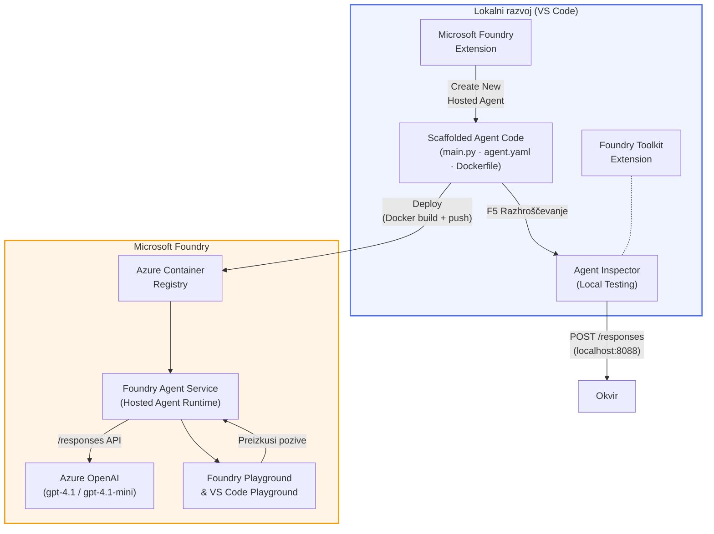

# Foundry Toolkit + Delavnica za gostujoče agente Foundry

[](https://www.python.org/)
[](https://github.com/microsoft/agents)
[](https://learn.microsoft.com/azure/foundry/agents/concepts/hosted-agents)
[](https://ai.azure.com/)
[](https://learn.microsoft.com/azure/ai-services/openai/)
[](https://learn.microsoft.com/cli/azure/install-azure-cli)
[](https://learn.microsoft.com/azure/developer/azure-developer-cli/install-azd)
[](https://www.docker.com/)
[](https://marketplace.visualstudio.com/items?itemName=ms-windows-ai-studio.windows-ai-studio)
[](LICENSE)

Zgradite, testirajte in zaženite AI agente na **Microsoft Foundry Agent Service** kot **gostujoče agente** - vse iz VS Code z uporabo **Microsoft Foundry razširitve** in **Foundry Toolkita**.

> **Gostujoči agenti so trenutno v predogledu.** Podprte regije so omejene - glejte [razpoložljivost regij](https://learn.microsoft.com/azure/foundry/agents/concepts/hosted-agents#region-availability).

> Mapa `agent/` znotraj vsake delavnice je **samodejno ustvarjena** z razširitvijo Foundry - potem prilagodite kodo, testirate lokalno in namestite.

### 🌐 Večjezična podpora

#### Podprto preko GitHub akcije (avtomatsko in vedno posodobljeno)

<!-- CO-OP TRANSLATOR LANGUAGES TABLE START -->
[Arabic](../ar/README.md) | [Bengali](../bn/README.md) | [Bulgarian](../bg/README.md) | [Burmese (Myanmar)](../my/README.md) | [Chinese (Simplified)](../zh-CN/README.md) | [Chinese (Traditional, Hong Kong)](../zh-HK/README.md) | [Chinese (Traditional, Macau)](../zh-MO/README.md) | [Chinese (Traditional, Taiwan)](../zh-TW/README.md) | [Croatian](../hr/README.md) | [Czech](../cs/README.md) | [Danish](../da/README.md) | [Dutch](../nl/README.md) | [Estonian](../et/README.md) | [Finnish](../fi/README.md) | [French](../fr/README.md) | [German](../de/README.md) | [Greek](../el/README.md) | [Hebrew](../he/README.md) | [Hindi](../hi/README.md) | [Hungarian](../hu/README.md) | [Indonesian](../id/README.md) | [Italian](../it/README.md) | [Japanese](../ja/README.md) | [Kannada](../kn/README.md) | [Khmer](../km/README.md) | [Korean](../ko/README.md) | [Lithuanian](../lt/README.md) | [Malay](../ms/README.md) | [Malayalam](../ml/README.md) | [Marathi](../mr/README.md) | [Nepali](../ne/README.md) | [Nigerian Pidgin](../pcm/README.md) | [Norwegian](../no/README.md) | [Persian (Farsi)](../fa/README.md) | [Polish](../pl/README.md) | [Portuguese (Brazil)](../pt-BR/README.md) | [Portuguese (Portugal)](../pt-PT/README.md) | [Punjabi (Gurmukhi)](../pa/README.md) | [Romanian](../ro/README.md) | [Russian](../ru/README.md) | [Serbian (Cyrillic)](../sr/README.md) | [Slovak](../sk/README.md) | [Slovenian](./README.md) | [Spanish](../es/README.md) | [Swahili](../sw/README.md) | [Swedish](../sv/README.md) | [Tagalog (Filipino)](../tl/README.md) | [Tamil](../ta/README.md) | [Telugu](../te/README.md) | [Thai](../th/README.md) | [Turkish](../tr/README.md) | [Ukrainian](../uk/README.md) | [Urdu](../ur/README.md) | [Vietnamese](../vi/README.md)

> **Raje klonirate lokalno?**
>
> Ta repozitorij vključuje več kot 50 prevodov jezikov, kar znatno poveča velikost prenosa. Za kloniranje brez prevodov uporabite "sparse checkout":
>
> **Bash / macOS / Linux:**
> ```bash
> git clone --filter=blob:none --sparse https://github.com/microsoft-foundry/Foundry_Toolkit_for_VSCode_Lab.git
> cd Foundry_Toolkit_for_VSCode_Lab
> git sparse-checkout set --no-cone '/*' '!translations' '!translated_images'
> ```
>
> **CMD (Windows):**
> ```cmd
> git clone --filter=blob:none --sparse https://github.com/microsoft-foundry/Foundry_Toolkit_for_VSCode_Lab.git
> cd Foundry_Toolkit_for_VSCode_Lab
> git sparse-checkout set --no-cone "/*" "!translations" "!translated_images"
> ```
>
> Tako dobite vse, kar potrebujete za dokončanje tečaja, z veliko hitrejšim prenosom.
<!-- CO-OP TRANSLATOR LANGUAGES TABLE END -->

---

## Arhitektura


```mermaid
flowchart TB
    subgraph Local["Lokalni razvoj (VS Code)"]
        direction TB
        FE["Microsoft Foundry
        Extension"]
        FoundryToolkit["Foundry Toolkit
        Extension"]
        Scaffold["Scaffolded Agent Code
        (main.py · agent.yaml · Dockerfile)"]
        Inspector["Agent Inspector
        (Local Testing)"]
        FE -- "Create New
        Hosted Agent" --> Scaffold
        Scaffold -- "F5 Razhroščevanje" --> Inspector
        FoundryToolkit -.- Inspector
    end

    subgraph Cloud["Microsoft Foundry"]
        direction TB
        ACR["Azure Container
        Registry"]
        AgentService["Foundry Agent Service
        (Hosted Agent Runtime)"]
        Model["Azure OpenAI
        (gpt-4.1 / gpt-4.1-mini)"]
        Playground["Foundry Playground
        & VS Code Playground"]
        ACR --> AgentService
        AgentService -- "/responses API" --> Model
        AgentService --> Playground
    end

    Scaffold -- "Deploy
    (Docker build + push)" --> ACR
    Inspector -- "POST /responses
    (localhost:8088)" --> Okvir
    Playground -- "Preizkusi pozive" --> AgentService

    style Local fill:#f0f4ff,stroke:#4a6cf7,stroke-width:2px
    style Cloud fill:#fff4e6,stroke:#f59e0b,stroke-width:2px
```

**Potek:** razširitev Foundry ustvari agenta → prilagodite kodo in navodila → test lokalno z Agent Inspectorjem → namestite v Foundry (Docker slika je potisnjena v ACR) → preverite na Playgroundu.

---

## Kaj boste zgradili

| Laboratorij | Opis | Status |
|-----|-------------|--------|
| **Laboratorij 01 - Posamezni agent** | Zgradite **"Razloži kot da sem direktor" agenta**, testirajte lokalno in namestite v Foundry | ✅ Na voljo |
| **Laboratorij 02 - Večagentni potek dela** | Zgradite **"Ocenjevalec primernosti za delo iz življenjepisa"** - 4 agenti sodelujejo pri ocenjevanju življenjepisa in ustvarjanju načrta učenja | ✅ Na voljo |

---

## Spoznajte direktorjevega agenta

V tej delavnici boste zgradili **"Razloži kot da sem direktor" agenta** – AI agenta, ki vzame zapleten tehnični žargon in ga prevede v umirjene, za poslovni sestanek primerne povzetke. Ker bodimo iskreni, nihče v vodstvu noče slišati o "izčrpanju nitnega bazena zaradi sinhronih klicev v različici v3.2."

Ta agent sem zgradil po preveč primerih, ko je moj natančno izdelan povzetek po incidentu dobil odgovor: *"Torej... ali spletna stran deluje ali ne?"*

### Kako deluje

Podate mu tehnično posodobitev. Vrne izvršni povzetek – tri iztočnice, brez žargona, brez sledov napak, brez eksistencialnih strahov. Samo **kaj se je zgodilo**, **poslovni vpliv** in **naslednji korak**.

### Oglejte si ga v akciji

**Vi rečete:**
> "Zakasnitev API-ja se je povečala zaradi izčrpanosti nitnega bazena, ki jo povzročajo sinhroni klici, uvedeni v v3.2."

**Agent odgovori:**

> **Izvršni povzetek:**
> - **Kaj se je zgodilo:** Po zadnji izdaji je sistem začel delovati počasneje.
> - **Poslovni vpliv:** Nekateri uporabniki so doživeli zamude pri uporabi storitve.
> - **Naslednji korak:** Sprememba je bila povrnjena in pripravljamo popravke pred ponovnim zagonom.

### Zakaj prav ta agent?

Je zelo enostaven agent z enim namenom - popoln za učenje celotnega poteka dela z gostujočimi agenti brez kompliciranih orodnih verig. In iskreno? Vsaka inženirska ekipa bi ga lahko potrebovala.

---

## Struktura delavnice

```
📂 Foundry_Toolkit_for_VSCode_Lab/
├── 📄 README.md                      ← You are here
└── 📂 workshop/
    ├── 📂 lab01-single-agent/        ← Full lab: docs + agent code
    │   ├── README.md                 ← Hands-on lab instructions
    │   ├── 📂 docs/                  ← Step-by-step tutorial modules
    │   │   ├── 00-prerequisites.md
    │   │   ├── 01-setup.md
    │   │   ├── 02-create-hosted-agent.md
    │   │   ├── 03-configure-and-code.md
    │   │   ├── 04-test-locally.md
    │   │   ├── 05-deploy-to-foundry.md
    │   │   ├── 06-verify-in-playground.md
    │   │   ├── 07-summary.md
    │   │   └── 08-troubleshooting.md
    │   └── 📂 agent/                 ← Reference solution (auto-scaffolded by Foundry extension)
    │       ├── agent.yaml
    │       ├── Dockerfile
    │       ├── main.py
    │       └── requirements.txt
    └── 📂 lab02-multi-agent/         ← Resume → Job Fit Evaluator
        ├── README.md                 ← Hands-on lab instructions (end-to-end)
        ├── 📂 docs/                  ← Step-by-step tutorial modules
        │   ├── 00-prerequisites.md
        │   ├── 01-understand-multi-agent.md
        │   ├── 02-scaffold-multi-agent.md
        │   ├── 03-configure-agents.md
        │   ├── 04-orchestration-patterns.md
        │   ├── 05-test-locally.md
        │   ├── 06-deploy-to-foundry.md
        │   ├── 07-verify-in-playground.md
        │   └── 08-troubleshooting.md
        └── 📂 PersonalCareerCopilot/ ← Reference solution (multi-agent workflow)
            ├── agent.yaml
            ├── Dockerfile
            ├── main.py
            └── requirements.txt
```

> **Opomba:** Mapa `agent/` znotraj vsake delavnice je tista, ki jo **Microsoft Foundry razširitev** generira, ko zaženete `Microsoft Foundry: Create a New Hosted Agent` iz ukazne palete. Datoteke nato prilagodite s svojimi navodili, orodji in konfiguracijo. Laboratorij 01 vas popelje skozi postopek ustvarjanja tega od začetka.

---

## Začetek

### 1. Klonirajte repozitorij

```bash
git clone https://github.com/microsoft-foundry/Foundry_Toolkit_for_VSCode_Lab.git
cd Foundry_Toolkit_for_VSCode_Lab
```

### 2. Nastavite Python virtualno okolje

```bash
python -m venv venv
```

Aktivirajte ga:

- **Windows (PowerShell):**
  ```powershell
  .\venv\Scripts\Activate.ps1
  ```
- **macOS / Linux:**
  ```bash
  source venv/bin/activate
  ```

### 3. Namestite odvisnosti

```bash
pip install -r workshop/lab01-single-agent/agent/requirements.txt
```

### 4. Konfigurirajte okoljske spremenljivke

Kopirajte primer `.env` datoteke v mapo agenta in vnesite svoje vrednosti:

```bash
cp workshop/lab01-single-agent/agent/.env.example workshop/lab01-single-agent/agent/.env
```

Uredite `workshop/lab01-single-agent/agent/.env`:

```env
AZURE_AI_PROJECT_ENDPOINT=https://<your-account>.services.ai.azure.com/api/projects/<your-project>
AZURE_AI_MODEL_DEPLOYMENT_NAME=<your-model-deployment-name>
```

### 5. Sledite laboratorijem delavnice

Vsak laboratorij je samostojen z lastnimi moduli. Začnite z **Laboratorij 01** za učenje osnov, nato nadaljujte z **Laboratorij 02** za poteke dela z več agenti.

#### Laboratorij 01 - Posamezni agent ([polna navodila](workshop/lab01-single-agent/README.md))

| # | Modul | Povezava |
|---|--------|------|
| 1 | Preberite predpogoje | [00-prerequisites.md](workshop/lab01-single-agent/docs/00-prerequisites.md) |
| 2 | Namestite Foundry Toolkit & Foundry razširitev | [01-setup.md](workshop/lab01-single-agent/docs/01-setup.md) |
| 3 | Ustvarite Foundry projekt | [01-setup.md](workshop/lab01-single-agent/docs/01-setup.md) |
| 4 | Ustvarite gostujočega agenta | [02-create-hosted-agent.md](workshop/lab01-single-agent/docs/02-create-hosted-agent.md) |
| 5 | Konfigurirajte navodila in okolje | [03-configure-and-code.md](workshop/lab01-single-agent/docs/03-configure-and-code.md) |
| 6 | Testirajte lokalno | [04-test-locally.md](workshop/lab01-single-agent/docs/04-test-locally.md) |
| 7 | Namestite v Foundry | [05-deploy-to-foundry.md](workshop/lab01-single-agent/docs/05-deploy-to-foundry.md) |
| 8 | Preverite na igrišču | [06-verify-in-playground.md](workshop/lab01-single-agent/docs/06-verify-in-playground.md) |
| 9 | Odpravljanje težav | [08-troubleshooting.md](workshop/lab01-single-agent/docs/08-troubleshooting.md) |

#### Laboratorij 02 - Večagentni potek dela ([polna navodila](workshop/lab02-multi-agent/README.md))

| # | Modul | Povezava |
|---|--------|------|
| 1 | Predpogoji (Laboratorij 02) | [00-prerequisites.md](workshop/lab02-multi-agent/docs/00-prerequisites.md) |
| 2 | Razumevanje večagentne arhitekture | [01-understand-multi-agent.md](workshop/lab02-multi-agent/docs/01-understand-multi-agent.md) |
| 3 | Ustvarite večagentni projekt | [02-scaffold-multi-agent.md](workshop/lab02-multi-agent/docs/02-scaffold-multi-agent.md) |
| 4 | Konfigurirajte agente in okolje | [03-configure-agents.md](workshop/lab02-multi-agent/docs/03-configure-agents.md) |
| 5 | Vzorci orkestracije | [04-orchestration-patterns.md](workshop/lab02-multi-agent/docs/04-orchestration-patterns.md) |
| 6 | Testirajte lokalno (večagentno) | [05-test-locally.md](workshop/lab02-multi-agent/docs/05-test-locally.md) |

| 7 | Namestitev v Foundry | [06-deploy-to-foundry.md](workshop/lab02-multi-agent/docs/06-deploy-to-foundry.md) |
| 8 | Preverjanje na igrišču | [07-verify-in-playground.md](workshop/lab02-multi-agent/docs/07-verify-in-playground.md) |
| 9 | Reševanje težav (večagentno) | [08-troubleshooting.md](workshop/lab02-multi-agent/docs/08-troubleshooting.md) |

---

## Vzdrževalec

<table>
<tr>
    <td align="center"><a href="https://github.com/ShivamGoyal03">
        <br />
        <sub><b>Shivam Goyal</b></sub>
    </a><br />
    </td>
</tr>
</table>

---

## Zahtevane pravice (hitri pregled)

| Scenarij | Zahtevane vloge |
|----------|---------------|
| Ustvarjanje novega projekta Foundry | **Azure AI Lastnik** na viru Foundry |
| Namestitev v obstoječ projekt (nove vire) | **Azure AI Lastnik** + **Sodelujoči** na naročnini |
| Namestitev v popolnoma konfiguriran projekt | **Bralec** na računu + **Azure AI Uporabnik** na projektu |

> **Pomembno:** Vloge Azure `Lastnik` in `Sodelujoči` vključujejo le *upravljavske* pravice, ne pa *razvojnih* (dejanja z podatki). Za izdelavo in namestitev agentov potrebujete **Azure AI Uporabnik** ali **Azure AI Lastnik**.

---

## Reference

- [Hitri začetek: Namestite svojega prvega gostujočega agenta (VS Code)](https://learn.microsoft.com/azure/foundry/agents/quickstarts/quickstart-hosted-agent)
- [Kaj so gostujoči agenti?](https://learn.microsoft.com/azure/foundry/agents/concepts/hosted-agents)
- [Ustvarite poteke dela gostujočih agentov v VS Code](https://learn.microsoft.com/azure/foundry/agents/how-to/vs-code-agents-workflow-pro-code)
- [Namestite gostujočega agenta](https://learn.microsoft.com/azure/foundry/agents/how-to/deploy-hosted-agent)
- [RBAC za Microsoft Foundry](https://learn.microsoft.com/azure/foundry/concepts/rbac-foundry)
- [Vzorčni agent za pregled arhitekture](https://github.com/Azure-Samples/agent-architecture-review-sample) - Gostujoči agent iz resničnega sveta z orodji MCP, diagrami Excalidraw in dvojno namestitvijo

---


## Licenca

[MIT](../../LICENSE)

---

<!-- CO-OP TRANSLATOR DISCLAIMER START -->
**Omejitev odgovornosti**:
Ta dokument je bil preveden z uporabo AI prevajalske storitve [Co-op Translator](https://github.com/Azure/co-op-translator). Čeprav si prizadevamo za natančnost, vas prosimo, da upoštevate, da avtomatizirani prevodi lahko vsebujejo napake ali netočnosti. Izvirni dokument v njegovem izvirnem jeziku je treba obravnavati kot avtoritativni vir. Za kritične informacije je priporočljiv strokovni človeški prevod. Ne odgovarjamo za morebitna nesporazume ali napačne interpretacije, ki izhajajo iz uporabe tega prevoda.
<!-- CO-OP TRANSLATOR DISCLAIMER END -->