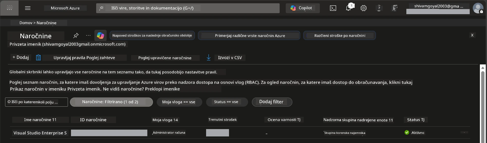

# Module 0 - Predpogoji

Pred začetkom delavnice potrdite, da imate pripravljena naslednja orodja, dostop in okolje. Sledite vsakemu spodnjemu koraku - ne preskakujte naprej.

---

## 1. Azure račun in naročnina

### 1.1 Ustvarite ali preverite svojo Azure naročnino

1. Odprite brskalnik in pojdite na [https://azure.microsoft.com/free/](https://azure.microsoft.com/free/).
2. Če nimate Azure računa, kliknite **Start free** in sledite postopku registracije. Potrebovali boste Microsoft račun (ali ga ustvarite) in kreditno kartico za preverjanje identitete.
3. Če že imate račun, se prijavite na [https://portal.azure.com](https://portal.azure.com).
4. V portalu kliknite na **Subscriptions** ploščo v levi navigaciji (ali poiščite "Subscriptions" v vrhnjem iskalnem polju).
5. Preverite, da vidite vsaj eno **Active** naročnino. Zabeležite si **Subscription ID** - potrebovali ga boste kasneje.



### 1.2 Razumite zahtevane RBAC vloge

Razporeditev [Hosted Agent](https://learn.microsoft.com/azure/foundry/agents/concepts/hosted-agents) zahteva dovoljenja za **data action**, ki jih standardne Azure vloge `Owner` in `Contributor` **ne** vključujejo. Potrebovali boste eno od teh [kombinacij vlog](https://learn.microsoft.com/azure/foundry/concepts/rbac-foundry#built-in-roles):

| Scenarij | Potrebne vloge | Kje jih dodeliti |
|----------|----------------|------------------|
| Ustvarite nov Foundry projekt | **Azure AI Owner** na Foundry viru | Foundry vir v Azure portalu |
| Razmestite v obstoječ projekt (novi viri) | **Azure AI Owner** + **Contributor** na naročnini | Naročnina + Foundry vir |
| Razmestite v popolnoma konfiguriran projekt | **Reader** na računu + **Azure AI User** na projektu | Račun + Projekt v Azure portalu |

> **Ključna točka:** Azure vloge `Owner` in `Contributor` pokrivajo le *upravljavske* pravice (ARM operacije). Za *data actions* kot je `agents/write`, ki je potrebna za ustvarjanje in razmestitev agentov, potrebujete [**Azure AI User**](https://learn.microsoft.com/azure/foundry/concepts/rbac-foundry#built-in-roles) (ali višje). Te vloge boste dodelili v [Modulu 2](02-create-foundry-project.md).

---

## 2. Namestite lokalna orodja

Namestite vsako spodaj navedeno orodje. Po namestitvi preverite delovanje z ukazom za preverjanje.

### 2.1 Visual Studio Code

1. Pojdite na [https://code.visualstudio.com/](https://code.visualstudio.com/).
2. Prenesite namestitveni program za vaš operacijski sistem (Windows/macOS/Linux).
3. Zaženite namestitveni program s privzetimi nastavitvami.
4. Odprite VS Code in potrdite, da se zažene.

### 2.2 Python 3.10+

1. Pojdite na [https://www.python.org/downloads/](https://www.python.org/downloads/).
2. Prenesite Python 3.10 ali novejši (priporočeno 3.12+).
3. **Windows:** Med namestitvijo obkljukajte **"Add Python to PATH"** na prvem zaslonu.
4. Odprite terminal in preverite:

   ```powershell
   python --version
   ```

   Pričakovan izpis: `Python 3.10.x` ali višje.

### 2.3 Azure CLI

1. Pojdite na [https://learn.microsoft.com/cli/azure/install-azure-cli](https://learn.microsoft.com/cli/azure/install-azure-cli).
2. Sledite navodilom za namestitev za vaš operacijski sistem.
3. Preverite:

   ```powershell
   az --version
   ```

   Pričakovano: `azure-cli 2.80.0` ali višje.

4. Prijavite se:

   ```powershell
   az login
   ```

### 2.4 Azure Developer CLI (azd)

1. Pojdite na [https://learn.microsoft.com/azure/developer/azure-developer-cli/install-azd](https://learn.microsoft.com/azure/developer/azure-developer-cli/install-azd).
2. Sledite navodilom za namestitev za vaš operacijski sistem. Na Windows:

   ```powershell
   winget install microsoft.azd
   ```

3. Preverite:

   ```powershell
   azd version
   ```

   Pričakovano: `azd version 1.x.x` ali višje.

4. Prijavite se:

   ```powershell
   azd auth login
   ```

### 2.5 Docker Desktop (izbirno)

Docker potrebujete le, če želite lokalno zgraditi in testirati kontejnersko sliko pred razmestitvijo. Razširitev Foundry samodejno upravlja kontejnerske izgradnje med razmestitvijo.

1. Pojdite na [https://docs.docker.com/get-docker/](https://docs.docker.com/get-docker/).
2. Prenesite in namestite Docker Desktop za vaš operacijski sistem.
3. **Windows:** Med namestitvijo zagotovite, da je izbrana WSL 2 podlaga.
4. Zaženite Docker Desktop in počakajte, da se v sistemski vrstici prikaže ikona z napisom **"Docker Desktop is running"**.
5. Odprite terminal in preverite:

   ```powershell
   docker info
   ```

   Izpis naj pokaže Docker sistemske podatke brez napak. Če vidite `Cannot connect to the Docker daemon`, počakajte še nekaj sekund, da se Docker povsem zažene.

---

## 3. Namestite VS Code razširitve

Potrebujete tri razširitve. Namestite jih **pred začetkom** delavnice.

### 3.1 Microsoft Foundry za VS Code

1. Odprite VS Code.
2. Pritisnite `Ctrl+Shift+X` za odprtje panela z razširitvami.
3. V iskalno polje vpišite **"Microsoft Foundry"**.
4. Poiščite **Microsoft Foundry for Visual Studio Code** (izdajatelj: Microsoft, ID: `TeamsDevApp.vscode-ai-foundry`).
5. Kliknite **Install**.
6. Po namestitvi naj se v vrstici dejavnosti (levo stranski meni) pokaže ikona **Microsoft Foundry**.

### 3.2 Foundry Toolkit

1. V panelu z razširitvami (`Ctrl+Shift+X`) poiščite **"Foundry Toolkit"**.
2. Poiščite **Foundry Toolkit** (izdajatelj: Microsoft, ID: `ms-windows-ai-studio.windows-ai-studio`).
3. Kliknite **Install**.
4. Ikona **Foundry Toolkit** naj se prikaže v vrstici dejavnosti.

### 3.3 Python

1. V panelu z razširitvami poiščite **"Python"**.
2. Poiščite **Python** (izdajatelj: Microsoft, ID: `ms-python.python`).
3. Kliknite **Install**.

---

## 4. Prijava v Azure iz VS Code

[Microsoft Agent Framework](https://learn.microsoft.com/agent-framework/overview/) uporablja [`DefaultAzureCredential`](https://learn.microsoft.com/azure/developer/python/sdk/authentication/credential-chains#defaultazurecredential-overview) za overjanje. Potrebno je, da ste prijavljeni v Azure v VS Code.

### 4.1 Prijava preko VS Code

1. Poglejte v spodnji levi kot VS Code in kliknite na ikono **Accounts** (silhueta osebe).
2. Kliknite **Sign in to use Microsoft Foundry** (ali **Sign in with Azure**).
3. Odpre se brskalnik - prijavite se z Azure računom, ki ima dostop do vaše naročnine.
4. Vrnite se v VS Code. Vaše uporabniško ime naj bo vidno spodaj levo.

### 4.2 (Izbirno) Prijava preko Azure CLI

Če imate nameščen Azure CLI in želite prijavo preko CLI:

```powershell
az login
```

S tem se odpre brskalnik za prijavo. Po prijavi nastavite pravilno naročnino:

```powershell
az account set --subscription "<your-subscription-id>"
```

Preverite:

```powershell
az account show --query "{name:name, id:id, state:state}" --output table
```

Videti bi morali ime naročnine, ID in stanje = `Enabled`.

### 4.3 (Alternativa) Avtentikacija preko service principal

Za CI/CD ali deljena okolja nastavite naslednje okoljske spremenljivke:

```powershell
$env:AZURE_TENANT_ID = "<your-tenant-id>"
$env:AZURE_CLIENT_ID = "<your-client-id>"
$env:AZURE_CLIENT_SECRET = "<your-client-secret>"
```

---

## 5. Omejitve predogleda

Pred nadaljevanjem bodite seznanjeni z trenutno omejitvami:

- [**Hosted Agents**](https://learn.microsoft.com/azure/foundry/agents/concepts/hosted-agents) so trenutno v **javnem predogledu** - niso priporočeni za produkcijsko uporabo.
- Podprte regije so omejene - preverite [dostopnost regij](https://learn.microsoft.com/azure/foundry/agents/concepts/hosted-agents#region-availability) pred ustvarjanjem virov. Če izberete nepodprto regijo, bo razmestitev neuspešna.
- Paket `azure-ai-agentserver-agentframework` je v predizdaji (`1.0.0b16`) - API-ji se lahko spremenijo.
- Omejitve skaliranja: gostovani agenti podpirajo 0-5 replik (vključno z možnostjo skaliranja na nič).

---

## 6. Predhodni seznam za preverjanje

Preverite vsak spodnji element. Če kateri korak ne uspe, se vrnite nazaj in ga popravite, preden nadaljujete.

- [ ] VS Code se odpre brez napak
- [ ] Python 3.10+ je na vašem PATH (`python --version` izpiše `3.10.x` ali več)
- [ ] Azure CLI je nameščen (`az --version` izpiše `2.80.0` ali več)
- [ ] Azure Developer CLI je nameščen (`azd version` izpiše podatke o verziji)
- [ ] Razširitev Microsoft Foundry je nameščena (ikona vidna v vrstici dejavnosti)
- [ ] Razširitev Foundry Toolkit je nameščena (ikona vidna v vrstici dejavnosti)
- [ ] Razširitev Python je nameščena
- [ ] Prijavljeni ste v Azure v VS Code (preverite ikono Accounts, spodaj levo)
- [ ] `az account show` vrne vašo naročnino
- [ ] (Izbirno) Docker Desktop teče (`docker info` vrne sistemske informacije brez napak)

### Kontrolna točka

Odprite vrstico dejavnosti v VS Code in potrdite, da vidite obe stranski poglede **Foundry Toolkit** in **Microsoft Foundry**. Kliknite vsakega, da potrdite, da se brez napak naložita.

---

**Naslednje:** [01 - Namestite Foundry Toolkit & Foundry Extension →](01-install-foundry-toolkit.md)

---

<!-- CO-OP TRANSLATOR DISCLAIMER START -->
**Omejitev odgovornosti**:
Ta dokument je bil preveden z uporabo AI prevajalske storitve [Co-op Translator](https://github.com/Azure/co-op-translator). Čeprav si prizadevamo za natančnost, vas prosimo, da upoštevate, da avtomatizirani prevodi lahko vsebujejo napake ali netočnosti. Izvirni dokument v njegovem maternem jeziku velja za avtoritativni vir. Za kritične informacije priporočamo strokovni prevod človeka. Nismo odgovorni za morebitne nesporazume ali napačne interpretacije, ki izhajajo iz uporabe tega prevoda.
<!-- CO-OP TRANSLATOR DISCLAIMER END -->